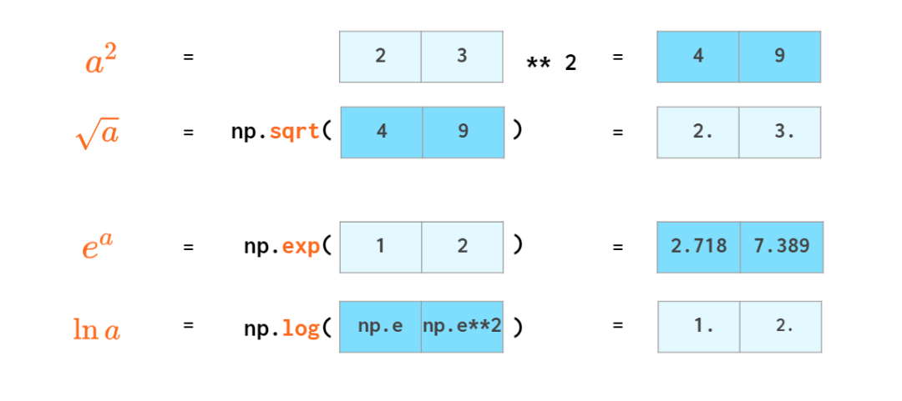
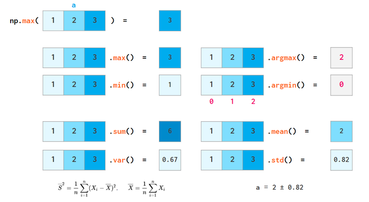
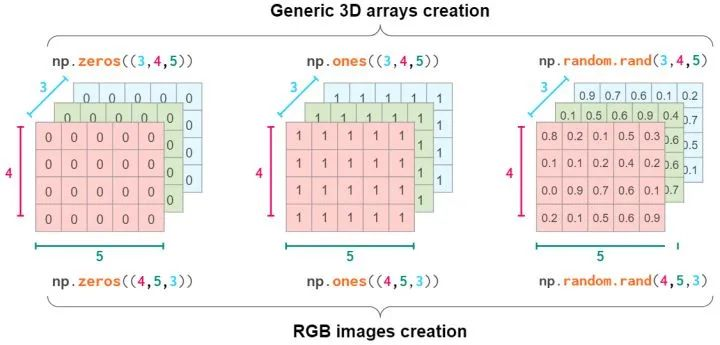

Python  Numpy是Python的一个非常基础且通用的库，基本上常见的库Pandas，Opencv，Pytorch，TensorFlow等都会用到。 Numpy的核心就是n维array，这里介绍一维，二维和多维array。

## Numpy与List的异同点
他俩非常相似，**同样都是容器，都能快速的取值的修改值，但是插入和删除会慢一点**。  Numpy的优点

- 更**紧凑**，特别是**多维数据**
- 当数据可以**向量化**的时候比list更快
- 通常是**同质化**的，数据相同时处理更快，比如都是浮点型或者整数型

## 向量 Vector 或者一维向量 1D array

### 向量初始化
通过list转化，自动变成np类型，**_shape_**为（3，） 
:::danger
注意，如果list里面的值类型不相同，那么**_dtype_**就会返回”object“
:::
如果暂时没有想要转化的list，可以全用0代替  也可以复制一个已经存在的全0 向量 
:::danger
注意，所有创建包含固定值_vector_的方法都有_**_like**_函数
:::
 还有经典的_arange_和_linspace_方法   **arange**方法对于数据类型敏感，比如**_arange_**(3)，**_dtype_** 为int，如果需要float类型，可以`_arange(3).astype(float)_`

#### 生成随机array

### 向量索引
基础的向量索引操作，**只是展示部分数据，而不改变数据本身**  布尔操作  也可以用`.**_where_**` 和**_clip_**代替上面的方法 

### 向量操作
numpy的优势就是把vector当做数做整体运算，避免循环运算 

#### - * /无所不能

#### 复杂的数学运算不在话下

#### 标量运算

####  三角函数 

#### 整体取整
 numpy还可以做基础的统计操作，比如**_max，min， mean， sum_**等  排序操作 

### 查找操作
numpy不像list有**_index_**函数，通常会用**_where_**等操作  其中有三种方法：

1. where，难懂且对于x处于array末端很不友好
2. next，相对较快，但需要numba
3. searchsorted，针对于已排过序的array

## 二维array，也称matrix矩阵
初始化，注意「双括号」  随机matrix，同一维类似  索引操作，不改变matrix本身  Axis 轴操作，在matrix中，axis = 0 代表列， axis = 1 代表行，默认axis = 0  matrix算术 + - * / 和 ** 都可  也可以matrix与单个数，matrix与vector，vector与vector进行运算   行向量 列向量 二维的转置如下，一维的也就是vector转置为自己本身  reshape改变形态  自此，三种向量，一维array，二维列vector，二维行向量 

### 矩阵操作

#### 合并matrix，hstack横向，vstack纵向，也可以理解为堆叠

#### 反向操作hsplit和vsplit

#### matrix的复制操作，tile整个复制，repeat可以理解为挨个复制

#### delete删除操作

#### 删除的同时也可以插入

#### append操作，只能在末尾操作

#### 如果只增加固定值，也可以用pad

#### 网格化
c和python都很麻烦，跟别说再大点的数了  采用类似MATLAB会更快点  **当然numpy有更好的办法** 

### matrix统计

#### sum,min,max,mean,median等等

#### argmin和argmax返回最小值和最大值的下标

#### all和any也可以用

### matrix排序，注意axis

## 3D array或者以上
初始化，**_reshape_**或者硬来  可以考虑把数据抽象成一层层的数据 就像RGB值的图像一样  跟1D和2D类似的操作，**_zeros_**， **_ones_**，**_rand_**等  **_vstack_**和**_hstack_**照样可以用，现在多了一个dstack，代表维度的堆叠  **_concatenate_**也有同样的效果 

## 总结
本文总结了numpy对于1D，2D和多维的基本操作。
