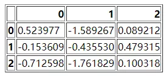

Python Pandas

- `read_sql()`
- `to_sql()`
- `read_clipboard()`
- `from_dict()`
- `to_dict()`
- `to_clipboard()`
- `read_json()`
- `to_json()`
- `read_html()`
- `to_html()`
- `read_table()`
- `read_csv()`
- `to_csv()`
- `read_excel()`
- `to_excel()`
- `read_xml()`
- `to_xml()`
- `read_pickle()`
- `to_pickle()`
<a name="swvuQ"></a>
## `read_sql()`与`to_sql()`
一般读取数据都是从数据库中来读取的，因此可以在`read_sql()`方法中填入对应的sql语句然后来读取想要的数据，
```python
pd.read_sql(sql, con, index_col=None,
            coerce_float=True, params=None,
            parse_dates=None,
            columns=None, chunksize=None)
```
参数详解如下：

- `sql`：SQL命令字符串
- `con`：连接SQL数据库的Engine，一般用SQLAlchemy或者是PyMysql之类的模块来建立
- `index_col`：选择某一列作为Index
- `coerce_float`：将数字形式的字符串直接以float型读入
- `parse_dates`：将某一列日期型字符串传唤为datatime型数据，可以直接提供需要转换的列名以默认的日期形式转换，或者也可以提供字典形式的列名和转换日期的格式，

用PyMysql这个模块来连接数据库，并且读取数据库当中的数据，首先导入所需要的模块，并且建立起与数据库的连接
```python
import pandas as pd
from pymysql import *

conn = connect(host='localhost', port=3306, database='database_name',
               user='', password='', charset='utf8')
```
简单地写一条SQL命令来读取数据库当中的数据，并且用`read_sql()`方法来读取数据
```python
sql_cmd = "SELECT * FROM table_name"
df = pd.read_sql(sql_cmd, conn)
df.head()
```
上面提到`read_sql()`方法当中`parse_dates`参数可以对日期格式的数据进行处理，来试一下其作用
```python
sql_cmd_2 = "SELECT * FROM test_date"
df_1 = pd.read_sql(sql_cmd_2, conn)
df_1.head()
```
output
```python
  number  date_columns
0    1      2021-11-11
1    2      2021-10-01
2    3      2021-11-10
```
来看一个各个列的数据类型
```python
df_1.info()
```
output
```python
<class 'pandas.core.frame.DataFrame'>
RangeIndex: 3 entries, 0 to 2
Data columns (total 2 columns):
 #   Column        Non-Null Count  Dtype 
---  ------        --------------  ----- 
 0   number        3 non-null      int64 
 1   date_columns  3 non-null      object
dtypes: int64(1), object(1)
memory usage: 176.0+ bytes
```
正常默认情况下，`date_columns`这一列也是被当做是String类型的数据，要是通过`parse_dates`参数将日期解析应用与该列
```python
df_2 = pd.read_sql(sql_cmd_2, conn, parse_dates="date_columns")
df_2.info()
```
output
```python
<class 'pandas.core.frame.DataFrame'>
RangeIndex: 3 entries, 0 to 2
Data columns (total 2 columns):
 #   Column        Non-Null Count  Dtype         
---  ------        --------------  -----         
 0   number        3 non-null      int64         
 1   date_columns  3 non-null      datetime64[ns]
dtypes: datetime64[ns](1), int64(1)
memory usage: 176.0 bytes
```
就转换成了相对应的日期格式，当然还可以采用上面提到的另外一种格式
```python
parse_dates={"date_column": {"format": "%d/%m/%y"}})
```
<a name="VnU9S"></a>
### `to_sql()`方法
来看一下`to_sql()`方法，作用是将DataFrame当中的数据存放到数据库当中，请看下面的示例代码，创建一个基于内存的`SQLite`数据库
```python
from sqlalchemy import create_engine
engine = create_engine('sqlite://', echo=False)
```
然后创建一个用于测试的数据集，并且存放到该数据库当中，
```python
df = pd.DataFrame({'num': [1, 3, 5]})
df.to_sql('nums', con=engine)
```
查看一下是否存取成功了
```python
engine.execute("SELECT * FROM nums").fetchall()
```
output
```python
[(0, 1), (1, 3), (2, 5)]
```
可以尝试着往里面添加数据
```python
df2 = pd.DataFrame({'num': [7, 9, 11]})
df2.to_sql('nums', con=engine, if_exists='append')
engine.execute("SELECT * FROM nums").fetchall()
```
output
```python
[(0, 1), (1, 3), (2, 5), (0, 7), (1, 9), (2, 11)]
```
注意到上面的`if_exists`参数上面填的是`append`，意味着添加新数据进去，当然也可以将原有的数据替换掉，将`append`替换成`replace`
```python
df2.to_sql('nums', con=engine, if_exists='replace')
engine.execute("SELECT * FROM nums").fetchall()
```
output
```python
[(0, 7), (1, 9), (2, 11)]
```
<a name="iroGU"></a>
## `from_dict()`方法和`to_dict()`方法
有时候数据是以字典的形式存储的，有对应的键值对，如何根据字典当中的数据来创立DataFrame，假设
```python
a_dict = {
    '学校': '清华大学',
    '地理位置': '北京',
    '排名': 1
}
```
一种方法是调用`json_normalize()`方法，代码如下
```python
df = pd.json_normalize(a_dict)
```
output
```python
     学校 地理位置  排名
0  清华大学   北京   1
```
当然直接调用`pd.DataFrame()`方法也是可以的
```python
df = pd.DataFrame(json_list, index = [0])
```
output
```python
     学校 地理位置  排名
0  清华大学   北京   1
```
当然还可以用`from_dict()`方法，代码如下
```python
df = pd.DataFrame.from_dict(a_dict,orient='index').T
```
output
```python
     学校 地理位置  排名
0  清华大学   北京   1
```
这里最值得注意的是`orient`参数，用来指定字典当中的键是用来做行索引还是列索引，请看下面两个例子
```python
data = {'col_1': [1, 2, 3, 4],
       'col_2': ['A', 'B', 'C', 'D']}
```
将`orient`参数设置为`columns`，将当中的键当做是列名
```python
df = pd.DataFrame.from_dict(data, orient='columns')
```
output
```python
   col_1 col_2
0      1     A
1      2     B
2      3     C
3      4     D
```
当然也可以将其作为是行索引，将`orient`设置为是`index`
```python
df = pd.DataFrame.from_dict(data, orient='index')
```
output
```python
       0  1  2  3
col_1  1  2  3  4
col_2  A  B  C  D
```
<a name="plFr3"></a>
### `to_dict()`方法
语法如下：
```python
df.to_dict(orient='dict')
```
针对`orient`参数，一般可以填这几种形式<br />一种是默认的`dict`，代码如下
```python
df = pd.DataFrame({'shape': ['square', 'circle', 'triangle'],
                   'degrees': [360, 360, 180],
                   'sides': [4, 5, 3]})
df.to_dict(orient='dict')
```
output
```python
{'shape': {0: 'square', 1: 'circle', 2: 'triangle'}, 'degrees': {0: 360, 1: 360, 2: 180}, 'sides': {0: 4, 1: 5, 2: 3}}
```
也可以是list，代码如下
```python
df.to_dict(orient='list')
```
output
```python
{'shape': ['square', 'circle', 'triangle'], 'degrees': [360, 360, 180], 'sides': [4, 5, 3]}
```
除此之外，还有`split`，代码如下
```python
df.to_dict(orient='split')
```
output
```python
{'index': [0, 1, 2], 'columns': ['shape', 'degrees', 'sides'], 'data': [['square', 360, 4], ['circle', 360, 5], ['triangle', 180, 3]]}
```
还有`records`，代码如下
```python
df.to_dict(orient='records')
```
output
```python
[{'shape': 'square', 'degrees': 360, 'sides': 4}, {'shape': 'circle', 'degrees': 360, 'sides': 5}, {'shape': 'triangle', 'degrees': 180, 'sides': 3}]
```
最后一种是`index`，代码如下
```python
df.to_dict(orient='index')
```
output
```python
{0: {'shape': 'square', 'degrees': 360, 'sides': 4}, 1: {'shape': 'circle', 'degrees': 360, 'sides': 5}, 2: {'shape': 'triangle', 'degrees': 180, 'sides': 3}}
```
<a name="aki30"></a>
## `read_json()`方法和`to_json()`方法
经常也会在实际工作与学习当中遇到需要去处理JSON格式数据的情况，用Pandas模块当中的`read_json()`方法来进行处理，来看一下该方法中常用到的参数<br />`orient`: 对应JSON字符串的格式主要有

- `split`: 格式类似于：`{index: [index], columns: [columns], data: [values]}`

例如JSON字符串长这样
```python
a = '{"index":[1,2,3],"columns":["a","b"],"data":[[1,3],[2,8],[3,9]]}'
df = pd.read_json(a, orient='split')
```
output
```python
   a  b
1  1  3
2  2  8
3  3  9
```

- `records`: 格式类似于：`[{column: value}, ... , {column: value}]`

例如JSON字符串长这样
```python
a = '[{"name":"Tom","age":"18"},{"name":"Amy","age":"20"},{"name":"John","age":"17"}]'
df_1 = pd.read_json(a, orient='records')
```
output
```python
   name  age
0   Tom   18
1   Amy   20
2  John   17
```

- `index`: 格式类似于：`{index: {column: value}}`

例如JSON字符串长这样
```python
a = '{"index_1":{"name":"John","age":20},"index_2":{"name":"Tom","age":30},"index_3":{"name":"Jason","age":50}}'
df_1 = pd.read_json(a, orient='index')
```
output
```python
          name  age
index_1   John   20
index_2    Tom   30
index_3  Jason   50
```

- `columns`: 格式类似于：`{column: {index: value}}`

要是将上面的`index`变成`columns`，就变成
```python
df_1 = pd.read_json(a, orient='columns')
```
output
```python
     index_1 index_2 index_3
name    John     Tom   Jason
age       20      30      50
```

- `values`: 数组

例如JSON字符串长这样
```python
v='[["a",1],["b",2],["c", 3]]'
df_1 = pd.read_json(v, orient="values")
```
output
```python
   0  1
0  a  1
1  b  2
2  c  3
```
<a name="G8VjQ"></a>
### `to_json()`方法
将DataFrame数据对象输出成JSON字符串，可以使用`to_json()`方法来实现，其中`orient`参数可以输出不同格式的字符串，用法和上面的大致相同，这里就不做过多的赘述
<a name="SiJdO"></a>
## `read_html()`方法和`to_html()`方法
有时候需要抓取网页上面的一个表格信息，相比较使用`Xpath`或者是`Beautifulsoup`，可以使用pandas当中已经封装好的函数`read_html`来快速地进行获取，例如通过它来抓取菜鸟教程Python网站上面的一部分内容
```python
url = "https://www.runoob.com/python/python-exceptions.html"
dfs = pd.read_html(url, header=None, encoding='utf-8')
```
返回的是一个list的`DataFrame`对象
```python
df = dfs[0]
df.head()
```
output
```python
                异常名称               描述
0                NaN              NaN
1      BaseException          所有异常的基类
2         SystemExit          解释器请求退出
3  KeyboardInterrupt  用户中断执行(通常是输入^C)
4          Exception          常规错误的基类
```
当然`read_html()`方法也支持读取HTML形式的表格，先来生成一个类似这样的表格，通过`to_html()`方法
```python
df = pd.DataFrame(np.random.randn(3, 3))
df.to_html("test_1.html")
```
当然这个HTML形式的表格长这个样子<br /><br />然后再通过`read_html`方法读取该文件，
```python
dfs = pd.read_html("test_1.html")
dfs[0]
```
<a name="bCf9p"></a>
## `read_csv()`方法和`to_csv()`方法
<a name="xb5MV"></a>
### `read_csv()`方法
`read_csv()`方法是最常被用到的pandas读取数据的方法之一，其中经常用到的参数有

- `filepath_or_buffer`: 数据输入的路径，可以是文件的路径的形式，例如
```python
pd.read_csv('data.csv')
```
output
```python
   num1  num2  num3  num4
0     1     2     3     4
1     6    12     7     9
2    11    13    15    18
3    12    10    16    18
```
也可以是URL，如果访问该URL会返回一个文件的话
```python
pd.read_csv("http://...../..../data.csv")
```

- `sep`: 读取csv文件时指定的分隔符，默认为逗号，需要注意的是：“csv文件的分隔符”要和“读取csv文件时指定的分隔符”保持一致

假设数据集，csv文件当中的分隔符从逗号改成了"`\t`"，需要将`sep`参数也做相应的设定
```python
pd.read_csv('data.csv', sep='\t')
```

- `index_col`: 在读取文件之后，可以指定某一列作为DataFrame的索引
```python
pd.read_csv('data.csv', index_col="num1")
```
output
```python
      num2  num3  num4
num1                  
1        2     3     4
6       12     7     9
11      13    15    18
12      10    16    18
```
除了指定单个列，还可以指定多个列，例如
```python
df = pd.read_csv("data.csv", index_col=["num1", "num2"])
```
output
```python
           num3  num4
num1 num2            
1    2        3     4
6    12       7     9
11   13      15    18
12   10      16    18
```

- `usecols`: 如果数据集当中的列很多，而并不想要全部的列、而是只要指定的列就可以，就可以使用这个参数
```python
pd.read_csv('data.csv', usecols=["列名1", "列名2", ....])
```
output
```python
   num1  num2
0     1     2
1     6    12
2    11    13
3    12    10
```
除了指定列名之外，也可以通过索引来选择想要的列，示例代码如下
```python
df = pd.read_csv("data.csv", usecols = [0, 1, 2])
```
output
```python
   num1  num2  num3
0     1     2     3
1     6    12     7
2    11    13    15
3    12    10    16
```
另外`usecols`参数还有一个比较好玩的地方在于它能够接收一个函数，将列名作为参数传递到该函数中调用，要是满足条件的，就选中该列，反之则不选择该列
```python
# 选择列名的长度大于 4 的列
pd.read_csv('girl.csv', usecols=lambda x: len(x) > 4)
```

- `prefix`: 当导入的数据没有`header`的时候，可以用来给列名添加前缀
```python
df = pd.read_csv("data.csv", header = None)
```
output
```python
      0     1     2     3
0  num1  num2  num3  num4
1     1     2     3     4
2     6    12     7     9
3    11    13    15    18
4    12    10    16    18
```
如果将`header`设为`None`，pandas则会自动生成表头0, 1, 2, 3..., 然后设置`prefix`参数为表头添加前缀
```python
df = pd.read_csv("data.csv", prefix="test_", header = None)
```
output
```python
  test_0 test_1 test_2 test_3
0   num1   num2   num3   num4
1      1      2      3      4
2      6     12      7      9
3     11     13     15     18
4     12     10     16     18
```

- `skiprows`: 过滤掉哪些行，参数当中填行的索引

代码如下：
```python
df = pd.read_csv("data.csv", skiprows=[0, 1])
```
output
```python
    6  12   7   9
0  11  13  15  18
1  12  10  16  18
```
上面的代码过滤掉了前两行的数据，直接将第三行与第四行的数据输出，当然也可以看到第二行的数据被当成是了表头

- `nrows`: 该参数设置一次性读入的文件行数，对于读取大文件时非常有用，比如 16G 内存的PC无法容纳几百G的大文件

代码如下：
```python
df = pd.read_csv("data.csv", nrows=2)
```
output
```python
   num1  num2  num3  num4
0     1     2     3     4
1     6    12     7     9
```
<a name="lnNAE"></a>
### `to_csv()`方法
该方法主要是用于将DataFrame写入csv文件当中，示例代码如下
```python
df.to_csv("文件名.csv", index = False)
```
还能够输出到zip文件的格式，代码如下
```python
df = pd.read_csv("data.csv")
compression_opts = dict(method='zip',
                        archive_name='output.csv')
df.to_csv('output.zip', index=False,
          compression=compression_opts)
```
<a name="U83OQ"></a>
## `read_excel()`方法和`to_excel()`方法
<a name="ALBLt"></a>
### `read_excel()`方法
要是数据是存放在excel当中就可以使用`read_excel()`方法，该方法中的参数和上面提到的`read_csv()`方法相差不多，这里就不做过多的赘述，直接来看代码
```python
df = pd.read_excel("test.xlsx")
```

- `dtype`: 该参数能够对指定某一列的数据类型加以设定
```python
df = pd.read_excel("test.xlsx", dtype={'Name': str, 'Value': float})
```
output
```python
    Name  Value
0  name1    1.0
1  name2    2.0
2  name3    3.0
3  name4    4.0
```

- `sheet_name`: 对于读取excel当中的哪一个sheet当中的数据加以设定
```python
df = pd.read_excel("test.xlsx", sheet_name="Sheet3")
```
output
```python
    Name  Value
0  name1     10
1  name2     10
2  name3     20
3  name4     30
```
当然要是想一次性读取多个Sheet当中的数据也是可以的，最后返回的数据是以`dict`形式返回的
```python
df = pd.read_excel("test.xlsx", sheet_name=["Sheet1", "Sheet3"])
```
output
```python
{'Sheet1':     Name  Value
0  name1      1
1  name2      2
2  name3      3
3  name4      4, 'Sheet3':     Name  Value
0  name1     10
1  name2     10
2  name3     20
3  name4     30}
```
例如只想要Sheet1的数据，可以这么来做
```python
df1.get("Sheet1")
```
output
```python
    Name  Value
0  name1      1
1  name2      2
2  name3      3
3  name4      4
```
<a name="nJKPJ"></a>
### `to_excel()`方法
将DataFrame对象写入Excel表格，除此之外还有`ExcelWriter()`方法也有着异曲同工的作用，代码如下
```python
df1 = pd.DataFrame([['A', 'B'], ['C', 'D']],
                   index=['Row 1', 'Row 2'],
                   columns=['Col 1', 'Col 2'])
df1.to_excel("output.xlsx")
```
当然还可以指定Sheet的名称
```python
df1.to_excel("output.xlsx", sheet_name='Sheet_Name_1_1_1')
```
有时候需要将多个DataFrame数据集输出到一个Excel当中的不同的Sheet当中
```python
df2 = df1.copy()
with pd.ExcelWriter('output.xlsx') as writer:
    df1.to_excel(writer, sheet_name='Sheet_name_1_1_1')
    df2.to_excel(writer, sheet_name='Sheet_name_2_2_2')
```
还可以在现有的Sheet的基础之上，再添加一个Sheet
```python
df3 = df1.copy()
with pd.ExcelWriter('output.xlsx', mode="a", engine="openpyxl") as writer:
    df3.to_excel(writer, sheet_name='Sheet_name_3_3_3')
```
可以生成至Excel文件并且进行压缩包处理
```python
with zipfile.ZipFile("output_excel.zip", "w") as zf:
    with zf.open("output_excel.xlsx", "w") as buffer:
        with pd.ExcelWriter(buffer) as writer:
            df1.to_excel(writer)
```
对于日期格式或者是日期时间格式的数据，也能够进行相应的处理
```python
from datetime import date, datetime
df = pd.DataFrame(
    [
        [date(2019, 1, 10), date(2021, 11, 24)],
        [datetime(2019, 1, 10, 23, 33, 4), datetime(2021, 10, 20, 13, 5, 13)],
    ],
    index=["Date", "Datetime"],
    columns=["X", "Y"],
)
with pd.ExcelWriter(
    "output_excel_date.xlsx",
    date_format="YYYY-MM-DD",
    datetime_format="YYYY-MM-DD HH:MM:SS"
) as writer:
    df.to_excel(writer)
```
<a name="eoYWZ"></a>
## `read_table()`方法
对于txt文件，既可以用`read_csv()`方法来读取，也可以用`read_table()`方法来读取，其中的参数和`read_csv()`当中的参数大致相同，这里也就不做过多的赘述
```python
df = pd.read_table("test.txt", names = ["col1", "col2"], sep=' ')
```
output
```python
   col1  col2
0     1     2
1     3     4
2     5     6
3     7     8
4     9    10
5    11    12
```
要读取的txt文件当中的数据是以空格隔开的，因此再`sep`参数上面需要设置成空格
<a name="a70ps"></a>
## `read_pickle()`方法和`to_pickle()`方法
Python当中的`Pickle`模块实现了对一个Python对象结构的二进制序列和反序列化，序列化过程是将文本信息转变为二进制数据流，同时保存数据类型。例如数据处理过程中，突然有事儿要离开，可以直接将数据序列化到本地，这时候处理中的数据是什么类型，保存到本地也是同样的类型，反序列化之后同样也是该数据类型，而不是从头开始处理
<a name="KJkEN"></a>
### `to_pickle()`方法
先将DataFrame数据集生成`pickle`文件，对数据进行永久储存，代码如下
```python
df1.to_pickle("test.pkl")
```
<a name="DEFK1"></a>
### `read_pickle()`方法
代码如下
```python
df2 = pd.read_pickle("test.pkl")
```
<a name="zPYEA"></a>
## `read_xml()`方法和`to_xml()`方法
XML指的是可扩展标记语言，和JSON类似也是用来存储和传输数据的，还可以用作配置文件
<a name="zSCVX"></a>
### XML和HTML之间的差异
XML和HTML为不同的目的而设计的

- XML被设计用来传输和存储数据，其重点是数据的内容
- HTML被设计用来显示数据，其焦点是数据的外观
- XML不会替代HTML，是对HTML的补充

对XML最好的理解是独立于软件和硬件的信息传输工具，先通过`to_xml()`方法生成XML数据
```python
df = pd.DataFrame({'shape': ['square', 'circle', 'triangle'],
                   'degrees': [360, 360, 180],
                   'sides': [4, np.nan, 3]})
df.to_xml("test.xml")
```
用pandas中的`read_xml()`方法来读取数据
```python
df = pd.read_xml("test.xml")
```
output
```python
      shape  degrees  sides
0    square      360    4.0
1    circle      360    NaN
2  triangle      180    3.0
```
<a name="XUkmP"></a>
## `read_clipboard()`方法
有时候数据获取不太方便，可以通过复制的方式，通过Pandas当中的`read_clipboard()`方法来读取复制成功的数据，例如选中一部分数据，然后复制，运行下面的代码
```python
df_1 = pd.read_clipboard()
```
output
```python
   num1  num2  num3  num4
0     1     2     3     4
1     6    12     7     9
2    11    13    15    18
3    12    10    16    18
```
<a name="WVhts"></a>
## `to_clipboard()`方法
有复制就会有粘贴，可以将`DataFrame`数据集输出至剪贴板中，粘贴到例如Excel表格中
```python
df.to_clipboard()
```
