PythonPandas<br />介绍一款用于做EDA(探索性数据分析)的利器，并且可以**自动生成代码**，帮助大家极大节省工作时间与提升工作效率的利器，叫做Bamboolib。<br />大家可以将其理解为是Pandas的GUI扩展工具，所具备的功能有

- 查看DataFrame数据集与Series数据集
- 过滤数据
- 数据的统计分析
- 绘制交互式图表
- 文本数据的操作
- 数据清洗与类型转换
- 合并数据集
<a name="MV6ur"></a>
## 安装模块
在使用之前，先需要通过`pip install`进行该模块的安装
```bash
pip install bamboolib 
```
同时因为要在Jupyter Notebook以及JupyterLab上面用到该工具，因此还要安装额外的插件
```bash
# Jupyter Notebook extensions
python -m bamboolib install_nbextensions

# JupyterLab extensions
python -m bamboolib install_labextensions
```
<a name="x0vL4"></a>
## 查看DataFrame数据集
在上面的步骤全都完成之后，开始简单的来尝试使用一下bamboolib，导入需要用到的模块
```python
import bamboolib as bam
import pandas as pd
```
读取数据
```python
df = pd.read_excel(
    io="supermarkt_sales.xlsx",
    engine="openpyxl",
    sheet_name="Sales",
    skiprows=3,
    usecols="B:R",
    nrows=1000,
)

df
```
会弹出如下所示的界面，<br />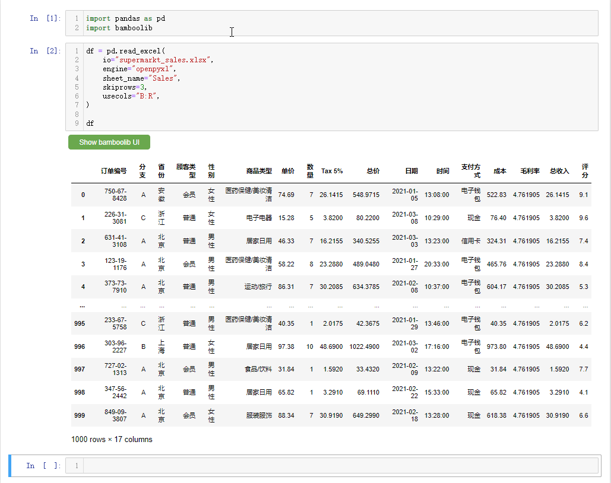<br />先来简单介绍一下界面上的各个按钮，

- Explore DataFrame：对数据集进行探索性分析的按钮
- Create plot: 绘制交互性图表的按钮
- Search Transformations：包含对数据集进行各项操作
- Update: 过滤出指定的列
- Export: 可以将处理完的数据集以及代码导出

点击Explore DataFrame按钮来对数据先来一个大致的印象<br /><br />看到会对数据集有一个大致的介绍，例如数据集是有1000行、18列，然后每一列的数据类型、每一列有多少的唯一值和缺失值都可以直观的看到<br />要是想要查看有着连续型变量的特征，它们之间的相关性，可以点击Correlation Matrix按钮<br />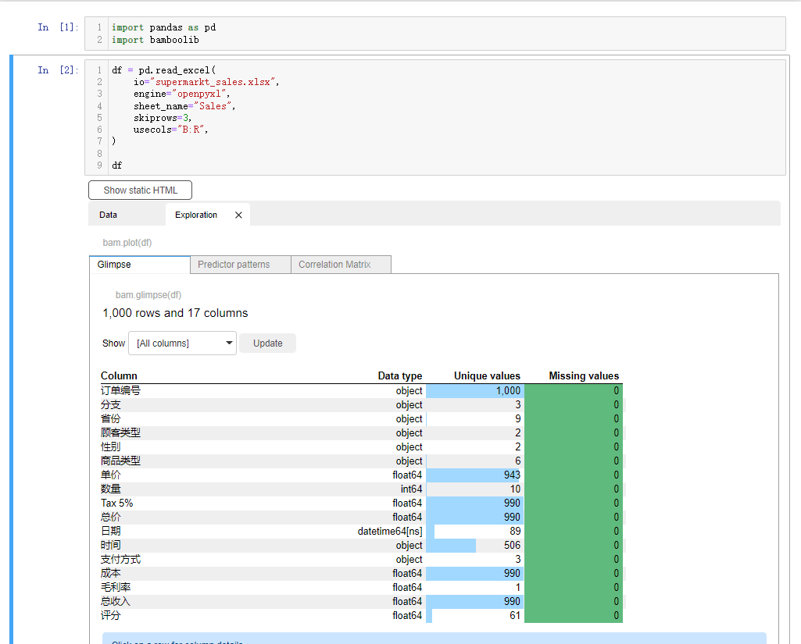
<a name="veSZM"></a>
## 过滤数据
要是想要指定某一列数据的话，点击下拉框，选中select or drop columns，<br /><br />或者想要删掉某一列的话，也是相类似的操作<br />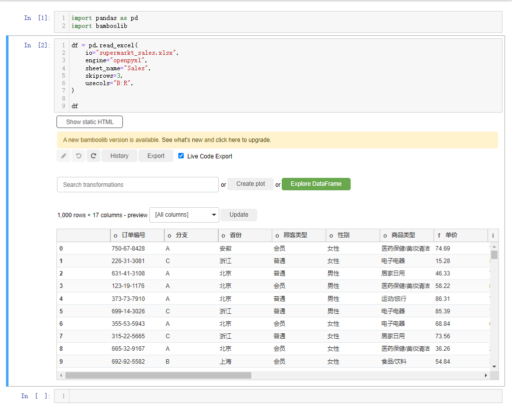<br />当然如果想要根据特定的条件来过滤出某些数据的话，则是选中filter rows按钮，然后给出特定的条件，在Bamboolib模块当中有多种方式来过滤数据，有has values、contains、startswith、endswith等等，类似于Pandas模块当中对于文本数据处理的方法，例如想要挑选出“省份”这一列当中的“浙江省”的数据，就这么来做<br /><br />还能够对每行的数据进行排列，点击下拉框选中sort rows，例如以“毛利率”的大小来排序，并且是降序排序，就这么来做<br /><br />要是想要对某一列的列名进行重命名，点击rename columns<br />
<a name="t3c9P"></a>
## 数据的清洗与类型转换
能够改变数据集当中某一列的数据类型，点击选中change column data dtype<br />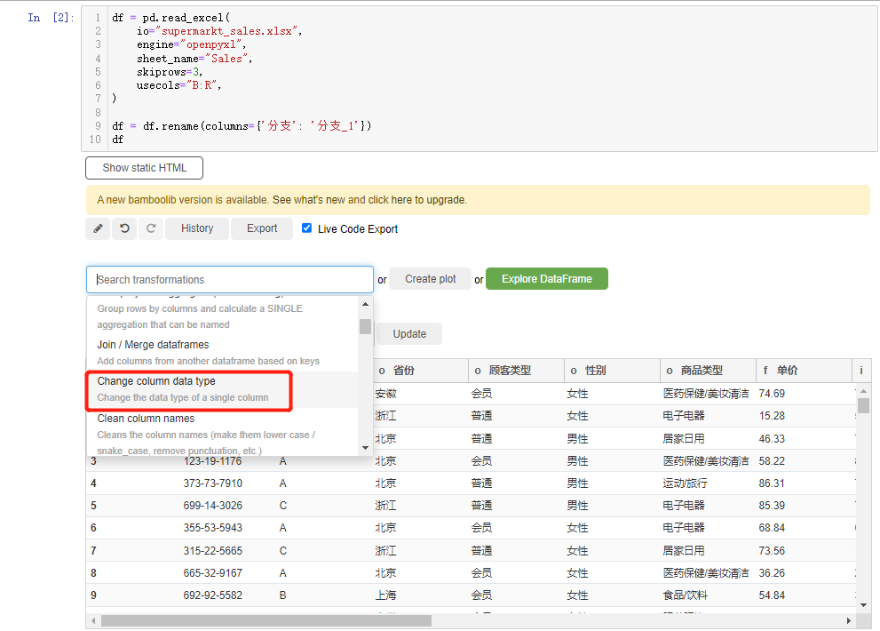<br />对于缺失值的情况，既可以选择去除掉这些缺失值，点击选中drop missing values或者是drop columns with missing values<br />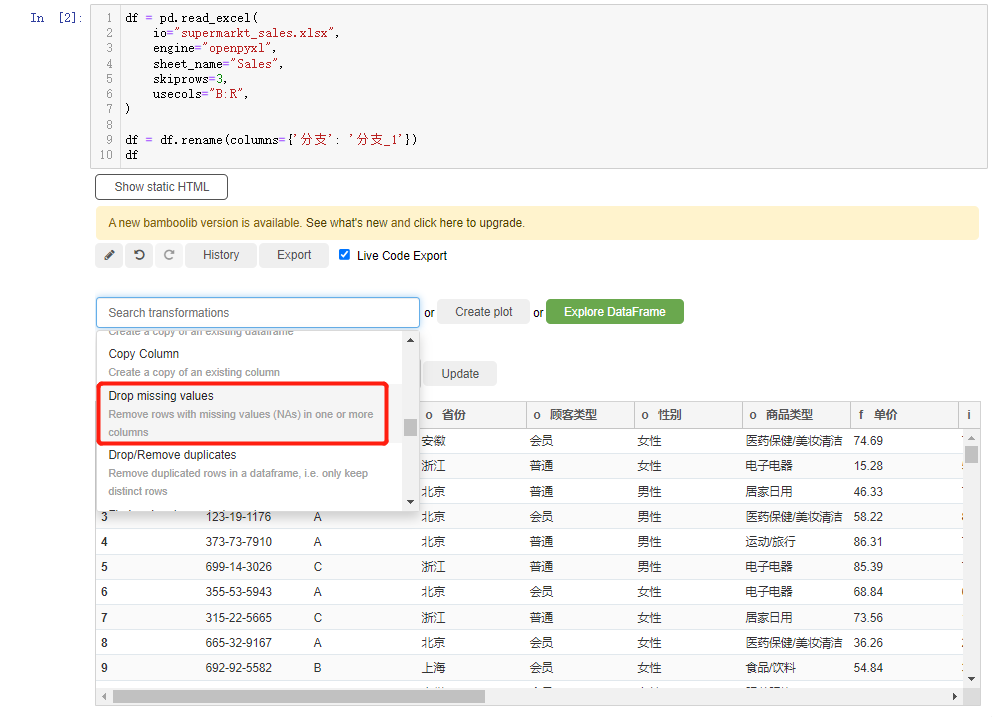<br />当然可以将这些缺失值**替代**为其他特定的值，无论是平均值或者是众数等等，点击选中find and replace missing values<br />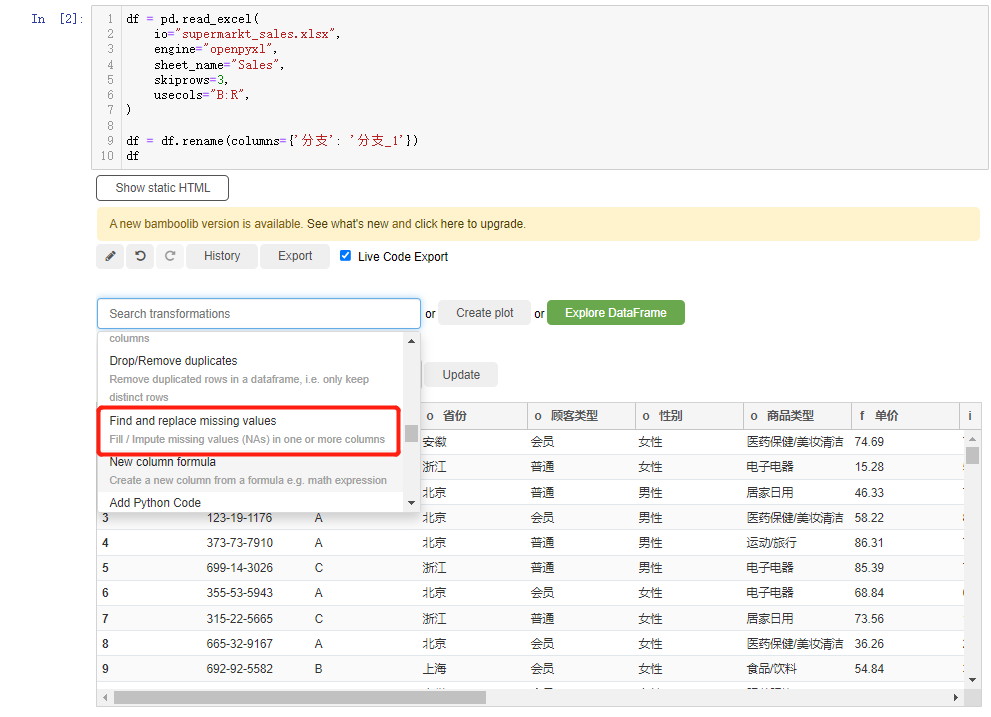
<a name="O36hG"></a>
## 数据的统计分析
可以通过bamboolib模块来对数据进行统计分析，例如计算数值的变化(percent change)，在下拉框中找到percent change的选项，然后对指定的列计算当中**数值的变化百分比**<br />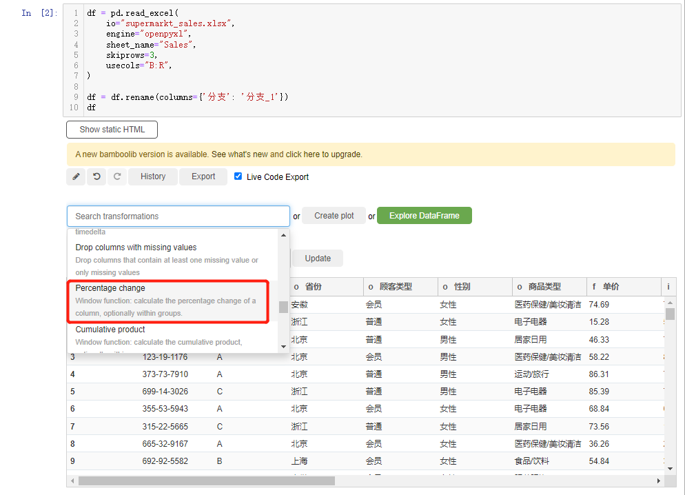<br />还能够进行累乘/累加的操作，在下拉框中选中cumulative product或者是cumulative sum<br />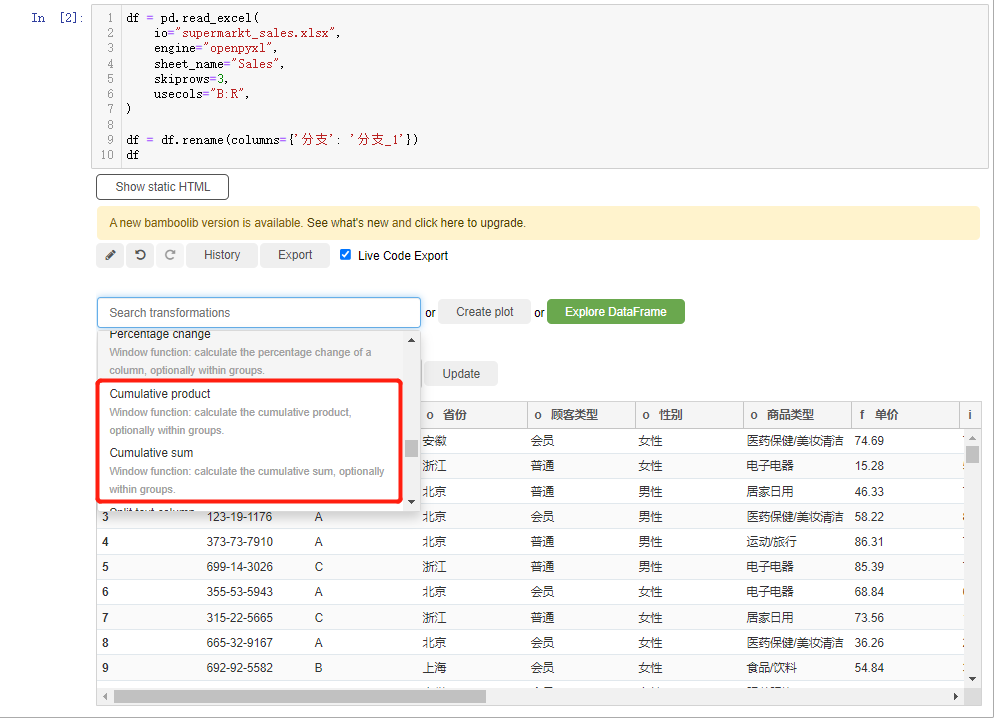<br />另外还能进行分组统计的计算操作，选中下拉框当中的group by and aggregate按钮，例如以“省份”来分组，计算“总收入”的平均值，可以这么来操作<br />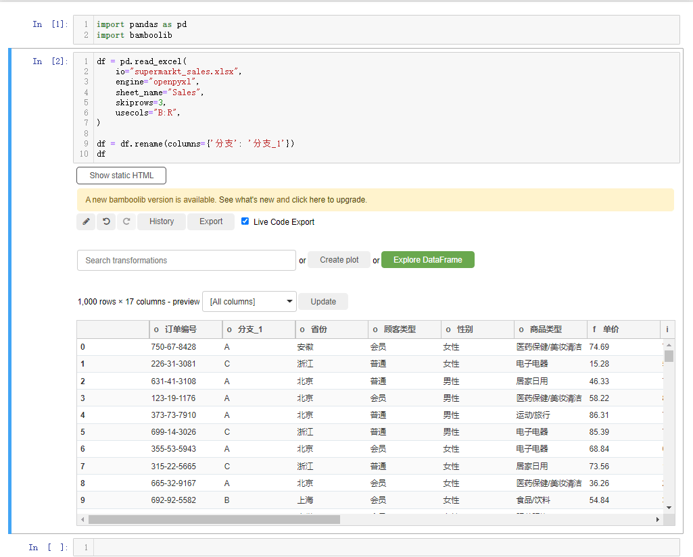
<a name="K9zcY"></a>
## 合并数据集
要是想要进行合并数据集的操作，在下拉框选中join/merge dataframes选项，当中有四种合并的方式，分别是inner join、left join、right join和outer join，然后选择合并的<br />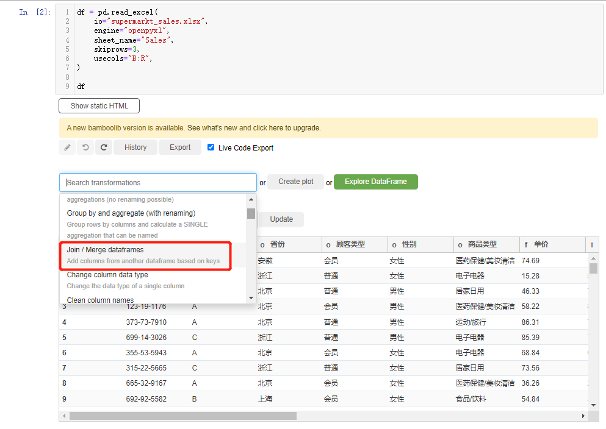
<a name="Cy5Y5"></a>
## 文本数据的操作
还能对数据集当中的文本数据进行各种操作，包括对英文字母大小写的转换，就用convert to lowercase/convert to uppercase<br />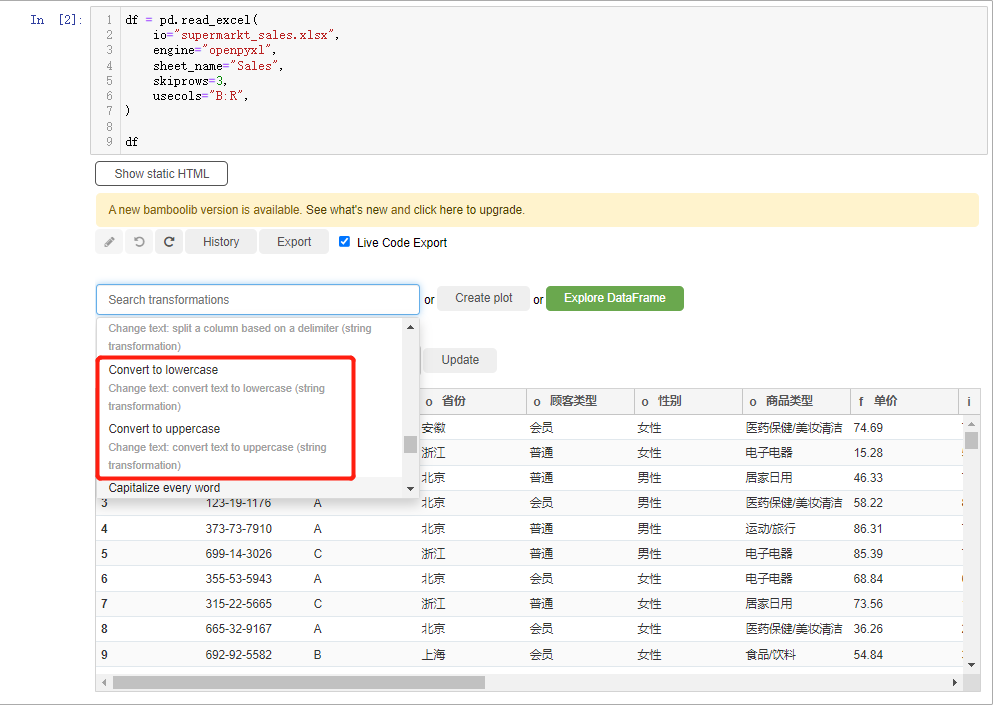<br />如果需要对字符串当中的空格做一个处理，在下拉框当中选中Remove leading and trailing whitespaces

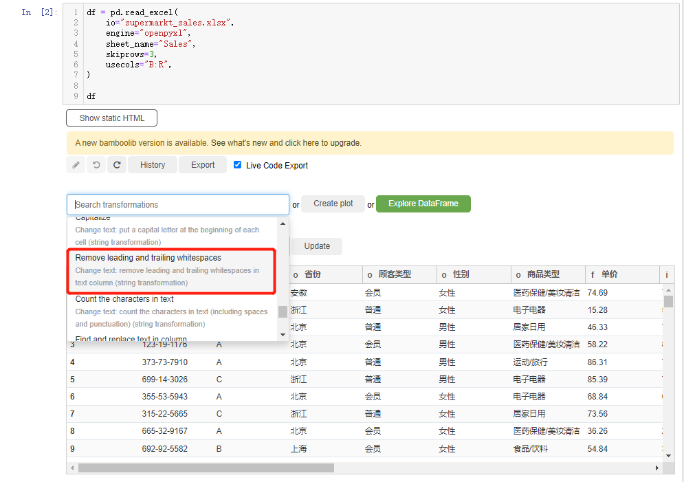<br />而要是需要对字符串做一个分割，就在下拉框中选中split text column<br />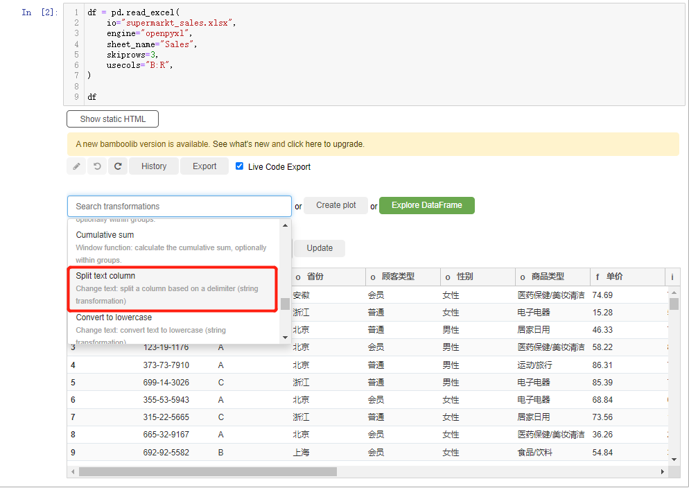
<a name="Ccm1S"></a>
## 绘制交互式的图表
同时还能够通过该模块来绘制交互式的图表，点击“create plot”按钮，能看到在图表类型当中有直方图、柱状图、折线图、饼图等十来种，来绘制当中的一种<br />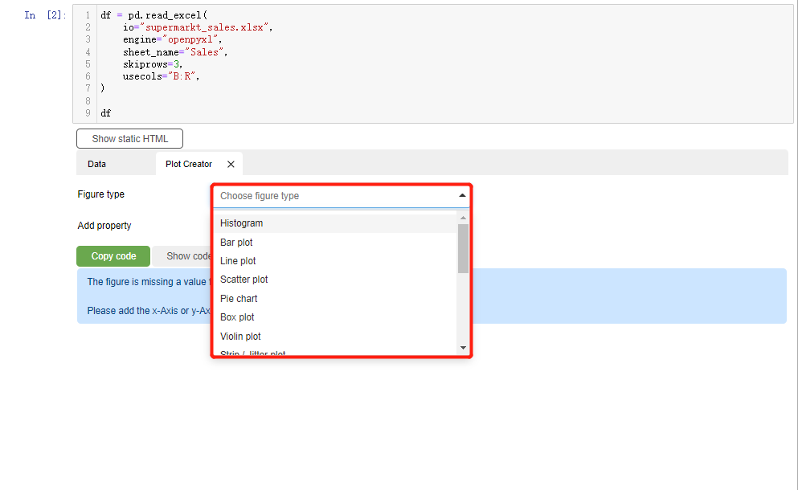<br />在X轴上指定的是“省份”的数据，然后**根据不同的商品类型配上不同的颜色**，而从绘制出来的结果中能够看到来自“**北京**”的顾客“**食品饮料**”购买的比较多，而来“**浙江**”的顾客“**服装服饰**”购买的比较多<br /><br />当然除了直方图之外，还有其他很多种图表可以通过该模块来绘制，这里由于篇幅有限，就不一一演示。
