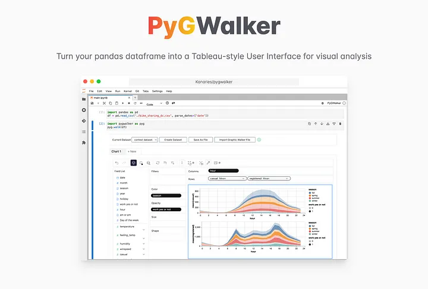
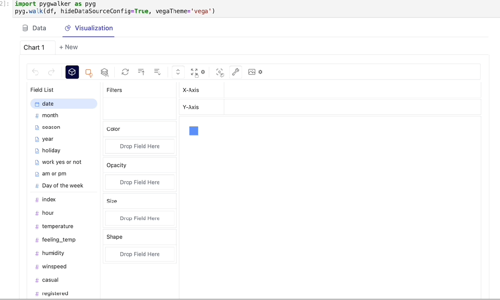
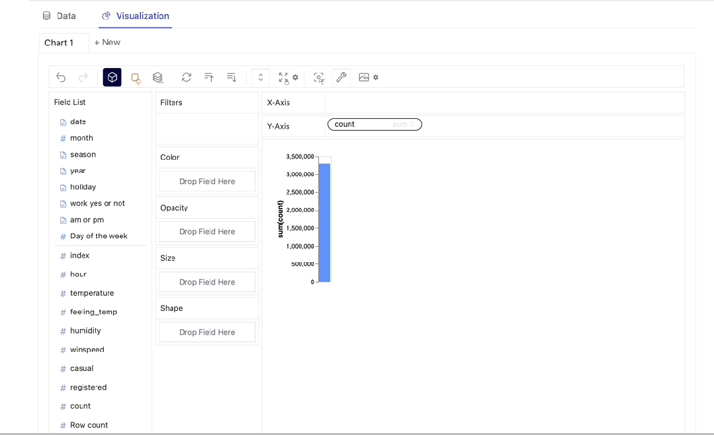
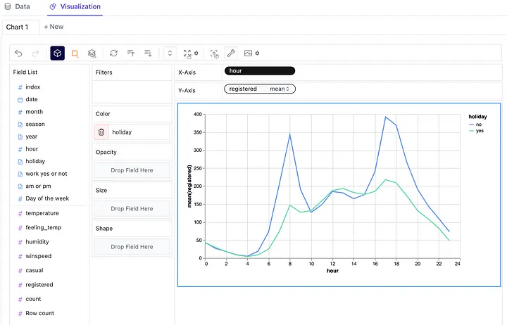
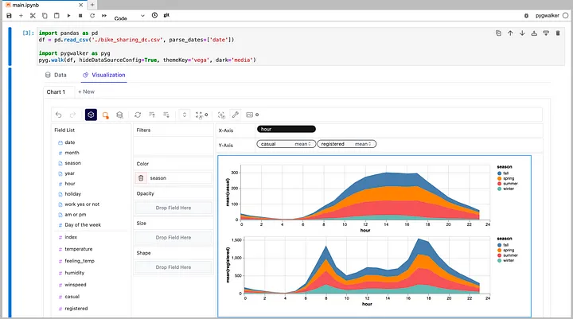
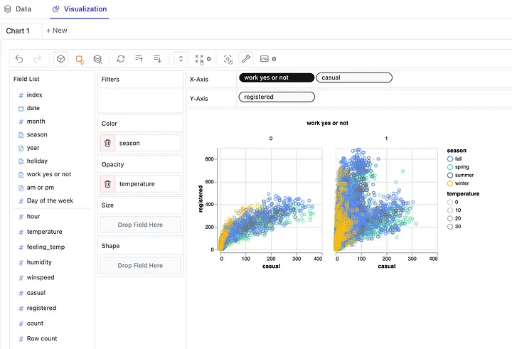
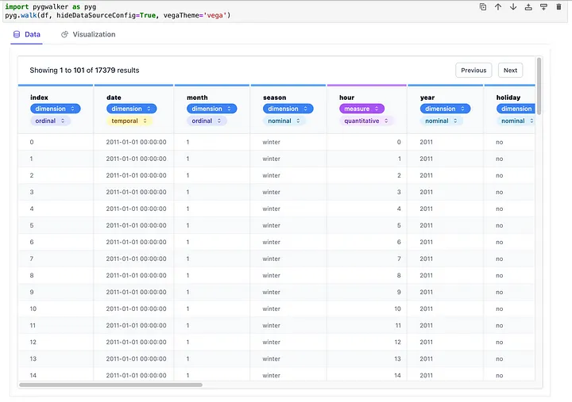

假设在 Jupyter Notebook 中有一堆数据需要分析和可视化。PyGWalker 就像一个神奇的工具，使这一切变得非常容易。<br />它接受你的数据并将其转换成一种特殊的表格，可以像使用 Tableau 一样与之交互。<br />可以通过视觉方式探索数据，进行互动，看到模式和洞察，而不用陷入复杂的代码中。<br />PyGWalker 简化了一切，让你能够迅速而轻松地分析和理解数据。PyGWalker 由 Kanaries 开发。<br /><br />官方GitHub：[https://github.com/Kanaries/pygwalker](https://github.com/Kanaries/pygwalker)<br />通过 pip 安装 PyGWalker 库
```bash
!pip install pygwalker -q
```
要在 Jupyter Notebook 中开始使用 PyGWalker，需要导入两个基本库：pandas 和 pygwalker。
```python
import pandas as pd
import pygwalker as pyg
```
`import pandas as pd` 一行让你能够以表格格式处理数据，而 `import pygwalker as pyg`引入了 PyGWalker 库。<br />一旦导入，就可以将 PyGWalker 无缝集成到现有的工作流中。<br />例如，可以使用 pandas 加载数据：
```python
df = pd.read_csv('my_data.csv')
```
然后，通过将数据框作为参数传递，可以创建一个 PyGWalker 的实例，命名为 “gwalker”：
```python
gwalker = pyg.walk(df)
```
当执行提供的命令时，一个新的输出将出现在代码单元格下方。该输出将包含一个交互式用户界面。<br /><br />这个界面提供了各种拖放功能，可以利用它们来分析和探索数据。它提供了一种方便而交互式的方式来与数据进行交互，使你能够执行诸如可视化数据、探索关系等任务。<br />有了 PyGWalker，现在有了一个类似于 Tableau 的用户界面，允许分析和可视化你的数据。<br /><br />PyGWalker 提供了更改标记类型的灵活性，使你能够创建不同的图表。例如，通过选择所需的变量并选择线条标记类型，可以轻松切换到折线图。<br /><br />还可以通过创建连接视图来比较不同的度量。通过将多个度量添加到行或列，可以轻松地分析并将它们并排比较。<br /><br />可以根据特定的类别或特征将数据组织成单独的部分。这有助于你单独分析和比较数据的不同子集。<br /><br />PyGWalker 允许你以表格格式查看数据，并自定义分析类型和语义类型。可以轻松地以结构化的方式可视化数据，并根据具体需求调整如何分析和解释数据。<br /><br />还可以将数据探索结果保存到本地文件。
<a name="F6gxX"></a>
## 总结
PyGWalker 是一个功能丰富的库，提供了许多功能。探索这个强大的工具可以提高在数据分析和可视化方面的技能。
