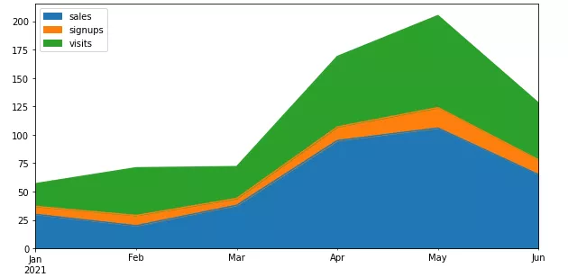
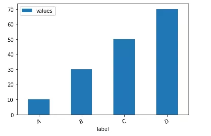
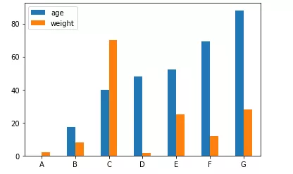
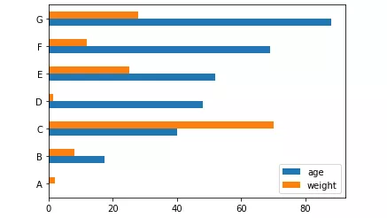
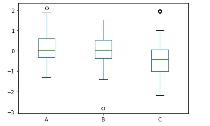

Python Pandas

- `items()`方法
- `iterrows()`方法
- `insert()`方法
- `assign()`方法
- `eval()`方法
- `pop()`方法
- `truncate()`方法
- `count()`方法
- `add_prefix()`方法/`add_suffix()`方法
- `clip()`方法
- `filter()`方法
- `first()`方法
- `isin()`方法
- `df.plot.area()`方法
- `df.plot.bar()`方法
- `df.plot.box()`方法
- `df.plot.pie()`方法
<a name="fwOXm"></a>
### `items()`方法
pandas当中的`items()`方法可以用来遍历数据集当中的每一列，同时返回列名以及每一列当中的内容，通过以元组的形式，示例如下
```python
df = pd.DataFrame({'species': ['bear', 'bear', 'marsupial'],
                  'population': [1864, 22000, 80000]},
                  index=['panda', 'polar', 'koala'])
df
```
output
```python
         species  population
panda       bear        1864
polar       bear       22000
koala  marsupial       80000
```
然后使用`items()`方法
```python
for label, content in df.items():
    print(f'label: {label}')
    print(f'content: {content}', sep='\n')
    print("=" * 50)
```
output
```python
label: species
content: panda         bear
polar         bear
koala    marsupial
Name: species, dtype: object
==================================================
label: population
content: panda     1864
polar    22000
koala    80000
Name: population, dtype: int64
==================================================
```
相继的打印出了‘species’和‘population’这两列的列名和相应的内容
<a name="ERNs9"></a>
### `iterrows()`方法
而对于`iterrows()`方法而言，其功能则是遍历数据集当中的每一行，返回每一行的索引以及带有列名的每一行的内容，示例如下
```python
for label, content in df.iterrows():
    print(f'label: {label}')
    print(f'content: {content}', sep='\n')
    print("=" * 50)
```
output
```python
label: panda
content: species       bear
population    1864
Name: panda, dtype: object
==================================================
label: polar
content: species        bear
population    22000
Name: polar, dtype: object
==================================================
label: koala
content: species       marsupial
population        80000
Name: koala, dtype: object
==================================================
```
<a name="IVZDQ"></a>
### `insert()`方法
`insert()`方法主要是用于在数据集当中的特定位置处插入数据，示例如下
```python
df.insert(1, "size", [2000, 3000, 4000])
```
output
```python
         species  size  population
panda       bear  2000        1864
polar       bear  3000       22000
koala  marsupial  4000       80000
```
可见在DataFrame数据集当中，列的索引也是从0开始的
<a name="p6GKG"></a>
### `assign()`方法
`assign()`方法可以用来在数据集当中添加新的列，示例如下
```python
df.assign(size_1=lambda x: x.population * 9 / 5 + 32)
```
output
```python
         species  population    size_1
panda       bear        1864    3387.2
polar       bear       22000   39632.0
koala  marsupial       80000  144032.0
```
从上面的例子中可以看出，通过一个`lambda`匿名函数，在数据集当中添加一个新的列，命名为‘size_1’，当然也可以通过`assign()`方法来创建不止一个列
```python
df.assign(size_1 = lambda x: x.population * 9 / 5 + 32,
          size_2 = lambda x: x.population * 8 / 5 + 10)
```
output
```python
         species  population    size_1    size_2
panda       bear        1864    3387.2    2992.4
polar       bear       22000   39632.0   35210.0
koala  marsupial       80000  144032.0  128010.0
```
<a name="CRvXu"></a>
### `eval()`方法
`eval()`方法主要是用来执行用字符串来表示的运算过程的，例如
```python
df.eval("size_3 = size_1 + size_2")
```
output
```python
         species  population    size_1    size_2    size_3
panda       bear        1864    3387.2    2992.4    6379.6
polar       bear       22000   39632.0   35210.0   74842.0
koala  marsupial       80000  144032.0  128010.0  272042.0
```
当然也可以同时对执行多个运算过程
```python
df = df.eval('''
size_3 = size_1 + size_2
size_4 = size_1 - size_2
''')
```
output
```python
         species  population    size_1    size_2    size_3   size_4
panda       bear        1864    3387.2    2992.4    6379.6    394.8
polar       bear       22000   39632.0   35210.0   74842.0   4422.0
koala  marsupial       80000  144032.0  128010.0  272042.0  16022.0
```
<a name="pEjo4"></a>
### `pop()`方法
`pop()`方法主要是用来删除掉数据集中特定的某一列数据
```python
df.pop("size_3")
```
output
```python
panda      6379.6
polar     74842.0
koala    272042.0
Name: size_3, dtype: float64
```
而原先的数据集当中就没有这个‘size_3’这一例的数据了
<a name="hoyU6"></a>
### `truncate()`方法
`truncate()`方法主要是根据行索引来筛选指定行的数据的，示例如下
```python
df = pd.DataFrame({'A': ['a', 'b', 'c', 'd', 'e'],
                   'B': ['f', 'g', 'h', 'i', 'j'],
                   'C': ['k', 'l', 'm', 'n', 'o']},
                  index=[1, 2, 3, 4, 5])
```
output
```python
   A  B  C
1  a  f  k
2  b  g  l
3  c  h  m
4  d  i  n
5  e  j  o
```
使用`truncate()`方法来做一下尝试
```python
df.truncate(before=2, after=4)
```
output
```python
   A  B  C
2  b  g  l
3  c  h  m
4  d  i  n
```
可以看到参数`before`和`after`存在于`truncate()`方法中，目的就是把行索引2之前和行索引4之后的数据排除在外，筛选出剩余的数据
<a name="En4js"></a>
### `count()`方法
`count()`方法主要是用来计算某一列当中非空值的个数，示例如下
```python
df = pd.DataFrame({"Name": ["John", "Myla", "Lewis", "John", "John"],
                   "Age": [24., np.nan, 25, 33, 26],
                   "Single": [True, True, np.nan, True, False]})
```
output
```python
    Name   Age Single
0   John  24.0   True
1   Myla   NaN   True
2  Lewis  25.0    NaN
3   John  33.0   True
4   John  26.0  False
```
使用`count()`方法来计算一下数据集当中非空值的个数
```python
df.count()
```
output
```python
Name      5
Age       4
Single    4
dtype: int64
```
<a name="Ih7tV"></a>
### `add_prefix()`方法/`add_suffix()`方法
`add_prefix()`方法和`add_suffix()`方法分别会给列名以及行索引添加后缀和前缀，对于`Series()`数据集而言，前缀与后缀是添加在行索引处，而对于`DataFrame()`数据集而言，前缀与后缀是添加在列索引处，示例如下
```python
s = pd.Series([1, 2, 3, 4])
```
output
```python
0    1
1    2
2    3
3    4
dtype: int64
```
使用`add_prefix()`方法与`add_suffix()`方法在`Series()`数据集上
```python
s.add_prefix('row_')
```
output
```python
row_0    1
row_1    2
row_2    3
row_3    4
dtype: int64
```
又例如
```python
s.add_suffix('_row')
```
output
```python
0_row    1
1_row    2
2_row    3
3_row    4
dtype: int64
```
而对于`DataFrame()`形式数据集而言，`add_prefix()`方法以及`add_suffix()`方法是将前缀与后缀添加在列索引处的
```python
df = pd.DataFrame({'A': [1, 2, 3, 4], 'B': [3, 4, 5, 6]})
```
output
```python
   A  B
0  1  3
1  2  4
2  3  5
3  4  6
```
示例如下
```python
df.add_prefix("column_")
```
output
```python
   column_A  column_B
0         1         3
1         2         4
2         3         5
3         4         6
```
又例如
```python
df.add_suffix("_column")
```
output
```python
   A_column  B_column
0         1         3
1         2         4
2         3         5
3         4         6
```
<a name="zFVhL"></a>
### `clip()`方法
`clip()`方法主要是通过设置阈值来改变数据集当中的数值，当数值超过阈值的时候，就做出相应的调整
```python
data = {'col_0': [9, -3, 0, -1, 5], 'col_1': [-2, -7, 6, 8, -5]}
df = pd.DataFrame(data)
```
output
```python
df.clip(lower = -4, upper = 4)
```
output
```python
   col_0  col_1
0      4     -2
1     -3     -4
2      0      4
3     -1      4
4      4     -4
```
可以看到参数lower和upper分别代表阈值的上限与下限，数据集当中超过上限与下限的值会被替代。
<a name="lGYjI"></a>
### `filter()`方法
pandas当中的`filter()`方法是用来筛选出特定范围的数据的，示例如下
```python
df = pd.DataFrame(np.array(([1, 2, 3], [4, 5, 6], [7, 8, 9], [10, 11, 12])),
                  index=['A', 'B', 'C', 'D'],
                  columns=['one', 'two', 'three'])
```
output
```python
   one  two  three
A    1    2      3
B    4    5      6
C    7    8      9
D   10   11     12
```
使用`filter()`方法来筛选数据
```python
df.filter(items=['one', 'three'])
```
output
```python
   one  three
A    1      3
B    4      6
C    7      9
D   10     12
```
还可以使用正则表达式来筛选数据
```python
df.filter(regex='e$', axis=1)
```
output
```python
   one  three
A    1      3
B    4      6
C    7      9
D   10     12
```
当然通过参数`axis`来调整筛选行方向或者是列方向的数据
```python
df.filter(like='B', axis=0)
```
output
```python
   one  two  three
B    4    5      6
```
<a name="G0fh1"></a>
### `first()`方法
当数据集当中的行索引是日期的时候，可以通过该方法来筛选前面几行的数据
```python
index_1 = pd.date_range('2021-11-11', periods=5, freq='2D')
ts = pd.DataFrame({'A': [1, 2, 3, 4, 5]}, index=index_1)
ts
```
output
```python
            A
2021-11-11  1
2021-11-13  2
2021-11-15  3
2021-11-17  4
2021-11-19  5
```
使用`first()`方法来进行一些操作，例如筛选出前面3天的数据
```python
ts.first('3D')
```
output
```python
            A
2021-11-11  1
2021-11-13  2
```
<a name="L6PN3"></a>
### `isin()`方法
`isin()`方法主要是用来确认数据集当中的数值是否被包含在给定的列表当中
```python
df = pd.DataFrame(np.array(([1, 2, 3], [4, 5, 6], [7, 8, 9], [10, 11, 12])),
                  index=['A', 'B', 'C', 'D'],
                  columns=['one', 'two', 'three'])
df.isin([3, 5, 12])
```
output
```python
     one    two  three
A  False  False   True
B  False   True  False
C  False  False  False
D  False  False   True
```
若是数值被包含在列表当中了，也就是3、5、12当中，返回的是True，否则就返回False
<a name="Y0wzr"></a>
### `df.plot.area()`方法
下面来讲一下如何在Pandas当中通过一行代码来绘制图表，将所有的列都通过面积图的方式来绘制
```python
df = pd.DataFrame({
    'sales': [30, 20, 38, 95, 106, 65],
    'signups': [7, 9, 6, 12, 18, 13],
    'visits': [20, 42, 28, 62, 81, 50],
}, index=pd.date_range(start='2021/01/01', end='2021/07/01', freq='M'))

ax = df.plot.area(figsize = (10, 5))
```
output<br />
<a name="jlwZp"></a>
### `df.plot.bar()`方法
下面看一下如何通过一行代码来绘制柱状图
```python
df = pd.DataFrame({'label':['A', 'B', 'C', 'D'], 'values':[10, 30, 50, 70]})
ax = df.plot.bar(x='label', y='values', rot=20)
```
output<br /><br />当然也可以根据不同的类别来绘制柱状图
```python
age = [0.1, 17.5, 40, 48, 52, 69, 88]
weight = [2, 8, 70, 1.5, 25, 12, 28]
index = ['A', 'B', 'C', 'D', 'E', 'F', 'G']
df = pd.DataFrame({'age': age, 'weight': weight}, index=index)
ax = df.plot.bar(rot=0)
```
output<br /><br />当然也可以横向来绘制图表
```python
ax = df.plot.barh(rot=0)
```
output<br />
<a name="yKX1S"></a>
### `df.plot.box()`方法
来看一下箱型图的具体的绘制，通过pandas一行代码来实现
```python
data = np.random.randn(25, 3)
df = pd.DataFrame(data, columns=list('ABC'))
ax = df.plot.box()
```
output<br />
<a name="ep3Qc"></a>
### `df.plot.pie()`方法
接下来是饼图的绘制
```python
df = pd.DataFrame({'mass': [1.33, 4.87 , 5.97],
                   'radius': [2439.7, 6051.8, 6378.1]},
                  index=['Mercury', 'Venus', 'Earth'])
plot = df.plot.pie(y='mass', figsize=(8, 8))
```
output<br /><br />除此之外，还有折线图、直方图、散点图等等，步骤与方式都与上述的技巧有异曲同工之妙，可以自己另外去尝试。
