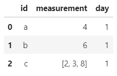
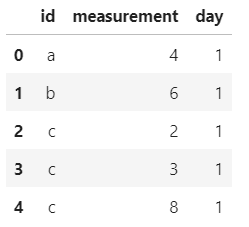
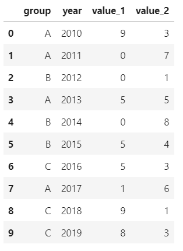
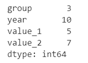
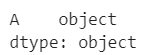
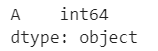
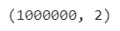
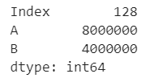
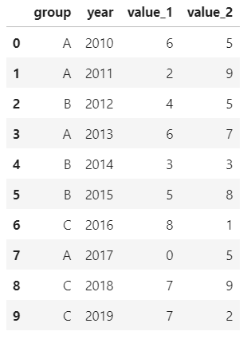
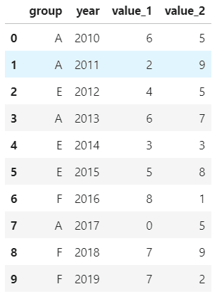

Python Pandas
<a name="01HSF"></a>
## 1. `explode`
`explode`用于将一行数据展开成多行。比如说dataframe中某一行其中一个元素包含多个同类型的数据，若想要展开成多行进行分析，这时候`explode`就派上用场，而且只需一行代码，非常节省时间。<br />用法：
```python
DataFrame.explode(self, column: Union[str, Tuple])
```
参数作用：

- column：str或tuple

以下表中第三行、第二列为例，展开[2,3,8]：
```python
# 先创建表
id = ['a','b','c']
measurement = [4,6,[2,3,8]]
day = [1,1,1]
df1 = pd.DataFrame({'id':id, 'measurement':measurement, 'day':day})
df1
```
<br />使用`explode`轻松将`[2,3,8]`转换成多行，且行内其他元素保持不变。
```python
df1.explode('measurement').reset_index(drop=True)
```

<a name="LoACC"></a>
## 2. `Nunique`
`Nunique`用于计算行或列上唯一值的数量，即去重后计数。这个函数在分类问题中非常实用，当不知道某字段中有多少类元素时，`Nunique`能快速生成结果。<br />用法：
```python
Series.nunique(dropna=True)
# 或者
DataFrame.nunique(axis=0, dropna=True)
```
参数作用：

- axis：int型，0代表行，1代表列，默认0；
- dropna：bool类型，默认为True，计数中不包括NaN；

先创建一个df：
```python
values_1 = np.random.randint(10, size=10)
values_2 = np.random.randint(10, size=10)
years = np.arange(2010,2020)
groups = ['A','A','B','A','B','B','C','A','C','C']
df = pd.DataFrame({'group':groups, 'year':years, 'value_1':values_1, 'value_2':values_2})
df
```
<br />对year列进行唯一值计数：
```python
df.year.nunique()
```
输出：10 对整个dataframe的每一个字段进行唯一值计数：
```python
df.nunique()
```

<a name="NggFi"></a>
## 3. `infer_objects`
`infer_objects`用于将object类型列推断为更合适的数据类型。<br />用法：
```python
# 直接将df或者series推断为合适的数据类型
DataFrame.infer_objects()
```
pandas支持多种数据类型，其中之一是object类型。object类型包括字符串和混合值（数字及非数字）。<br />object类型比较宽泛，如果可以确定为具体数据类型，则不建议用object。
```python
df = pd.DataFrame({"A": ["a", 1, 2, 3]})
df = df.iloc[1:]
df
```

```python
df.dtypes
```
<br />使用`infer_objects`方法将object推断为int类型：
```python
df.infer_objects().dtypes
```

<a name="qmEq5"></a>
## 4. `memory_usage`
`memory_usage`用于计算dataframe每一列的字节存储大小，这对于大数据表非常有用。<br />用法：
```python
DataFrame.memory_usage(index=True, deep=False)
```
参数解释：<br />`index`：指定是否返回df中索引字节大小，默认为True，返回的第一行即是索引的内存使用情况；<br />`deep`：如果为True，则通过查询object类型进行系统级内存消耗来深入地检查数据，并将其包括在返回值中。<br />首先创建一个df，共2列，1000000行。
```python
df_large = pd.DataFrame({'A': np.random.randn(1000000),
                    'B': np.random.randint(100, size=1000000)})
df_large.shape
```
<br />返回每一列的占用字节大小：
```python
df_large.memory_usage()
```
<br />第一行是索引index的内存情况，其余是各列的内存情况。
<a name="B3cWH"></a>
## 5. `replace`
顾名思义，`replace`是用来替换df中的值，赋以新的值。<br />用法：
```python
DataFrame.replace(to_replace=None, value=None, inplace=False, limit=None, regex=False, method='pad')
```
参数解释：

- `to_replace`：被替换的值
- `value`：替换后的值
- `inplace`：是否要改变原数据，False是不改变，True是改变，默认是False
- `limit`：控制填充次数
- `regex`：是否使用正则,False是不使用，True是使用，默认是False
- `method`：填充方式，`pad`，`ffill`，`bfill`分别是向前、向前、向后填充

创建一个df：
```python
values_1 = np.random.randint(10, size=10)
values_2 = np.random.randint(10, size=10)
years = np.arange(2010,2020)
groups = ['A','A','B','A','B','B','C','A','C','C']
df = pd.DataFrame({'group':groups, 'year':years, 'value_1':values_1, 'value_2':values_2})
df
```
<br />将A全部替换为D：
```python
df.replace('A','D')
```
将B替换为E，C替换为F：
```python
df.replace({'B':'E','C':'F'})
```

