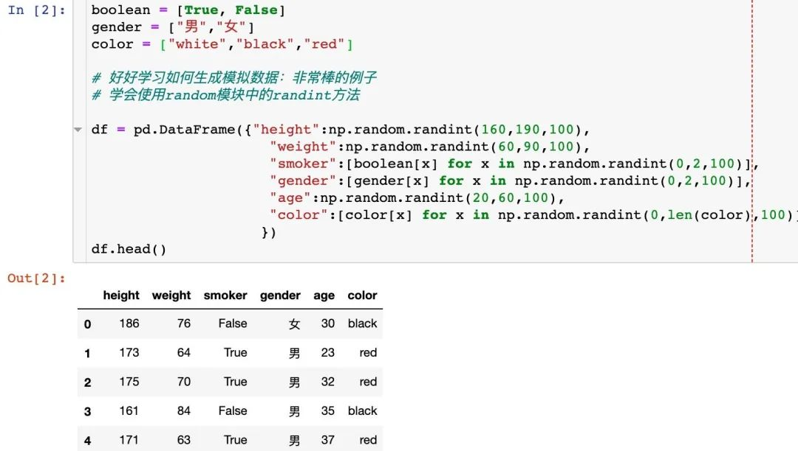
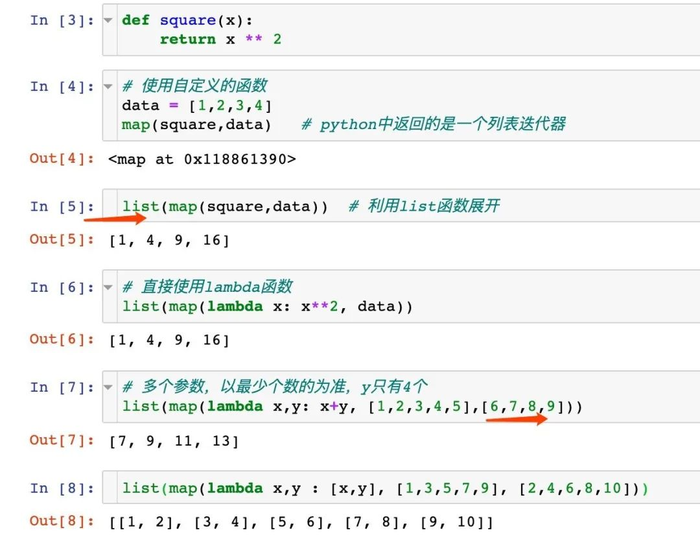
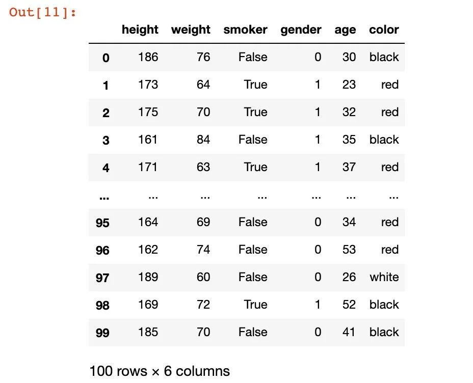
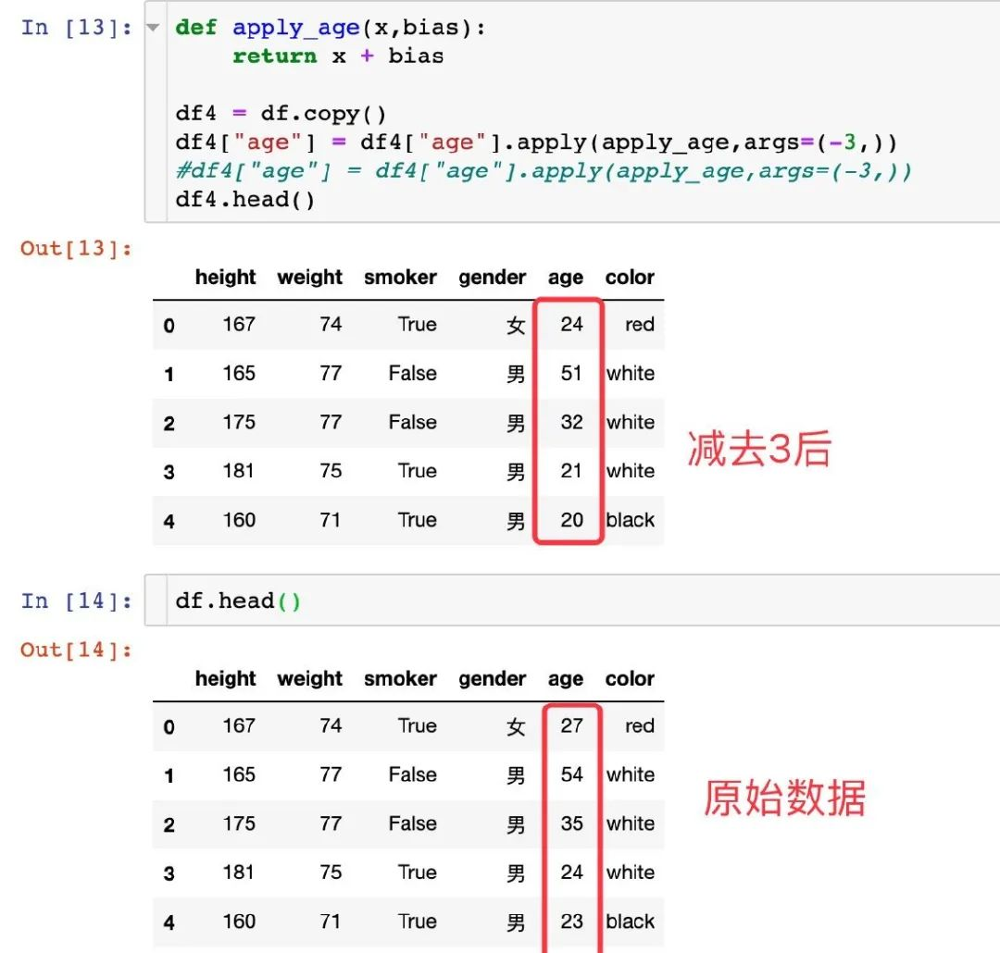
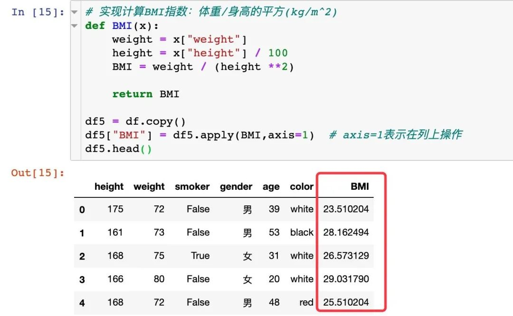
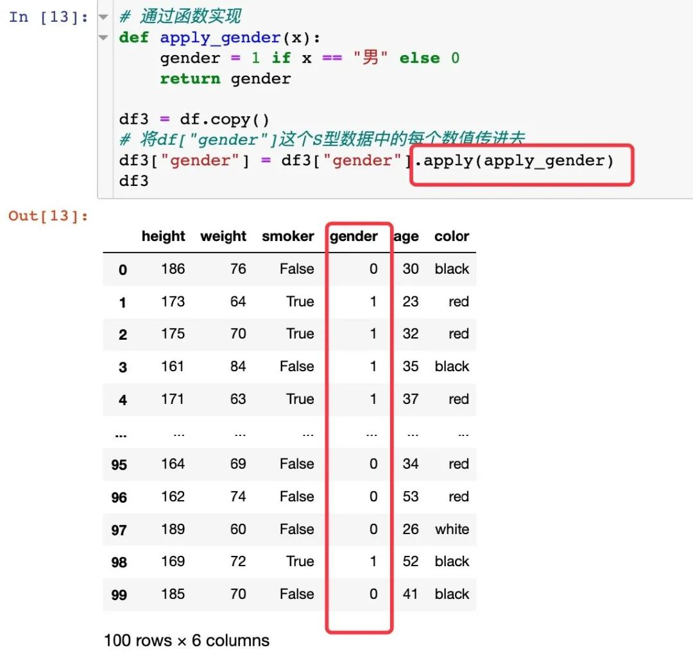
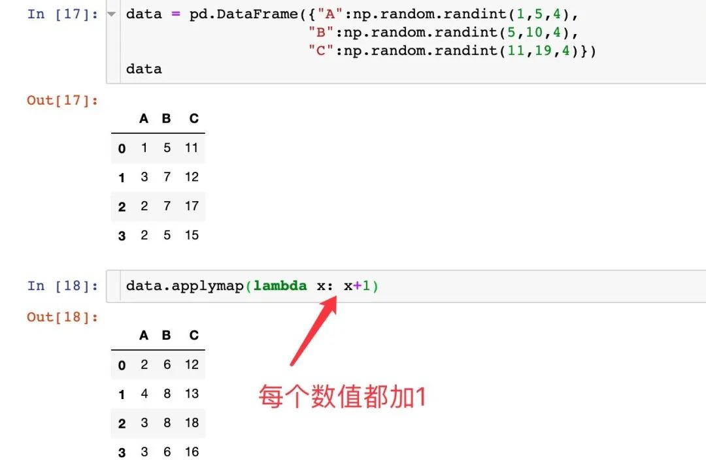
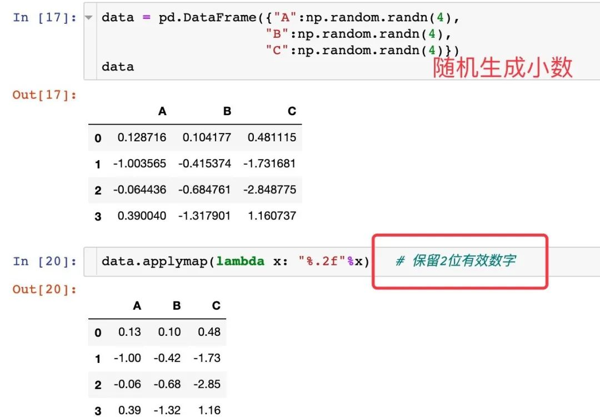

Python Pandas<br /><br />实际工作中，在利用 pandas进行数据处理的时候，经常会对数据框中的单行、多行（列也适用）甚至是整个数据进行某种相同方式的处理，比如将数据中的 sex字段将 男替换成1，女替换成0。<br />在这个时候，很容易想到的是 for循环。用 for循环是一种很简单、直接的方式，但是运行效率很低。本文中介绍了 pandas中的三大利器： map、apply、applymap 来解决上述同样的需求。

- map
- apply
- applymap
<a name="xtAKl"></a>
## 1、模拟数据
通过一个模拟的数据来说明3个函数的使用，在这个例子中学会了如何生成各种模拟数据。数据如下：
```python
import pandas as pd
import numpy as np


boolean = [True, False]
gender = ["男","女"]
color = ["white","black","red"]


# 好好学习如何生成模拟数据：非常棒的例子
# 学会使用random模块中的randint方法


df = pd.DataFrame({"height":np.random.randint(160,190,100),
                     "weight":np.random.randint(60,90,100),
                     "smoker":[boolean[x] for x in np.random.randint(0,2,100)],
                     "gender":[gender[x] for x in np.random.randint(0,2,100)],
                     "age":np.random.randint(20,60,100),
                     "color":[color[x] for x in np.random.randint(0,len(color),100)]
                    })
df.head()
```

<a name="UHllU"></a>
## 2、map
<a name="GMawo"></a>
### demo
`map()` 会根据提供的函数对指定序列做映射。<br />第一个参数 function 以参数序列中的每一个元素调用 function 函数，返回包含每次 function 函数返回值的新列表。
```python
map(function, iterable)
```

<a name="z2arX"></a>
### 实际数据
将gender中男变成1，女变成0
```python
# 方式1：通过字典映射实现
dic = {"男":1, "女":0}  # 通过字典映射
df1 = df.copy()   # 副本，不破坏原来的数据df
df1["gender"] = df1["gender"].map(dic)
df1


# 方式2：通过函数实现
def map_gender(x):
    gender = 1 if x == "男" else 0
    return gender


df2 = df.copy()
# 将df["gender"]这个S型数据中的每个数值传进去
df2["gender"] = df2["gender"].map(map_gender)
df2
```

<a name="hqbm9"></a>
## 3、apply
`apply`方法的作用原理和 `map`方法类似，区别在于 `apply`能够传入功能更为复杂的函数，可以说 `apply`是 `map`的高级版<br />pandas 的 `apply()` 函数可以作用于 `Series` 或者整个 `DataFrame`，功能也是自动遍历整个 `Series` 或者 `DataFrame`，对每一个元素运行指定的函数。<br />在 `DataFrame`对象的大多数方法中，都会有 `axis`这个参数，它控制了指定的操作是沿着0轴还是1轴进行。 `axis=0`代表操作对 `列columns`进行， `axis=1`代表操作对 `行row`进行
<a name="XiFsA"></a>
### demo

1. 上面的数据中将age字段的值都减去3，即加上-3
```python
def apply_age(x,bias):
    return x + bias


df4 = df.copy()
# df4["age"]当做第一个值传给apply_age函数，args是第二个参数
df4["age"] = df4["age"].apply(apply_age,args=(-3,))
```


1. 计算BMI指数
```python
# 实现计算BMI指数：体重/身高的平方(kg/m^2)
def BMI(x):
    weight = x["weight"]
    height = x["height"] / 100
    BMI = weight / (height **2)


    return BMI


df5 = df.copy()
df5["BMI"] = df5.apply(BMI,axis=1)  # df5现在就相当于BMI函数中的参数x；axis=1表示在列上操作
df5
```
<br />DataFrame型数据的 `apply`操作总结：

1. 当 `axis=0`时，对 `每列columns`执行指定函数；当 `axis=1`时，对 `每行row`执行指定函数。
2. 无论 `axis=0`还是 `axis=1`，其传入指定函数的默认形式均为 Series，可以通过设置 `raw=True`传入 numpy数组。
3. 对每个Series执行结果后，会将结果整合在一起返回（若想有返回值，定义函数时需要 return相应的值）
<a name="bb6Tm"></a>
### apply实现需求
通过apply方法实现上面的性别转换需求。apply方法中传进来的第一个参数一定是函数<br />
<a name="m0Hqb"></a>
## 4、applymap
<a name="zAUPS"></a>
### DF数据加1
applymap函数用于对DF型数据中的每个元素执行相同的函数操作，比如下面的加1：<br />
<a name="UShD0"></a>
### 保留2位有效数字

