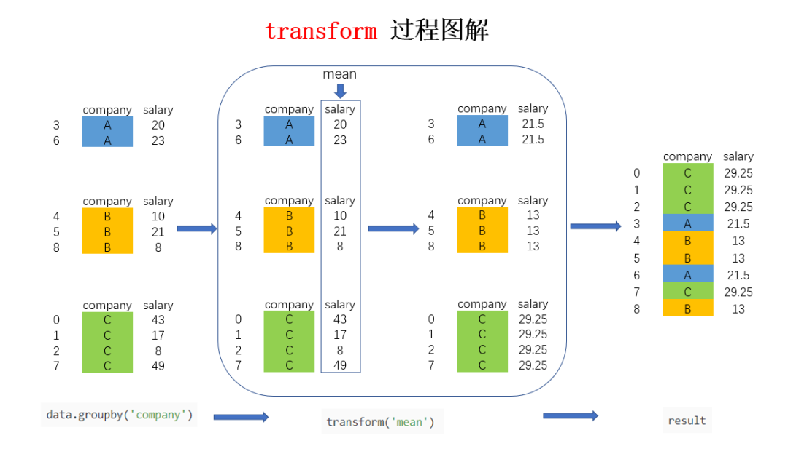

Python Pandas<br />Pandas具有很多强大的功能，`transform`就是其中之一，利用它可以高效地汇总数据且不改变数据行数，`transform`是一种什么数据操作？如果熟悉SQL的窗口函数，就非常容易理解了，该函数的核心功能是，既计算了统计值，又保留了明细数据。为了更好地理解`transform`和`agg`的不同，下面从实际的应用场景出发进行对比。<br />`aggregation`会返回数据的缩减版本，而`transformation`能返回完整数据的某一变换版本供重组。这样的`transformation`，输出的形状和输入一致。一个常见的例子是通过减去分组平均值来居中数据。
```python
#数据构造
data = pd.DataFrame(
{"company":['百度', '阿里', '百度', '阿里', '百度', '腾讯', '腾讯', '阿里', '腾讯', '阿里'],
"salary":[43000, 24000, 40000, 39000, 8000, 47000, 25000, 16000, 21000, 38000],
"age":[25, 34, 49, 42, 28, 23, 45, 21, 34, 29]}) 
data
  company  salary  age
0      百度   43000   25
1      阿里   24000   34
2      百度   40000   49
3      阿里   39000   42
4      百度    8000   28
5      腾讯   47000   23
6      腾讯   25000   45
7      阿里   16000   21
8      腾讯   21000   34
9      阿里   38000   29
```
<a name="DgAhG"></a>
## 1、`transform`作用于`Series`
<a name="w2Uks"></a>
### 1）单个变换函数
当`transform`作用于单列`Series`时较为简单 ，对`salary`列进行`transform`变换可以传入任意的非聚合类函数，比如对工资列对数化
```python
import pandas as pd 
import numpy  as np
# 对工资对数化
data['salary'].transform(np.log) 
0    10.668955
1    10.085809
2    10.596635
3    10.571317
4     8.987197
5    10.757903
6    10.126631
7     9.680344
8     9.952278
9    10.545341
Name: salary, dtype: float64
```
除了内置函数，还可以传入`lambda`函数
```python
# lambda函数
data['salary'].transform(lambda s: s+1)
0    43001
1    24001
2    40001
3    39001
4     8001
5    47001
6    25001
7    16001
8    21001
9    38001
Name: salary, dtype: int64
```
<a name="GtQZl"></a>
### 2）多个变换函数
也可以传入包含多个变换函数的列表来一口气计算出多列结果：
```python
data['salary'].transform([np.log, lambda s: s+1, np.sqrt])
   log  <lambda>        sqrt
0  10.668955     43001  207.364414
1  10.085809     24001  154.919334
2  10.596635     40001  200.000000
3  10.571317     39001  197.484177
4   8.987197      8001   89.442719
5  10.757903     47001  216.794834
6  10.126631     25001  158.113883
7   9.680344     16001  126.491106
8   9.952278     21001  144.913767
9  10.545341     38001  194.935887
```
而又因为`transform`传入的函数，在执行运算时接收的输入参数是对应的整列数据，所以可以利用这个特点实现诸如数据标准化、归一化等需要依赖样本整体统计特征的变换过程：
```python
# 利用transform进行数据标准化
data['salary'].transform(lambda s: (s - s.mean()) / s.std())
0    0.991038
1   -0.468630
2    0.760564
3    0.683739
4   -1.697825
5    1.298337
6   -0.391806
7   -1.083228
8   -0.699104
9    0.606915
Name: salary, dtype: float64
```
<a name="YJxhQ"></a>
## 2、`transform`作用于`DataFrame`
当`transform`作用于整个`DataFrame`时，实际上就是将传入的所有变换函数作用到每一列中：
```python
data.loc[:,'salary':'age'].transform(lambda s:(s-s.mean()) /s.std())
     salary       age
0  0.991038 -0.832050
1 -0.468630  0.104006
2  0.760564  1.664101
3  0.683739  0.936057
4 -1.697825 -0.520031
5  1.298337 -1.040063
6 -0.391806  1.248075
7 -1.083228 -1.248075
8 -0.699104  0.104006
9  0.606915 -0.416025
```
而当传入多个变换函数时，对应的返回结果格式类似agg中的机制，会生成MultiIndex格式的字段名
```python
data.loc[:, 'salary': 'age'].transform([np.log, lambda s: s+1])
  salary                age         
         log <lambda>       log <lambda>
0  10.668955    43001  3.218876       26
1  10.085809    24001  3.526361       35
2  10.596635    40001  3.891820       50
3  10.571317    39001  3.737670       43
4   8.987197     8001  3.332205       29
5  10.757903    47001  3.135494       24
6  10.126631    25001  3.806662       46
7   9.680344    16001  3.044522       22
8   9.952278    21001  3.526361       35
9  10.545341    38001  3.367296       30
```
而且由于作用的是DataFrame，还可以利用字典以键值对的形式，一口气为每一列配置单个或多个变换函数：
```python
(data.loc[:, 'salary': 'age']
.transform({'age': lambda s: (s - s.mean()) / s.std(),
                'salary': [np.log, np.sqrt]}))
   age     salary            
   <lambda>        log        sqrt
0 -0.832050  10.668955  207.364414
1  0.104006  10.085809  154.919334
2  1.664101  10.596635  200.000000
3  0.936057  10.571317  197.484177
4 -0.520031   8.987197   89.442719
5 -1.040063  10.757903  216.794834
6  1.248075  10.126631  158.113883
7 -1.248075   9.680344  126.491106
8  0.104006   9.952278  144.913767
9 -0.416025  10.545341  194.935887
```
<a name="WNHlW"></a>
## 3、`transform`作用于`groupby`分组后
在原来的数据中，知道了如何求不同公司的平均薪水，假如需要在原数据集中新增一列`salary_mean`，代表该公司的平均薪水，该怎么实现呢？
```python
data['salary_mean'] = data.groupby('company')[['salary']].transform('mean')
data 
  company  salary  age   salary_mean
0      百度   43000   25  30333.333333
1      阿里   24000   34  29250.000000
2      百度   40000   49  30333.333333
3      阿里   39000   42  29250.000000
4      百度    8000   28  30333.333333
5      腾讯   47000   23  31000.000000
6      腾讯   25000   45  31000.000000
7      阿里   16000   21  29250.000000
8      腾讯   21000   34  31000.000000
9      阿里   38000   29  29250.000000
```
通过上面的数据可以看出，利用transform输出，既得到了统计数据，形状也没有变化。<br />当然，也可对多个数据列进行计算
```python
data.groupby('company')[['salary', 'age']].transform('mean')
         salary   age
0  30333.333333  34.0
1  29250.000000  31.5
2  30333.333333  34.0
3  29250.000000  31.5
4  30333.333333  34.0
5  31000.000000  34.0
6  31000.000000  34.0
7  29250.000000  31.5
8  31000.000000  34.0
9  29250.000000  31.5
```
也可以用map函数实现类似的功能，但是稍微复杂点，但是有助于理解transform的含义。
```python
avg_dict = data.groupby('company')['salary'].mean().to_dict()
avg_dict#得到了一个平均工资的字典
{'百度': 30333.333333333332, '腾讯': 31000.0, '阿里': 29250.0}
#利用map函数，将得到的字典映射到对应的列
data['salary_mean'] = data['company'].map(avg_dict)
data
company  salary  age   salary_mean
0      百度   43000   25  30333.333333
1      阿里   24000   34  29250.000000
2      百度   40000   49  30333.333333
3      阿里   39000   42  29250.000000
4      百度    8000   28  30333.333333
5      腾讯   47000   23  31000.000000
6      腾讯   25000   45  31000.000000
7      阿里   16000   21  29250.000000
8      腾讯   21000   34  31000.000000
9      阿里   38000   29  29250.000000
```
以图解的方式来看看进行`groupby`后`transform`的实现过程（公司列包含ABC，salary列为每个员工的工资明细）：<br /><br />上图中的大方框是`transform`和`agg` 所不一样的地方，对`agg`而言，会计算并聚合得到 A，B，C 公司对应的均值并直接返回，每个公司一条数据，但对`transform`而言，则会对每一条数据求得相应的结果，同一组内的样本会有相同的值，组内求完均值后会按照原索引的顺序返回结果
