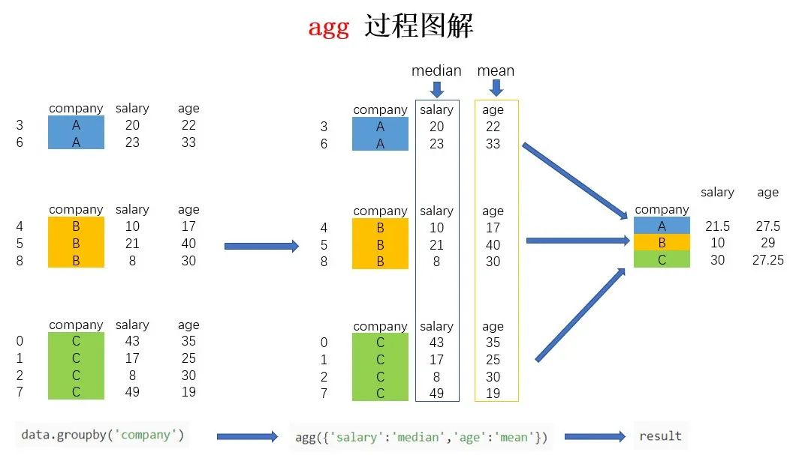

Python Pandas<br /><br />利用`agg()`函数可以进行更灵活的聚合操作<br />Pandas中的的`agg()`函数为aggregate的缩写，总数、合计、聚合的意思，是一个功能非常强大的函数，在Pandas中可以利用`agg()`对Series、DataFrame以及`groupby()`后的结果进行聚合操作。<br />该函数传入的参数为字典，键为变量名，值为对应的聚合函数字符串，譬如
```python
{'value1':['sum','max'], 'value2':['median','max','min]}
```
就代表对数据框中的value1列进行求和、最大值操作，对value2列进行中位数、最大值、最小值操作。<br />下面用几个简单的例子演示其具体使用方式，先构建一个基础的数据，用于下面的实验。
```python
data = pd.DataFrame(
{"company":['百度', '阿里', '百度', '阿里', '百度', '腾讯', '腾讯', '阿里', '腾讯', '阿里'],
'level': ['P7', 'P7', 'P8', 'P5', 'P8', 'P7', 'P8', 'P7', 'P5', 'P6'],
"salary":[43000, 24000, 40000, 39000, 8000, 47000, 25000, 16000, 21000, 38000],
"age":[25, 34, 49, 42, 28, 23, 45, 21, 34, 29]})
```
<a name="nNYAS"></a>
### 1、聚合Series
在对Series进行聚合时，因为只有1列，所以可以不使用字典的形式传递参数，直接传入函数名列表即可：<br />只计算工资列的最小值
```python
data['salary'].agg('min')
8000
```
求工资列列的最小值、最大值以及中位数
```python
data['salary'].agg(['min','max','median'])
min        8000.0
max       47000.0
median    31500.0
Name: salary, dtype: float64
```
<a name="aMZ5d"></a>
### 2、聚合数据框
对数据框进行聚合时因为有多列，所以要使用字典的方式传入聚合方案：
```python
data.agg({'level': ['max','min'], 'salary': ['mean','std']})
    level        salary
max     P8           NaN
min     P5           NaN
mean   NaN  30100.000000
std    NaN  13016.655997
```
值得注意的是，因为上例中对于不同变量的聚合方案不统一，所以会出现NaN的情况。
<a name="r7JRG"></a>
### 3、聚合`groupby()`结果
求每个公司-每个层级工资的最大值、最小值、中位数
```python
data.groupby(['company','level']).agg({'salary':['min','max','median']})
salary              
min    max median
company level                     
百度      P7     43000  43000  43000
P8      8000  40000  24000
腾讯      P5     21000  21000  21000
P7     47000  47000  47000
P8     25000  25000  25000
阿里      P5     39000  39000  39000
P6     38000  38000  38000
P7     16000  24000  20000

data.groupby(['company','level']).agg({'salary':['min','max','median']}).reset_index(drop=False)
company level salary              
min    max median
0      百度    P7  43000  43000  43000
1      百度    P8   8000  40000  24000
2      腾讯    P5  21000  21000  21000
3      腾讯    P7  47000  47000  47000
4      腾讯    P8  25000  25000  25000
5      阿里    P5  39000  39000  39000
6      阿里    P6  38000  38000  38000
7      阿里    P7  16000  24000  20000
```
可以注意到虽然使用`reset_index()`将索引列还原回变量，而在pandas 0.25.0以及之后的版本中，可以使用`pd.NamedAgg()`来为聚合后的每一列赋予新的名字：
```python
data.groupby(['company','level']).agg(
min_salary = pd.NamedAgg(column='salary', aggfunc='min'),
max_salary = pd.NamedAgg(column='salary', aggfunc='max'),
median = pd.NamedAgg(column='salary', aggfunc='median')).reset_index(drop=False)
company level  min_salary  max_salary  median
0      百度    P7       43000       43000   43000
1      百度    P8        8000       40000   24000
2      腾讯    P5       21000       21000   21000
3      腾讯    P7       47000       47000   47000
4      腾讯    P8       25000       25000   25000
5      阿里    P5       39000       39000   39000
6      阿里    P6       38000       38000   38000
7      阿里    P7       16000       24000   20000
```
