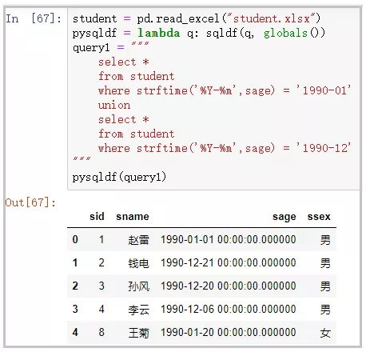

pandasql
<a name="rMbs0"></a>
## 1. 演示数据
所有演示数据，均是基于下方的四张表。这就是`网传50道经典MySQL面试题`中使用到的几张原表。<br />
<a name="Aw0gm"></a>
## 2. pandasql的使用
<a name="T46OP"></a>
### 1）简介
`pandas`中的DataFrame是一个二维表格，数据库中的表也是一个二维表格，因此在pandas中使用`sql语句`就显得水到渠成，pandasql使用SQLite作为其操作数据库，同时Python自带`SQLite模块`，不需要安装，便可直接使用。
:::tips
这里有一点需要注意的是：使用pandasql读取DataFrame中日期格式的列，默认会读取年月日、时分秒，因此要学会使用sqlite中的日期处理函数，方便转换日期格式，下面提供sqlite中常用函数大全
:::
:::info
**sqlite函数大全**：[http://suo.im/5DWraE](http://suo.im/5DWraE)
:::
**导入相关库：**
```python
import pandas as pd
from pandasql import sqldf
```
<a name="xohEK"></a>
### 2）声明全局变量的2种方式
① 在使用之前，声明该全局变量；<br />② 一次性声明好全局变量；
<a name="P8bpy"></a>
#### ① 在使用之前，声明该全局变量
```python
df1 = pd.read_excel("student.xlsx")
df2 = pd.read_excel("sc.xlsx")
df3 = pd.read_excel("course.xlsx")
df4 = pd.read_excel("teacher.xlsx")
global df1
global df2
global df3
global df4query1 = "select * from df1 limit 5"
query2 = "select * from df2 limit 5"
query3 = "select * from df3"
query4 = "select * from df4"
sqldf(query1)
sqldf(query2)
sqldf(query3)
sqldf(query4)
```
部分结果如下：<br />
<a name="KuTNw"></a>
#### ② 一次性声明好全局变量
```python
df1 = pd.read_excel("student.xlsx")
df2 = pd.read_excel("sc.xlsx")
df3 = pd.read_excel("course.xlsx")
df4 = pd.read_excel("teacher.xlsx")
pysqldf = lambda q: sqldf(q, globals())
query1 = "select * from df1 limit 5"
query2 = "select * from df2 limit 5"
query3 = "select * from df3"
query4 = "select * from df4"
sqldf(query1)
sqldf(query2)
sqldf(query3)
sqldf(query4)
```
部分结果如下：<br />
<a name="yHA4J"></a>
### 3）几个简单的SQL语句示例
<a name="rf36A"></a>
#### ① 查看sqlite的版本
```python
student = pd.read_excel("student.xlsx")
pysqldf = lambda q: sqldf(q, globals())
query1 = """
    select sqlite_version(*)
"""
pysqldf(query1)
```
结果如下：<br />
<a name="ZUJ3Q"></a>
#### ② where筛选
```python
student = pd.read_excel("student.xlsx")
pysqldf = lambda q: sqldf(q, globals())
query1 = """
    select * 
    from student 
    where strftime('%Y-%m-%d',sage) = '1990-01-01'
"""
pysqldf(query1)
```
结果如下：<br />
<a name="soR71"></a>
#### ③ 多表连接
```python
student = pd.read_excel("student.xlsx")
sc = pd.read_excel("sc.xlsx")
pysqldf = lambda q: sqldf(q, globals())
query2 = """
    select *
    from student s
    join sc on s.sid = sc.sid
"""
pysqldf(query2)
```
部分结果如下：<br />
<a name="rXAvK"></a>
#### ④ 分组聚合
```python
student = pd.read_excel("student.xlsx")
sc = pd.read_excel("sc.xlsx")
pysqldf = lambda q: sqldf(q, globals())
query2 = """
    select s.sname as 姓名,sum(sc.score) as 总分
    from student s
    join sc on s.sid = sc.sid
    group by s.sname
"""
pysqldf(query2)
```
结果如下：<br />
<a name="Tv8Tp"></a>
#### ⑤ union查询
```python
student = pd.read_excel("student.xlsx")
pysqldf = lambda q: sqldf(q, globals())
query1 = """
    select * 
    from student 
    where strftime('%Y-%m',sage) = '1990-01'
    union
    select * 
    from student 
    where strftime('%Y-%m',sage) = '1990-12'
"""
pysqldf(query1)
```
结果如下：<br />
