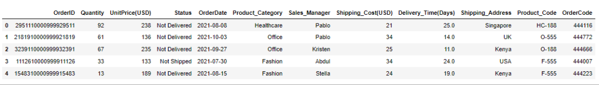
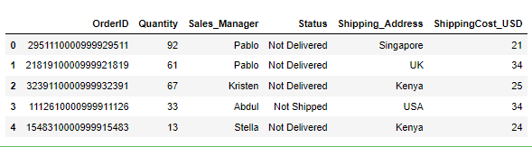
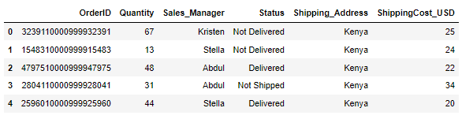
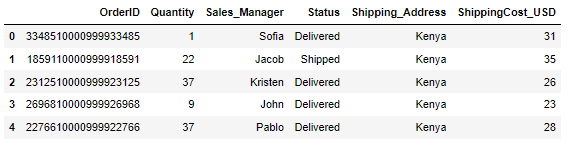
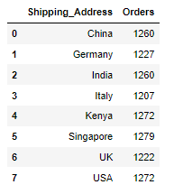
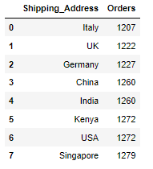
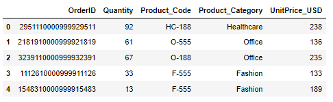
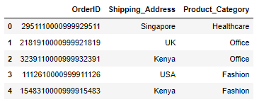
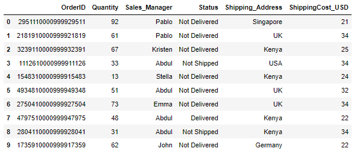

Python Pandas<br />在Pandas当中使用SQL语句来筛选数据可以通过Pandasql模块来实现该想法，首先来安装一下该模块
```bash
pip install pandasql
```
要是目前正在使用jupyter notebook，也可以这么来下载
```bash
!pip install pandasql
```
<a name="ovOb3"></a>
### 导入数据
首先导入数据
```python
import pandas as pd
from pandasql import sqldf
df = pd.read_csv("Dummy_Sales_Data_v1.csv", sep=",")
df.head()
```
output<br /><br />先对导入的数据集做一个初步的探索性分析，
```python
df.info()
```
output
```python
<class 'pandas.core.frame.DataFrame'>
RangeIndex: 9999 entries, 0 to 9998
Data columns (total 12 columns):
 #   Column               Non-Null Count  Dtype  
---  ------               --------------  -----  
 0   OrderID              9999 non-null   int64  
 1   Quantity             9999 non-null   int64  
 2   UnitPrice(USD)       9999 non-null   int64  
 3   Status               9999 non-null   object 
 4   OrderDate            9999 non-null   object 
 5   Product_Category     9963 non-null   object 
 6   Sales_Manager        9999 non-null   object 
 7   Shipping_Cost(USD)   9999 non-null   int64  
 8   Delivery_Time(Days)  9948 non-null   float64
 9   Shipping_Address     9999 non-null   object 
 10  Product_Code         9999 non-null   object 
 11  OrderCode            9999 non-null   int64  
dtypes: float64(1), int64(5), object(6)
memory usage: 937.5+ KB
```
再开始进一步的数据筛选之前，再对数据集的列名做一个转换，代码如下
```python
df.rename(columns={"Shipping_Cost(USD)":"ShippingCost_USD",
                   "UnitPrice(USD)":"UnitPrice_USD",
                   "Delivery_Time(Days)":"Delivery_Time_Days"},
          inplace=True)
df.info()
```
output
```python
<class 'pandas.core.frame.DataFrame'>
RangeIndex: 9999 entries, 0 to 9998
Data columns (total 12 columns):
 #   Column              Non-Null Count  Dtype  
---  ------              --------------  -----  
 0   OrderID             9999 non-null   int64  
 1   Quantity            9999 non-null   int64  
 2   UnitPrice_USD       9999 non-null   int64  
 3   Status              9999 non-null   object 
 4   OrderDate           9999 non-null   object 
 5   Product_Category    9963 non-null   object 
 6   Sales_Manager       9999 non-null   object 
 7   ShippingCost_USD    9999 non-null   int64  
 8   Delivery_Time_Days  9948 non-null   float64
 9   Shipping_Address    9999 non-null   object 
 10  Product_Code        9999 non-null   object 
 11  OrderCode           9999 non-null   int64  
dtypes: float64(1), int64(5), object(6)
memory usage: 937.5+ KB
```
<a name="CtKal"></a>
### 用SQL筛选出若干列来
先尝试筛选出OrderID、Quantity、Sales_Manager、Status等若干列数据，用SQL语句应该是这么来写的
```python
SELECT OrderID, Quantity, Sales_Manager, \
Status, Shipping_Address, ShippingCost_USD \
FROM df
```
与Pandas模块联用的时候就这么来写
```python
query = "SELECT OrderID, Quantity, Sales_Manager,\
Status, Shipping_Address, ShippingCost_USD \
FROM df"

df_orders = sqldf(query)
df_orders.head()
```
output<br />
<a name="Lm6wk"></a>
### SQL中带WHERE条件筛选
在SQL语句当中添加指定的条件进而来筛选数据，代码如下
```python
query = "SELECT * \
        FROM df_orders \
        WHERE Shipping_Address = 'Kenya'"
        
df_kenya = sqldf(query)
df_kenya.head()
```
output<br /><br />而要是条件不止一个，则用AND来连接各个条件，代码如下
```python
query = "SELECT * \
        FROM df_orders \
        WHERE Shipping_Address = 'Kenya' \
        AND Quantity < 40 \
        AND Status IN ('Shipped', 'Delivered')"
df_kenya = sqldf(query)
df_kenya.head()
```
output<br />
<a name="HQfbs"></a>
### 分组
同理可以调用SQL当中的`GROUP BY`来对筛选出来的数据进行分组，代码如下
```python
query = "SELECT Shipping_Address, \
        COUNT(OrderID) AS Orders \
        FROM df_orders \
        GROUP BY Shipping_Address"

df_group = sqldf(query)
df_group.head(10)
```
output<br />
<a name="Q7N2J"></a>
### 排序
而排序在SQL当中则是用`ORDER BY`，代码如下
```python
query = "SELECT Shipping_Address, \
        COUNT(OrderID) AS Orders \
        FROM df_orders \
        GROUP BY Shipping_Address \
        ORDER BY Orders"

df_group = sqldf(query)
df_group.head(10)
```
output<br />
<a name="LOv4S"></a>
### 数据合并
先创建一个数据集，用于后面两个数据集之间的合并，代码如下
```python
query = "SELECT OrderID,\
        Quantity, \
        Product_Code, \
        Product_Category, \
        UnitPrice_USD \
        FROM df"
df_products = sqldf(query)
df_products.head()
```
output<br /><br />这里采用的两个数据集之间的交集，因此是`INNER JOIN`，代码如下
```python
query = "SELECT T1.OrderID, \
        T1.Shipping_Address, \
        T2.Product_Category \
        FROM df_orders T1\
        INNER JOIN df_products T2\
        ON T1.OrderID = T2.OrderID"

df_combined = sqldf(query)
df_combined.head()
```
output<br />
<a name="gN8pl"></a>
### 与`LIMIT`之间的联用
在SQL当中的`LIMIT`是用于限制查询结果返回的数量的，想看查询结果的前10个，代码如下
```python
query = "SELECT OrderID, Quantity, Sales_Manager, \ 
Status, Shipping_Address, \
ShippingCost_USD FROM df LIMIT 10"

df_orders_limit = sqldf(query)
df_orders_limit
```
output<br />
