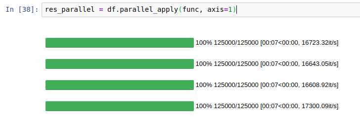
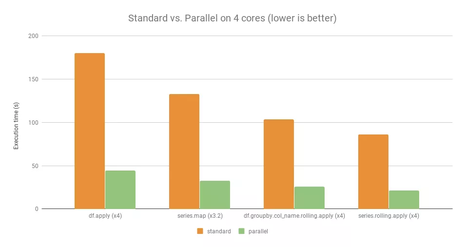

Python Pandas Pandarallel

| 没有使用<br />Pandarallel |  |
| --- | --- |
| 使用了<br />Pandarallel |  |

<br />众所周知，由于GIL的存在，Python单进程中的所有操作都是在一个CPU核上进行的，所以为了提高运行速度，一般会采用多进程的方式。而多进程无非就是以下几种方案：

- multiprocessing
- concurrent.futures.ProcessPoolExecutor()
- joblib
- ppserver
- celery

这些方案对于普通Pandas玩家来说都不是特别友好，怎样才能算作一个友好的并行处理方案？<br />那就是原来的逻辑基本不用变，仅修改需要计算的那行就能完成目标的方案，而 pandarallel 就是一个这样友好的工具。

| 没有并行计算（原始pandas） | `pandarallel` |
| --- | --- |
| `df.apply(func)` | `df.parallel_apply(func)` |
| `df.applymap(func)` | `df.parallel_applymap(func)` |
| `df.groupby(args).apply(func)` | `df.groupby(args).parallel_apply(func)` |
| `df.groupby(args1).col_name.rolling(args2).apply(func)` | `df.groupby(args1).col_name.rolling(args2).parallel_apply(func)` |
| `df.groupby(args1).col_name.expanding(args2).apply(func)` | `df.groupby(args1).col_name.expanding(args2).parallel_apply(func)` |
| `series.map(func)` | `series.parallel_map(func)` |
| `series.apply(func)` | `series.parallel_apply(func)` |
| `series.rolling(args).apply(func)` | `series.rolling(args).parallel_apply(func)` |

可以看到，在 pandarallel 的世界里，只需要替换原有的 pandas 处理语句就能实现多CPU并行计算。非常方便、非常nice.<br /><br />在4核CPU的性能测试上，它比原始语句快了接近4倍。测试条件（OS: Linux Ubuntu 16.04，Hardware: Intel Core i7 @ 3.40 GHz - 4 cores），它把CPU充分利用了起来。<br />下面就给大家介绍这个模块怎么用，其实非常简单，任何代码只需要加几行代码就能实现质的飞跃。
<a name="ngI40"></a>
## 1、准备
请选择以下任一种方式输入命令安装依赖：

1. Windows 环境 打开 Cmd (开始-运行-CMD)。
2. MacOS 环境 打开 Terminal (command+空格输入Terminal)。
3. 如果用的是 VSCode编辑器 或 Pycharm，可以直接使用界面下方的Terminal.
```bash
pip install pandarallel
```
对于windows用户，有一个不好的消息是，它只能在Windows的linux子系统上运行（WSL）可以在微软官网上找到安装教程：<br />[https://docs.microsoft.com/zh-cn/windows/wsl/about](https://docs.microsoft.com/zh-cn/windows/wsl/about)
<a name="k1n7U"></a>
## 2、使用Pandarallel
使用前，需要对Pandarallel进行初始化：
```python
from pandarallel import pandarallel
pandarallel.initialize()
```
这样才能调用并行计算的API，不过 initialize 中有一个重要参数需要说明，那就是 nb_workers ，它将指定并行计算的Worker数，如果没有设置，所有CPU的核都会用上。<br />Pandarallel一共支持8种Pandas操作，下面是一个`apply`方法的例子。
```python
import pandas as pd
import time
import math
import numpy as np
from pandarallel import pandarallel

# 初始化
pandarallel.initialize()
df_size = int(5e6)
df = pd.DataFrame(dict(a=np.random.randint(1, 8, df_size),
                       b=np.random.rand(df_size)))
def func(x):
    return math.sin(x.a**2) + math.sin(x.b**2)

# 正常处理
res = df.apply(func, axis=1)

# 并行处理
res_parallel = df.parallel_apply(func, axis=1)

# 查看结果是否相同
res.equals(res_parallel)
```
其他方法使用上也是类似的，在原始的函数名称前加上 `parallel_`，比如 DataFrame.groupby.apply：
```python
import pandas as pd
import time
import math
import numpy as np
from pandarallel import pandarallel

# 初始化
pandarallel.initialize()
df_size = int(3e7)
df = pd.DataFrame(dict(a=np.random.randint(1, 1000, df_size),
                       b=np.random.rand(df_size)))
def func(df):
    dum = 0
    for item in df.b:
        dum += math.log10(math.sqrt(math.exp(item**2)))
        
    return dum / len(df.b)

# 正常处理
res = df.groupby("a").apply(func)
# 并行处理
res_parallel = df.groupby("a").parallel_apply(func)
res.equals(res_parallel)
```
又比如 DataFrame.groupby.rolling.apply：
```python
import pandas as pd
import time
import math
import numpy as np
from pandarallel import pandarallel

# 初始化
pandarallel.initialize()
df_size = int(1e6)
df = pd.DataFrame(dict(a=np.random.randint(1, 300, df_size),
                       b=np.random.rand(df_size)))
def func(x):
    return x.iloc[0] + x.iloc[1] ** 2 + x.iloc[2] ** 3 + x.iloc[3] ** 4

# 正常处理
res = df.groupby('a').b.rolling(4).apply(func, raw=False)
# 并行处理
res_parallel = df.groupby('a').b.rolling(4).parallel_apply(func, raw=False)
res.equals(res_parallel)
```
案例都是类似的，这里就直接列出表格，不用浪费时间去阅读一些重复的例子了：

| 没有并行计算（原始pandas） | `pandarallel` |
| --- | --- |
| `df.apply(func)` | `df.parallel_apply(func)` |
| `df.applymap(func)` | `df.parallel_applymap(func)` |
| `df.groupby(args).apply(func)` | `df.groupby(args).parallel_apply(func)` |
| `df.groupby(args1).col_name.rolling(args2).apply(func)` | `df.groupby(args1).col_name.rolling(args2).parallel_apply(func)` |
| `df.groupby(args1).col_name.expanding(args2).apply(func)` | `df.groupby(args1).col_name.expanding(args2).parallel_apply(func)` |
| `series.map(func)` | `series.parallel_map(func)` |
| `series.apply(func)` | `series.parallel_apply(func)` |
| `series.rolling(args).apply(func)` | `series.rolling(args).parallel_apply(func)` |

<a name="kRCKI"></a>
## 3、注意事项
**1. 有 8 个 CPU，但 **`**parallel_apply**`** 只能加快大约4倍的计算速度。为什么？**<br />**答：正如前面所言，Python中每个进程占用一个核，Pandarallel 最多只能加快到所拥有的核心的总数，一个 4 核的超线程 CPU 将向操作系统显示 8 个 CPU，但实际上只有 4 个核心，因此最多加快4倍。**<br />**2. 并行化是有成本的（实例化新进程，通过共享内存发送数据，...），所以只有当并行化的计算量足够大时，并行化才是有意义的。对于很少量的数据，使用 Pandarallel 并不总是值得的。**
