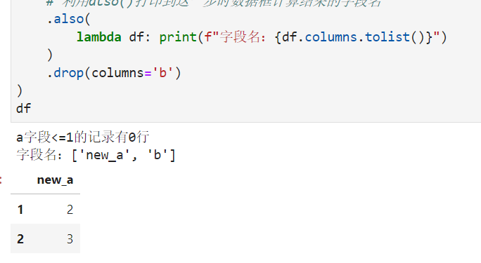
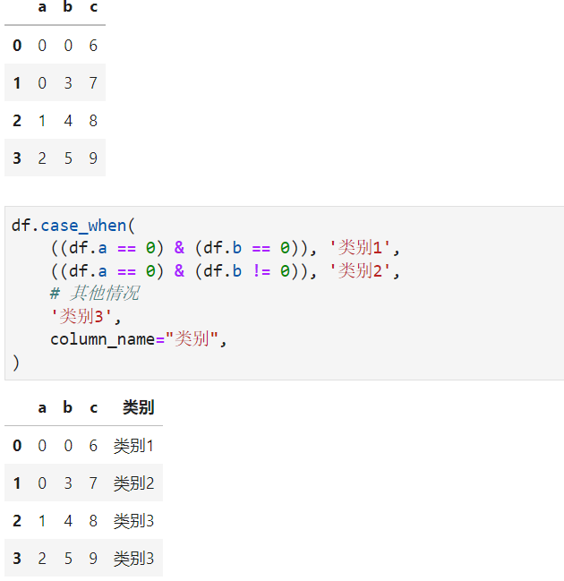
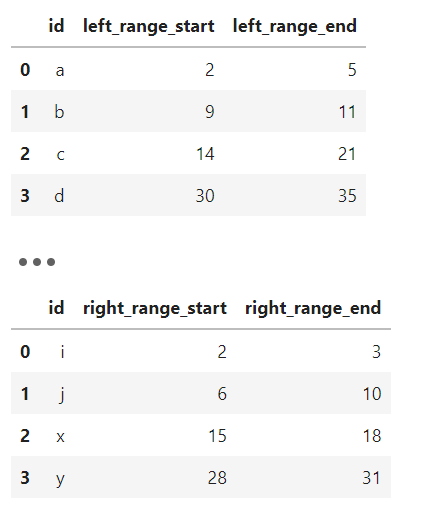
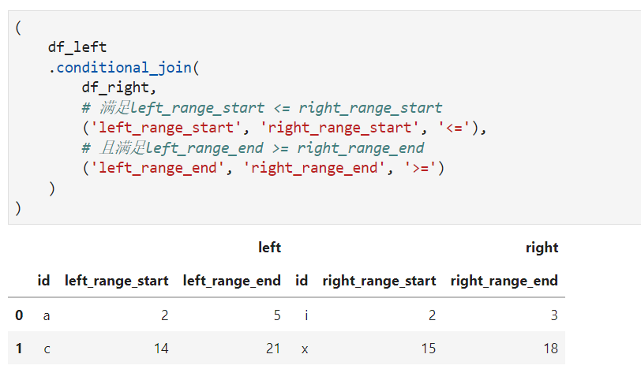
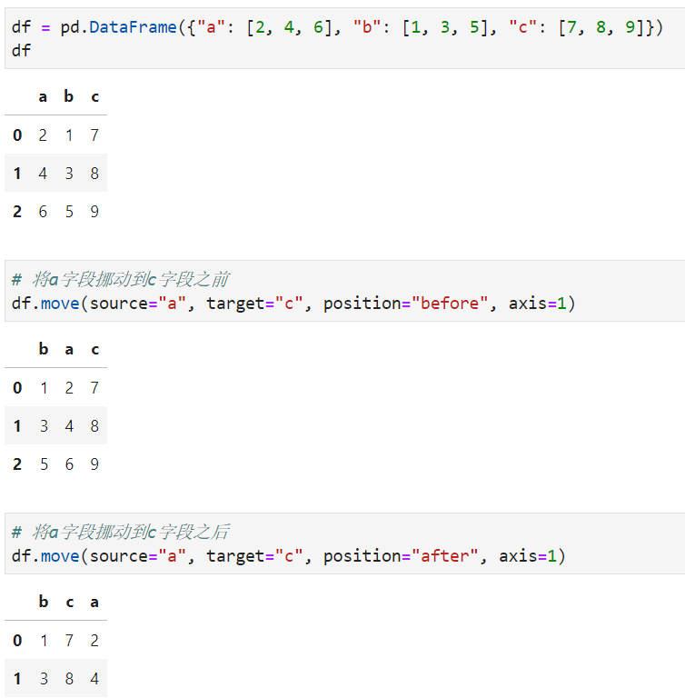

Pyhton Pandas
<a name="n5htE"></a>
## 1、简介
pandas发展了如此多年，所包含的功能已经覆盖了大部分数据清洗、分析场景，但仍然有着相当一部分的应用场景pandas中尚存空白亦或是现阶段的操作方式不够简洁方便。<br />这里要介绍的Python库pyjanitor就内置了诸多功能方法，可以在兼容pandas中数据框等数据结构的同时为pandas补充更多功能。它是对R中著名的数据清洗包janitor的移植，就如同它的名字那样，完成数据处理的清洁工作：<br />
<a name="swzGr"></a>
## 2、pyjanitor中的常用功能
对于使用conda的朋友，推荐使用下列命令完成pyjanitor的安装，其中使用到上海交大的conda-forge镜像：
```bash
conda install pyjanitor -c https://mirrors.sjtug.sjtu.edu.cn/anaconda/cloud/conda-forge -y
```
完成安装后`import janitor`即可进行导入，接着就可以直接在pandas的代码逻辑中穿插pyjanitor的各种API接口。<br />pyjanitor中的很多功能实际上跟pandas中的一些功能存在重叠，作为一位pandas老手，这部分功能还是倾向于使用pandas完成，因此下面介绍一些pyjanitor中颇具特色的功能：
<a name="ok5fs"></a>
### 2.1 利用`also()`方法穿插执行任意函数
熟悉pandas链式写法的朋友应该知道这种写法对于处理数据和理清步骤有多高效，pyjanitor中的`also()`方法允许在链式过程中随意插入执行任意函数，接受上一步状态的数据框运算结果，且不影响对下一步处理逻辑的数据输入，下面是一个简单的例子：
```python
df = (
    # 构造示例数据框
    pd.DataFrame({"a": [1, 2, 3], "b": list("abc")})
    .query("a > 1")
    # 利用also()插入lambda函数接受上一步的输入对象
    .also(lambda df: print(f"a字段<=1的记录有{df.query('a <= 1').shape[0]}行"))
    .rename(columns={'a': 'new_a'})
    # 利用also()实现中间计算结果的导出
    .also(lambda df: df.to_csv("temp.csv", index=False))
    # 利用also()打印到这一步时数据框计算结果的字段名
    .also(
        lambda df: print(f"字段名：{df.columns.tolist()}")
    )
    .drop(columns='b')
)
df
```

<a name="KFfNr"></a>
### 2.2 利用`case_when()`方法实现多条件分支
pyjanitor中的`case_when()`方法可以针对数据框实现类似SQL中的的多条件分支运算，注意，因为是多条件分支，所以包含最后的“其他”条件在内，需要至少定义3条分支规则，参考下面的例子：
```python
df = pd.DataFrame(
    {
        "a": [0, 0, 1, 2],
        "b": [0, 3, 4, 5],
        "c": [6, 7, 8, 9],
    }
)

df.case_when(
    ((df.a == 0) & (df.b == 0)), '类别1',
    ((df.a == 0) & (df.b != 0)), '类别2',
    # 其他情况
    '类别3',
    column_name="类别",
)
```

<a name="rsO2A"></a>
### 2.3 利用`conditional_join()`实现条件连接
pyjanitor中的`conditional_join()`非常地好用，它弥补了pandas一直以来都未完善的“条件连接”功能，即对两张表进行**「连接」**的条件，不只pandas中的`merge()`、`join()`之类的方法所实现的，左表与右表的指定字段之间相等这样简单的条件判断，而是可高度自定义的条件判断。<br />`conditional_join()`在作为方法使用时，其第一个参数应传入连接中的**「右表」**数据框，紧接着的是若干个格式为(左表字段, 右表字段, 判断条件)这样的三元组来定义单条或多条条件判断的**「且」**组合，之后再用于定义连接方式how参数。<br />下面是一个示例，这是常见的一种数据分析操作，左表和右表各自定义了一些区间段，利用条件连接来为左表找到右表中完全被其包住的区间：
```python
# 定义示例左表
df_left = pd.DataFrame({
    'id': list('abcd'),
    'left_range_start': [2, 9, 14, 30],
    'left_range_end': [5, 11, 21, 35]
})

# 定义示例右表
df_right = pd.DataFrame({
    'id': list('ijxy'),
    'right_range_start': [2, 6, 15, 28],
    'right_range_end': [3, 10, 18, 31]
})
```
<br />进行条件连接：
```python
(
    df_left
    .conditional_join(
        df_right,
        # 满足left_range_start <= right_range_start
        ('left_range_start', 'right_range_start', '<='),
        # 且满足left_range_end >= right_range_end
        ('left_range_end', 'right_range_end', '>=')
    )
)
```
连接结果如下：<br />
<a name="vp4Lg"></a>
### 2.4 利用`move()`方法快捷完成字段位置调整
pyjanitor中的`move()`方法用于快捷调整某行或某列数据的位置，通过source参数指定需要移动的数据行index或列的字段名，target参数用于指定移动的目标位置数据行index或列的字段名，position用于设置移动方式（'before'表示移动到目标之前一个位置，after表示后一个位置），axis用于设定移动方式（0表示行移动，1表示列移动）。<br />以最常用的列移动为例：<br /><br />而除了上述这些颇具特色的功能外，pyjanitor中还针对生信、化学、金融、机器学习、数学等领域内置了一些特别的功能，感兴趣的朋友可以前往其官网[https://pyjanitor-devs.github.io/pyjanitor/](https://pyjanitor-devs.github.io/pyjanitor/)进一步了解相关内容。
