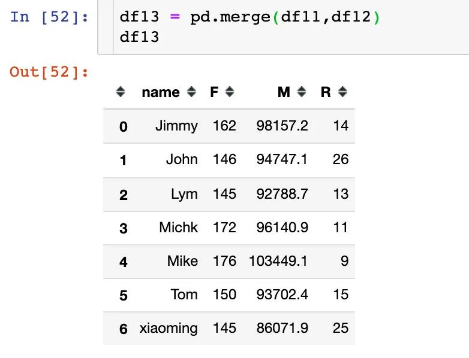
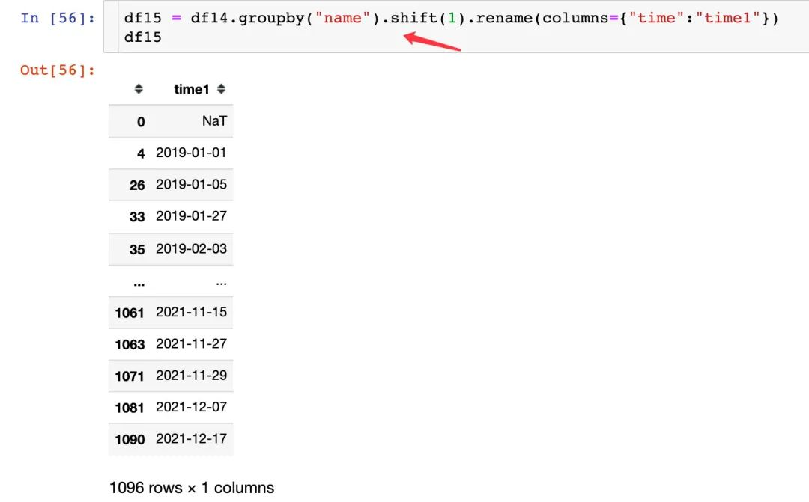

Pandas<br />介绍一个简单的综合使用，主要分为：

- 如何自行模拟数据
- 多种数据处理方式
- 数据统计与可视化
- 用户RFM模型
- 用户复购周期


<a name="zefCx"></a>
## 构建数据
本案例中用的数据是自行模拟的，主要包含两个数据：订单数据和水果信息数据，并且会将两份数据合并
```python
import pandas as pd
import numpy as np
import random
from datetime import *
import time

import plotly.express as px
import plotly.graph_objects as go
import plotly as py

# 绘制子图
from plotly.subplots import make_subplots
```
<a name="bAWzy"></a>
### 1、时间字段

<a name="DOJqy"></a>
### 2、水果和用户

<a name="WHLTW"></a>
### 3、生成订单数据
```python
order = pd.DataFrame({
    "time":time_range,  # 下单时间
    "fruit":fruit_list,  # 水果名称
    "name":name_list,  # 顾客名
    # 购买量
    "kilogram":np.random.choice(list(range(50,100)), size=len(time_range),replace=True) 
})

order
```

<a name="X18hn"></a>
### 4、生成水果的信息数据
```python
infortmation = pd.DataFrame({
    "fruit":fruits,
    "price":[3.8, 8.9, 12.8, 6.8, 15.8, 4.9, 5.8, 7],
    "region":["华南","华北","西北","华中","西北","华南","华北","华中"]
})

infortmation
```

<a name="FE15M"></a>
### 5、数据合并
将订单信息和水果信息直接合并成一个完整的DataFrame，这个df就是接下来处理的数据<br />
<a name="X6nYT"></a>
### 6、生成新的字段：订单金额
<br />到这里可以学到：

- 如何生成时间相关的数据
- 如何从列表（可迭代对象）中生成随机数据
- Pandas的DataFrame自行创建，包含生成新字段
- Pandas数据合并
<a name="ctj6z"></a>
## 分析维度1：时间
<a name="dhoXY"></a>
### 2019-2021年每月销量走势
<a name="Ia3Bs"></a>
#### 1、先把年份和月份提取出来：
```python
df["year"] = df["time"].dt.year
df["month"] = df["time"].dt.month
# 同时提取年份和月份
df["year_month"] = df["time"].dt.strftime('%Y%m')

df
```

<a name="cHNBq"></a>
#### 2、查看字段类型：

<a name="vK6IC"></a>
#### 3、分年月统计并展示：
```python
# 分年月统计销量
df1 = df.groupby(["year_month"])["kilogram"].sum().reset_index()

fig = px.bar(df1,x="year_month",y="kilogram",color="kilogram")
fig.update_layout(xaxis_tickangle=45)   # 倾斜角度

fig.show()
```

<a name="cdkXp"></a>
### 2019-2021销售额走势
```python
df2 = df.groupby(["year_month"])["amount"].sum().reset_index()

df2["amount"] = df2["amount"].apply(lambda x:round(x,2))

fig = go.Figure()
fig.add_trace(go.Scatter(  #
    x=df2["year_month"],
    y=df2["amount"],
    mode='lines+markers', # mode模式选择
    name='lines')) # 名字

fig.update_layout(xaxis_tickangle=45)   # 倾斜角度

fig.show()
```

<a name="ZvV6o"></a>
### 年度销量、销售额和平均销售额

<a name="qh4XC"></a>
## 分析维度2：商品
<a name="dRJqu"></a>
### 水果年度销量占比
```python
df4 = df.groupby(["year","fruit"]).agg({"kilogram":"sum","amount":"sum"}).reset_index()
df4["year"] = df4["year"].astype(str)
df4["amount"] = df4["amount"].apply(lambda x: round(x,2))

from plotly.subplots import make_subplots
import plotly.graph_objects as go

fig = make_subplots(
	rows=1, 
	cols=3,
	subplot_titles=["2019年","2020年","2021年"],
	specs=[[{"type": "domain"},   # 通过type来指定类型
			{"type": "domain"},
			{"type": "domain"}]]
)  

years = df4["year"].unique().tolist()

for i, year in enumerate(years):
	name = df4[df4["year"] == year].fruit
	value = df4[df4["year"] == year].kilogram
	
	fig.add_traces(go.Pie(labels=name,
						  values=value
						 ),
				   rows=1,cols=i+1
				  )
	
	fig.update_traces(
		textposition='inside',   # 'inside','outside','auto','none'
		textinfo='percent+label',
		insidetextorientation='radial',   # horizontal、radial、tangential
		hole=.3,
		hoverinfo="label+percent+name"
	)
	
fig.show()
```

<a name="PLZUh"></a>
### 各水果年度销售金额对比
```python
years = df4["year"].unique().tolist()

for _, year in enumerate(years):
    
    df5 = df4[df4["year"]==year]
    fig = go.Figure(go.Treemap( 
        labels = df5["fruit"].tolist(),
        parents = df5["year"].tolist(),
        values = df5["amount"].tolist(),
        textinfo = "label+value+percent root"
    ))
    
    fig.show()
```
<br /><br />
<a name="hGxlT"></a>
### 商品月度销量变化

```python
fig = px.bar(df5,x="year_month",y="amount",color="fruit")
fig.update_layout(xaxis_tickangle=45)   # 倾斜角度
fig.show()
```
<br />折线图展示的变化：<br />
<a name="aLlIA"></a>
## 分析维度3：地区
<a name="sx8Md"></a>
### 不同地区的销量
<br />
<a name="FL7kX"></a>
### 不同地区年度平均销售额
```python
df7 = df.groupby(["year","region"])["amount"].mean().reset_index()
```

<a name="s5ace"></a>
## 分析维度4：用户
<a name="Wi9PT"></a>
### 用户订单量、金额对比
```python
df8 = df.groupby(["name"]).agg({"time":"count","amount":"sum"}).reset_index().rename(columns={"time":"order_number"})

df8.style.background_gradient(cmap="Spectral_r")
```

<a name="xzgKv"></a>
### 用户水果喜好
根据每个用户对每种水果的订单量和订单金额来分析：
```python
df9 = df.groupby(["name","fruit"]).agg({"time":"count","amount":"sum"}).reset_index().rename(columns={"time":"number"})

df10 = df9.sort_values(["name","number","amount"],ascending=[True,False,False])

df10.style.bar(subset=["number","amount"],color="#a97fcf")
```

```python
px.bar(df10,
       x="fruit",
       y="amount",
#            color="number",
       facet_col="name"
      )
```

<a name="iAIDz"></a>
## 用户分层—RFM模型
RFM模型是衡量客户价值和创利能力的重要工具和手段。<br />通过这个模型能够反映一个用户的交期交易行为、交易的总体频率和总交易金额3项指标，通过3个指标来描述该客户的价值状况；同时依据这三项指标将客户划分为8类客户价值：

- Recency（R）是客户最近一次购买日期距离现在的天数，这个指标与分析的时间点有关，因此是变动的。理论上客户越是在近期发生购买行为，就越有可能复购
- Frequency（F）指的是客户发生购买行为的次数--最常购买的消费者，忠诚度也就较高。增加顾客购买的次数意味着能占有更多的时长份额。
- Monetary value（M）是客户购买花费的总金额。

下面通过Pandas的多个方法来分别求解这个3个指标，首先是F和M：每位客户的订单次数和总金额<br /><br />如何求解R指标呢？<br />1、先求解每个订单和当前时间的差值<br /><br />2、根据每个用户的这个差值R来进行升序排列，排在第一位的那条数据就是他最近购买记录：以xiaoming用户为例，最近一次是12月15号，和当前时间的差值是25天<br /><br />3、根据用户去重，保留第一条数据，这样便得到每个用户的R指标：<br /><br />4、数据合并得到3个指标：<br /><br /><br />当数据量足够大，用户足够多的时候，就可以只用RFM模型来将用户分成8个类型
<a name="FZwPW"></a>
## 用户复购周期分析
复购周期是用户每两次购买之间的时间间隔：以xiaoming用户为例，前2次的复购周期分别是4天和22天<br /><br />下面是求解每个用户复购周期的过程：
<a name="aCNYA"></a>
### 1、每个用户的购买时间升序

<a name="S9Lgo"></a>
### 2、将时间移动一个单位：

<a name="xINvs"></a>
### 3、合并后的差值：
出现空值是每个用户的第一条记录之前是没有数据，后面直接删除了空值部分<br /><br /><br />直接取出天数的数值部分：<br />
<a name="vMHTE"></a>
### 5、复购周期对比
```python
px.bar(df16,
       x="day",
       y="name",
       orientation="h",
       color="day",
       color_continuous_scale="spectral"   # purples
      )
```
<br />上图中矩形越窄表示间隔越小；每个用户整个复购周期由整个矩形长度决定。查看每个用户的整体复购周期之和与平均复购周期：<br /><br />得到一个结论：Michk和Mike两个用户整体的复购周期是比较长的，长期来看是忠诚的用户；而且从平均复购周期来看，相对较低，说明在短时间内复购活跃。<br />从下面的小提琴中同样可以观察到，Michk和Mike的复购周期分布最为集中。<br />
