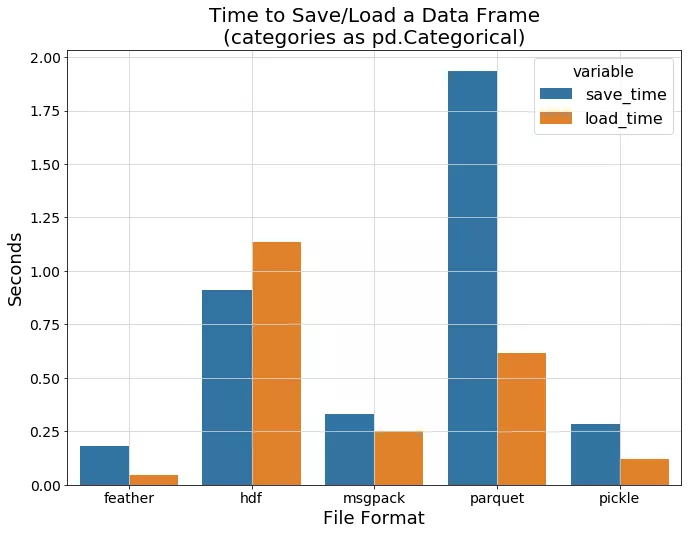
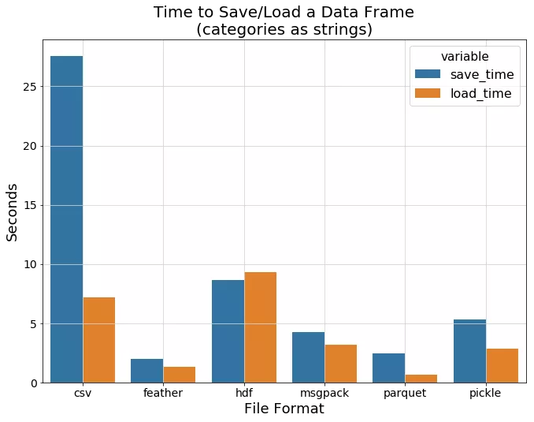
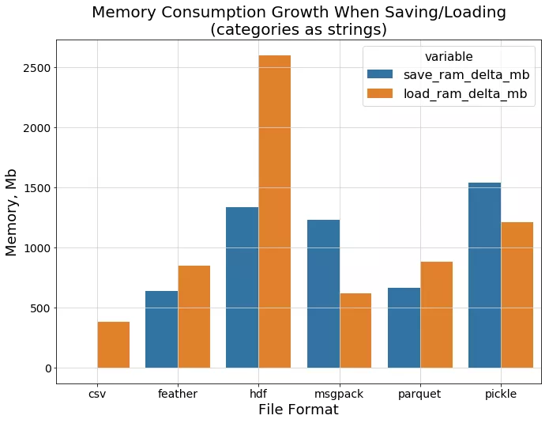
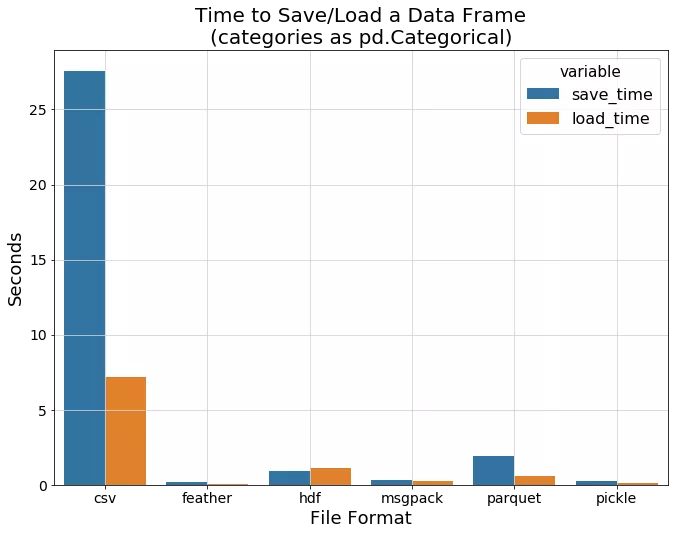
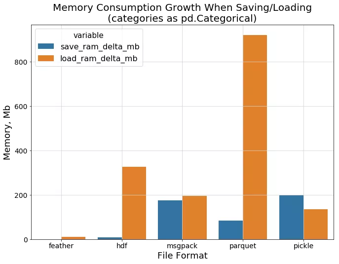

Python Pandas<br /><br />在数据分析相关项目工作时，通常使用Jupyter笔记本和pandas库来处理和传递数据。对于中等大小的数据集来说，这是一个非常直接的过程，甚至可以将其存储为纯文本文件而没有太多的开销。<br />然而，当数据集中的观测数据数量较多时，保存和加载数据回内存的过程就会变慢，现在程序的重新启动都需要等待数据重新加载。所以最终，CSV文件或任何其他纯文本格式都会失去吸引力。<br />可以做得更好。有很多二进制格式可以用来将数据存储到磁盘上，其中有很多格式pandas都支持。怎么能知道哪一种更适合呢？<br />来吧，尝试其中的几个，然后进行对比！这就是要做的：通过几种方法将 `pandas.DataFrame` 保存到磁盘上，看看哪一种在I/O速度、内存消耗和磁盘空间方面做的更好。<br />
<a name="CBWNf"></a>
## 1、要比较的格式
考虑采用以下格式来存储数据：<br />1. CSV -- 数据科学家的一个好朋友<br />2. Pickle -- 一种Python的方式来序列化事物<br />3. MessagePack -- 它就像JSON，但又快又小<br />4. HDF5 -- 一种设计用于存储和组织大量数据的文件格式<br />5. Feather -- 一种快速、轻量级、易于使用的二进制文件格式，用于存储数据框架<br />6. Parquet -- Apache Hadoop的柱状存储格式<br />所有这些格式都是被广泛使用的，而且（也许除了MessagePack）在做一些数据分析的事情时非常经常遇到。<br />为了追求找到最好的缓冲格式来存储程序会话之间的数据，选择了以下指标进行比较。<br />1. size_mb - 文件大小（Mb）。<br />2. save_time - 将数据帧保存到磁盘上所需的时间量。<br />3. load_time - 将之前转储的数据帧加载到内存中所需要的时间量。<br />4. save_ram_delta_mb - 数据帧保存过程中最大的内存消耗增长量。<br />5. load_ram_delta_mb - 数据帧加载过程中的最大内存消耗增长量。<br />请注意，当使用高效压缩的二进制数据格式，如 Parquet 时，最后两个指标变得非常重要。它们可以估计加载序列化数据所需的内存量，此外还有数据大小本身。将在接下来的章节中更详细地讨论这个问题。
<a name="FvoSp"></a>
## 2、测试及结果
使用一个合成数据集进行测试，以便更好地控制序列化的数据结构和属性。<br />另外，在基准中使用了两种不同的方法：<br />(a) 将生成的分类变量保留为字符串。<br />(b) 在执行任何I/O之前将它们转换为 `pandas.Categorical` 数据类型。<br />函数`generate_dataset`显示了在基准中是如何生成数据集的：
```python
def generate_dataset(n_rows, num_count, cat_count, max_nan=0.1, max_cat_size=100):
    """
    随机生成具有数字和分类特征的数据集。
    
    数字特征取自正态分布X ~ N(0, 1)。
    分类特征则被生成为随机的uuid4字符串。
    
    此外，数字和分类特征的max_nan比例被替换为NaN值。
    """
    dataset, types = {}, {}
    
    def generate_categories():
        from uuid import uuid4
        category_size = np.random.randint(2, max_cat_size)
        return [str(uuid4()) for _ in range(category_size)]
    
    for col in range(num_count):
        name = f'n{col}'
        values = np.random.normal(0, 1, n_rows)
        nan_cnt = np.random.randint(1, int(max_nan*n_rows))
        index = np.random.choice(n_rows, nan_cnt, replace=False)
        values[index] = np.nan
        dataset[name] = values
        types[name] = 'float32'
        
    for col in range(cat_count):
        name = f'c{col}'
        cats = generate_categories()
        values = np.array(np.random.choice(cats, n_rows, replace=True), dtype=object)
        nan_cnt = np.random.randint(1, int(max_nan*n_rows))
        index = np.random.choice(n_rows, nan_cnt, replace=False)
        values[index] = np.nan
        dataset[name] = values
        types[name] = 'object'
    
    return pd.DataFrame(dataset), types
```
将CSV文件的保存和加载性能作为一个基准。<br />五个随机生成的具有一百万个观测值的数据集被转储到CSV中，并读回内存以获得平均指标。<br />每种二进制格式都针对20个随机生成的具有相同行数的数据集进行测试。<br />这些数据集包括15个数字特征和15个分类特征。可以在这个资源库中找到带有基准测试功能和所需的完整源代码：[https://github.com/devforfu/pandas-formats-benchmark](https://github.com/devforfu/pandas-formats-benchmark)
<a name="r4sMK"></a>
### (a) 数据为字符串特征时的性能
下图显示了每种数据格式的平均I/O时间。一个有趣的观察是，hdf显示出比csv更慢的加载速度，而其他二进制格式的表现明显更好。其中最令人印象深刻的是feather和parquet。<br /><br />在保存数据和从磁盘上读取数据时，内存开销如何？<br />下一张图片说明，hdf 的表现就不是那么好了。可以肯定的是，csv在保存/加载纯文本字符串时不需要太多的额外内存，而Feather和parquet则相当接近：<br /><br />最后看看文件的大小。这次parquet显示了一个令人印象深刻的结果，考虑到这种格式是为有效存储大量数据而开发的，这并不令人惊讶。<br />
<a name="qRQ6C"></a>
### (b) 字符串特征转换为数字时的性能
在上一节中，没有尝试有效地存储分类特征而是使用普通的字符串。来弥补这个遗漏！这一次使用一个专门的 pandas.Categorical 类型，转字符串特征为数字特征。<br /><br />看看现在与纯文本的csv相比，它看起来如何!<br />现在所有的二进制格式都显示出它们的真正力量。Csv的基准结果已经远远落后了，所以把它去掉，以便更清楚地看到各种二进制格式之间的差异：<br /><br />Feather 和 Pickle 显示了最好的 I/O 速度，而 hdf 仍然显示了明显的性能开销。<br />现在是时候比较数据进程加载时的内存消耗了。下面的柱状图显示了之前提到的关于parquet格式的一个重要事实。<br /><br />可以看到 parquet 读写时的内存空间差距有多大，有可能无法将比较大的 parquet 文件加载到内存中。<br />最后的图显示了各格式的文件大小。所有的格式都显示出良好的效果，除了hdf仍然需要比其他格式多得多的空间：<br />
<a name="jVCC9"></a>
## 3、结论
正如测试所显示的，似乎 feather 格式是存储Python会话数据的理想候选者。它显示了很快的I/O速度，在磁盘上不占用太多内存，并且在加载回RAM时不需要消耗太大的内存。<br />当然，这种比较并不意味着应该在每个可能的情况下使用这种格式。例如，feather格式一般不会被用作长期文件存储的格式。<br />另外，某些特定情况下也无法使用 feather，这由整个程序架构决定。然而，就如本帖开头所述的目的，它在不被任何特殊事项限制的情况下是一个很好的选择。
