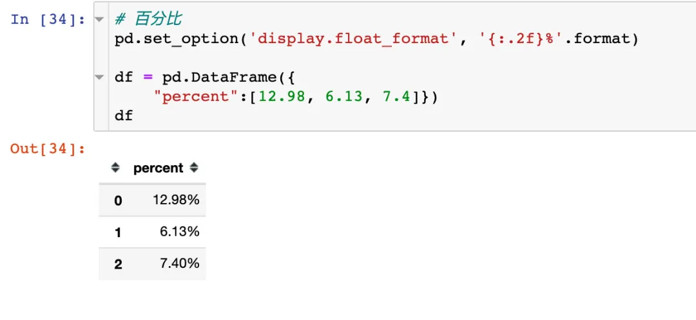

Python Pandas<br />Pandas的常用配置技巧，主要根据options和setings来展开的。强推官网学习地址：<br />[https://pandas.pydata.org/pandas-docs/stable/user_guide/options.html](https://pandas.pydata.org/pandas-docs/stable/user_guide/options.html)<br />
<a name="gNGnu"></a>
## 导入
这是一种国际惯例的导入方式！
```python
import pandas as pd
```
<a name="fW4Ld"></a>
## 忽略警告
因为版本的更新，可能Pandas的某些用法在不久将会被移除，经常会出现一些警告（不是报错），配上如下的代码即可忽略相关的警告：
```python
# 忽略警告
import warnings
warnings.filterwarnings('ignore')
```
<a name="mc0Xx"></a>
## `float`型数据精度
<a name="uL2KJ"></a>
### 查看默认精度
默认是保留6位小数。通过下面的方式来打印当前的精度：
```python
pd.get_option( 'display.precision')

6
```
<a name="QPyNy"></a>
### 修改精度
将精度设置成2位
```python
pd.set_option( 'display.precision',2)
# 写法2：pd.options.display.precision = 2
```
然后再次打印当前的精度则变成了2位：
```python
pd.get_option( 'display.precision')

2
```
<a name="Uo000"></a>
## 显示行数
<a name="zvNrr"></a>
### 查看显示行数
默认显示的行数是60
```python
pd.get_option("display.max_rows")  # 默认是60

60
```
默认最少的行数是10位：
```python
pd.get_option("display.min_rows")  # 最少显示行

10
```
<a name="pvpe1"></a>
### 修改显示行数
修改最大的显示行数成999，然后再查看：
```python
pd.set_option("display.max_rows",999)  # 最多显示行数

pd.get_option("display.max_rows")

999
```
修改最少显示行数：
```python
pd.set_option("display.min_rows",20)  

pd.get_option("display.min_rows")

20
```
<a name="e0Ism"></a>
### 重置功能
使用重置`reset_option`方法后，设置就会变成默认的形式（数值）：
```python
pd.reset_option("display.max_rows")

pd.get_option("display.max_rows")  # 又恢复到60

60

pd.reset_option("display.min_rows")

pd.get_option("display.min_rows")  # 又恢复到10

10
```
<a name="iOxTQ"></a>
### 正则功能
如果对多个`options`进行了修改设置，想同时恢复的话，使用正则表达式可以重置多条`option`。<br />在这里表示以`displacy`开头的设置全部重置：
```python
# ^表示以某个字符开始，在这里表示以display开始全部重置
pd.reset_option("^display")
```
<a name="Q2qSk"></a>
### 全部重置
如果使用`all`，则表示对全部的设置进行重置：
```python
pd.reset_option('all')
```
<a name="nVGF5"></a>
## 显示列
既然能够控制显示的行数，当然也是可以控制显示的列数
<a name="MEfip"></a>
### 查看显示列数
查看默认显示的列数是20：
```python
pd.get_option('display.max_columns')

# 另一种写法：通过属性的方式
pd.options.display.max_columns  

20
```
<a name="PCB4V"></a>
### 改变列数
修改显示的列数成100：
```python
# 修改成100
pd.set_option('display.max_columns',100)
```
查看修改后的列数：
```python
# 查看修改后的值
pd.get_option('display.max_columns')

100
```
<a name="yPX4X"></a>
### 显示所有列
如果设置成`None`，则表示显示全部的列：
```python
pd.set_option('display.max_columns',None)
```
<a name="dGrv6"></a>
### 重置
```python
pd.reset_option('display.max_columns')
```
<a name="ednlS"></a>
## 修改列宽
上面是查看列的数量，下面是针对每个列的宽度进行设置。单列数据宽度，以字符个数计算，超过时用省略号来表示。
<a name="uQqmq"></a>
### 默认列宽
默认的列宽是50个字符的宽度：
```python
pd.get_option ('display.max_colwidth')

50
```
<a name="pZGgt"></a>
### 修改列宽
修改显示的列宽成100：
```python
# 修改成100
pd.set_option ('display.max_colwidth', 100)
```
查看显示的列宽长度：
```python
pd.get_option ('display.max_colwidth')

100
```
<a name="cADip"></a>
### 显示所有列
显示全部的列：
```python
pd.set_option ('display.max_colwidth', None)
```
<a name="XXNml"></a>
## 折叠功能
当输出数据宽度，超过了设置的宽度时，是否要折叠。通常使用`False`不折叠，相反`True`要折叠。
```python
pd.set_option("expand_frame_repr", True)  # 折叠

pd.set_option("expand_frame_repr", False)  # 不折叠
```
<a name="GF5SH"></a>
## 代码段修改设置
上面介绍的各种设置，如果有修改的话都是整个环境的；还可以只给某个代码块进行临时的设置。<br />跑出当前的代码块，则会失效，恢复到原来的设置。<br />假设这里是第一个代码块：
```python
print(pd.get_option("display.max_rows"))
print(pd.get_option("display.max_columns"))
60
20
```
这里是第二个代码块：
```python
# 当前代码块进行设置

with pd.option_context("display.max_rows", 20, "display.max_columns", 10):
    print(pd.get_option("display.max_rows"))
    print(pd.get_option("display.max_columns"))
20
10
```
这里第三个代码块：
```python
print(pd.get_option("display.max_rows"))
print(pd.get_option("display.max_columns"))
60
20
```
上面的例子可以发现：到了指定的代码块之外，设置无效
<a name="N6Rg6"></a>
## 数字格式化
Pandas中有个`display.float_format`的方法，能够对浮点型的数字进行格式化输出，比如用千分位，百分比，固定小数位表示等。<br />如果其他数据类型可以转换为浮点数，也可以使用该方法。
> The callable should accept a floating point number and return a string with the desired format of the number

<a name="MZ56x"></a>
### 千分位表示
当数据比较大的时候，希望通过千分位的形式来表示数据，一目了然：
```python
df = pd.DataFrame({
    "percent":[12.98, 6.13, 7.4],
    "number":[1000000.3183,2000000.4578,3000000.2991]})
df
```
<br />
<a name="qAvg6"></a>
### 百分比

<a name="aMC3b"></a>
### 特殊符号
除了`%`号，还可以使用其他的特殊符号来表示：<br />
<a name="fI86W"></a>
## 零门槛转换
门槛转换是指什么意思呢？首先这个功能的实现使用的是`display.chop_threshold`方法。<br />表示将Series或者DF中数据展示为某个数的门槛。大于这个数，直接显示；小于的话，用0显示。<br /><br />
<a name="nCtaB"></a>
## 更改绘图方法
默认情况下，pandas使用matplotlib作为绘图后端，可以进行设置修改：
```python
import matplotlib.pyplot as plt
%matplotlib inline

# 默认情况
df1 = pd.DataFrame(dict(a=[5,3,2], b=[3,4,1]))
df1.plot(kind="bar")
plt.show()
```
<br />更改下绘图后端，变成强大的plotly：
```python
# 写法1
pd.options.plotting.backend = "plotly"

df = pd.DataFrame(dict(a=[5,3,2], b=[3,4,1]))
fig = df.plot()
fig.show()

# 写法2
df = pd.DataFrame(dict(a=[5,3,2], b=[3,4,1]))
fig = df.plot(backend='plotly') # 在这里指定
fig.show()
```

<a name="zDCnu"></a>
## 修改列头对齐方向
默认情况，属性字段（列头）是靠右对齐的，可以进行设置。下面看一个来自官网的例子：<br />
<a name="zzlgO"></a>
## 打印出当前设置并重置所有选项
`pd.describe_option()`是打印当前的全部设置，并重置所有选项。下面是部分设置选项：<br />
<a name="eMDsC"></a>
## 配置技巧
下面总结了常用的配置，复制即可使用：
```python
import pandas as pd  # 国际惯例

import warnings
warnings.filterwarnings('ignore')  # 忽略文中的警告

pd.set_option( 'display.precision',2)
pd.set_option("display.max_rows",999)  # 最多显示行数
pd.set_option("display.min_rows",20)   # 最少显示行数
pd.set_option('display.max_columns',None)  # 全部列
pd.set_option ('display.max_colwidth', 100)   # 修改列宽
pd.set_option("expand_frame_repr", True)  # 折叠
pd.set_option('display.float_format',  '{:,.2f}'.format)  # 千分位
pd.set_option('display.float_format', '{:.2f}%'.format)  # 百分比形式
pd.set_option('display.float_format', '{:.2f}￥'.format)  # 特殊符号
pd.options.plotting.backend = "plotly"  # 修改绘图
pd.set_option("colheader_justify","left")  # 列字段对齐方式
pd.reset_option('all')  # 重置
```
