Python Pandas
<a name="nI2cF"></a>
## 1、ExcelWriter
很多时候`dataframe`里面有中文，如果直接输出到csv里，中文将显示乱码。而Excel就不一样了，`ExcelWriter`是`pandas`的一个类，可以使`dataframe`数据框直接输出到excel文件，并可以指定`sheets`名称。
```python
df1 = pd.DataFrame([["AAA", "BBB"]], columns=["Spam", "Egg"])
df2 = pd.DataFrame([["ABC", "XYZ"]], columns=["Foo", "Bar"])
with ExcelWriter("path_to_file.xlsx") as writer:
    df1.to_excel(writer, sheet_name="Sheet1")
    df2.to_excel(writer, sheet_name="Sheet2")
```
如果有时间变量，输出时还可以`date_format`指定时间的格式。另外，它还可以通过`mode`设置输出到已有的excel文件中，非常灵活。
```python
with ExcelWriter("path_to_file.xlsx", mode="a", engine="openpyxl") as writer:
    df.to_excel(writer, sheet_name="Sheet3")
```
<a name="xPZaT"></a>
## 2、`pipe`
`pipe`管道函数可以将多个自定义函数装进同一个操作里，让整个代码更简洁，更紧凑。<br />比如，在做数据清洗的时候，往往代码会很乱，有去重、去异常值、编码转换等等。如果使用`pipe`，将是这样子的。
```python
diamonds = sns.load_dataset("diamonds")

df_preped = (diamonds.pipe(drop_duplicates).
                      pipe(remove_outliers, ['price', 'carat', 'depth']).
                      pipe(encode_categoricals, ['cut', 'color', 'clarity'])
            )
```
<a name="aEYMl"></a>
## 3、`factorize`
`factorize`这个函数类似`sklearn`中`LabelEncoder`，可以实现同样的功能。
```python
# Mind the [0] at the end
diamonds["cut_enc"] = pd.factorize(diamonds["cut"])[0]

>>> diamonds["cut_enc"].sample(5)

52103    2
39813    0
31843    0
10675    0
6634     0
Name: cut_enc, dtype: int64
```
区别是，`factorize`返回一个二值元组：编码的列和唯一分类值的列表。
```python
codes, unique = pd.factorize(diamonds["cut"], sort=True)

>>> codes[:10]
array([0, 1, 3, 1, 3, 2, 2, 2, 4, 2], dtype=int64)

>>> unique
['Ideal', 'Premium', 'Very Good', 'Good', 'Fair']
```
<a name="RaJCC"></a>
## 4、`explode`
`explode`爆炸功能，可以将array-like的值比如列表，炸开转换成多行。
```python
data = pd.Series([1, 6, 7, [46, 56, 49], 45, [15, 10, 12]]).to_frame("dirty")

data.explode("dirty", ignore_index=True)
```
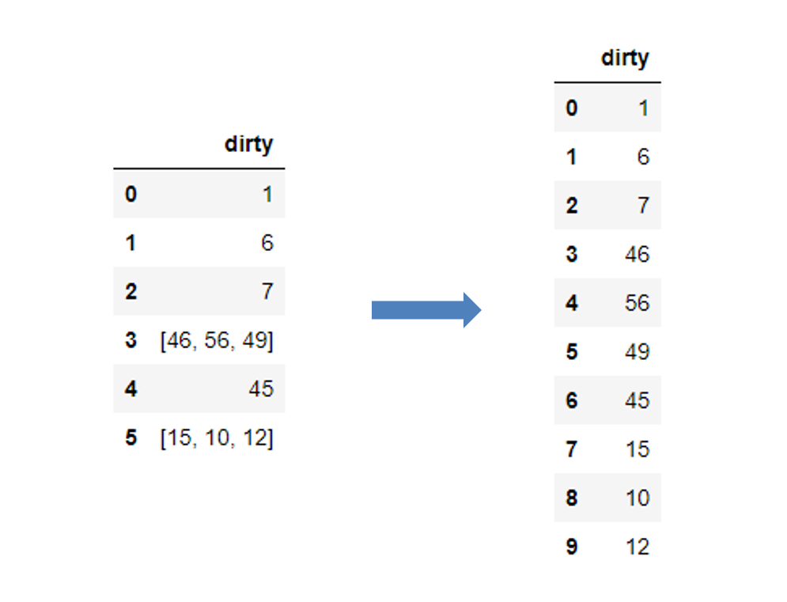
<a name="tOldK"></a>
## 5、`squeeze`
很多时候，用`.loc`筛选想返回一个值，但返回的却是个`series`。其实，只要使用`.squeeze()`即可完美解决。比如：
```python
# 没使用squeeze
subset = diamonds.loc[diamonds.index < 1, ["price"]]
# 使用squeeze
subset.squeeze("columns")
```
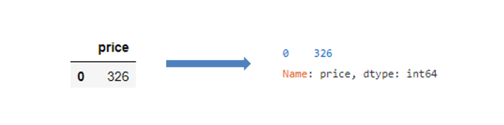<br />可以看到，压缩完结果已经是`int64`的格式了，而不再是`series`。
<a name="WlLul"></a>
## 6、`between`
`dataframe`的筛选方法有很多，常见的`loc`、`isin`等等，但其实还有个及其简洁的方法，专门筛选数值范围的，就是`between`，用法很简单。
```python
diamonds[diamonds["price"]\
      .between(3500, 3700, inclusive="neither")].sample(5)
```
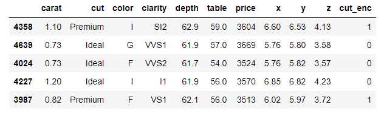
<a name="uNL04"></a>
## 7、`T`
这是所有的`dataframe`都有的一个简单属性，实现转置功能。它在显示`describe`时可以很好的搭配。
```python
boston.describe().T.head(10)
```
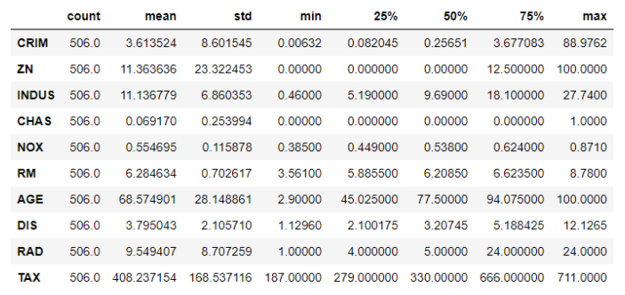
<a name="mWpIB"></a>
## 8、pandas styler
`pandas`也可以像excel一样，设置表格的可视化条件格式，而且只需要一行代码即可（可能需要一丢丢的前端HTML和CSS基础知识）。
```python
>>> diabetes.describe().T.drop("count", axis=1)\
                 .style.highlight_max(color="darkred")
```
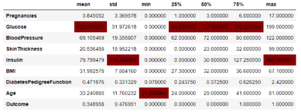<br />当然了，条件格式有非常多种。
<a name="qfm0g"></a>
## 9、Pandas options
`pandas`里提供了很多宏设置选项，被分为下面5大类。
```python
dir(pd.options)
['compute', 'display', 'io', 'mode', 'plotting']
```
一般情况下使用`display`会多一点，比如最大、最小显示行数，画图方法，显示精度等等。
```python
pd.options.display.max_columns = None
pd.options.display.precision = 5
```
<a name="GD6Cy"></a>
## 10、`convert_dtypes`
经常使用`pandas`的都知道，`pandas`对于经常会将变量类型直接变成`object`，导致后续无法正常操作。这种情况可以用`convert_dtypes`进行批量的转换，它会自动推断数据原来的类型，并实现转换。
```python
sample = pd.read_csv(
    "data/station_day.csv",
    usecols=["StationId", "CO", "O3", "AQI_Bucket"],
)

>>> sample.dtypes

StationId      object
CO            float64
O3            float64
AQI_Bucket     object
dtype: object

>>> sample.convert_dtypes().dtypes

StationId      string
CO            float64
O3            float64
AQI_Bucket     string
dtype: object
```
<a name="nXg77"></a>
## 11、`select_dtypes`
在需要筛选变量类型的时候，可以直接用`selec_dtypes`，通过`include`和`exclude`筛选和排除变量的类型。
```python
# 选择数值型的变量
diamonds.select_dtypes(include=np.number).head()
# 排除数值型的变量
diamonds.select_dtypes(exclude=np.number).head()
```
<a name="oiZLo"></a>
## 12、`mask`
`mask`可以在自定义条件下快速替换单元值，在很多三方库的源码中经常见到。比如下面想让age为50-60以外的单元为空，只需要在`con`和`ohter`写好自定义的条件即可。
```python
ages = pd.Series([55, 52, 50, 66, 57, 59, 49, 60]).to_frame("ages")

ages.mask(cond=~ages["ages"].between(50, 60), other=np.nan)
```
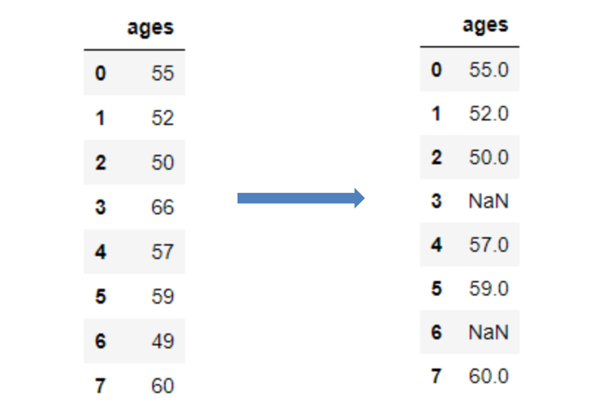
<a name="WvUMi"></a>
## 13、列轴的`min`、`max`
虽然大家都知道`min`和`max`的功能，但应用在列上的应该不多见。这对函数其实还可以这么用：
```python
index = ["Diamonds", "Titanic", "Iris", "Heart Disease", "Loan Default"]
libraries = ["XGBoost", "CatBoost", "LightGBM", "Sklearn GB"]

df = pd.DataFrame(
    {lib: np.random.uniform(90, 100, 5) for lib in libraries}, index=index
)

>>> df
```
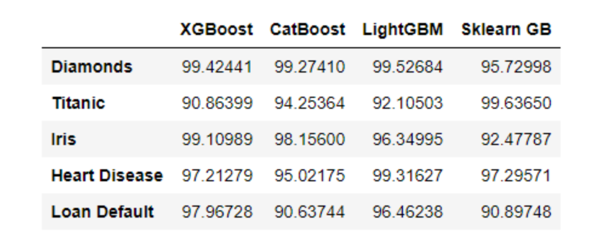
```python
>>> df.max(axis=1)

Diamonds         99.52684
Titanic          99.63650
Iris             99.10989
Heart Disease    99.31627
Loan Default     97.96728
dtype: float64
```
<a name="B3wFT"></a>
## 14、`nlargest`、`nsmallest`
有时不仅想要列的最小值/最大值，还想看变量的前 N 个或 ~(top N) 个值。这时`nlargest`和`nsmallest`就派上用场了。
```python
diamonds.nlargest(5, "price")
```
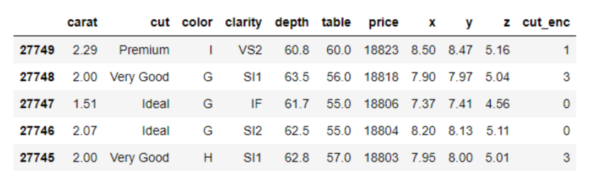
<a name="TV1qr"></a>
## 15、`idmax`、`idxmin`
用列轴使用`max`或`min`时，pandas 会返回最大/最小的值。但现在不需要具体的值了，需要这个最大值的位置。因为很多时候要锁定位置之后对整个行进行操作，比如单提出来或者删除等，所以这种需求还是很常见的。<br />使用`idxmax`和`idxmin`即可解决。
```python
>>> diamonds.price.idxmax()
27749

>>> diamonds.carat.idxmin()
14
```
<a name="VOjeu"></a>
## 16、`value_counts`
在数据探索的时候，`value_counts`是使用很频繁的函数，它默认是不统计空值的，但空值往往也是很关心的。如果想统计空值，可以将参数`dropna`设置为`False`。
```python
ames_housing = pd.read_csv("data/train.csv")

>>> ames_housing["FireplaceQu"].value_counts(dropna=False, normalize=True)

NaN    0.47260
Gd     0.26027
TA     0.21438
Fa     0.02260
Ex     0.01644
Po     0.01370
Name: FireplaceQu, dtype: float64
```
<a name="NzNvd"></a>
## 17、`clip`
异常值检测是数据分析中常见的操作。使用`clip`函数可以很容易地找到变量范围之外的异常值，并替换它们。
```python
>>> age.clip(50, 60)
```
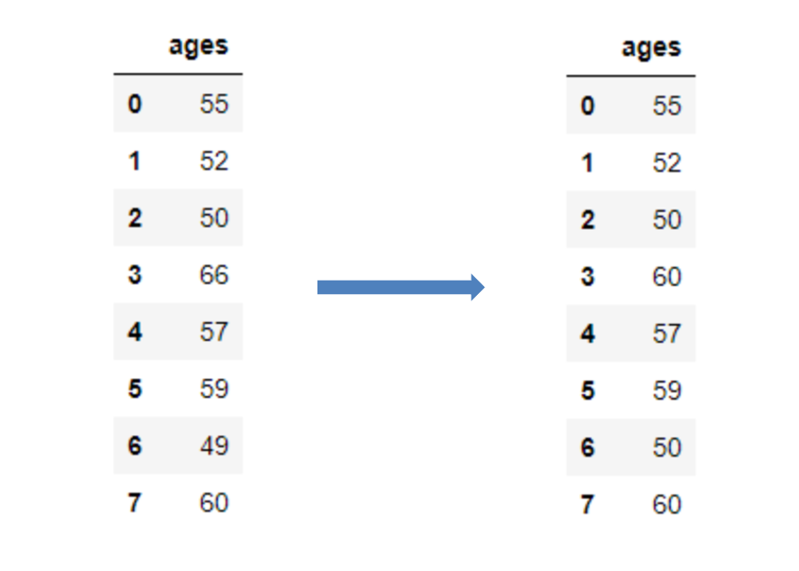
<a name="JTLYD"></a>
## 18、`at_time`、`between_time`
在有时间粒度比较细的时候，这两个函数超级有用。因为它们可以进行更细化的操作，比如筛选某个时点，或者某个范围时间等，可以细化到小时分钟。
```python
>>> data.at_time("15:00")
```
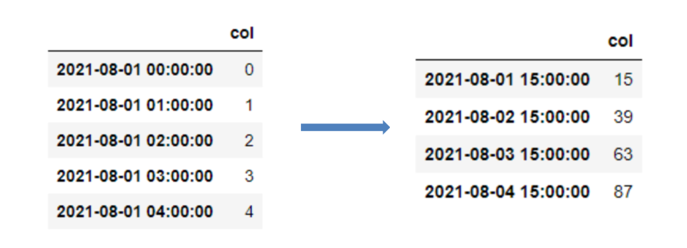
```python
from datetime import datetime

>>> data.between_time("09:45", "12:00")
```
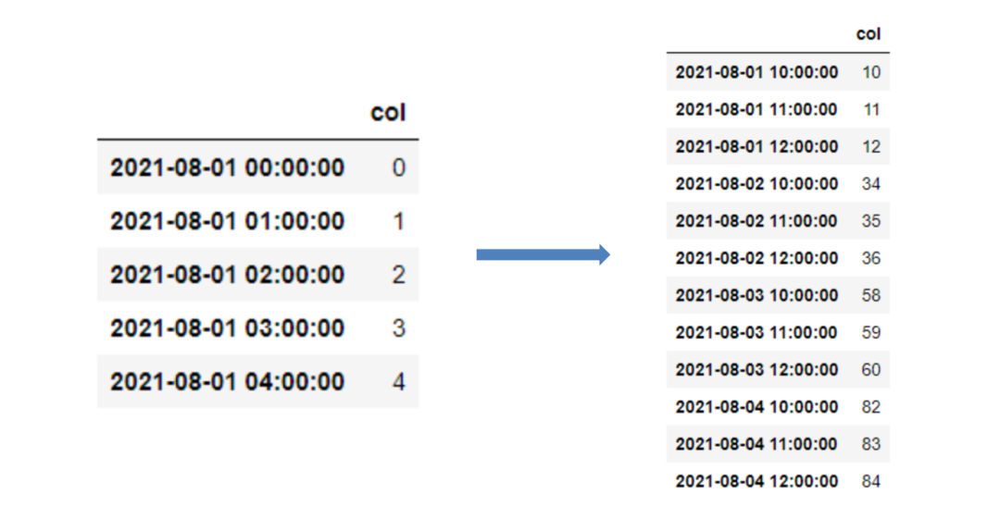
<a name="hWsgm"></a>
## 19、`hasnans`
`pandas`提供了一种快速方法`hasnans`来检查给定`series`是否包含空值。
```python
series = pd.Series([2, 4, 6, "sadf", np.nan])

>>> series.hasnans
True
```
该方法只适用于`series`的结构。
<a name="kF7Sp"></a>
## 20、`GroupBy.nth`
此功能仅适用于`GroupBy`对象。具体来说，分组后，`nth`返回每组的第n行：
```python
>>> diamonds.groupby("cut").nth(5)
```
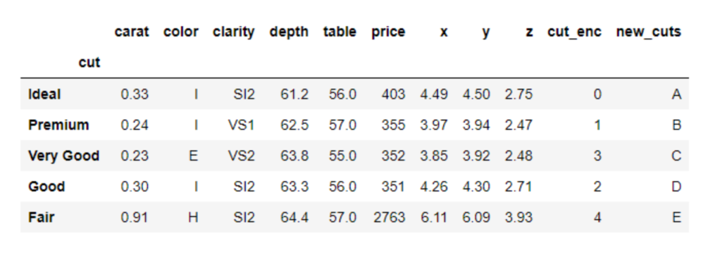
