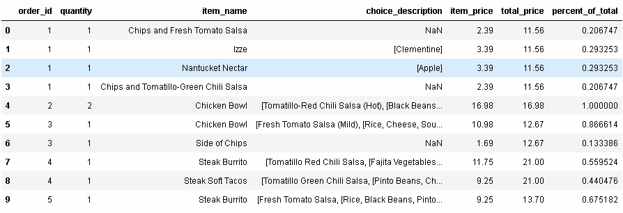
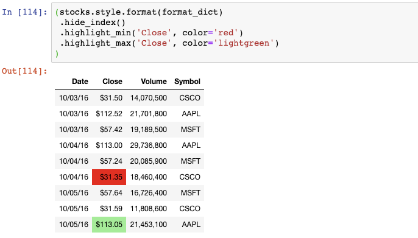

Python Pandas
<a name="adGFO"></a>
## 从剪贴板中创建DataFrame
假设将一些数据储存在Excel或者Google Sheet中，又想要尽快地将他们读取至DataFrame中。<br />需要选择这些数据并复制至剪贴板。然后，可以使用`**read_clipboard()**`**函数**将他们读取至DataFrame中：<br /><br />和`read_csv()`类似，`read_clipboard()`会自动检测每一列的正确的数据类型：<br /><br />再复制另外一个数据至剪贴板：<br /><br />神奇的是，pandas已经将第一列作为索引了：<br /><br />需要注意的是，**如果想要内容在未来可复制，那么**`**read_clipboard()**`**并不值得推荐。**
<a name="b3VHw"></a>
## 将DataFrame划分为两个随机的子集
假设想要将一个DataFrame划分为两部分，随机地将75%的行给一个DataFrame，剩下的25%的行给另一个DataFrame。<br />举例来说，movie ratings这个DataFrame有979行：<br /><br />可以使用`**sample()**`**函数**来随机选取75%的行，并将它们赋值给"movies_1"DataFrame：<br /><br />接着使用`drop()`函数来舍弃“moive_1”中出现过的行，将剩下的行赋值给"movies_2"DataFrame：<br />可以发现总的行数是正确的：<br /><br />还可以检查每部电影的索引，或者"moives_1":<br /><br />或者"moives_2":<br /><br />需要注意的是，**这个方法在索引值不唯一的情况下不起作用。**<br />**注：**该方法在机器学习或者深度学习中很有用，因为在模型训练前，往往需要将全部数据集按某个比例划分成训练集和测试集。该方法既简单又高效，值得学习和尝试。
<a name="WV8Ld"></a>
## 多种类型过滤DataFrame
先看一眼movies这个DataFrame：
```python
In [60]:movies.head()
Out[60]:
```
<br />其中有一列是genre（类型）:<br /><br />比如想要对该DataFrame进行过滤，只想显示genre为Action或者Drama或者Western的电影，可以使用多个条件，以"or"符号分隔：
```python
In [62]:movies[(movies.genre == 'Action') |       (movies.genre == 'Drama') |       (movies.genre == 'Western')].head()
Out[62]:
```
<br />但是，实际上可以使用`isin()`函数将代码写得更加清晰，将genres列表传递给该函数：
```python
In [63]:movies[movies.genre.isin(['Action', 'Drama', 'Western'])].head()
Out[63]:
```
<br />如果想要进行相反的过滤，也就是把刚才的三种类型的电影排除掉，那么可以在过滤条件前加上破浪号：
```python
In [64]:movies[~movies.genre.isin(['Action', 'Drama', 'Western'])].head()
Out[64]:
```
<br />这种方法能够起作用是**因为在Python中，波浪号表示“not”操作。**
<a name="X4IqH"></a>
## DataFrame筛选数量最多类别
假设想要对movies这个DataFrame通过genre进行过滤，但是只需要前3个数量最多的genre。<br />对genre使用`**value_counts()**`**函数**，并将它保存成counts（type为Series）:<br /><br />该Series的`nlargest()`函数能够轻松地计算出Series中前3个最大值：<br /><br />事实上在该Series中需要的是索引：<br /><br />最后，将该索引传递给`isin()`函数，该函数会把它当成genre列表：
```python
In [68]:movies[movies.genre.isin(counts.nlargest(3).index)].head()
Out[68]:
```
<br />这样，在DataFrame中只剩下Drame, Comdey, Action这三种类型的电影了。
<a name="uf8XA"></a>
## 处理缺失值
来看一看UFO sightings这个DataFrame:<br /><br />会注意到有些值是**缺失的**。<br />为了找出每一列中有多少值是缺失的，可以使用`**isna()**`**函数**，然后再使用`**sum()**`:<br /><br />`isna()`会产生一个由True和False组成的DataFrame，`sum()`会将所有的True值转换为1，False转换为0并把它们加起来。<br />类似地，可以通过`mean()`和`isna()`函数找出每一列中缺失值的百分比。<br /><br />如果想要舍弃那些包含了缺失值的列，可以使用`dropna()`函数：<br /><br />或者想要舍弃那么缺失值占比超过10%的列，可以给`dropna()`设置一个阈值：<br /><br />`len(ufo)`返回总行数，将它乘以0.9，以告诉pandas保留那些至少90%的值不是缺失值的列。
<a name="na2p5"></a>
## 一个字符串划分成多列
先创建另一个新的示例DataFrame:<br /><br />如果需要将“name”这一列划分为三个独立的列，用来表示first, middle, last name呢？将会使用`**str.split()**`**函数**，告诉它**以空格进行分隔**，并将结果扩展成一个DataFrame:<br /><br />这三列实际上可以通过一行代码保存至原来的DataFrame：<br /><br />如果想要划分一个字符串，但是仅保留其中一个结果列呢？比如说，以", "来划分location这一列：<br /><br />如果只想保留第0列作为city name，仅需要选择那一列并保存至DataFrame:<br />
<a name="OI4nh"></a>
## Series扩展成DataFrame
创建一个新的示例DataFrame:<br /><br />这里有两列，第二列包含了Python中的由整数元素组成的列表。<br />如果想要将第二列扩展成DataFrame，可以对那一列使用`**apply()**`**函数并传递给Series constructor**:<br /><br />通过使用`concat()`函数，可以将原来的DataFrame和新的DataFrame组合起来：<br />
<a name="LNvnC"></a>
## 对多个函数进行聚合
来看一眼从Chipotle restaurant chain得到的orders这个DataFrame:
```python
In [82]:orders.head(10)
Out[82]:
```
<br />每个订单（order）都有订单号（order_id），包含一行或者多行。为了找出每个订单的总价格，可以将那个订单号的价格（item_price）加起来。比如，这里是订单号为1的总价格：<br /><br />如果想要计算每个订单的总价格，可以对order_id使用`groupby()`，再对每个`group`的`item_price`进行求和。<br /><br />但是，事实上不可能在聚合时仅使用一个函数，比如`sum()`。**为了对多个函数进行聚合，可以使用**`**agg()**`**函数，**传给它一个函数列表，比如`sum()`和`count()`:<br /><br />没定订单的总价格和数量。
<a name="nbLUQ"></a>
## 聚合结果与DataFrame组合
再看一眼orders这个DataFrame:
```python
In [86]:orders.head(10)
Out[86]:
```
<br />如果想要增加新的一列，用于展示每个订单的总价格呢？回忆一下，通过使用`sum()`函数得到了总价格：<br /><br />`sum()`是一个聚合函数，这表明它返回输入数据的精简版本（reduced version ）。<br />换句话说，`sum()`函数的输出：<br /><br />比这个函数的输入要小：<br /><br />解决的办法是**使用**`**transform()**`**函数，它会执行相同的操作但是返回与输入数据相同的形状**：<br /><br />将这个结果存储至DataFrame中新的一列：
```python
In [91]:orders['total_price'] = total_priceorders.head(10)
Out[91]:
```
<br />可以看到，每个订单的总价格在每一行中显示出来了。<br />这样就能方便地甲酸每个订单的价格占该订单的总价格的百分比：
```python
In [92]:orders['percent_of_total'] = orders.item_price / orders.total_priceorders.head(10)
In [92]:
```

<a name="jLd17"></a>
## 选取行和列的切片
看一眼另一个数据集：
```python
In [93]:titanic.head()
Out[93]:
```
<br />这就是著名的Titanic数据集，它保存了Titanic上乘客的信息以及他们是否存活。<br />如果想要对这个数据集做一个数值方面的总结，可以使用`describe()`函数：<br /><br />但是，这个DataFrame结果可能比想要的信息显示得更多。<br />如果想对这个结果进行过滤，只想显示“五数概括法”（five-number summary）的信息，可以使用`**loc**`**函数并传递"min"到"max"的切片**:<br /><br />如果不是对所有列都感兴趣，也可以传递列名的切片：<br />
<a name="KLgzX"></a>
## MultiIndexed Series重塑
Titanic数据集的Survived列由1和0组成，因此可以对这一列计算总的存活率：<br /><br />如果想对某个类别，比如“Sex”，计算存活率，可以使用`groupby()`:<br /><br />如果想一次性对两个类别变量计算存活率，可以对这些类别变量使用`groupby()`：<br /><br />该结果展示了由Sex和Passenger Class联合起来的存活率。它存储为一个MultiIndexed Series，也就是说它对实际数据有多个索引层级。<br />这使得该数据难以读取和交互，因此更为方便的是**通过**`**unstack()**`**函数将MultiIndexed Series重塑成一个DataFrame**:<br /><br />该DataFrame包含了与MultiIndexed Series一样的数据，不同的是，现在可以用熟悉的DataFrame的函数对它进行操作。
<a name="c3HlI"></a>
## 创建数据透视表
如果经常使用上述的方法创建DataFrames，也许会发现用`**pivot_table()**`**函数更为便捷**：<br /><br />想要使用数据透视表，需要**指定索引**(index),** 列名**(columns), **值**(values)和**聚合函数**(aggregation function)。<br />数据透视表的另一个好处是，可以**通过设置margins=True轻松地将行和列都加起来**：<br /><br />这个结果既显示了总的存活率，也显示了Sex和Passenger Class的存活率。<br />最后，可以创建交叉表（cross-tabulation），只需要将聚合函数由"mean"改为"count":<br /><br />这个结果展示了每一对类别变量组合后的记录总数。
<a name="YeiQZ"></a>
## 连续数据转类别数据
来看一下Titanic数据集中的Age那一列：<br /><br />它现在是连续性数据，但是如果想要将它转变成类别数据呢？<br />一个解决办法是对年龄范围打标签，比如"adult", "young adult", "child"。实现该功能的最好方式是使用`**cut()**`**函数**：<br /><br />这会对每个值打上标签。0到18岁的打上标签"child"，18-25岁的打上标签"young adult"，25到99岁的打上标签“adult”。<br />注意到，该数据类型为**类别变量**，该类别变量**自动排好序**了（有序的类别变量）。
<a name="BxsAv"></a>
## Style a DataFrame
上一个技巧在想要修改整个jupyter notebook中的显示会很有用。但是，一个更灵活和有用的方法是定义特定DataFrame中的格式化（style）。<br />回到stocks这个DataFrame:<br /><br />可以**创建一个格式化字符串的字典，用于对每一列进行格式化**。然后将其传递给DataFrame的`style.format()`函数：<br />

注意到，Date列是month-day-year的格式，Close列包含一个`$`符号，Volume列包含逗号。<br />可以通过**链式调用函数**来应用更多的格式化：<br /><br />现在隐藏了索引，将Close列中的最小值高亮成红色，将Close列中的最大值高亮成浅绿色。<br />这里有另一个DataFrame格式化的例子：<br /><br />Volume列现在有一个渐变的背景色，可以轻松地识别出大的和小的数值。<br />最后一个例子：<br /><br />现在，Volumn列上有一个条形图，DataFrame上有一个标题。<br />请注意，还有许多其他的选项可以用来格式化DataFrame。
<a name="s9BMs"></a>
## 额外技巧
<a name="neXmu"></a>
### **Profile a DataFrame**
假设拿到一个新的数据集，不想要花费太多力气，只是想快速地探索下。那么可以**使用pandas-profiling这个模块**。<br />在系统上安装好该模块，然后**使用**`**ProfileReport()**`**函数**，传递的参数为任何一个DataFrame。它会返回一个互动的HTML报告：

- 第一部分为该数据集的总览，以及该数据集可能出现的问题列表
- 第二部分为每一列的总结。可以点击"toggle details"获取更多信息
- 第三部分显示列之间的关联热力图
- 第四部分为缺失值情况报告
- 第五部分显示该数据及的前几行

**使用示例如下**（只显示第一部分的报告）：<br />
