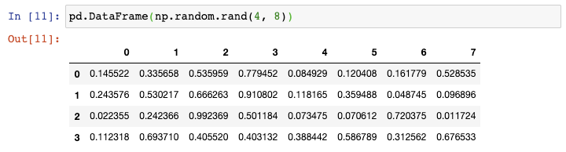
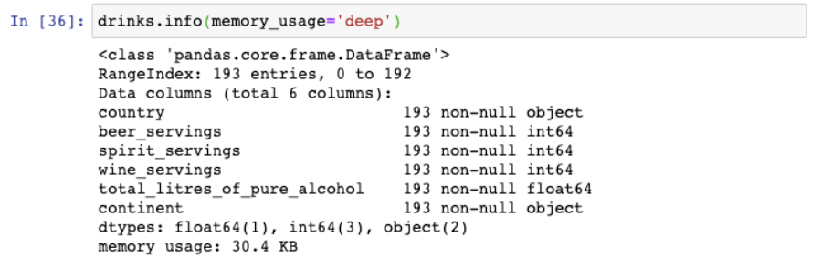

Python Pandas 
<a name="s3pqL"></a>
### 显示已安装的版本
输入下面的命令查询pandas版本：
```python
In [7]:pd.__version__
Out[7]: 0.24.2
```
如果还想知道pandas所依赖的模块的版本，可以使用`**show_versions()**`**函数**:
```python
In [9]：
pd.show_versions()

INSTALLED VERSIONS 
------------------ 
commit: None 
python: 3.7.3.final.0 
python-bits: 64 
OS: Darwin 
OS-release: 18.6.0 
machine: x86_64 
processor: i386 
byteorder: little 
LC_ALL: None 
LANG: en_US.UTF-8 
LOCALE: en_US.UTF-8 

pandas: 0.24.2 
pytest: None 
pip: 19.1.1 
setuptools: 41.0.1 
Cython: None 
numpy: 1.16.4 
scipy: None 
pyarrow: None 
xarray: None 
IPython: 7.5.0 
sphinx: None 
patsy: None 
dateutil: 2.8.0 
pytz: 2019.1 
blosc: None 
bottleneck: None 
tables: None 
numexpr: None 
feather: None 
matplotlib: 3.1.0 
openpyxl: None 
xlrd: None 
xlwt: None 
xlsxwriter: None 
lxml.etree: None 
bs4: None 
html5lib: None 
sqlalchemy: None 
pymysql: None 
psycopg2: None 
jinja2: 2.10.1 
s3fs: None 
fastparquet: None 
pandas_gbq: None 
pandas_datareader: None 
gcsfs: None
```
可以查看到Python，pandas, Numpy, matplotlib等的版本信息。
<a name="7c75a38f"></a>
### 创建示例DataFrame
假设需要创建一个示例DataFrame。有很多种实现的途径，一般是传一个字典给DataFrame constructor，其中字典中的**keys为列名，values为列的取值。**<br /><br />现在如果需要创建一个更大的DataFrame，上述方法则需要太多的输入。在这种情况下，可以使用**Numpy的**`**random.rand()**`**函数**，告诉它行数和列数，将它传递给DataFrame constructor：<br /><br />这种方式很好，但如果还想把列名变为非数值型的，可以强制地**将一串字符赋值给**`**columns**`**参数**：<br /><br />可以想到，传递的字符串的长度必须与列数相同。
<a name="xLChr"></a>
### 更改列名
看一下刚才创建的示例DataFrame:<br /><br />在选取pandas列的时候使用点（`.`），但是这对那么列名中含有空格的列不会生效。来修复这个问题。<br />更改列名最灵活的方式是使用`rename()`函数。可以传递一个字典，其中`**keys**`**为原列名，**`**values**`**为新列名**，还可以指定`axis`:
```python
In [14]:
df = df.rename({ col one : col_one ,  col two : col_two }, axis= columns )
```
使用这个函数最好的方式是需要更改任意数量的列名，不管是一列或者全部的列。<br />如果需要一次性重新命令所有的列名，更简单的方式就是**重写DataFrame的**`**columns**`**属性**：
```python
In [15]:
df.columns = [ col_one ,  col_two ]
```
如果需要做的仅仅是将空格换成下划线，那么更好的办法是使用`**str.replace()**`**方法**，因为这不需要输入所有的列名：
```python
In [16]:
df.columns = df.columns.str.replace(   ,  _ )
```
上述三个函数的结果都一样，可以更改列名使得列名中不含有空格：<br /><br />最后，如果需要在列名中添加前缀或者后缀，可以使用`**add_prefix()**`**函数**：<br /><br />或者使用`**add_suffix()**`**函数**：<br />
<a name="tdD4k"></a>
### 行序反转
看一下drinks这个DataFame:
```python
In [20]:
drinks.head()

Out[20]:
```
| 

 | country | beer_servings | spirit_servings | wine_servings | total_litres_of_pure_alcohol | continent |
| --- | --- | --- | --- | --- | --- | --- |
| 0 | Afghanistan | 0 | 0 | 0 | 0.0 | Asia |
| 1 | Albania | 89 | 132 | 54 | 4.9 | Europe |
| 2 | Algeria | 25 | 0 | 14 | 0.7 | Africa |
| 3 | Andorra | 245 | 138 | 312 | 12.4 | Europe |
| 4 | Angola | 217 | 57 | 45 | 5.9 | Africa |

该数据集描述了每个国家的平均酒消费量。如果想要将行序反转呢？<br />最直接的办法是使用`**loc函数并传递::-1**`，跟Python中列表反转时使用的切片符号一致：
```python
In [21]:
drinks.loc[::-1].head()

Out[21]:
```

| 

 | country | beer_servings | spirit_servings | wine_servings | total_litres_of_pure_alcohol | continent |
| --- | --- | --- | --- | --- | --- | --- |
| 192 | Zimbabwe | 64 | 18 | 4 | 4.7 | Africa |
| 191 | Zambia | 32 | 19 | 4 | 2.5 | Africa |
| 190 | Yemen | 6 | 0 | 0 | 0.1 | Asia |
| 189 | Vietnam | 111 | 2 | 1 | 2.0 | Asia |
| 188 | Venezuela | 333 | 100 | 3 | 7.7 | South America |

如想重置索引使得它从0开始。<br />可以使用`**reset_index()**`**函数**，**去掉之前的索引**：
```python
In [22]:
drinks.loc[::-1].reset_index(drop=True).head()

Out[22]:
```

| 

 | country | beer_servings | spirit_servings | wine_servings | total_litres_of_pure_alcohol | continent |
| --- | --- | --- | --- | --- | --- | --- |
| 0 | Zimbabwe | 64 | 18 | 4 | 4.7 | Africa |
| 1 | Zambia | 32 | 19 | 4 | 2.5 | Africa |
| 2 | Yemen | 6 | 0 | 0 | 0.1 | Asia |
| 3 | Vietnam | 111 | 2 | 1 | 2.0 | Asia |
| 4 | Venezuela | 333 | 100 | 3 | 7.7 | South America |

可以看到，行序已经反转，索引也被重置为默认的整数序号。
<a name="tVqQs"></a>
### 列序反转
跟之前的技巧一样，也可以使用`loc`函数将列从左至右反转：
```python
In [23]:
drinks.loc[:, ::-1].head()

Out[23]:
```
| 

 | continent | total_litres_of_pure_alcohol | wine_servings | spirit_servings | beer_servings | country |
| --- | --- | --- | --- | --- | --- | --- |
| 0 | Asia | 0.0 | 0 | 0 | 0 | Afghanistan |
| 1 | Europe | 4.9 | 54 | 132 | 89 | Albania |
| 2 | Africa | 0.7 | 14 | 0 | 25 | Algeria |
| 3 | Europe | 12.4 | 312 | 138 | 245 | Andorra |
| 4 | Africa | 5.9 | 45 | 57 | 217 | Angola |

逗号之前的冒号表示选择所有行，逗号之后的::-1表示反转所有的列，这就是为什么country这一列现在在最右边。
<a name="Uzv8e"></a>
### 通过数据类型选择列
这里有drinks这个DataFrame的数据类型：
```python
In [24]:
drinks.dtypes

Out[24]:
country                          object
beer_servings                     int64
spirit_servings                   int64
wine_servings                     int64
total_litres_of_pure_alcohol    float64
continent                        object
dtype: object
```
假设仅仅需要**选取数值型的列**，那么可以使用`**select_dtypes()**`**函数**：
```python
In [25]:
drinks.select_dtypes(include= number ).head()

Out[25]:
```
| 

 | beer_servings | spirit_servings | wine_servings | total_litres_of_pure_alcohol |
| --- | --- | --- | --- | --- |
| 0 | 0 | 0 | 0 | 0.0 |
| 1 | 89 | 132 | 54 | 4.9 |
| 2 | 25 | 0 | 14 | 0.7 |
| 3 | 245 | 138 | 312 | 12.4 |
| 4 | 217 | 57 | 45 | 5.9 |

这包含了int和float型的列。<br />也可以使用这个函数来选取数据类型为object的列：<br /><br />还可以选取多种数据类型，只需要传递一个列表即可：<br /><br />还可以用来排除特定的数据类型：<br />
<a name="XCbve"></a>
### 将字符型转换为数值型
创建另一个示例DataFrame:<br /><br />这些数字实际上储存为**字符型**，导致其数据类型为object:<br /><br />为了对这些列进行数学运算，需要**将数据类型转换成数值型**。可以对前两列使用`**astype()**`**函数**：<br /><br />但是，如果对第三列也使用这个函数，将会引起错误，这是因为这一列包含了破折号（用来表示0）但是pandas并不知道如何处理它。<br />可以对第三列使用`to_numeric()`函数，告诉其将任何无效数据转换为NaN:<br /><br />如果知道NaN值代表0，那么可以fillna()函数将他们替换成0：<br /><br />最后，可以通过`apply()`函数一次性对整个DataFrame使用这个函数：<br /><br />仅需一行代码就完成了目标，因为现在所有的数据类型都转换成float:<br />
<a name="NrKhB"></a>
### 减小DataFrame空间大小
pandas DataFrame被设计成可以适应内存，所以有些时候可以减小DataFrame的空间大小，让它在系统上更好地运行起来。<br />这是drinks这个DataFrame所占用的空间大小：<br /><br />可以看到它使用了30.4KB。<br />如果对DataFrame有操作方面的问题，或者不能将它读进内存，那么在读取文件的过程中有两个步骤可以使用来减小DataFrame的空间大小。<br />第一个步骤是只读取那些实际上需要用到的列，可以调用`usecols`参数：<br /><br />通过仅读取用到的两列，将DataFrame的空间大小缩小至13.6KB。<br />第二步是将所有实际上为类别变量的object列转换成类别变量，可以调用`dtypes`参数：<br /><br />通过将continent列读取为category数据类型，进一步地把DataFrame的空间大小缩小至2.3KB。<br />值得注意的是，如果跟行数相比，category数据类型的列数相对较小，那么catefory数据类型可以减小内存占用。
<a name="32zvl"></a>
### 按行从多个文件中构建DataFrame
假设数据集分化为多个文件，但是需要将这些数据集读到一个DataFrame中。<br />举例来说，有一些关于股票的小数聚集，每个数据集为单天的CSV文件。<br />**这是第一天的：**<br /><br />**这是第二天的：**<br /><br />**这是第三天的：**<br /><br />可以将每个CSV文件读取成DataFrame，将它们结合起来，然后再删除原来的DataFrame，但是这样会多占用内存且需要许多代码<br />更好的方式为使用内置的glob模块。可以给`glob()`函数传递某种模式，包括未知字符，这样它会返回符合该某事的文件列表。在这种方式下，glob会查找所有以stocks开头的CSV文件：<br /><br />glob会返回任意排序的文件名，这就是为什么要用Python内置的`sorted()`函数来对列表进行排序。<br />以生成器表达式用`read_csv()`函数来读取每个文件，并将结果传递给`concat()`函数，这会将单个的DataFrame按行来组合：<br /><br />不幸的是，索引值存在重复。为了避免这种情况，需要告诉`concat()`函数来忽略索引，使用默认的整数索引：<br />
<a name="6RIFC"></a>
### 按列从多个文件中构建DataFrame
上一个技巧对于数据集中每个文件包含行记录很有用。但是如果数据集中的每个文件包含的列信息呢？<br />这里有一个例子，dinks数据集被划分成两个CSV文件，每个文件包含三列：<br /><br />同上一个技巧一样，使用`glob()`函数开始。这一次，需要告诉`concat()`函数按列来组合：<br /><br />现在DataFrame已经有六列了。
