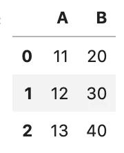
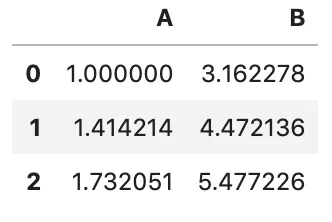
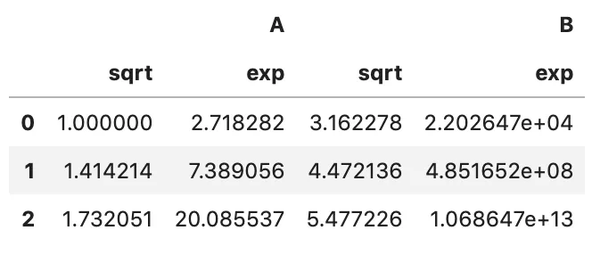
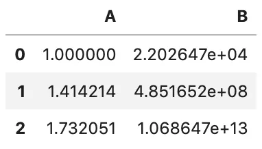
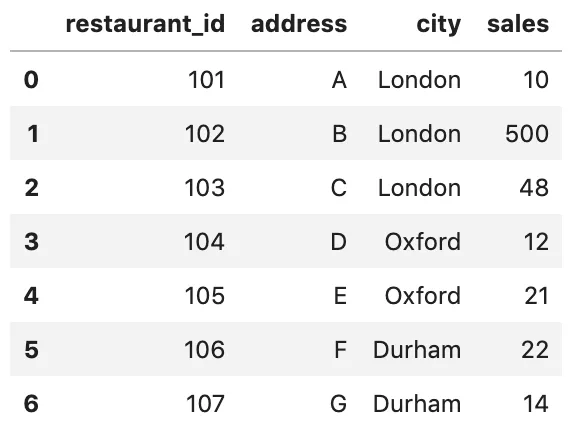
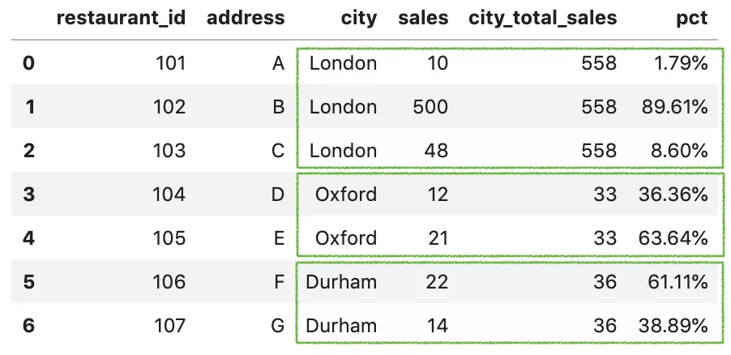
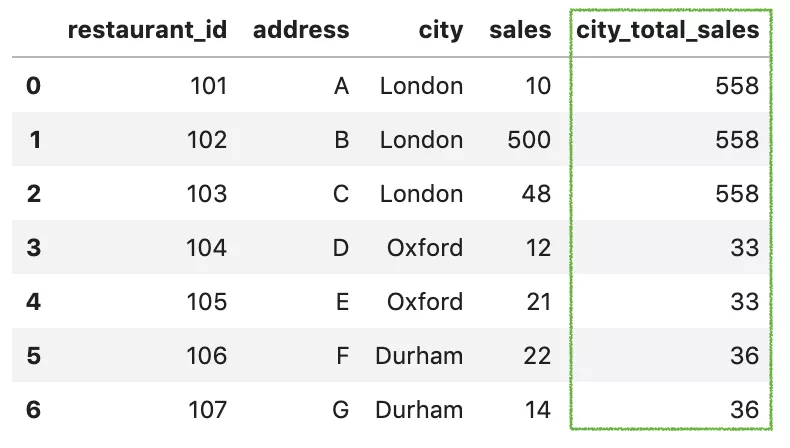
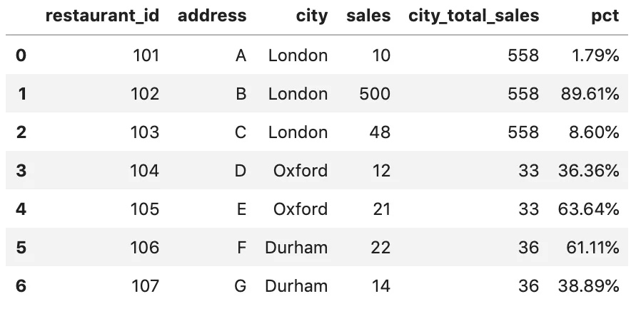
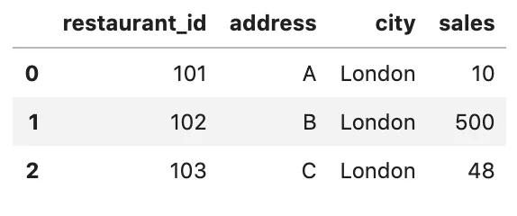
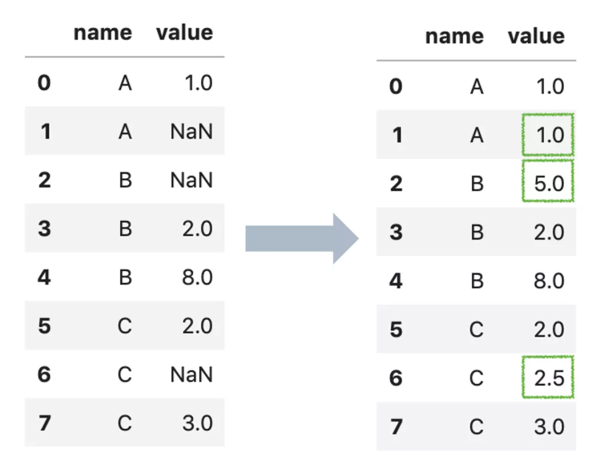

Python Pandas transform<br />`transform`有4个比较常用的功能，总结如下：

- 转换数值
- 合并分组结果
- 过滤数据
- 结合分组处理缺失值
<a name="ycQA2"></a>
## 一、转换数值
```python
pd.transform(func, axis=0)
```
以上就是`transform`转换数值的基本用法，参数含义如下：

- `func`是指定用于处理数据的函数，它可以是`普通函数`、`字符串函数名称`、`函数列表`或`轴标签映射函数的字典`。
- `axis`是指要应用到哪个轴，`0`代表列，`1`代表行。
<a name="C2u63"></a>
### 1、普通函数
`func`可以是正常使用的普通函数，像下面例子这样自定义一个函数。
```python
df = pd.DataFrame({'A': [1,2,3], 'B': [10,20,30] })
def plus_10(x):
    return x+10
df.transform(plus_10)
```
<br />或者，也可以用`lambda`函数简洁的实现，效果是一样的。
```python
df.transform(lambda x: x+10)
```
<a name="SVdI8"></a>
### 2、字符串函数
也可以传递任何有效的`pandas`内置的字符串函数，例如`sqrt`：
```python
df.transform('sqrt')
```

<a name="GZKRt"></a>
### 3、函数列表
`func`还可以是一个函数的列表。例如`numpy`的`sqrt`和`exp`函数的列表组合：
```python
df.transform([np.sqrt, np.exp])
```
<br />通过上面结果看到，两个函数分别作用于`A`和`B`每个列。
<a name="SPS6i"></a>
### 4、轴标签映射函数的字典
如果只想将指定函数作用于某一列，该如何操作？<br />`func`还可以是轴标签映射指定函数的字典。例如：
```python
df.transform({
    'A': np.sqrt,
    'B': np.exp,
})
```
<br />这样，就可以对`A`和`BL`两列分别使用相应函数了，互不干扰。
<a name="LmKqH"></a>
## 二、合并分组结果
这个有点类似`SQL`的窗口函数，就是可以合并`grouby()`的分组结果。用一个例子说明：
```python
df = pd.DataFrame({
  'restaurant_id': [101,102,103,104,105,106,107],
  'address': ['A','B','C','D', 'E', 'F', 'G'],
  'city': ['London','London','London','Oxford','Oxford', 'Durham', 'Durham'],
  'sales': [10,500,48,12,21,22,14]
})
```
<br />可以看到，每个城市都有多家销售餐厅。现在想知道**每家餐厅在城市中所占的销售百分比是多少。** 预期输出为：<br />传统方法是：先`groupby`分组，结合`apply`计算分组求和，再用`merge`合并原表，然后再`apply`计算百分比。<br />但其实用`transform`可以直接代替前面两个步骤（分组求和、合并）。<br />首先，用`transform`结合`groupby`按城市分组计算销售总和。
```python
df['city_total_sales'] = df.groupby('city')['sales']
                           .transform('sum')
```
<br />**可以看到，使用**`transfrom`**计算分组的求和并不会像**`apply`**一样改变原表的结构，而是直接在原表的基础上再增加一列。**<br />这样就可以一步到位，得到想要的格式。然后，再计算百分比调整格式。
```python
df['pct'] = df['sales'] / df['city_total_sales']
df['pct'] = df['pct'].apply(lambda x: format(x, '.2%'))
```

<a name="trlFl"></a>
## 三、过滤数据
`transform`也可以用来过滤数据。仍用上个例子，希望获得城市总销售额超过40的记录，那么就可以这样使用。
```python
df[df.groupby('city')['sales'].transform('sum') > 40]
```
<br />上面结果来看，并没有生成新的列，而是通过汇总计算求和直接对原表进行了筛选，非常优雅。
<a name="Y3ws3"></a>
## 四、结合分组处理缺失值
```python
df = pd.DataFrame({
    'name': ['A', 'A', 'B', 'B', 'B', 'C', 'C', 'C'],
    'value': [1, np.nan, np.nan, 2, 8, 2, np.nan, 3]
})
```
在上面的示例中，数据可以按`name`分为三组A、B、C，每组都有缺失值。替换缺失值的常见的方法是用`mean`替换`NaN`。下面是每个组中的平均值。
```python
df.groupby('name')['value'].mean()
name
A    1.0
B    5.0
C    2.5
Name: value, dtype: float64
```
可以通过`transform()`使用每组平均值来替换缺失值。用法如下：
```python
df['value'] = df.groupby('name')
                .transform(lambda x: x.fillna(x.mean()))
```

