Python Pandas<br />如果用 Python 做数据分析，必然会绕不过 Pandas 的使用，实际上， Python 也是由于 numpy、pandas 等数据科学库的出现，才开始在数据科学领域实现了快速的发展，因此，学好 Pandas 有很重要的现实意义。<br />这里总结经常使用的pandas操作方法：

- 创建DataFrame数据
- 查看数据相关信息
- 查看头尾文件
- 花样取数
- 切片取数
- 常见函数使用

首先，导入包
```python
import pandas as pd
import numpy as np
```
<a name="Vfs7V"></a>
## 1、创建DataFrame数据
<a name="wWuUg"></a>
### 方式1：通过字典直接创建
```python
df1 = pd.DataFrame({
    "name":["小明","小红","小孙","王小","关宇","刘蓓","张菲"],
    "age":[20,18,27,20,28,18,25],
    "sex":["男","女","男","男","男","女","女"],
    "score":[669,570,642,590,601,619,701],
    "address":["北京","深圳","广州","武汉","深圳","广州","长沙"]
})

df1
```
数据如下图：<br />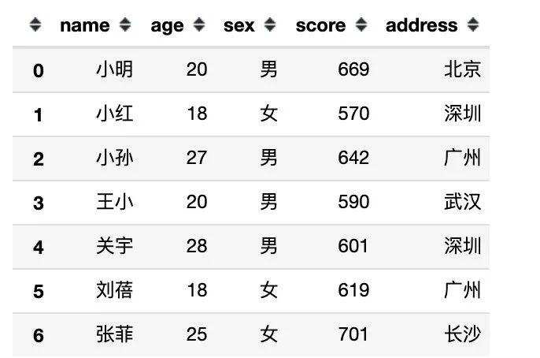
<a name="Sx5Tb"></a>
### 方式2：通过本地数据读取
从本地文件中读取进来。现在本地有一个文件：学生信息.xlsx直接通过`pd.read_excel()`读进来：
```python
df2 = pd.read_excel("学生信息.xlsx")
df2
```
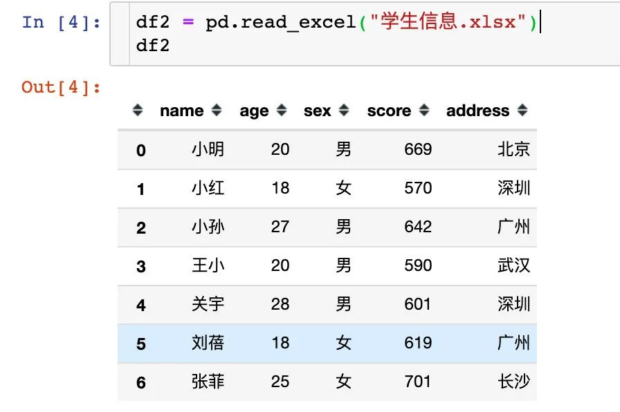<br />可以看到效果和上面是一样的
<a name="xxrtG"></a>
## 2、数据探索
<a name="kWEgr"></a>
### 查看数据`shape`
`shape`表示数据是由多少行和列组成：
```python
df1.shape  # (7,5)
```
<a name="lUjqg"></a>
### 查看字段属性名称
```python
df1.columns
```
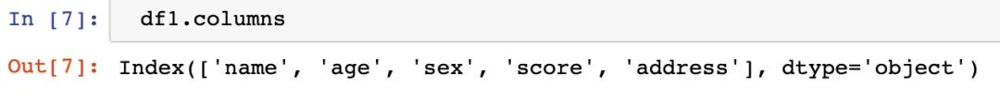
<a name="BKRWz"></a>
### 查看属性的数据类型
```python
df1.dtypes
```
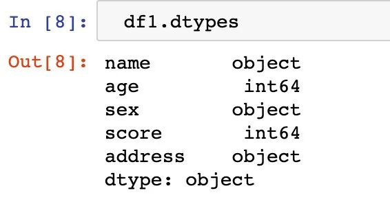<br />可以看到只有两种数据类型：`int64`和`object`
<a name="v4GwU"></a>
### 查看数据是否缺失
```python
df1.isnull()   # 如果缺失显示为True，否则显示False
```
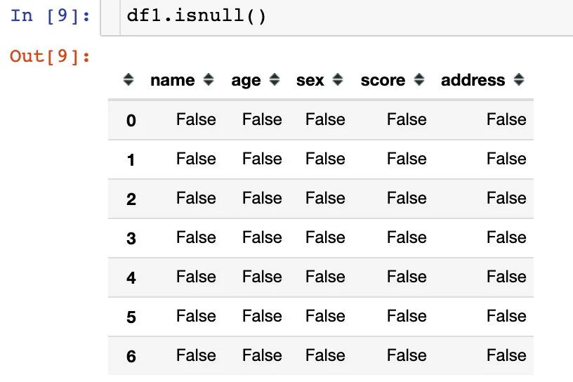
```python
df1.isnull().sum() # 统计缺失值的个数。一个True计数一次
```
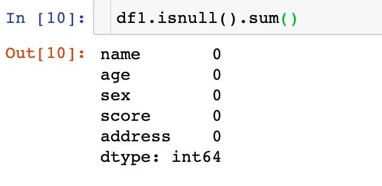<br />结果显示：本次数据是没有缺失值的
<a name="N3jYs"></a>
### 查看数据行索引
```python
df1.index
```
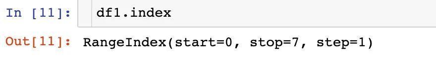
<a name="oww0D"></a>
### 查看数据描述信息
```python
df1.describe
```
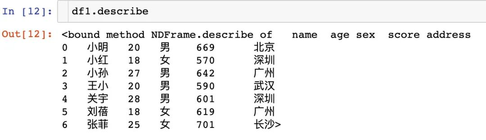
<a name="hFfK7"></a>
### 查看数据统计值
统计值信息只会显示类型为数值型的数据统计值信息：
```python
df1.describe()
```
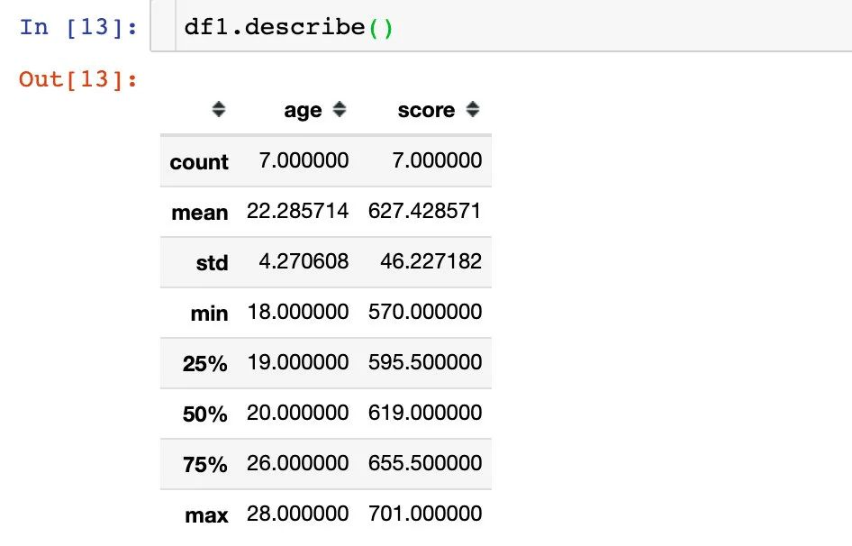<br />统计值的结果包含：个数count、均值mean、方差std、最值min\max、四分位数25%、中位数50%、四分之三分位数75%。
<a name="zlDK1"></a>
## 3、查看头尾文件
通过`head`和`tail`方法能够快速查看数据的头尾文件。
<a name="fvMBu"></a>
### head
```python
df1.head()   # 默认是查看前5行数据
df1.head(3)  # 指定显示的行数
```
<a name="NqB18"></a>
### tail
```python
df1.tail()    # 默认尾部5行
df1.tail(3)   # 指定尾部3行数据
```
<a name="aG5aP"></a>
## 4、花样取数
从pandas的DataFrame数据框中取出想要的数据，然后进行处理
<a name="zynaZ"></a>
### 取出某个字段的数据
取出name这列的数据：
```python
name = df1["name"]
name

# 结果
0    小明
1    小红
2    小孙
3    王小
4    关宇
5    刘蓓
6    张菲
Name: name, dtype: object
```
<a name="iFk5K"></a>
### 取出多个字段的数据
比如取出name和age列的数据：
```python
name_age = df1[["name","age"]]  
name_age

# 结果
  name age
0 小明 20
1 小红 18
2 小孙 27
3 王小 20
4 关宇 28
5 刘蓓 18
6 张菲 25
```
<a name="nCYnZ"></a>
### 根据字段类型选择数据
比如，想选择字段类型为int64的数据，通过查看的字段数据类型显示：age和score都是int64类型
<a name="gpJQF"></a>
#### 1、选择单个数据类型
```python
# 1、选择单个数据类型

df1.select_dtypes(include='int64')

# 结果
  age score
0 20 669
1 18 570
2 27 642
3 20 590
4 28 601
5 18 619
6 25 701
```
<a name="KDCcH"></a>
#### 2、同时选择多个类型
```python
df1.select_dtypes(include=['int64','object'])

# 结果
  name  age sex score address
0 小明  20  男 669    北京
1 小红  18  女 570    深圳
2 小孙  27  男 642    广州
3 王小  20  男 590    武汉
4 关宇  28  男 601    深圳
5 刘蓓  18  女 619    广州
6 张菲  25  女 701    长沙
```
因为数据中只有int64，object，所以全部选出来了。
<a name="BreKU"></a>
#### 3、选择排除某些数据类型之外的数据：
```python
# 选择除了int64类型之外的数据
# 排除name和score字段之外的数据
df1.select_dtypes(exclude='int64') 

# 结果
  name sex address
0 小明 男   北京
1 小红 女   深圳
2 小孙 男   广州
3 王小 男   武汉
4 关宇 男   深圳
5 刘蓓 女   广州
6 张菲 女   长沙
```
<a name="DxyLL"></a>
### 根据数值大小取数
<a name="JCMQ3"></a>
#### 1、直接通过判断大小来取数：
```python
df1[df1["age"] == 20]  # 年龄等于20
df1[df1["age"] != 20]  # 年龄不等于20
df1[df1["age"] >= 20]  # 年龄大于等于20
```
<a name="UI6cs"></a>
#### 2、多个判断条件连用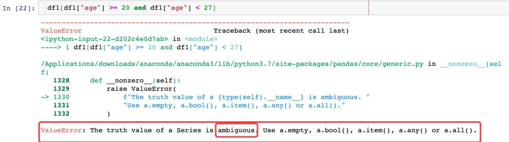
第一次使用上面的方法报错：关键词是ambiguous。判断条件很让pandas混淆，改成下面的写法成功解决：
```python
df1[(df1["age"] >= 20) & (df1["age"] < 27)]
```
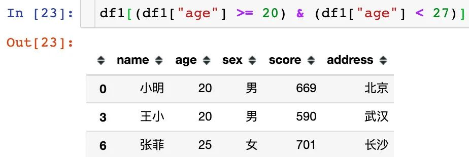
<a name="tWpYA"></a>
### 根据字符串取数
<a name="rn73F"></a>
#### 1、通过单个条件取数
```python
# 1、单条数据
df1[df1["name"] == "小明"]  

# 结果
  name  age sex  score address
0 小明  20  男   669   北京
```
<a name="i7rw1"></a>
#### 2、通过多个条件取数
选择姓名是小明，或者年龄大于25的数据
```python
df1[(df1["name"] == "小明") | (df1["age"] > 25)]

# 结果
  name  age sex  score address
0 小明  20  男  669   北京
2 小孙  27  男  642   广州
4 关宇  28  男  601   深圳
```
<a name="v1hnc"></a>
#### 3、字符串的开始、结尾、包含函数

- `str.startswith(string)`
- `str.endswith(string)`
- `str.contains(string)`
```python
# 1、取出以“小”开头的姓名
df1[df1["name"].str.startswith("小")]  # name以"小"开头

# 结果
 name  age sex  score address
0 小明 20 男    669 北京
1 小红 18 女    570 深圳
2 小孙 27 男    642 广州

# 以“关”开始
df1[df1["name"].str.startswith("关")]

# 结果
 name  age sex  score address
4 关宇 28 男    601 深圳

# 3、以“菲”结尾
df1[df1["name"].str.endswith("菲")]

# 结果
  name  age sex  score address
6 张菲  25  女   701   长沙

# 取出包含“小”的数据：不管小是在开头，还是结尾都会被选出来
df1[df1["name"].str.contains("小")]

# 结果

  name  age sex  score address
0 小明  20  男  669  北京
1 小红  18  女  570  深圳
2 小孙  27  男  642  广州
3 王小  20  男  590  武汉
```
上面的王小不是小开头，但是包含小，所以也被选出来。
<a name="Icwel"></a>
#### 4、字符串取反操作
取反符号是波浪线：`~`<br />下面的例子是：取出名字name中不包含小的数据，只有3个人名字中没有小字。
```python
# 取出不包含小的数据
df1[~df1["name"].str.contains("小")]

# 结果
  name  age sex  score address
4 关宇  28  男  601   深圳
5 刘蓓  18  女  619   广州
6 张菲  25  女  701   长沙
```
<a name="JZPQ0"></a>
## 5、切片取数
切片是Python中存在的概念，在pandas中同样可以使用。切片中存在3个概念：`start`、`stop`、`step`

- `start`：起始索引，包含
- `stop`：结束索引，不包含
- `step`：步长，可正可负；

写法为：`[start:stop:step]`
<a name="yzYP4"></a>
### 步长为正数
<a name="Jfat1"></a>
#### 1、通过下面的3个案例说明：起始索引默认从0开始，步长默认是1
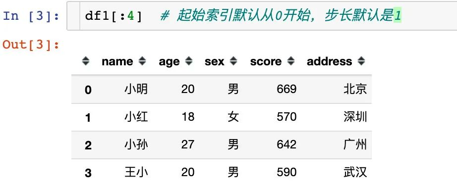<br />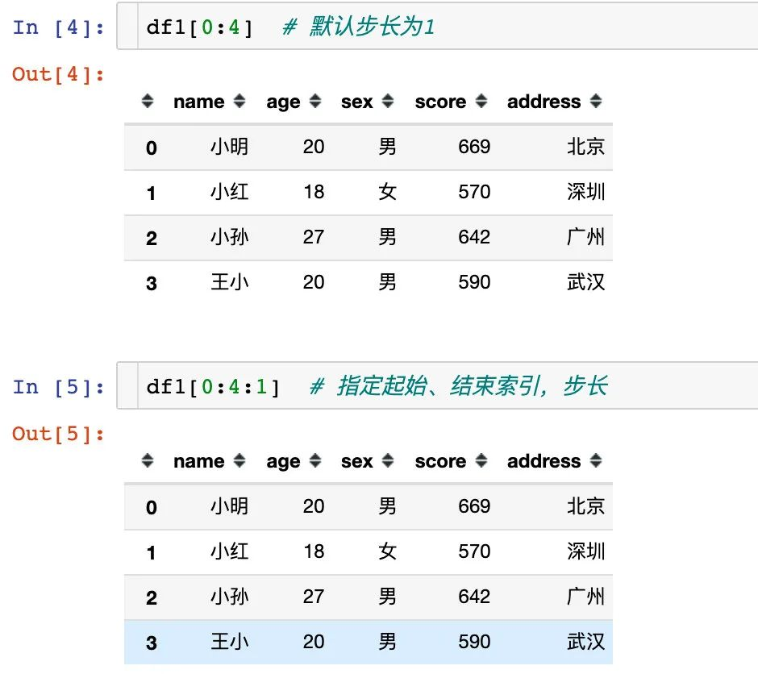
<a name="ZKwc3"></a>
#### 2、指定起始索引，不指定结束索引，表示一直取到数据末尾
```python
df1[4:]  # 从索引4开始取到末尾

# 结果
  name  age sex  score address
4 关宇  28  男  601   深圳
5 刘蓓  18  女  619   广州
6 张菲  25  女  701   长沙
```
<a name="FrUcD"></a>
#### 3、改变步长的值
```python
df1[0:4:2]  # 改变步长：每隔2个值取一行数据

# 结果
  name  age sex  score address
0 小明  20  男   669   北京
2 小孙  27  男   642   广州
```

上面的例子不指定起始索引：
```python
df1[:4:2]  # 默认从0开始
```
<a name="cUqqg"></a>
#### 4、只指定步长
```python
df1[::2]   # 从头到尾，步长为2

# 结果
  name  age sex  score address
0 小明  20  男   669   北京
2 小孙  27  男  642   广州
4 关宇  28  男  601   深圳
6 张菲  25  女  701   长沙
```
<a name="Cem4U"></a>
### 步长为负数
<a name="q1Shj"></a>
#### 1、步长为-1，默认是倒序输出结果
```python
df1[::-1]  # 倒序输出

# 结果
   name  age sex  score address
6  张菲   25 女    701  长沙
5  刘蓓   18 女    619  广州
4  关宇   28 男    601  深圳
3  王小   20 男    590  武汉
2  小孙   27 男    642  广州
1  小红   18 女    570  深圳
0  小明   20 男    669  北京
```
<a name="O6y4A"></a>
#### 2、步长为负，指定起始和终止索引，起始索引大于终止索引
```python
df1[4:0:-1]
  name  age sex  score address
4 关宇  28  男   601   深圳
3 王小  20  男   590   武汉
2 小孙  27  男   642   广州
1 小红  18  女   570   深圳
```
<a name="y1qih"></a>
#### 3、起始和终止索引为负数
```python
df1[-1:-5:-1]  # 最后一行记录索引为-1，不包含索引为-5的数据
 name  age sex  score address
6 张菲 25 女    701  长沙
5 刘蓓 18 女    619  广州
4 关宇 28 男    601  深圳
3 王小 20 男    590  武汉
```
<a name="htUlt"></a>
## 6、常用函数
<a name="q13bb"></a>
### 统计元素个数
很多时候需要统计某个列中每个元素出现的个数，相当于是做词频统计，使用：`value_counts()`方法，具体案例为：<br />⚠️：新数据中df1增加了一列：班级class，后续有作用<br />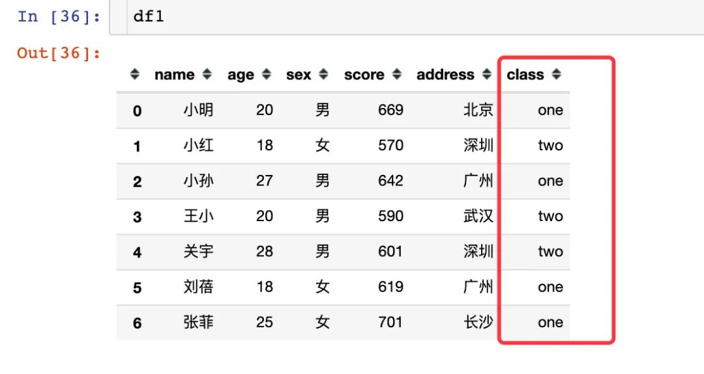<br />比如想统计每个城市出现了多少次：
```python
# 统计中每个城市各出现了多少次

address = df1["address"].value_counts()
address
```
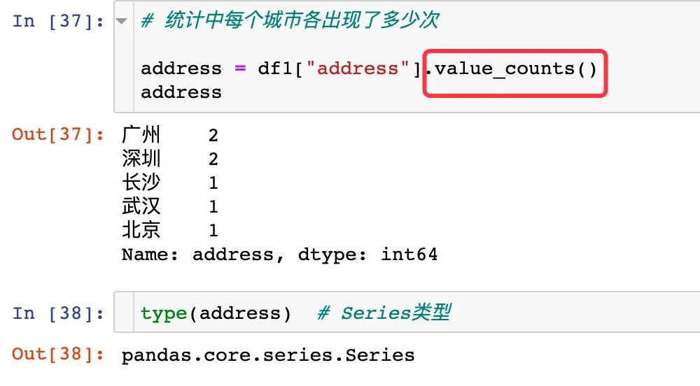<br />结果自动是降序排列的Series类型数据
<a name="Ltt8M"></a>
### 索引重置
索引重置使用`reset_index()`：
```python
address_new = address.reset_index()
address_new
```
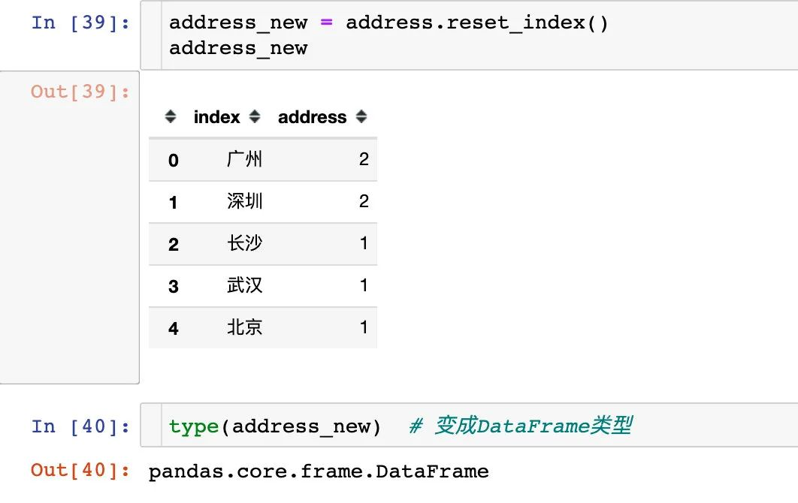<br />还比如想从数据中单独取出`sex="男"`的数据：
```python
fale = df1[df1["sex"] == "男"]
fale
```
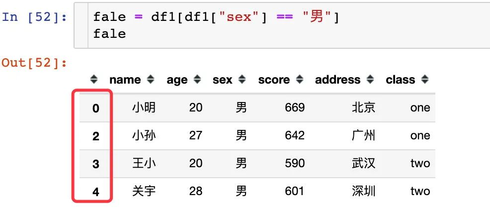<br />观察到数据前面的索引还是原来的，但是希望的是从0开始显示，比较符合习惯：
```python
fale_1 = fale.reset_index()
fale_1
```
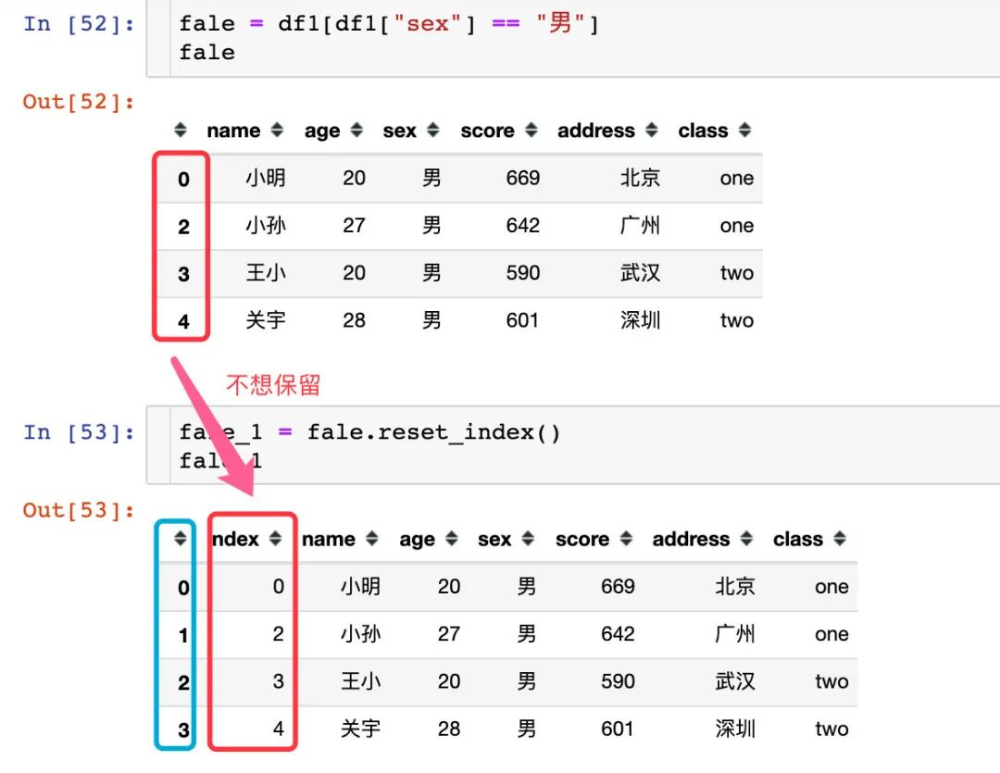<br />出现的结果中索引是想要的结果，但是出现了一列新的数据，就是原来的索引构成的数据，这不是想要的数据，需要去除：
```python
fale_1 = fale.reset_index(drop=True)  # 加上参数即可解决
fale_1
```
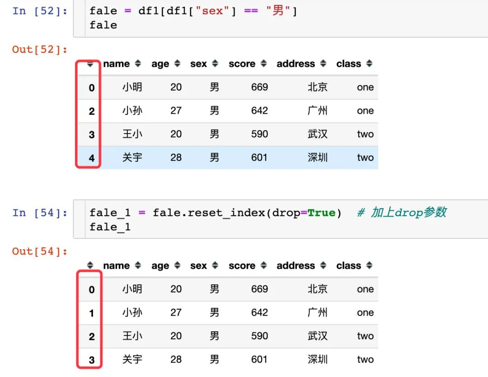
<a name="FmUYQ"></a>
### 属性重命名
使用的是`rename`函数，传入`columsn`参数：
```python
address_new = address_new.rename(columns={"index":"address",
                                          "address":"number"
                                         })
address_new
```
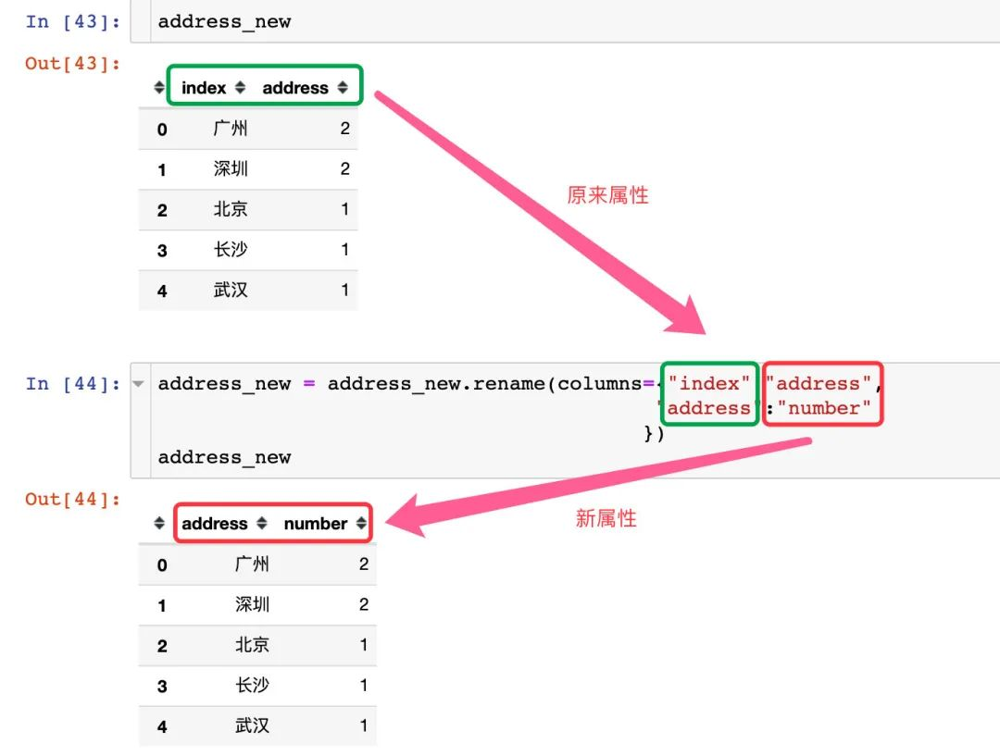
<a name="V1ESI"></a>
### `groupby`使用
`groupby`主要是实现分组统计的功能：
<a name="zOMb9"></a>
#### 1、比如想统计男女各自的总分
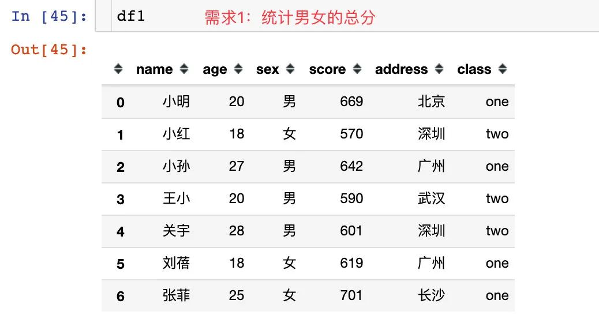
```python
# 统计男女的总成绩：sum

sex_score = df1.groupby("sex")["score"].sum()
sex_score
```
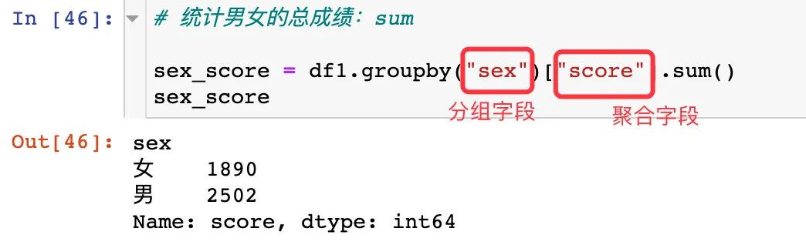
<a name="iYRt3"></a>
#### 2、求男女各自的平均分mean
```python
# 统计男女的平均成绩：mean

sex_score = df1.groupby("sex")["score"].mean()
sex_score
```
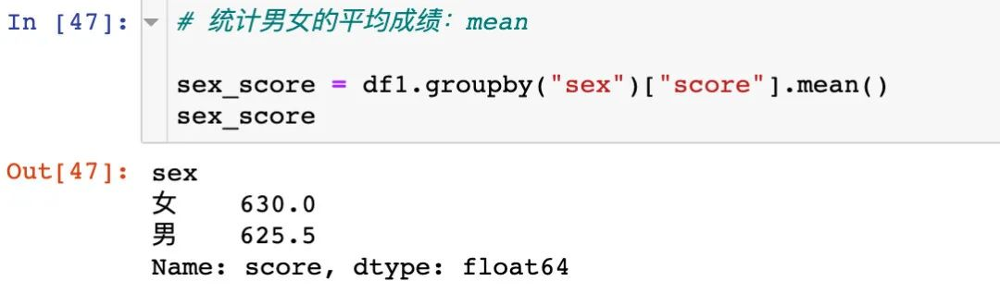
<a name="e57te"></a>
#### 3、根据男女性别sex、班级class求总分
```python
# 先根据性别、班级求总分

sex_class = df1.groupby(["sex","class"])["score"].sum()
sex_class
```
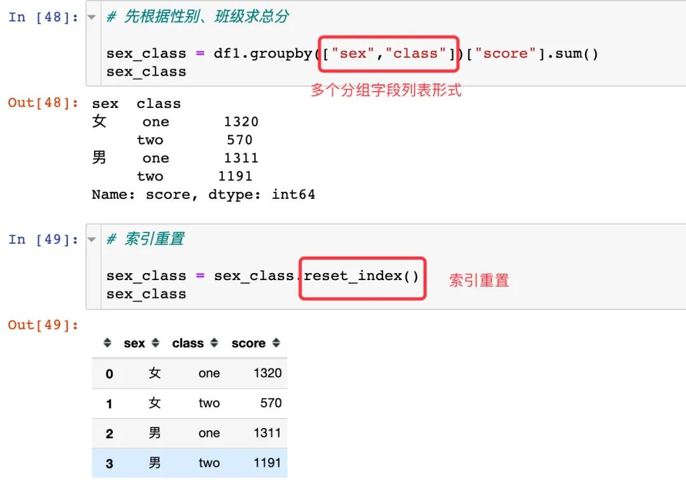<br />一行代码实现上面的功能：
```python
# 一行代码实现

df1.groupby(["sex","class"])["score"].sum().reset_index()
```
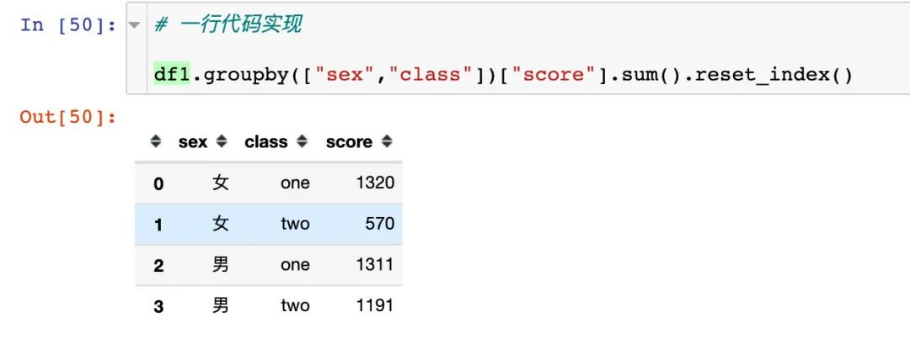
<a name="iOGDp"></a>
### `apply`函数
还是上面的df1数据集：<br />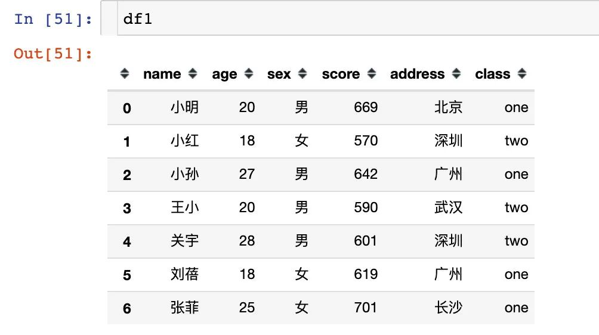
<a name="fw5fr"></a>
#### 1、需求1：想将性别中的男变成1，女变成0
```python
# 1、改变：男-1，女-0

df2 = df1.copy()  # 生成一个副本

df2["sex"] = df2["sex"].apply(lambda x: 1 if x=="男" else 0)  # 通过匿名函数解决
df2
```
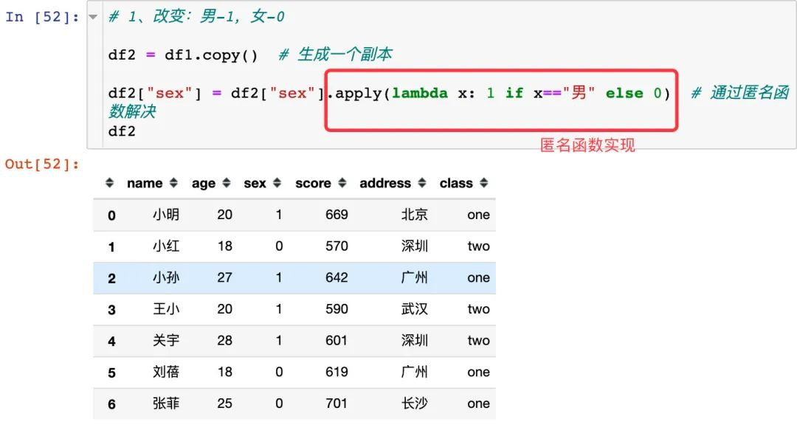<br />还可以自定义一个函数来实现：
```python
#  自定义函数

def apply_sex(x):
    return 1 if x == "男" else 0

df3 = df1.copy()  # 生成一个副本df3

df3["sex"] = df3["sex"].apply(apply_sex)  # 通过自定义函数解决
df3
```
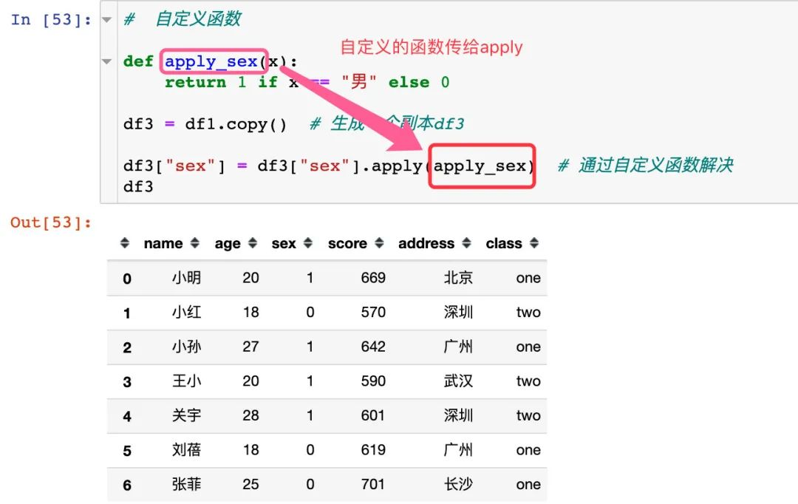
<a name="FA8DP"></a>
#### 2、还比如给每个城市的后面加上一个“市”，变成北京市、深圳市等：
```python
# 2、给每个城市加上一个字：市，变成北京市、深圳市等

df4 = df1.copy()

df4["address"] = df4["address"].apply(lambda x: x + "市")
df4
```
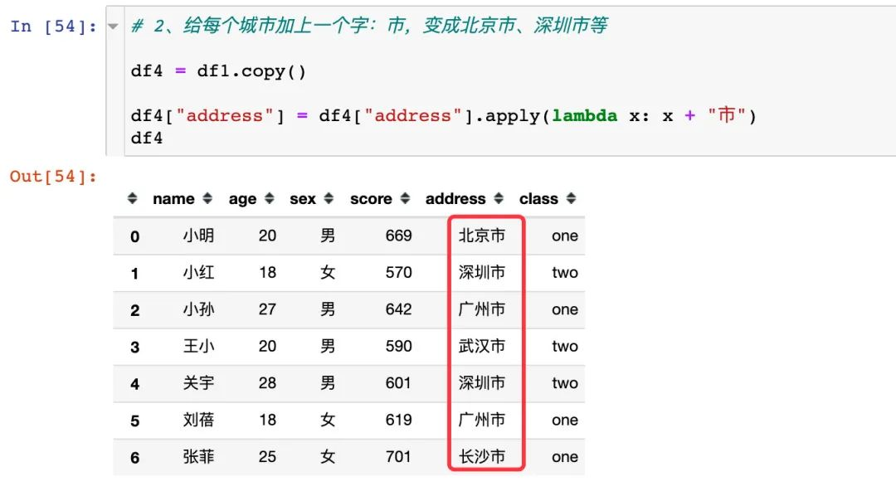
<a name="k4MYb"></a>
## 总结
从pandas中DataFrame数据的创建，常见数据信息的探索，再到如何从数据框中获取到指定的数据。
