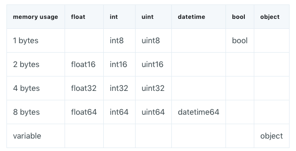

PythonPandas<br />可以使用 `DataFrame.info()` 方法提供关于 dataframe 的高层面信息，包括它的大小、数据类型的信息和内存使用情况。<br />默认情况下，pandas 会近似 dataframe 的内存用量以节省时间。可以将 `memory_usage` 参数设置为 `'deep'`，以便得到准确的数字。
```python
df.info(memory_usage='deep')
```
pandas 中的许多类型都有多个子类型，这些子类型可以使用更少的字节来表示每个值。比如说 float 类型就包含 float16、float32 和 float64 子类型。类型名称中的数字就代表该类型表示值的位（bit）数。下面的表格给出了 pandas 中最常用类型的子类型：<br /><br />一个 int8 类型的值使用 1 个字节的存储空间，可以表示 256（2^8）个二进制数。这意味着可以使用这个子类型来表示从 -128 到 127（包括 0）的所有整数值。 <br />可以使用 `numpy.iinfo`/`numpy.finfo` 类来验证每个整型/浮点数子类型的最大值和最小值，具体如下：
```python
# ----------------------------------------------------------------
# 减少内存
# 减少df.size

from pandas.api.types import is_datetime64_any_dtype as is_datetime
from pandas.api.types import is_categorical_dtype

def reduce_mem_usage(df, use_float16=False):
    start_mem = df.memory_usage().sum() / 1024 ** 2
    print('Memory usage of dataframe is {:.2f} MB'.format(start_mem))

    for col in df.columns:
        if is_datetime(df[col]) or is_categorical_dtype(df[col]):
            continue
        col_type = df[col].dtype
        if col_type != object:
            c_min = df[col].min()
            c_max = df[col].max()
            if str(col_type)[:3] == 'int':
                if c_min > np.iinfo(np.int8).min and c_max < np.iinfo(np.int8).max:
                    df[col] = df[col].astype(np.int8)
                elif c_min > np.iinfo(np.int16).min and c_max < np.iinfo(np.int16).max:
                    df[col] = df[col].astype(np.int32)
                elif c_min > np.iinfo(np.int32).min and c_max < np.iinfo(np.int32).max:
                    df[col] = df[col].astype(np.int32)
                elif c_min > np.iinfo(np.int64).min and c_max < np.iinfo(np.int64).max:
                    df[col] = df[col].astype(np.int64)
            else:
                if use_float16 and c_min > np.finfo(np.float16).min and c_max < np.finfo(np.float16).max:
                    df[col] = df[col].astype(np.float16)
                elif c_min > np.finfo(np.float32).min and c_max < np.finfo(np.float32).max:
                    df[col] = df[col].astype(np.float32)
                else:
                    df[col] = df[col].astype(np.float64)
        else:
            df[col] = df[col].astype('category')

    end_mem = df.memory_usage().sum() / 1024 ** 2
    print("Memory usage after optimization is: {:.2f} MB".format(end_mem))
    print("Decreased by {:.1f}%".format(100 * (start_mem - end_mem) / start_mem))
    return df
```
参考：<br />[https://www.jiqizhixin.com/articles/2018-03-07-3](https://www.jiqizhixin.com/articles/2018-03-07-3)<br />[https://www.dataquest.io/blog/pandas-big-data/](https://www.dataquest.io/blog/pandas-big-data/)
