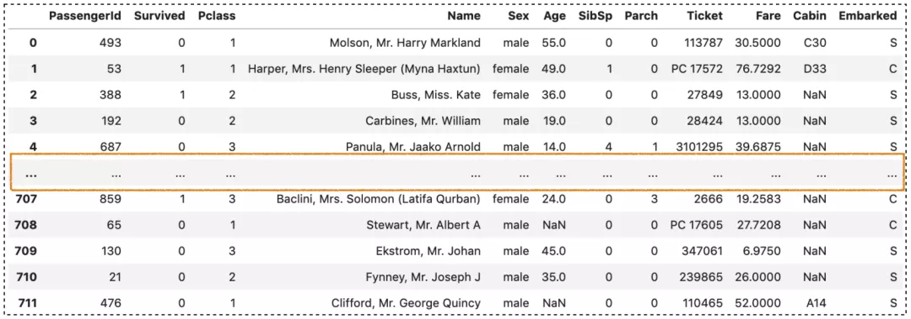
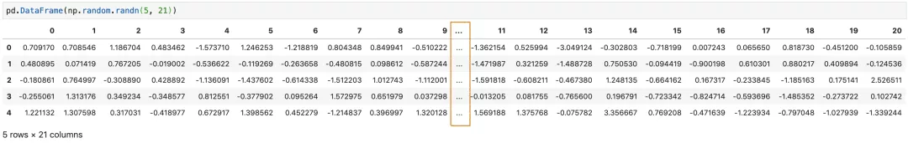
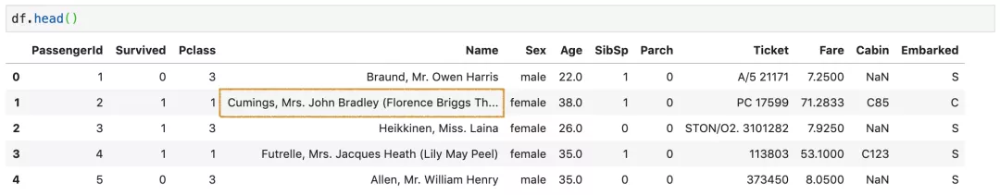
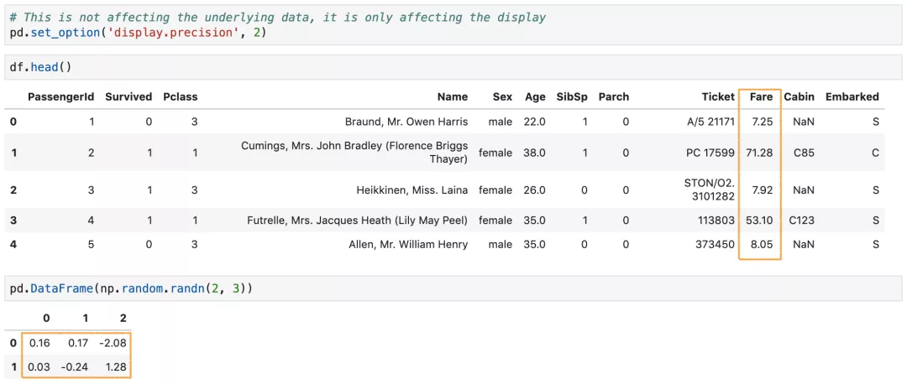
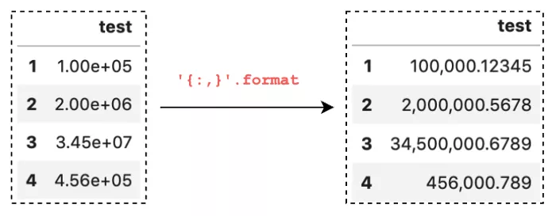
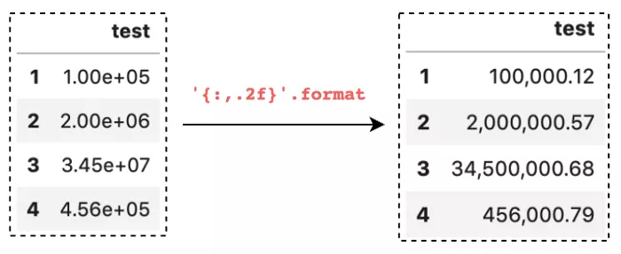
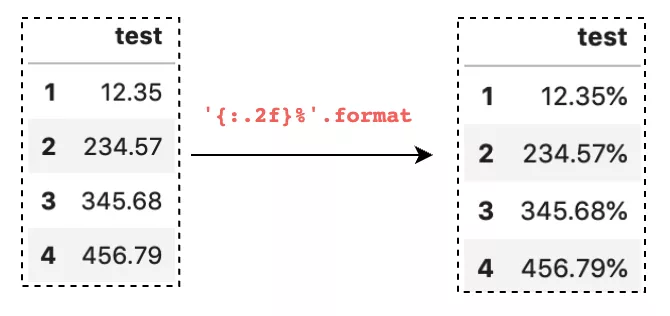
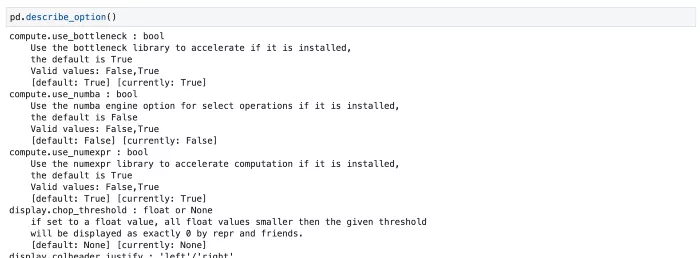
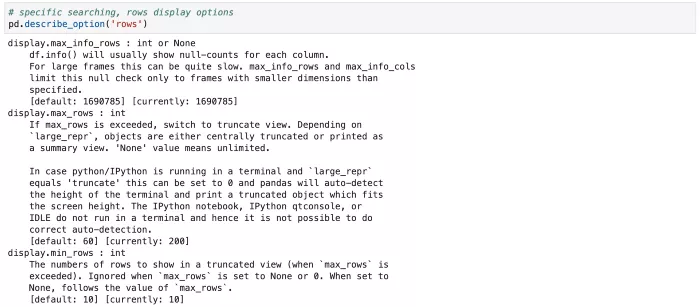

Python Pandas<br />通过`pandas`的使用，经常要交互式地展示表格（`dataframe`）、分析表格。而表格的格式就显得尤为重要了，因为大部分时候如果直接展示表格，格式并不是很友好。<br />其实呢，这些痛点都可以通过`pandas`的`option`来解决。短短几行代码，只要提前配置好，一次设置好，全局生效，perfect！
```python
# 使用方法
import pandas as pd
pd.set_option()
pd.get_option()

# 使用属性，例如展示的最大行数
pd.option.display.max_rows
```
整理8个常用的配置选项供参考。记住这8个option代码。

- 显示更多行
- 显示更多列
- 改变列宽
- 设置float列的精度
- 数字格式化显示
- 更改绘图方法
- 配置`info()`的输出
- 打印出当前设置并重置所有选项
<a name="i8sIM"></a>
## 1、显示更多行
默认情况下，`pandas` 是不超出屏幕的显示范围的，如果表的行数很多，它会截断中间的行只显示一部分。可以通过设置`display.max_rows`来控制显示的最大行数，比如想设置显示200行。
```python
pd.set_option('display.max_rows', 200)
# pd.options.display.max_rows = 200
```
如果行数超过了`display.max_rows`，那么`display.min_rows`将确定显示的部分有多少行。因为`display.min_rows`的默认行数为5，,下面例子只显示前5行和最后5行，中间的所有行省略。<br /><br />同理，也可根据自己的习惯显示可显示的行数，比如10, 20..
```python
pd.set_option('display.min_rows', 10)
# pd.options.display.min_rows = 10
```
还可以直接重置。
```python
# 重置
pd.reset_option('display.max_rows')
```
<a name="bx3bG"></a>
## 2、显示更多列
行可以设置，同样的列也可以设置，`display.max_columns`控制着可显示的列数，默认值为20。
```python
pd.get_option('display.max_columns') 
# pd.options.display.max_columns
20
```

<a name="kua4O"></a>
## 3、改变列宽
`pandas`对列中显示的字符数有一些限制，默认值为50字符。所以，有的值字符过长就会显示省略号。如果想全部显示，可以设置`display.max_colwidth`，比如设置成500。
```python
pd.set_option ('display.max_colwidth',500)
# pd.options.display.max_colwidth = 500
```

<a name="Ffw8m"></a>
## 4、设置`float`列的精度
对于`float`浮点型数据，`pandas`默认情况下只显示小数点后6位。可以通过预先设置`display.precision`让其只显示2位，避免后面重复操作。
```python
pd.set_option( 'display.precision',2)
# pd.options.display.precision = 2
```
<br />这个设置不影响底层数据，它只影响浮动列的显示。
<a name="sNOWB"></a>
## 5、数字格式化显示
`pandas`中有一个选项`display.float_formatoption`可以用来格式化任何浮点列。这个仅适用于浮点列，对于其他数据类型，必须将它们转换为浮点数才可以。
<a name="Gc9kY"></a>
### 用逗号格式化大值数字
例如 1200000 这样的大数字看起来很不方便，所以用逗号进行分隔。
```python
pd.set_option('display.float_format','{:,}'.format)
```

<a name="qPROb"></a>
### 设置数字精度
和上面`display.precision`有点类似，假如只关心小数点后的2位数字，可以这样设置格式化：
```python
pd.set_option('display.float_format',  '{:,.2f}'.format)
```

<a name="PrrvT"></a>
### 百分号格式化
如果要显示一个百分比的列，可以这样设置。
```python
pd.set_option('display.float_format', '{:.2f}%'.format)
```
<br />或者其它币种的符号等均可，只需要在大括号`{}`前后添加即可。
<a name="Jazta"></a>
## 6、更改绘图方法
默认情况下，`pandas`使用`matplotlib`作为绘图后端。从 0.25 版本开始，`pandas`提供了使用不同后端选择，比如`plotly`，`bokeh`等第三方库，但前提是需要先安装起来。<br />设置很简单，只要安装好三方库后，同样只需要一行。
```python
import pandas as pd
import numpy as np
pd.set_option('plotting.backend', 'altair')
data = pd.Series(np.random.randn(100).cumsum())
data.plot()
```
<a name="Tgkvo"></a>
## 7、配置`info()`的输出
`pandas`中经常要使用`info()`来快速查看`DataFrame`的数据情况。但是，`info`这个方法对要分析的最大列数是有默认限制的，并且如果数据集中有null，那么在大数据集计数统计时会非常慢。<br />`pandas`提供了两种选择：

- `display.max_info_columns`: 设置要分析的最大列数，默认为100。
- `display.max_info_rows`: 设置计数null时的阈值，默认为1690785。

比如，在分析有 150 个特征的数据集时，可以设置`display.max_info_columns`为涵盖所有列的值，比如将其设置为 200：
```python
pd.set_option('display.max_info_columns', 200)
```
在分析大型数据集时，`df.info()`由于要计算所有null，导致速度很慢。因此可以简单地设置
```python
display.max_info_rows为一个小的值来避免计数，例如只在行数不超过5时才计数null：
pd.set_option('display.max_info_rows', 5)
```
<a name="fOmAH"></a>
## 8、打印出当前设置并重置所有选项
```python
pd.describe_option()将打印出设置的描述及其当前值。
pd.describe_option()
```
<br />还可以打印特定的选项，例如，行显示。
```python
# 具体的搜索
pd.describe_option('rows')
```
<br />最后，还可以直接全部重置。
```python
pd.reset_option('all')
```
以上就是8个常用`set_option`的使用，下面进行了汇总，方便大家粘贴使用。
```python
pd.set_option('display.max_rows',xxx) # 最大行数
pd.set_option('display.min_rows',xxx) # 最小显示行数
pd.set_option('display.max_columns',xxx) # 最大显示列数
pd.set_option ('display.max_colwidth',xxx) #最大列字符数
pd.set_option( 'display.precision',2) # 浮点型精度
pd.set_option('display.float_format','{:,}'.format) #逗号分隔数字
pd.set_option('display.float_format',  '{:,.2f}'.format) #设置浮点精度
pd.set_option('display.float_format', '{:.2f}%'.format) #百分号格式化
pd.set_option('plotting.backend', 'altair') # 更改后端绘图方式
pd.set_option('display.max_info_columns', 200) # info输出最大列数
pd.set_option('display.max_info_rows', 5) # info计数null时的阈值
pd.describe_option() #展示所有设置和描述
pd.reset_option('all') #重置所有设置选项
```
