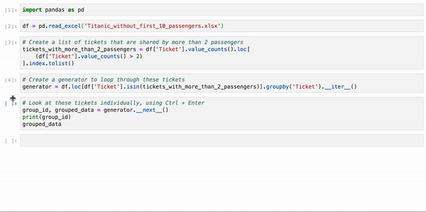
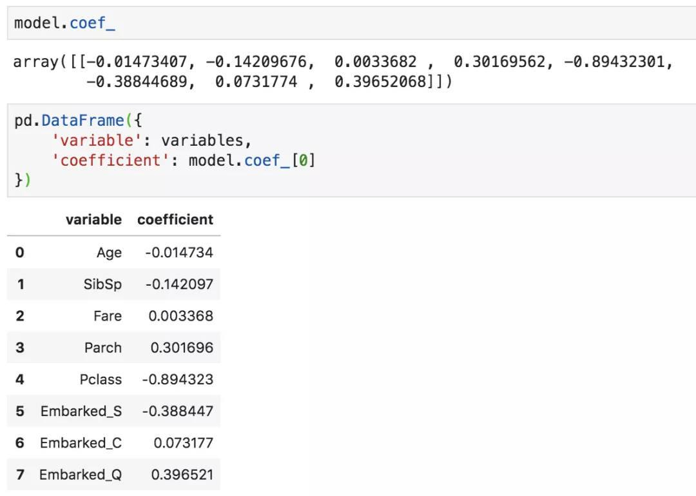
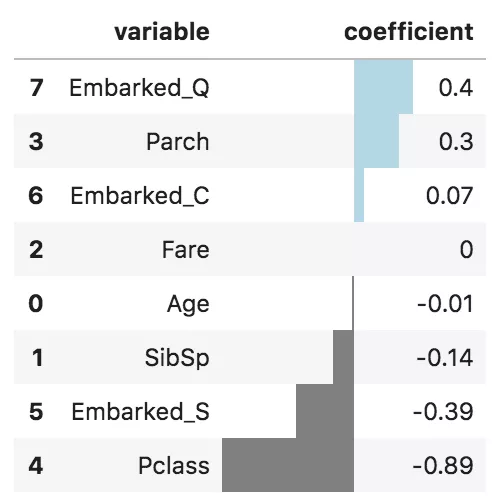
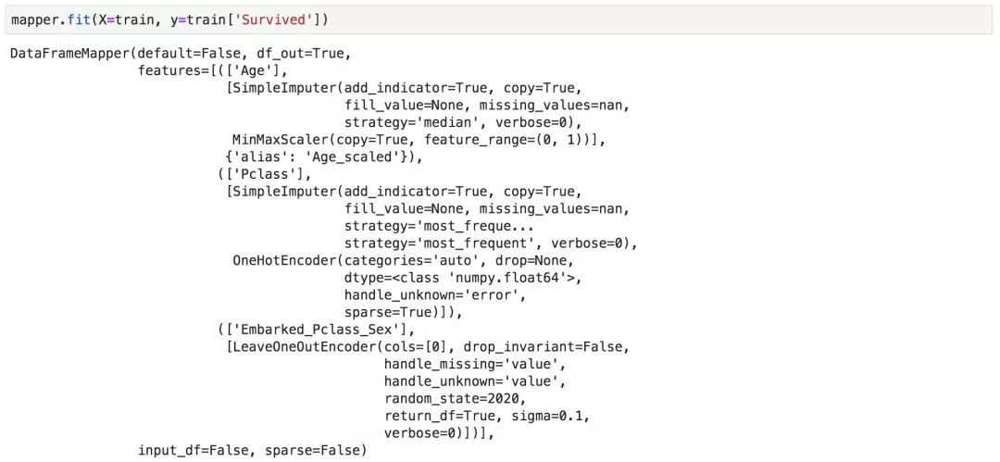

Python Pandas
<a name="a3d6e4ff366d9ff0695cf3a189bcc5bd"></a>
### 1、`df.groupby().__iter__()`分析数据样本
在Jupyter Notebook中通常很难像使用Excel一样难逐行或逐个组地浏览数据集。一个非常有用的技巧是使用 generator 生成器和Ctrl + Enter组合，而不是常规的Shift + Enter运行整个单元格。这样做就可以很方便地迭代查看同一单元格中的不同样本了。<br />首先在单元格中使用`.groupby()`（或`.iterrows()`）和`.__iter __()`创建一个生成器：
```python
generator = df.groupby(['identifier']).__iter__()
```
然后，根据自己需要运行的次数，使用键盘快捷键Ctrl + Enter逐个查看数据。
```python
group_id, grouped_data = generator.__next__()
print(group_id) 
grouped_data
```
下面是taitanic数据集的示例。正常分析的时候，所有乘客都混在一起，是不能单独地隔离每组乘客的，使用这种方法就可以非常简单地分析一组乘客。<br />
<a name="90cc3ecb0ad0459b9219944673614553"></a>
### 2、特征重要性/参数的可视化
如果做机器学习，那么模型的参数或者特征的重要性是必不可少的一环。通常会像下面这样查看参数，但小数点太多了，真的容易花眼，这样非常不便于分析和比较。<br /><br />所以，对上面代码稍加改造，用链式操作首先round保留小数点后两位数字，然后`sort_values`进行从大到小的排序，最后用`style.bar`进行可视化，颜色可随意设置，这样不但可以区分大小，也可区分正负。
```python
pd.DataFrame({
    'variable': variables,
    'coefficient': model.coef_[0]
}) \
    .round(decimals=2) \
    .sort_values('coefficient', ascending=False) \
    .style.bar(color=['grey', 'lightblue'], align='zero')
```
上面这段代码是可以复用的，之后每次展示参数或者特征重要性的时候，直接替换字段名就ok了。下面是可视化效果。<br />
<a name="53a67be58e1793f3ee89cb61c3dcbb13"></a>
### 3、sklearn_pandas
时间长了会发现sklearn和pandas搭配有时候代码并不是十分整洁，中间的操作环节比较多。推荐一个连接sklearn和pandas的库包，它叫sklearn_pandas。它将sklearn的ColumnTransformer替换为pandas的DataFrameMapper。用起来无缝连接，和直接使用sklearn的ColumnTransformer毫无区别。
```python
imputer_Pclass = SimpleImputer(strategy='most_frequent', add_indicator=True)
imputer_Age = SimpleImputer(strategy='median', add_indicator=True)
imputer_SibSp = SimpleImputer(strategy='constant', fill_value=0, add_indicator=True)
imputer_Parch = SimpleImputer(strategy='constant', fill_value=0, add_indicator=True)
imputer_Fare = SimpleImputer(strategy='median', add_indicator=True)
imputer_Embarked = SimpleImputer(strategy='most_frequent')
scaler_Age = MinMaxScaler()
scaler_Fare = StandardScaler()
onehotencoder_Sex = OneHotEncoder(drop=['male'], handle_unknown='error')
onehotencoder_Embarked = OneHotEncoder(handle_unknown='error')
leaveoneout_encoder = LeaveOneOutEncoder(sigma=.1, random_state=2020)
mapper = DataFrameMapper([
    (['Age'], [imputer_Age, scaler_Age], {'alias':'Age_scaled'}),
    (['Pclass'], [imputer_Pclass]),
    (['SibSp'], [imputer_SibSp]),
    (['Parch'], [imputer_Parch]),
    (['Fare'], [imputer_Fare, scaler_Fare], {'alias': 'Fare_scaled'}),
    (['Sex'], [onehotencoder_Sex], {'alias': 'is_female'}),
    (['Embarked'], [imputer_Embarked, onehotencoder_Embarked]), 
    (['Embarked_Pclass_Sex'], [leaveoneout_encoder])
], df_out=True) 
mapper.fit(X=train, y=train['Survived'])
```
下面是fit之后的结果。<br />
<a name="a32bd02e5636d92feb31179b82d3ea0d"></a>
### 4、`.to_clipboard()`
经过数据处理和建模后，通常最后会以csv或者excel格式将数据输出，但有的时候需要汇总数据，这就需要打开生成的excel文件，然后再复制粘贴。<br />但其实也有更灵活的方法，不通过使用`.to_excel`方法，也能导出来。pandas还有一个功能是`.to_clipboard(index = False)`，它可以将数据复制到剪贴板。<br />然后，就可以在正在操作的Excel中直接Ctrl + V将数据粘贴到当前电子表格中，也是另外一种选择。
<a name="bc0fc1e769e51112036943655914be88"></a>
### 5、tqdm
处理大数据集时，数据处理会花费很多时间。当然也有很多加速运行pandas的方法。<br />但即使加速了还是要等，Jupyter Notebook运行时有个缺点，就是不知道运行的状态，需要多久。像在电脑上复制粘贴的时候通常会显示需要多久和当前的速度，这样提前安排做其它事情还是继续等待。<br />Python中有个库是tqdm，它可以用来跟踪代码是否真正在运行以及需要花费多长时间，使用方法很简单。
```python
from tqdm import notebook
notebook.tqdm().pandas()
```
`import`之后，pandas的`dataframe`就有了新的方法。

- .`progress_apply`, `.progress_applymap`
- `.progress_map`

这些方法与`apply`、`applymap`和`map`的使用相同，不同之处是它们将显示进度条。<br />
