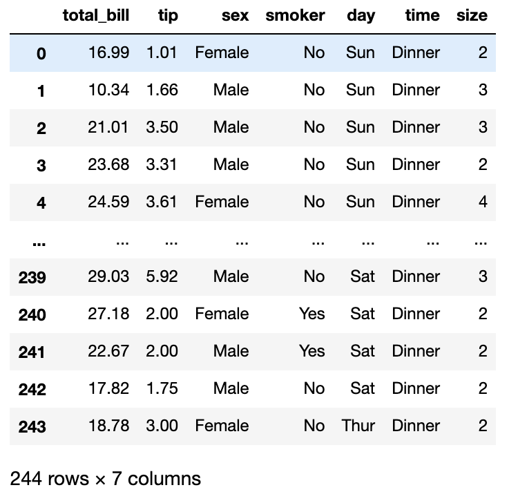

Python Pandas SQL<br />Pandas 和 SQL 有很多相似之处，都是对二维表的数据进行查询、处理，都是数据分析中常用的工具。
<a name="qmtlk"></a>
## 1、数据查询
首先，读取数据
```python
import pandas as pd
import numpy as np

tips = pd.read_csv('tips.csv')
```

<a name="Lzdus"></a>
### 1.1 查询列
查询 total_bill和tip 两列
```python
tips[["total_bill", "tip"]]
```
用 SQL 实现：
```plsql
select total_bill, tip
from tips;
```
<a name="nDFej"></a>
### 1.2 增加列
查询结果中，新增一列tip_rate
```python
tips['tip_rate'] = tips["tip"] / tips["total_bill"]
```
用 SQL 实现：
```plsql
select *, tip/total_bill as tip_rate
from tips;
```
<a name="Jtr2m"></a>
### 1.3 筛选条件
查询 time列等于Dinner并且tip列大于5的数据
```python
tips[(tips["time"] == "Dinner") & (tips["tip"] > 5.00)]
```
用 SQL 实现：
```plsql
select *
from tips
where time = 'Dinner' and tip > 5.00;
```
<a name="mTr4G"></a>
## 2、分组聚合
按照某列分组计数
```python
tips.groupby("sex").size()

'''
sex
Female     87
Male      157
dtype: int64
'''
```
用 SQL 实现：
```plsql
select sex, count(*)
from tips
group by sex;
```
按照多列聚合多个值
```python
tips.groupby(["smoker", "day"]).agg({"tip": [np.size, np.mean]})
```
用 SQL 实现：
```plsql
select smoker, day, count(*), avg(tip)
from tips
group by smoker, day;
```
<a name="OlTVK"></a>
## 3、join
构造两个临时DataFrame
```python
df1 = pd.DataFrame({"key": ["A", "B", "C", "D"], "value": np.random.randn(4)})
df2 = pd.DataFrame({"key": ["B", "D", "D", "E"], "value": np.random.randn(4)})
```
先用 Pandas 分别实现`inner join`、`left join`、`right join`和`full join`。
```python
# inner join
pd.merge(df1, df2, on="key")

# left join
pd.merge(df1, df2, on="key", how="left")

# inner join
pd.merge(df1, df2, on="key", how="right")

# inner join
pd.merge(df1, df2, on="key", how="outer")
```
用 SQL 分别实现：
```plsql
# inner join
select *
from df1 inner join df2
on df1.key = df2.key;

# left join
select *
from df1 left join df2
on df1.key = df2.key;

# right join
select *
from df1 right join df2
on df1.key = df2.key;

# full join
select *
from df1 full join df2
on df1.key = df2.key;
```
<a name="lsMG9"></a>
## 4、union
将两个表纵向堆叠
```python
pd.concat([df1, df2])
```
用 SQL 实现：
```plsql
select *
from df1

union all

SELECT *
from df2;
```
将两个表纵向堆叠并去重
```python
pd.concat([df1, df2]).drop_duplicates()
```
用 SQL 实现：
```plsql
select *
from df1

union

SELECT *
from df2;
```
<a name="ByyTT"></a>
## 5、开窗
对tips中day列取值相同的记录按照total_bill排序。
```python
(tips.assign(
        rn=tips.sort_values(["total_bill"], ascending=False)
        .groupby(["day"])
        .cumcount()
        + 1
    )
    .sort_values(["day", "rn"])
)
```
用 SQL 实现：
```plsql
select
    *,
    row_number() over(partition by day order by total_bill desc) as rn
from tips t
```
day列取值相同的记录会被划分到同一个窗口内，并按照total_bill排序，窗口之间的数据互不影响，这类操作便被称为**开窗**。
