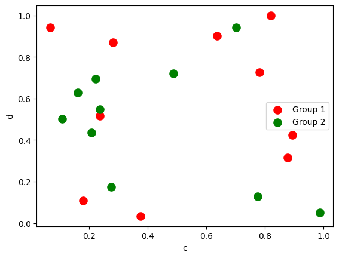

Python Pandas 可视化<br />pandas可视化主要依赖下面两个函数：

- `pandas.DataFrame.plot`

[https://pandas.pydata.org/pandas-docs/stable/reference/api/pandas.DataFrame.plot.html?highlight=plot#pandas.DataFrame.plot](https://pandas.pydata.org/pandas-docs/stable/reference/api/pandas.DataFrame.plot.html?highlight=plot#pandas.DataFrame.plot)

- `pandas.Series.plot`

[https://pandas.pydata.org/pandas-docs/stable/reference/api/pandas.Series.plot.html?highlight=plot#pandas.Series.plot](https://pandas.pydata.org/pandas-docs/stable/reference/api/pandas.Series.plot.html?highlight=plot#pandas.Series.plot)<br />导入依赖包
```python
import matplotlib.pyplot as plt 
import numpy as np
import pandas as pd
from pandas import DataFrame,Series
plt.style.use('dark_background')#设置绘图风格
```
<a name="WgUlS"></a>
## 1、单组折线图
```python
np.random.seed(0)#使得每次生成的随机数相同
ts = pd.Series(np.random.randn(1000), index=pd.date_range("1/1/2000", periods=1000))
ts1 = ts.cumsum()#累加
ts1.plot(kind="line")#默认绘制折线图
```

<a name="zku66"></a>
## 2、多组折线图
```python
np.random.seed(0)
df = pd.DataFrame(np.random.randn(1000, 4), index=ts.index, columns=list("ABCD"))
df = df.cumsum()
df.plot()#默认绘制折线图
```

<a name="TC3hI"></a>
## 3、单组条形图
```python
df.iloc[5].plot(kind="bar")
```

<a name="WRMWX"></a>
## 4、多组条形图
```python
df2 = pd.DataFrame(np.random.rand(10, 4), columns=["a", "b", "c", "d"])
df2.plot.bar()
```

<a name="bQHBC"></a>
## 5、堆积条形图
```python
df2.plot.bar(stacked=True)
```

<a name="EwmKE"></a>
## 6、水平堆积条形图
```python
df2.plot.barh(stacked=True)
```

<a name="EfiyG"></a>
## 7、直方图
```python
df4 = pd.DataFrame(
    {
        "a": np.random.randn(1000) + 1,
        "b": np.random.randn(1000),
        "c": np.random.randn(1000) - 1,
    },
    columns=["a", "b", "c"],
)
df4.plot.hist(alpha=0.8)
```

<a name="DKX5q"></a>
## 8、分面直方图
```python
df.diff().hist(color="r", alpha=0.9, bins=50)
```

<a name="Xwfub"></a>
## 9、箱图
```python
df = pd.DataFrame(np.random.rand(10, 5), columns=["A", "B", "C", "D", "E"])
df.plot.box()
```

<a name="Ol4ys"></a>
## 10、面积图
```python
df = pd.DataFrame(np.random.rand(10, 4), columns=["a", "b", "c", "d"])
df.plot.area()
```

<a name="qJgdr"></a>
## 11、堆积面积图
```python
df.plot.area(stacked=False)
```

<a name="MZNB1"></a>
## 12、散点图
```python
ax = df.plot.scatter(x="a", y="b", color="r", label="Group 1",s=90)
df.plot.scatter(x="c", y="d", color="g", label="Group 2", ax=ax,s=90)
```

<a name="BOcuB"></a>
## 13、单组饼图
```python
series = pd.Series(3 * np.random.rand(4), index=["a", "b", "c", "d"], name="series")
series.plot.pie(figsize=(6, 6))
```

<a name="tVg8F"></a>
## 14、多组饼图
```python
df = pd.DataFrame(
    3 * np.random.rand(4, 2), index=["a", "b", "c", "d"], columns=["x", "y"]
)
df.plot.pie(subplots=True, figsize=(8, 4))
```

<a name="mQShE"></a>
## 15、分面图
```python
import matplotlib as mpl
mpl.rc_file_defaults()
plt.style.use('fivethirtyeight')
from pandas.plotting import scatter_matrix
df = pd.DataFrame(np.random.randn(1000, 4), columns=["a", "b", "c", "d"])
scatter_matrix(df, alpha=0.2, figsize=(6, 6), diagonal="kde")
plt.show()
```

<a name="k8uCL"></a>
## 16、hexbin图
```python
df = pd.DataFrame(np.random.randn(1000, 2), columns=["a", "b"])
df["b"] = df["b"] + np.arange(1000)
df.plot.hexbin(x="a", y="b", gridsize=25)
```

<a name="XqoMe"></a>
## 17、`andrews_curves`图
```python
from pandas.plotting import andrews_curves
mpl.rc_file_defaults()
data = pd.read_csv("iris.data.txt")
plt.style.use('dark_background')
andrews_curves(data, "Species")
```

<a name="pecs2"></a>
## 18、核密度图
```python
ser = pd.Series(np.random.randn(1000))
ser.plot.kde()
```

<a name="iNooa"></a>
## 19、parallel_coordinates图
```python
from pandas.plotting import parallel_coordinates
data = pd.read_csv("iris.data.txt")
plt.figure()
parallel_coordinates(data, "Species")
```

<a name="ilzId"></a>
## 20、autocorrelation_plot图
```python
from pandas.plotting import autocorrelation_plot
plt.figure();
spacing = np.linspace(-9 * np.pi, 9 * np.pi, num=1000)
data = pd.Series(0.7 * np.random.rand(1000) + 0.3 * np.sin(spacing))
autocorrelation_plot(data)
```

<a name="TOilR"></a>
## 21、radviz图
```python
from pandas.plotting import radviz
data = pd.read_csv("iris.data.txt")
plt.figure()
radviz(data, "Species")
```

<a name="h1Ury"></a>
## 22、bootstrap_plot图
```python
from pandas.plotting import bootstrap_plot
data = pd.Series(np.random.rand(1000))
bootstrap_plot(data, size=50, samples=500, color="grey")
```

<a name="qgyo2"></a>
## 23、子图（subplot）
```python
df = pd.DataFrame(np.random.randn(1000, 4), index=ts.index, columns=list("ABCD"))
df.plot(subplots=True, figsize=(6, 6))
```

<a name="oOuvq"></a>
## 24、子图任意排列
```python
df.plot(subplots=True, layout=(2, 3), figsize=(6, 6), sharex=False)
```

```python
fig, axes = plt.subplots(4, 4, figsize=(9, 9))
plt.subplots_adjust(wspace=0.5, hspace=0.5)
target1 = [axes[0][0], axes[1][1], axes[2][2], axes[3][3]]
target2 = [axes[3][0], axes[2][1], axes[1][2], axes[0][3]]
df.plot(subplots=True, ax=target1, legend=False, sharex=False, sharey=False);
(-df).plot(subplots=True, ax=target2, legend=False, sharex=False, sharey=False)
```

<a name="i7yRr"></a>
## 25、图中绘制数据表格
```python
from pandas.plotting import table
mpl.rc_file_defaults()
#plt.style.use('dark_background')
fig, ax = plt.subplots(1, 1)
table(ax, np.round(df.describe(), 2), loc="upper right", colWidths=[0.2, 0.2, 0.2]);
df.plot(ax=ax, ylim=(0, 2), legend=None);
```
<a name="ll3Mj"></a>
## 27、更多pandas可视化精进资料
[https://pandas.pydata.org/pandas-docs/stable/user_guide/cookbook.html#cookbook-plotting](https://pandas.pydata.org/pandas-docs/stable/user_guide/cookbook.html#cookbook-plotting)
<a name="HvfPO"></a>
## 附录：代码示例
[Pandas绘图.zip](https://www.yuque.com/attachments/yuque/0/2021/zip/396745/1630470366632-5b5f33f1-0eb9-4063-8880-93c76225bada.zip?_lake_card=%7B%22src%22%3A%22https%3A%2F%2Fwww.yuque.com%2Fattachments%2Fyuque%2F0%2F2021%2Fzip%2F396745%2F1630470366632-5b5f33f1-0eb9-4063-8880-93c76225bada.zip%22%2C%22name%22%3A%22Pandas%E7%BB%98%E5%9B%BE.zip%22%2C%22size%22%3A1091495%2C%22type%22%3A%22application%2Fx-zip-compressed%22%2C%22ext%22%3A%22zip%22%2C%22status%22%3A%22done%22%2C%22taskId%22%3A%22u9715d64f-9003-4802-8cc5-5471b8cde6e%22%2C%22taskType%22%3A%22upload%22%2C%22id%22%3A%22ue925c144%22%2C%22card%22%3A%22file%22%7D)
