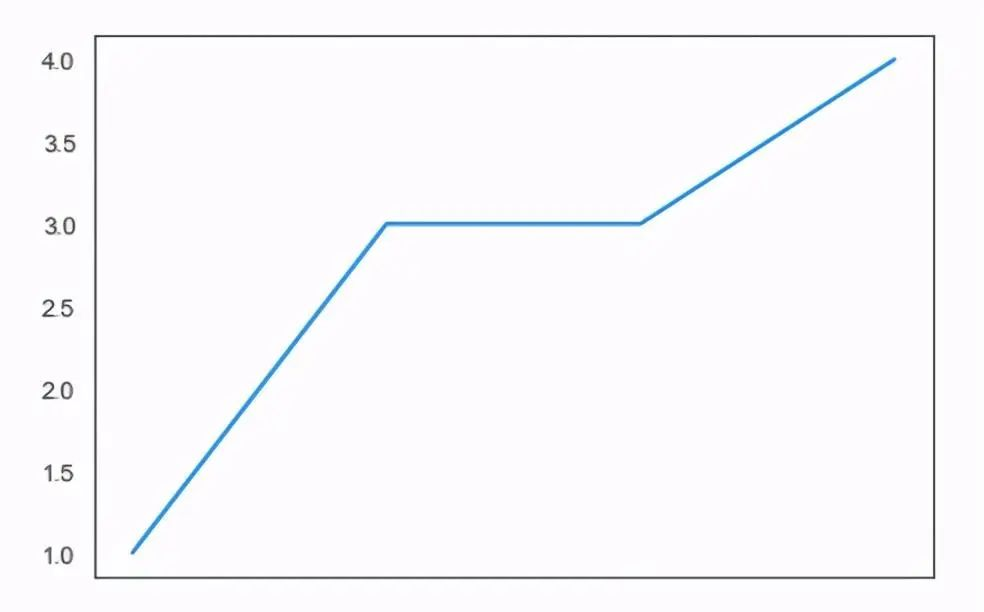
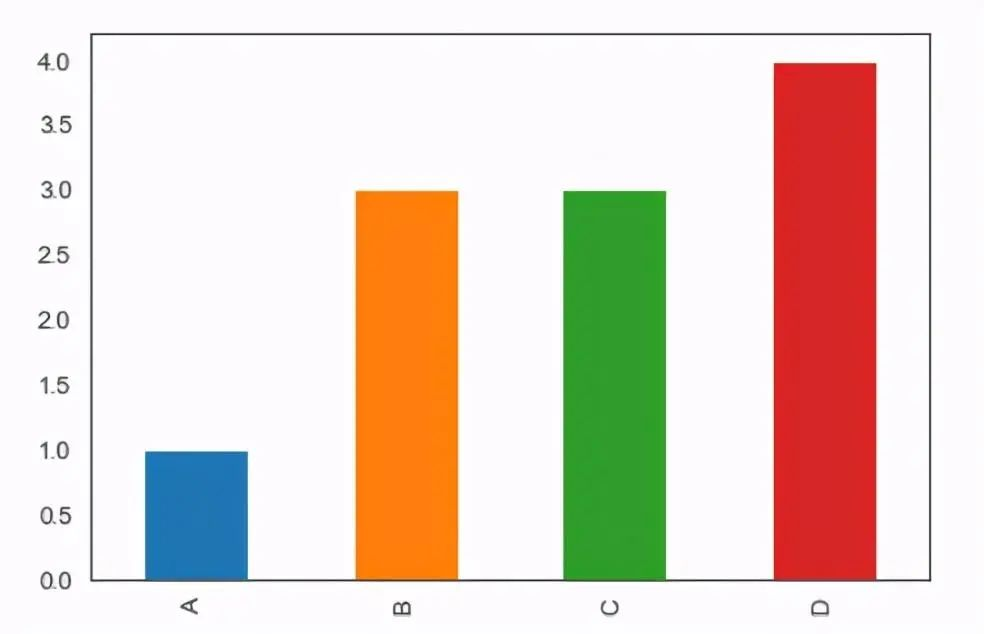
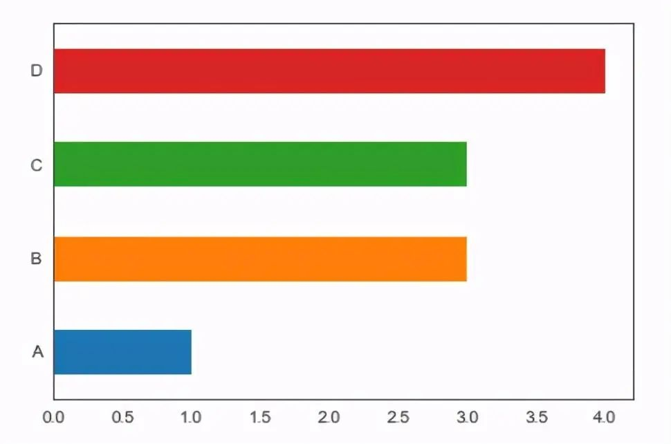
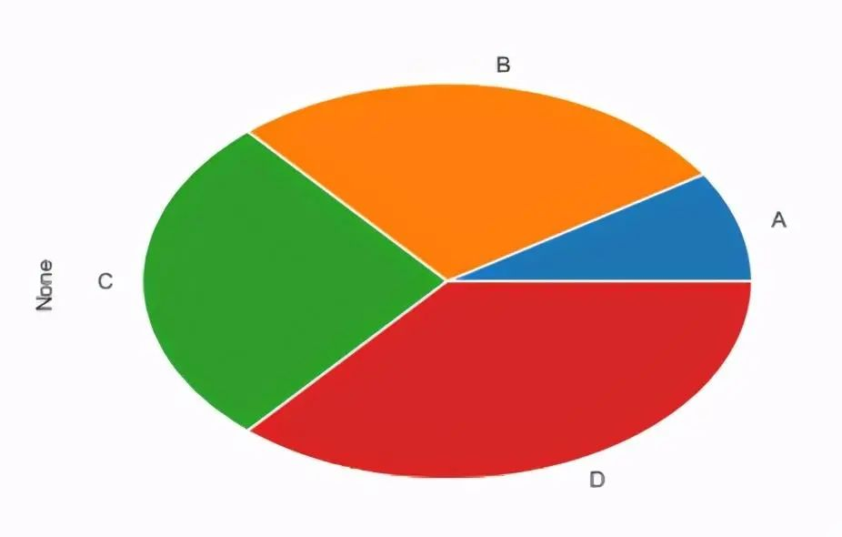
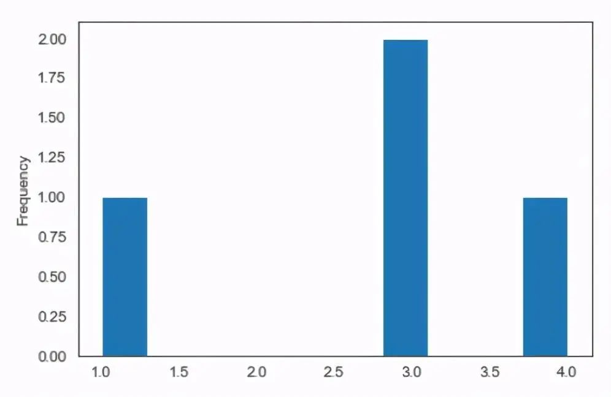
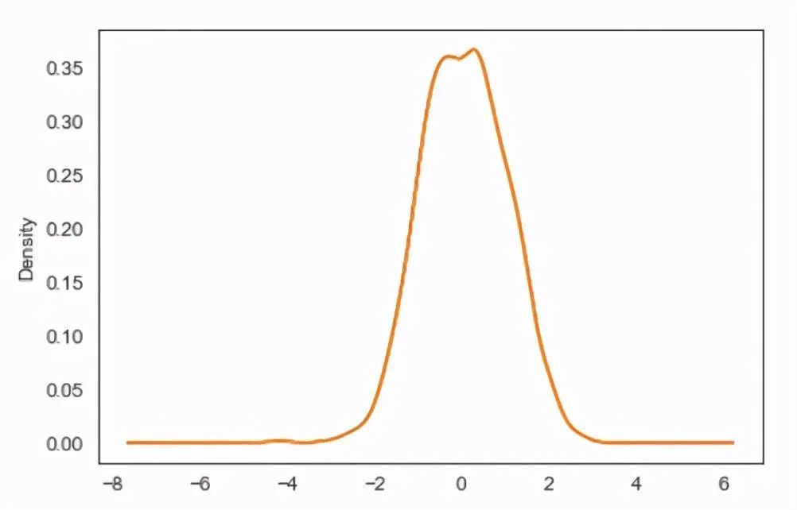
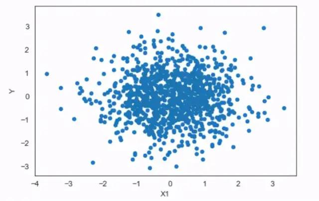
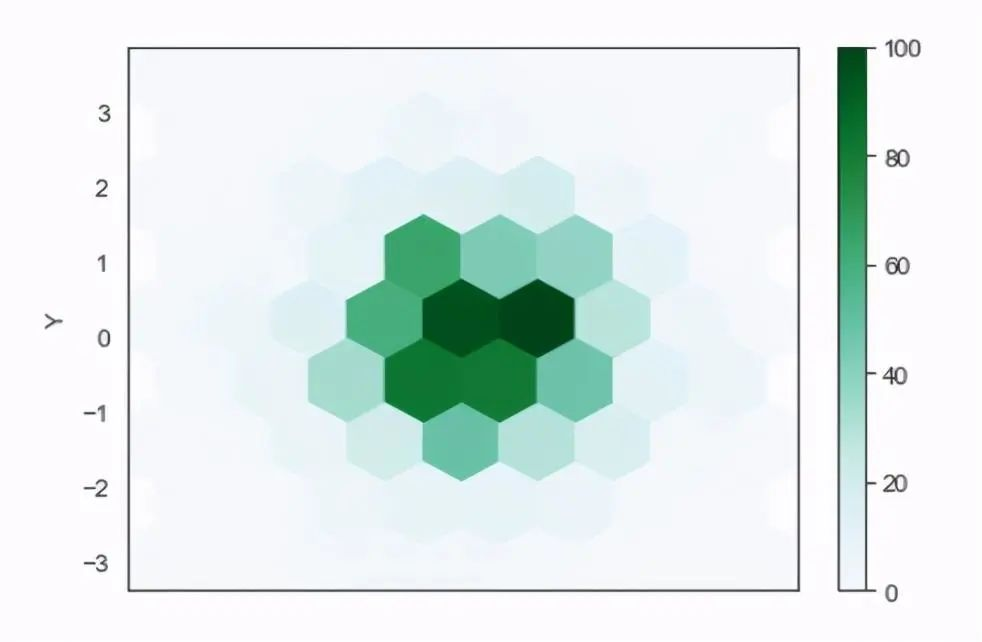
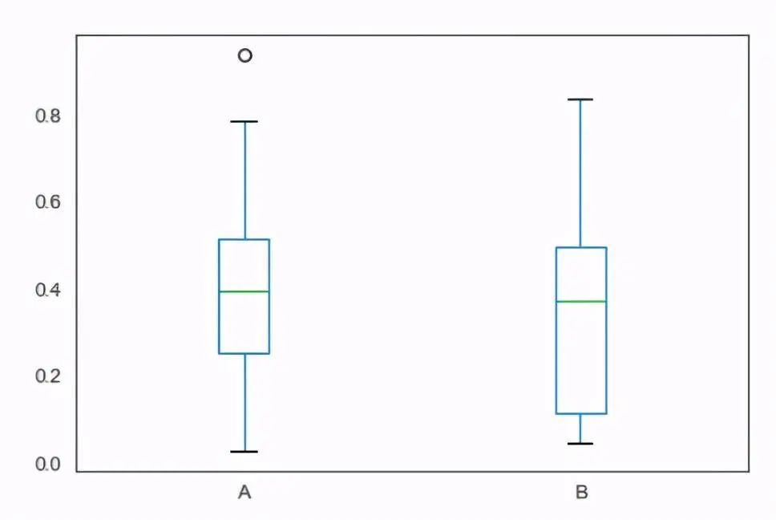

PythonPandas<br />官网：[https://www.pypandas.cn/](https://www.pypandas.cn/)<br />Pandas 是 Python的核心数据分析支持库，提供了快速、灵活、明确的数据结构，旨在简单、直观地处理关系型、标记型数据，广泛应用于数据分析领域，Pandas 适用于处理与 Excel 表类似的表格数据，以及有序和无序的时间序列数据等。<br />Pandas 的主要数据结构是 Series（一维数据）和 DataFrame（二维数据），这两种数据结构足以处理金融、统计、社会科学、工程等领域里的大多数典型用例，使用pandas进行数据分析流程包含数据整理与清洗、数据分析与建模、数据可视化与制表等阶段。

- 灵活的分组功能：group by数据分组；
- 直观地合并功能：merge数据连接；
- 灵活地重塑功能：reshape数据重塑；

<br />pandas库不仅可以做一些数据清洗的工作，还可以使用pandas作图，并且做图时，使用一行代码就可以轻松作图，详细的作图方法可以看代码中的注释。
```python
#导入pandas库  
import pandas as pd    
#生成一个Series  
s=pd.Series([1,3,3,4], index=list('ABCD'))    

#括号内不指定图表类型，则默认生成直线图  
s.plot()
```

<a name="qKx6e"></a>
### 条形图
```python
#条形图
s.plot(kind='bar')
```

<a name="IptSd"></a>
### 水平条形图
```python
#水平条形图
s.plot.barh()
```

<a name="SdT6j"></a>
### 饼图
```python
#饼图
s.plot.pie()
```

<a name="uHUWq"></a>
### 直方图
```python
#直方图
s.plot.hist()
```

```python
#密度图   
import numpy as np 

s=pd.Series(np.random.randn(1000))  #生成一列随机数   
s.plot.kde()   
s.plot.density()
```

<a name="KpFkX"></a>
### 散点图
```python
#散点图   
import numpy as np 
#生成一个DataFrame  
df=pd.DataFrame(np.random.randn(1000,2),
                 columns=['X1','Y'])
df.plot.scatter(x='X1',y='Y')
```

<a name="N28bu"></a>
### 六角箱图
```python
#六角箱图
df.plot.hexbin(x='X1',y='Y',gridsize=8)
```

<a name="jVtXx"></a>
### 箱型图
```python
#箱型图
df=pd.DataFrame(np.random.rand(10,2),columns=['A','B'])
df.plot.box()
```

<a name="hkMmC"></a>
### 面积图
```python
#面积图
df=pd.DataFrame(np.random.randint(10,size=(4,4)),
                columns=list('ABCD'),
                index=list('WXYZ'))    

df.plot.area()
```

