Python Pandas 可视化<br />在Pandas的0.25.0版本之后，提供了一些其他绘图后端，其中交互可视化图表的绘制基于Bokeh！
> Starting in 0.25 pandas can be extended with third-party plotting backends. The main idea is letting users select a plotting backend different than the provided one based on Matplotlib.

目录：

- 环境准备
- 1. 折线图
- 2. 柱状图（条形图）
- 3. 散点图
- 4. 点图
- 5. 阶梯图
- 6. 饼图
- 7. 直方图
- 8. 面积图
- 9. 地图
- 10. 其他
<a name="xpaWZ"></a>
## 环境准备
这里用到的是pandas-bokeh，它为`Pandas`、`GeoPandas`和Pyspark 的`DataFrames`提供了`Bokeh`绘图后端，类似于Pandas已经存在的可视化功能。导入库后，在DataFrames和Series上就新添加了一个绘图方法`plot_bokeh()`。

安装第三方库
```bash
pip install pandas-bokeh
```
or conda:
```bash
conda install -c patrikhlobil pandas-bokeh
```
如果使用jupyter notebook，可以这样让其直接显示
```python
import pandas as pd
import pandas_bokeh

pandas_bokeh.output_notebook()
```
同样如果输出是html文件，则可以用以下方式处理
```python
import pandas as pd
import pandas_bokeh

pandas_bokeh.output_file("Interactive Plot.html")
```
当然在使用的时候，记得先设置绘制后端为pandas_bokeh
```python
import pandas as pd

pd.set_option('plotting.backend', 'pandas_bokeh')
```
目前这个绘图方式支持的可视化图表有以下几类：

- 折线图
- 柱状图（条形图）
- 散点图
- 点图
- 阶梯图
- 饼图
- 直方图
- 面积图
- 地图
<a name="keETJ"></a>
## 1、折线图
交互元素含有以下几种：

- 可平移或缩放
- 单击图例可以显示或隐藏折线
- 悬停显示对应点数据信息

先看一个简单案例：
```python
import numpy as np

np.random.seed(42)
df = pd.DataFrame({"谷歌": np.random.randn(1000)+0.2, 
                   "苹果": np.random.randn(1000)+0.17}, 
                   index=pd.date_range('1/1/2020', periods=1000))
df = df.cumsum()
df = df + 50
df.plot_bokeh(kind="line")       #等价于 df.plot_bokeh.line()
```
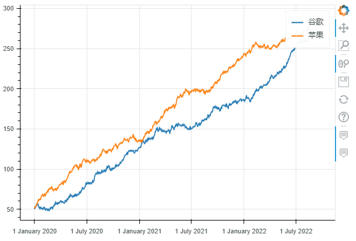<br />折线图<br />在绘制过程中，还可以设置很多参数，用来设置可视化图表的一些功能：

- kind : 图表类型，目前支持的有：“`line`”、“`point`”、“`scatter`”、“`bar`”和“`histogram`”；在不久的将来，更多的将被实现为水平条形图、箱形图、饼图等
- x：x的值，如果未指定x参数，则索引用于绘图的 x 值；或者，也可以传递与 DataFrame 具有相同元素数量的值数组
- y：y的值。
- figsize : 图的宽度和高度
- title : 设置标题
- xlim / ylim：为 x 和 y 轴设置可见的绘图范围（也适用于日期时间 x 轴）
- xlabel / ylabel : 设置 x 和 y 标签
- logx / logy : 在 x/y 轴上设置对数刻度
- xticks / yticks : 设置轴上的刻度
- color：为绘图定义颜色
- colormap：可用于指定要绘制的多种颜色
- hovertool：如果 True 悬停工具处于活动状态，否则如果为 False 则不绘制悬停工具
- hovertool_string：如果指定，此字符串将用于悬停工具（@{column} 将替换为鼠标悬停在元素上的列的值）
- toolbar_location：指定工具栏位置的位置（None, “above”, “below”, “left” or “right”)），默认值：right
- zooming：启用/禁用缩放，默认值：True
- panning：启用/禁用平移，默认值：True
- fontsize_label/fontsize_ticks/fontsize_title/fontsize_legend：设置标签、刻度、标题或图例的字体大小（整数或“15pt”形式的字符串）
- rangetool启用范围工具滚动条，默认False
- kwargs **：`bokeh.plotting.figure.line` 的可选关键字参数
```python
df.plot_bokeh.line(
    figsize=(800, 450), # 图的宽度和高度
    y="苹果", # y的值，这里选择的是df数据中的苹果列
    title="苹果", # 标题
    xlabel="Date", # x轴标题
    ylabel="Stock price [$]", # y轴标题
    yticks=[0, 100, 200, 300, 400], # y轴刻度值
    ylim=(0, 400), # y轴区间
    toolbar_location=None, # 工具栏（取消）
    colormap=["red", "blue"], # 颜色
    hovertool_string=r"""</img> Apple 
                        
                        <h4> Stock Price: </h4> @{苹果}""",  # 悬停工具显示形式（支持css）
    panning=False, # 禁止平移
    zooming=False) # 禁止缩放
```
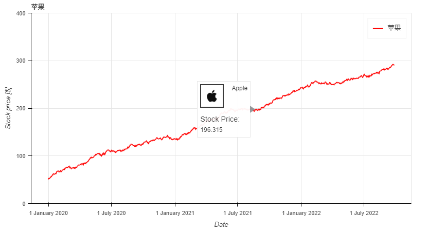<br />对于折线图来说，还有一些特殊的参数，它们是：

- `plot_data_points`：添加绘制线上的数据点
- `plot_data_points_size`：设置数据点的大小
- 标记：定义点类型*（默认值：circle）*，可能的值有：“`circle`”、“`square`”、“`triangle`”、“`asterisk`”、“`circle_x`”、“`square_x`”、“`inverted_triangle`”、`“`x”、“`circle_cross`”、“`square_cross`”、“`diamond`”、“`cross`” '
- `kwargs **`：`bokeh.plotting.figure.line` 的可选关键字参数
```python
df.plot_bokeh.line(
    figsize=(800, 450),
    title="苹果 vs 谷歌",
    xlabel="Date",
    ylabel="价格 [$]",
    yticks=[0, 100, 200, 300, 400],
    ylim=(0, 100),
    xlim=("2020-01-01", "2020-02-01"),
    colormap=["red", "blue"],
    plot_data_points=True, # 是否线上数据点
    plot_data_points_size=10, # 数据点的大小
    marker="square") # 数据点的类型
```
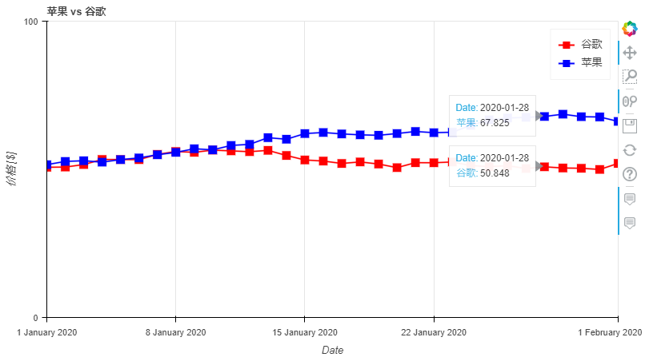<br />启动范围工具滚动条的折线图
```python
ts = pd.Series(np.random.randn(1000), index=pd.date_range('1/1/2020', periods=1000))
df = pd.DataFrame(np.random.randn(1000, 4), index=ts.index, columns=list('ABCD'))
df = df.cumsum()

df.plot_bokeh(rangetool=True)
```
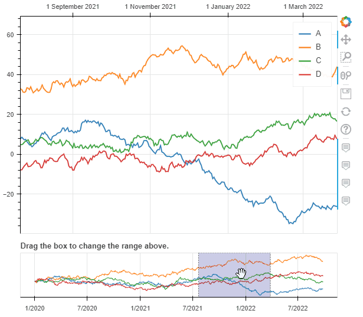<br />带有范围滚动条的折线图
<a name="UmuNI"></a>
## 2、柱状图（条形图）
柱状图没有特殊的关键字参数，一般分为柱状图和堆叠柱状图，默认是柱状图。
```python
data = {
    'fruits':
    ['Apples', 'Pears', 'Nectarines', 'Plums', 'Grapes', 'Strawberries'],
    '2015': [2, 1, 4, 3, 2, 4],
    '2016': [5, 3, 3, 2, 4, 6],
    '2017': [3, 2, 4, 4, 5, 3]
}
df = pd.DataFrame(data).set_index("fruits")

p_bar = df.plot_bokeh.bar(
    ylabel="Price per Unit [€]", 
    title="Fruit prices per Year", 
    alpha=0.6)
```
<br />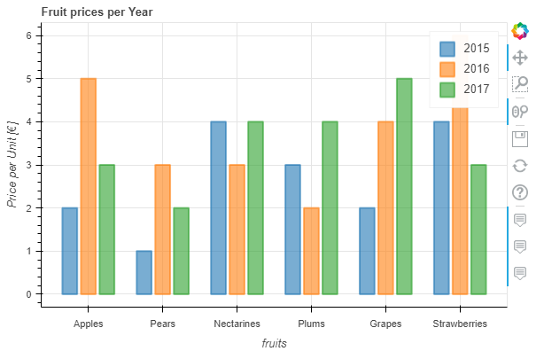<br />柱状图<br />可以通过参数`stacked`来绘制堆叠柱状图：
```python
p_stacked_bar = df.plot_bokeh.bar(
    ylabel="Price per Unit [€]",
    title="Fruit prices per Year",
    stacked=True, # 堆叠柱状图
    alpha=0.6)
```
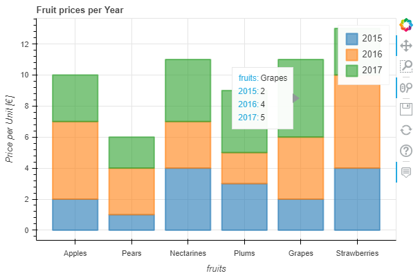<br />默认情况下，x轴的值就是数据索引列的值，也可通过指定参数x来设置x轴；另外，还可以通过关键字`kind="barh"`或访问器`plot_bokeh.barh`来进行条形图绘制。
```python
#Reset index, such that "fruits" is now a column of the DataFrame:
df.reset_index(inplace=True)

#Create horizontal bar (via kind keyword):
p_hbar = df.plot_bokeh(
    kind="barh",
    x="fruits",
    xlabel="Price per Unit [€]",
    title="Fruit prices per Year",
    alpha=0.6,
    legend = "bottom_right",
    show_figure=False)

#Create stacked horizontal bar (via barh accessor):
p_stacked_hbar = df.plot_bokeh.barh(
    x="fruits",
    stacked=True,
    xlabel="Price per Unit [€]",
    title="Fruit prices per Year",
    alpha=0.6,
    legend = "bottom_right",
    show_figure=False)

#Plot all barplot examples in a grid:
pandas_bokeh.plot_grid([[p_bar, p_stacked_bar],
                        [p_hbar, p_stacked_hbar]], 
                       plot_width=450)
```
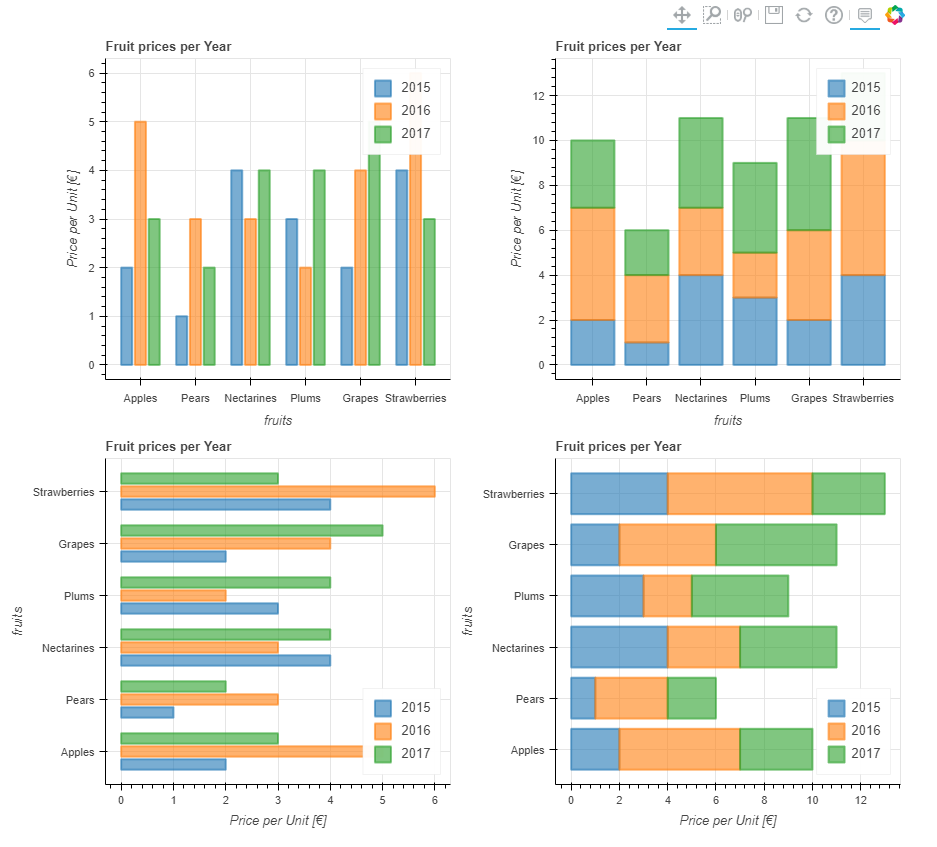
<a name="lVKfH"></a>
## 3、散点图
散点图需要指定x和y，以下参数可选：

- `category`：确定用于为散点着色的类别对应列字段名
- `kwargs **`：`bokeh.plotting.figure.scatter` 的可选关键字参数

以下绘制表格和散点图：
```python
# Load Iris Dataset:
df = pd.read_csv(
    r"https://raw.githubusercontent.com/PatrikHlobil/Pandas-Bokeh/master/docs/Testdata/iris/iris.csv"
)
df = df.sample(frac=1)

# Create Bokeh-Table with DataFrame:
from bokeh.models.widgets import DataTable, TableColumn
from bokeh.models import ColumnDataSource

data_table = DataTable(
    columns=[TableColumn(field=Ci, title=Ci) for Ci in df.columns],
    source=ColumnDataSource(df),
    height=300,
)

# Create Scatterplot:
p_scatter = df.plot_bokeh.scatter(
    x="petal length (cm)",
    y="sepal width (cm)",
    category="species",
    title="Iris DataSet Visualization",
    show_figure=False,
)

# Combine Table and Scatterplot via grid layout:
pandas_bokeh.plot_grid([[data_table, p_scatter]], plot_width=400, plot_height=350)
```
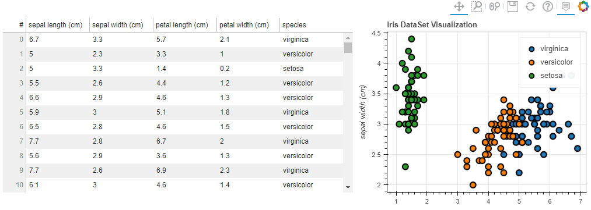<br />表格与散点图<br />还可以传递一些参数比如 散点的大小之类的（用某列的值）
```python
#Change one value to clearly see the effect of the size keyword
df.loc[13, "sepal length (cm)"] = 15

#Make scatterplot:
p_scatter = df.plot_bokeh.scatter(
    x="petal length (cm)",
    y="sepal width (cm)",
    category="species",
    title="Iris DataSet Visualization with Size Keyword",
    size="sepal length (cm)", # 散点大小
)
```
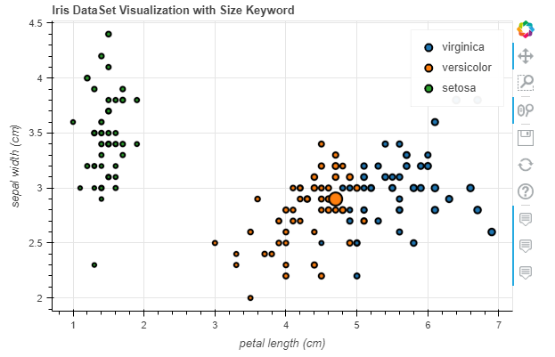
<a name="re0bQ"></a>
## 4、点图
点图比较简单，直接调用`pointplot`即可
```python
import numpy as np

x = np.arange(-3, 3, 0.1)
y2 = x**2
y3 = x**3
df = pd.DataFrame({"x": x, "Parabula": y2, "Cube": y3})
df.plot_bokeh.point(
    x="x",
    xticks=range(-3, 4),
    size=5,
    colormap=["#009933", "#ff3399"],
    title="Pointplot (Parabula vs. Cube)",
    marker="x")
```
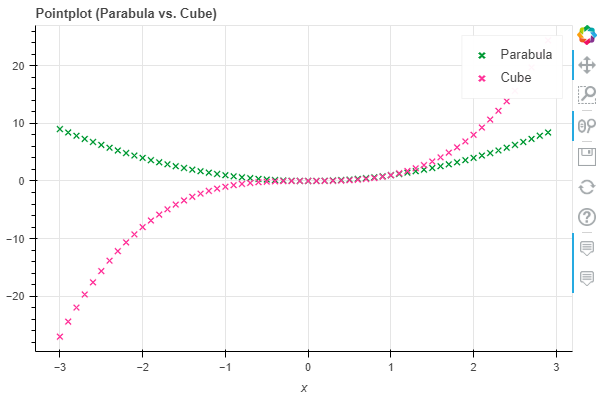<br />点图
<a name="x4SNx"></a>
## 5、阶梯图
阶梯图主要是需要设置其模式`mode`，目前可供选择的是`before`, `after`和`center`
```python
import numpy as np

x = np.arange(-3, 3, 1)
y2 = x**2
y3 = x**3
df = pd.DataFrame({"x": x, "Parabula": y2, "Cube": y3})
df.plot_bokeh.step(
    x="x",
    xticks=range(-1, 1),
    colormap=["#009933", "#ff3399"],
    title="Pointplot (Parabula vs. Cube)",
    figsize=(800,300),
    fontsize_title=30,
    fontsize_label=25,
    fontsize_ticks=15,
    fontsize_legend=5,
    )

df.plot_bokeh.step(
    x="x",
    xticks=range(-1, 1),
    colormap=["#009933", "#ff3399"],
    title="Pointplot (Parabula vs. Cube)",
    mode="after",
    figsize=(800,300)
    )
```
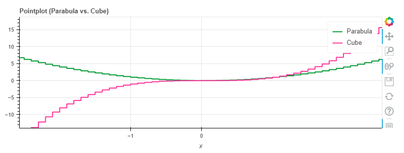
<a name="t4uVc"></a>
## 6、饼图
这里用网上的一份自 2002 年以来德国所有联邦议院选举结果的数据集为例展示
```python
df_pie = pd.read_csv(r"https://raw.githubusercontent.com/PatrikHlobil/Pandas-Bokeh/master/docs/Testdata/Bundestagswahl/Bundestagswahl.csv")
df_pie
```
| 

 | Partei | 2002 | 2005 | 2009 | 2013 | 2017 |
| --- | --- | --- | --- | --- | --- | --- |
| 0 | CDU/CSU | 38.5 | 35.2 | 33.8 | 41.5 | 32.9 |
| 1 | SPD | 38.5 | 34.2 | 23.0 | 25.7 | 20.5 |
| 2 | FDP | 7.4 | 9.8 | 14.6 | 4.8 | 10.7 |
| 3 | Grünen | 8.6 | 8.1 | 10.7 | 8.4 | 8.9 |
| 4 | Linke/PDS | 4.0 | 8.7 | 11.9 | 8.6 | 9.2 |
| 5 | AfD | 0.0 | 0.0 | 0.0 | 0.0 | 12.6 |
| 6 | Sonstige | 3.0 | 4.0 | 6.0 | 11.0 | 5.0 |

```python
df_pie.plot_bokeh.pie(
    x="Partei",
    y="2017",
    colormap=["blue", "red", "yellow", "green", "purple", "orange", "grey"],
    title="Results of German Bundestag Election 2017",
    )
```
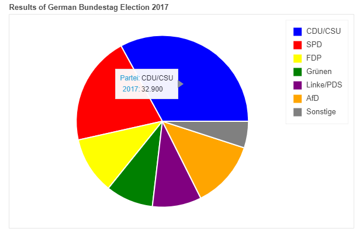<br />饼图<br />如果想绘制全部的列（上图中绘制的是2017年的数据），则无需对y赋值，结果会嵌套显示在一个图中：
```python
df_pie.plot_bokeh.pie(
    x="Partei",
    colormap=["blue", "red", "yellow", "green", "purple", "orange", "grey"],
    title="Results of German Bundestag Elections [2002-2017]",
    line_color="grey")
```
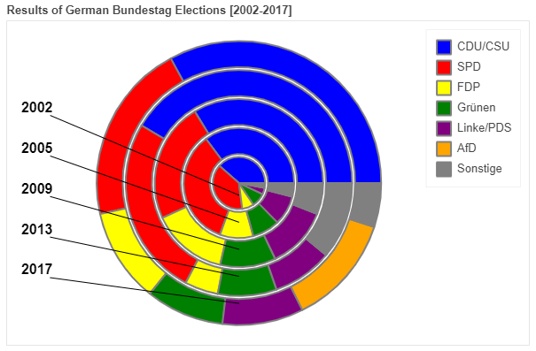

<a name="A3kn4"></a>
## 7、直方图
在绘制直方图时，有不少参数可供选择：

- `bins`：确定用于直方图的 bin，如果 bins 是 int，则它定义给定范围内的等宽 bin 数量（默认为 10），如果 bins 是一个序列，它定义了 bin 边缘，包括最右边的边缘，允许不均匀的 bin 宽度，如果 bins 是字符串，则它定义用于计算最佳 bin 宽度的方法，如`histogram_bin_edges`所定义
- `histogram_type`：“`sidebyside`”、“`topontop`”或“`stacked`”，默认值：“topontop”
- `stacked`：布尔值，如果给定，则将`histogram_type`覆盖为*“`stacked`”*。默认值：*假False
- `kwargs **`：`bokeh.plotting.figure.quad` 的可选关键字参数
```python
import numpy as np

df_hist = pd.DataFrame({
    'a': np.random.randn(1000) + 1,
    'b': np.random.randn(1000),
    'c': np.random.randn(1000) - 1
    },
    columns=['a', 'b', 'c'])

#Top-on-Top Histogram (Default):
df_hist.plot_bokeh.hist(
    bins=np.linspace(-5, 5, 41),
    vertical_xlabel=True,
    hovertool=False,
    title="Normal distributions (Top-on-Top)",
    line_color="black")

#Side-by-Side Histogram (multiple bars share bin side-by-side) also accessible via
#kind="hist":
df_hist.plot_bokeh(
    kind="hist",
    bins=np.linspace(-5, 5, 41),
    histogram_type="sidebyside",
    vertical_xlabel=True,
    hovertool=False,
    title="Normal distributions (Side-by-Side)",
    line_color="black")

#Stacked histogram:
df_hist.plot_bokeh.hist(
    bins=np.linspace(-5, 5, 41),
    histogram_type="stacked",
    vertical_xlabel=True,
    hovertool=False,
    title="Normal distributions (Stacked)",
    line_color="black")
```
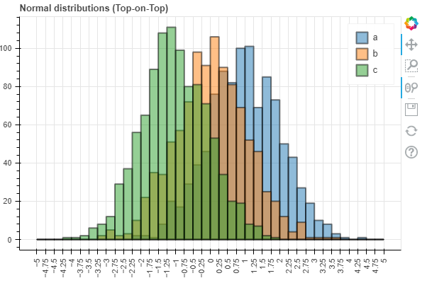<br />Top-on-Top Histogram (Default)<br />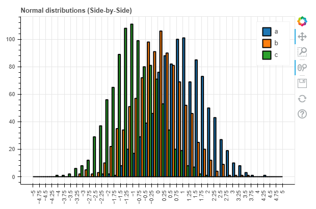<br />Side-by-Side Histogram<br />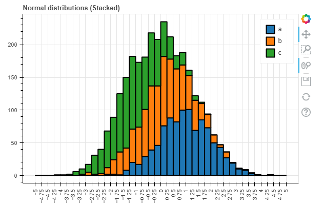<br />Stacked histogram<br />同时，对于直方图还有更高级的参数：

- `weights`：DataFrame 的一列，用作 histogramm 聚合的权重（另请参见`numpy.histogram`）
- `normed`：如果为 True，则直方图值被归一化为 1（直方图值之和 = 1）。也可以传递一个整数，例如normed=100将导致带有百分比 y 轴的直方图（直方图值的总和 = 100），默认值：False
- `cumulative`：如果为 True，则显示累积直方图，默认值：False
- `show_average`：如果为 True，则还显示直方图的平均值，默认值：False
```python
p_hist = df_hist.plot_bokeh.hist(
    y=["a", "b"],
    bins=np.arange(-4, 6.5, 0.5),
    normed=100,
    vertical_xlabel=True,
    ylabel="Share[%]",
    title="Normal distributions (normed)",
    show_average=True,
    xlim=(-4, 6),
    ylim=(0, 30),
    show_figure=False)

p_hist_cum = df_hist.plot_bokeh.hist(
    y=["a", "b"],
    bins=np.arange(-4, 6.5, 0.5),
    normed=100,
    cumulative=True,
    vertical_xlabel=True,
    ylabel="Share[%]",
    title="Normal distributions (normed & cumulative)",
    show_figure=False)

pandas_bokeh.plot_grid([[p_hist, p_hist_cum]], plot_width=450, plot_height=300) # 仪表盘输出方式
```
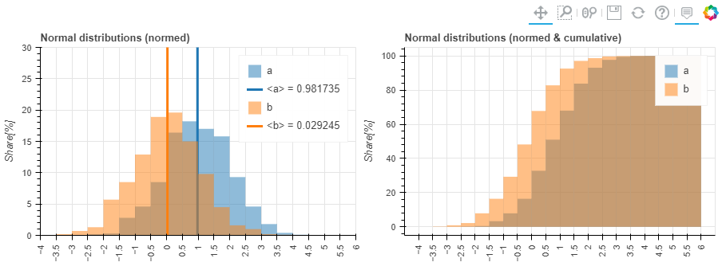
<a name="X1LqB"></a>
## 8、面积图
面积图嘛，提供两种：堆叠或者在彼此之上绘制

- stacked：如果为 True，则面积图堆叠；如果为 False，则在彼此之上绘制图。默认值：False
- kwargs **：`bokeh.plotting.figure.patch` 的可选关键字参数
```python
# 用之前饼图里的数据来绘制
df_energy = df_pie
df_energy.plot_bokeh.area(
    x="Partei",
    stacked=True,
    legend="top_right",
    colormap=["brown", "orange", "black", "grey", "blue"],
    title="标题",
    ylabel="Y轴",
    )
```
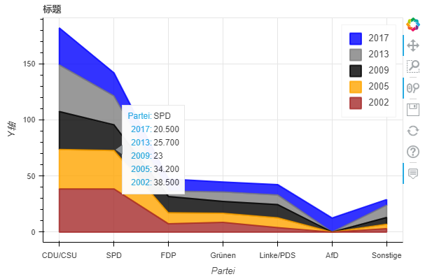<br />堆叠面积图
```python
df_energy.plot_bokeh.area(
    x="Partei",
    stacked=False,
    legend="top_right",
    colormap=["brown", "orange", "black", "grey", "blue"],
    title="标题",
    ylabel="Y轴",
    )
```
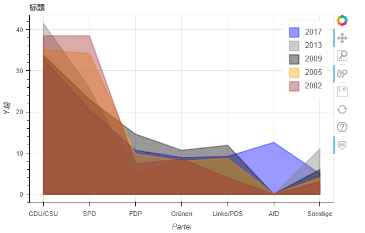<br />非堆叠面积图<br />当使用`normed`关键字对图进行规范时，还可以看到这种效果：
```python
df_energy.plot_bokeh.area(
    x="Partei",
    stacked=True,
    normed=100,  # 规范满100（可看大致占比）
    legend="top_right",
    colormap=["brown", "orange", "black", "grey", "blue"],
    title="标题",
    ylabel="Y轴",
    )
```
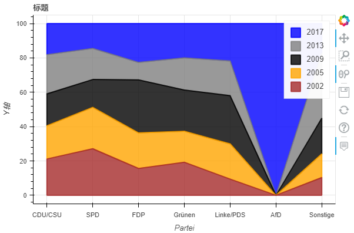
<a name="DXrYU"></a>
## 9、地图
`plot_bokeh.map`函数，参数x和y分别对应经纬度坐标，以全球超过100万居民所有城市为例简单展示一下：
```python
df_mapplot = pd.read_csv(r"https://raw.githubusercontent.com/PatrikHlobil/Pandas-Bokeh/master/docs/Testdata/populated%20places/populated_places.csv")
df_mapplot.head()
```
| 

 | name | pop_max | latitude | longitude |
| --- | --- | --- | --- | --- |
| 0 | Mesa | 1085394 | 33.423915 | -111.736084 |
| 1 | Sharjah | 1103027 | 25.371383 | 55.406478 |
| 2 | Changwon | 1081499 | 35.219102 | 128.583562 |
| 3 | Sheffield | 1292900 | 53.366677 | -1.499997 |
| 4 | Abbottabad | 1183647 | 34.149503 | 73.199501 |

```python
df_mapplot["size"] = df_mapplot["pop_max"] / 1000000
df_mapplot.plot_bokeh.map(
    x="longitude",
    y="latitude",
    hovertool_string="""<h2> @{name} </h2> 
    
                        <h3> Population: @{pop_max} </h3>""",
    tile_provider="STAMEN_TERRAIN_RETINA",
    size="size", 
    figsize=(900, 600),
    title="World cities with more than 1.000.000 inhabitants")
```
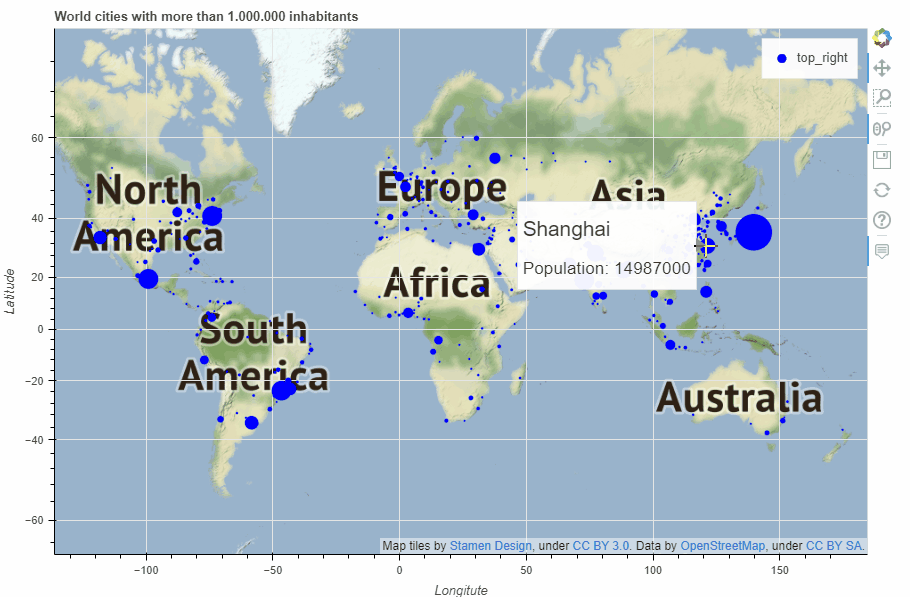<br />map
<a name="pokBE"></a>
## 10、其他
仪表盘输出，通过`pandas_bokeh.plot_grid`来设计仪表盘（具体看这行代码的逻辑）
```python
import pandas as pd
import numpy as np
import pandas_bokeh
pandas_bokeh.output_notebook()

#Barplot:
data = {
    'fruits':
    ['Apples', 'Pears', 'Nectarines', 'Plums', 'Grapes', 'Strawberries'],
    '2015': [2, 1, 4, 3, 2, 4],
    '2016': [5, 3, 3, 2, 4, 6],
    '2017': [3, 2, 4, 4, 5, 3]
}
df = pd.DataFrame(data).set_index("fruits")
p_bar = df.plot_bokeh(
    kind="bar",
    ylabel="Price per Unit [€]",
    title="Fruit prices per Year",
    show_figure=False)

#Lineplot:
np.random.seed(42)
df = pd.DataFrame({
    "Google": np.random.randn(1000) + 0.2,
    "Apple": np.random.randn(1000) + 0.17
},
                  index=pd.date_range('1/1/2000', periods=1000))
df = df.cumsum()
df = df + 50
p_line = df.plot_bokeh(
    kind="line",
    title="Apple vs Google",
    xlabel="Date",
    ylabel="Stock price [$]",
    yticks=[0, 100, 200, 300, 400],
    ylim=(0, 400),
    colormap=["red", "blue"],
    show_figure=False)

#Scatterplot:
from sklearn.datasets import load_iris
iris = load_iris()
df = pd.DataFrame(iris["data"])
df.columns = iris["feature_names"]
df["species"] = iris["target"]
df["species"] = df["species"].map(dict(zip(range(3), iris["target_names"])))
p_scatter = df.plot_bokeh(
    kind="scatter",
    x="petal length (cm)",
    y="sepal width (cm)",
    category="species",
    title="Iris DataSet Visualization",
    show_figure=False)

#Histogram:
df_hist = pd.DataFrame({
    'a': np.random.randn(1000) + 1,
    'b': np.random.randn(1000),
    'c': np.random.randn(1000) - 1
},
                       columns=['a', 'b', 'c'])

p_hist = df_hist.plot_bokeh(
    kind="hist",
    bins=np.arange(-6, 6.5, 0.5),
    vertical_xlabel=True,
    normed=100,
    hovertool=False,
    title="Normal distributions",
    show_figure=False)

#Make Dashboard with Grid Layout:
pandas_bokeh.plot_grid([[p_line, p_bar], 
                        [p_scatter, p_hist]], plot_width=450)
```
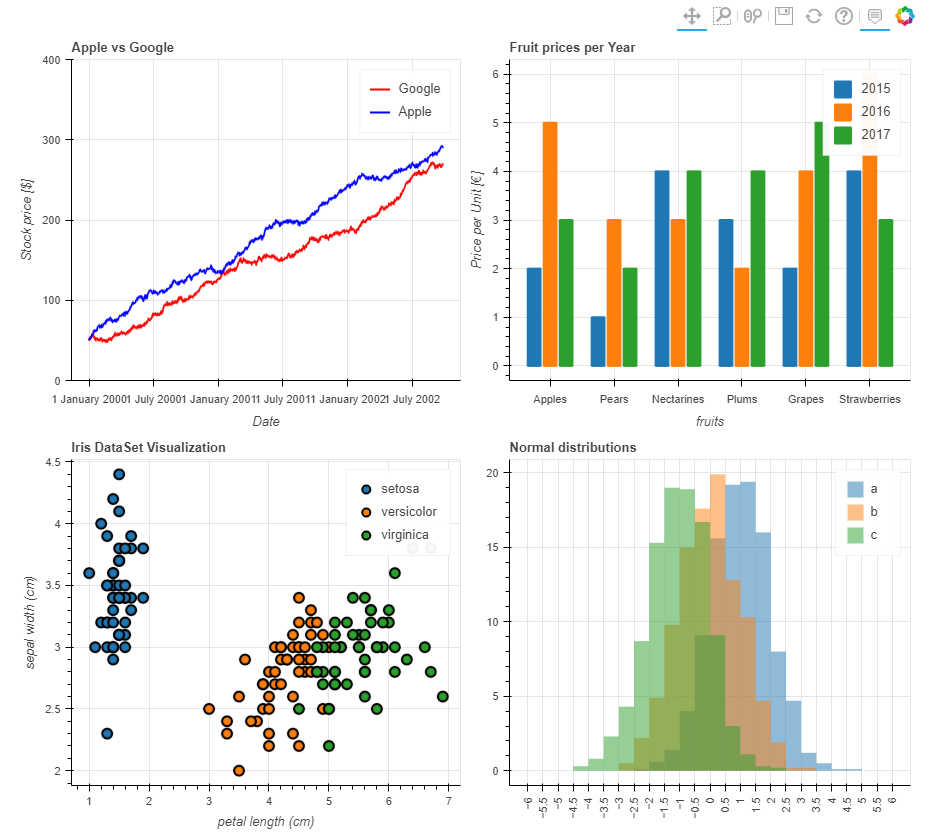<br />仪表盘输出<br />又或者这样：
```python
p_line.plot_width = 900
p_hist.plot_width = 900

layout = pandas_bokeh.column(p_line,
                pandas_bokeh.row(p_scatter, p_bar),
                p_hist)  # 指定每行显示的内容

pandas_bokeh.show(layout)
```
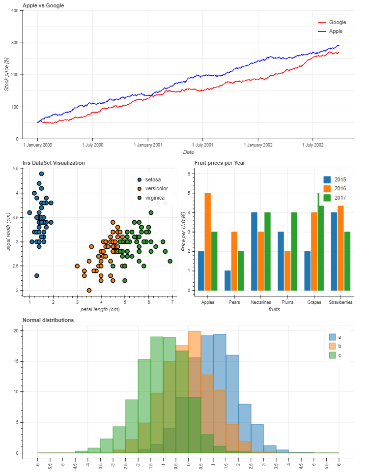<br />替代仪表板布局<br />可以发现Pandas除了结合matplotlib常规绘图外，还可以通过bokeh绘图后端快速绘制可交互的图表，用起来非常方便。
