Python Pandas
<a name="L9LSo"></a>
## Pandas和Matplotlib绘图对比
使用pandas随机生成示例数据
```python
import pandas as pd
df= pd.DataFrame(np.random.rand(8, 4), columns=['A','B','C','D'])
```
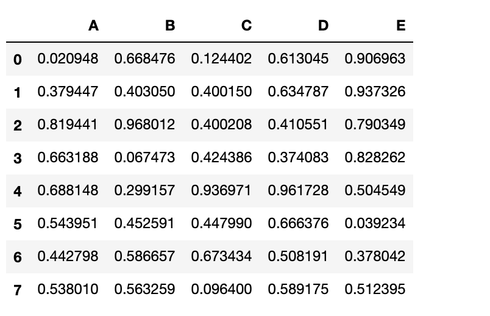<br />现在只要一行代码，即可完成柱状图的绘制`df.plot.bar()`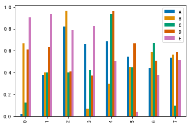<br />同样是这个图，如果使用Matplotlib制作的话👇
```python
import matplotlib.pyplot as plt
x = np.array(df.index.tolist())
y1 = df.A.tolist()
y2 = df.B.tolist()
y3 = df.C.tolist()
y4 = df.D.tolist()
y5 = df.E.tolist()
total_width, n = 0.8, 5
width = total_width / n
x = x - (total_width - width) / 2
plt.bar(x, y1,  width=width, label='A')
plt.bar(x + width, y2, width=width, label='B')
plt.bar(x + 2*width, y3, width=width, label='C')
plt.bar(x + 3*width, y4, width=width, label='D')
plt.bar(x + 4*width, y5, width=width, label='E')
plt.legend()
plt.show()
```
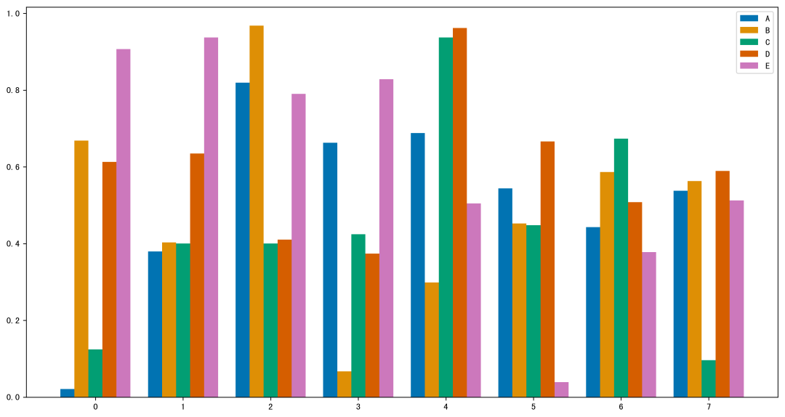<br />可以看到，虽然结果差不多，但是Matplotlib绘图需要的代码量比Pandas要多的多。
<a name="yttM6"></a>
## Pandas绘图示例
<a name="ItvB1"></a>
### 堆叠柱状图，添加一个参数即可`df.plot.barh(stacked=True)`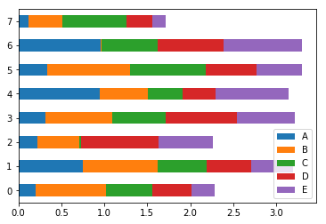
<a name="iKzrV"></a>
### 堆叠面积图`df.plot.area(stacked=True,alpha = 0.9)`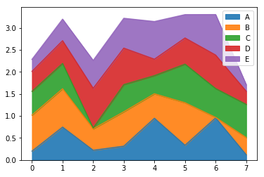
<a name="6541eb2c"></a>
### 密度估计图`df.plot.kde()`
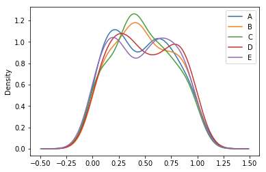
<a name="WckmY"></a>
### 直方图
需要换一组数据
```python
df = pd.DataFrame({'a': np.random.randn(1000) + 1,
                   'b': np.random.randn(1000),
                   'c': np.random.randn(1000) - 1},
                  columns=['a', 'b', 'c'])
```
下面，两行代码就能制作堆叠/不堆叠的直方图
```python
df.plot.hist(stacked=True, bins=20)
df.plot.hist(alpha=0.5)
```
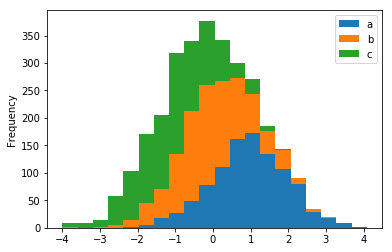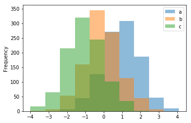<br />**箱线图、散点图等常用图形**，都可以通过一行代码轻松搞定👇
```python
df.plot.box()
df['value'].plot()
df.plot.scatter()
data.plot.hexbin(x='A',y='B')
```
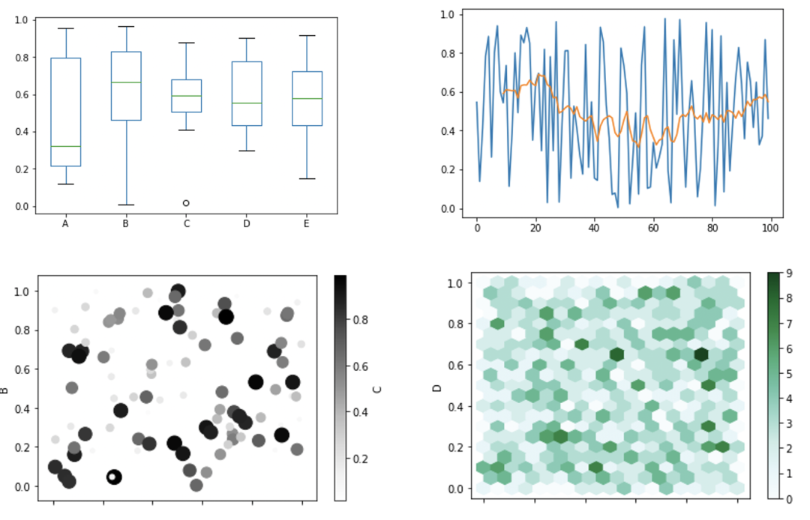
<a name="hizMd"></a>
### 制作子图
只需要设置`subplots=True`就行了，子图位置、大小调整方式和Matplotlib设置一样！
```python
data.plot(subplots=True,layout=(3, 2), figsize=(15, 8));
```
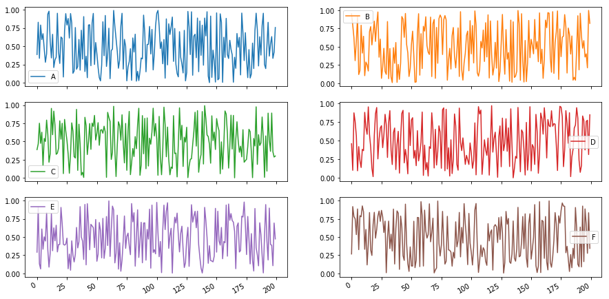<br />更多的图表可以从官方文档中可以看到，`**Pandas**`**一共支持14种常见图表的直接绘制**。
<a name="5brMU"></a>
## 修改主题，使用酷炫样式
如果觉得默认生成的图表不够好看，而它又是基于`Matoplotlib`制作的，所以**可以使用同样套着Matplotlib壳的**`**Seaborn**`**调色板**，从而调整图片主题。<br />还是上面的数据，下面换个主题重新绘制
```python
import seaborn as sns
sns.set_palette("pastel", 8)
```
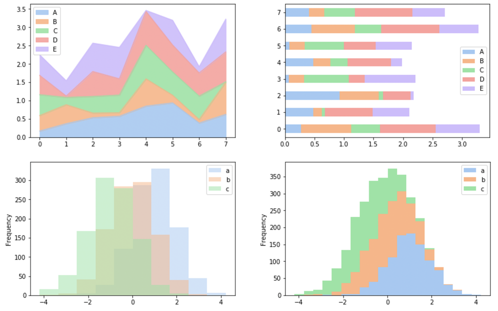
```python
import seaborn as sns
sns.set_palette("Blues_r", 8)
```
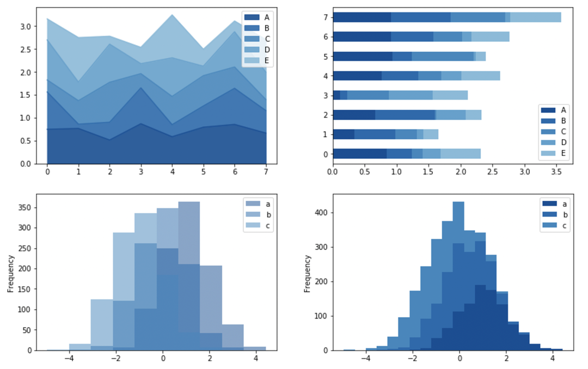
```python
import seaborn as sns
sns.set_palette("magma", 8)
```
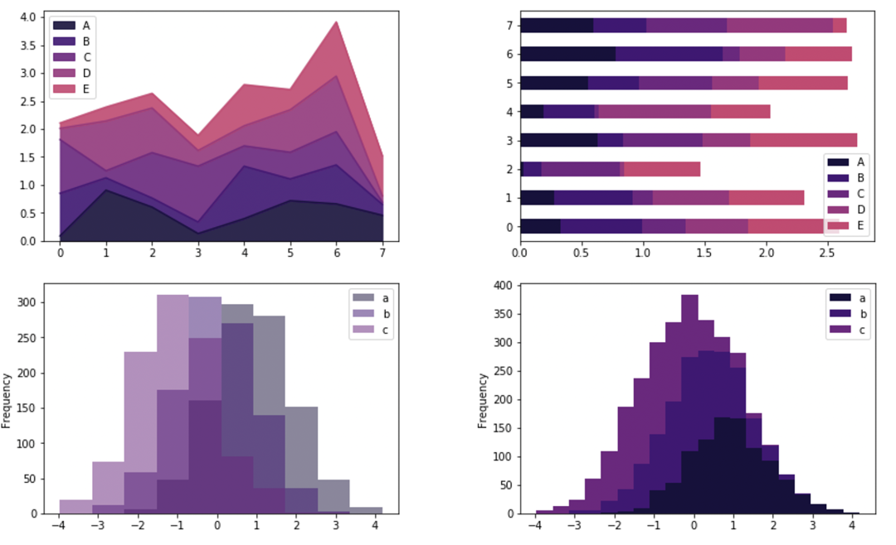<br />更多的颜色搭配可以在seaborn相关文档中找到并使用！
