PythonPandas<br />Pandas 是一种非常流行的数据分析工具，同时它还为数据可视化提供了很好的选择。<br />数据可视化是使数据科学项目成功的重要一步——一个有效的可视化图表可以胜过上千文字描述。<br />数据可视化是捕捉趋势和分享从数据中获得的见解的非常有效的方式，流行的可视化工具有很多，它们各具特色，这里学习使用 Pandas 进行绘图。
<a name="haEAT"></a>
## **Pandas 的 plot() 方法**
Pandas 附带了一些绘图功能，底层都是基于 Matplotlib 库的，也就是说，由 Pandas 库创建的任何绘图都是 Matplotlib 对象。<br />从技术上讲，Pandas 的 `plot()` 方法通过 `kind` 关键字参数提供了一组绘图样式，以此来创建美观的绘图。`kind` 参数的默认值是行字符串值。可以将 11 种不同的字符串值分配给 kind 参数，也就可以创建出不一样的绘图了。<br />同时 `.plot` 也是 Pandas DataFrame 和 series 对象的属性，提供了 Matplotlib 可用的一小部分绘图功能。事实上，Pandas 通过自动化大部分数据可视化过程，使绘图变得像编写一行代码一样简单。
<a name="JKK7S"></a>
## **导入库和数据集**
研究 Facebook、微软和苹果股票的每周收盘价。以下代码导入可视化所需的必要库和数据集，然后在输出中显示 DataFrame 的内容。`%matplotlib` 内联魔法命令也被添加到代码中，以确保绘制的数字正确显示在笔记本单元格中：
```python
import pandas as pd
import numpy as np
import matplotlib.pyplot as plt

df = pd.read_csv('weekly_stocks.csv', parse_dates=['Date'], index_col='Date')
pd.set_option('display.max.columns', None)
print(df.head())
```
Output:
```python
                  MSFT          FB        AAPL
Date                                          
2021-05-24  249.679993  328.730011  124.610001
2021-05-31  250.789993  330.350006  125.889999
2021-06-07  257.890015  331.260010  127.349998
2021-06-14  259.429993  329.660004  130.460007
2021-06-21  265.019989  341.369995  133.110001
```
现在已准备好使用 Pandas 探索和可视化数据了，开始吧
<a name="TdkBm"></a>
## **折线图**
plot 默认图就是折线图，它在 x 轴上绘制索引，在 y 轴上绘制 DataFrame 中的其他数字列。<br />绘制一个折线图，看看微软在过去 12 个月的表现如何：
```python
df.plot(y='MSFT', figsize=(9,6))
```
Output:<br />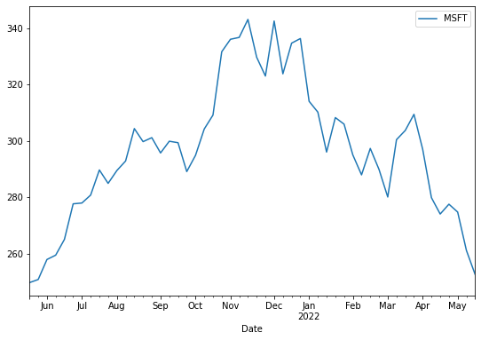<br />figsize 参数接受两个参数，以英寸为单位的宽度和高度，并允许更改输出图形的大小。宽度和高度的默认值分别为 6.4 和 4.8。<br />通过提供列名列表并将其分配给 y 轴，可以从数据中绘制多条线。例如，看看这三家公司在去年的表现如何：
```python
df.plot.line(y=['FB', 'AAPL', 'MSFT'], figsize=(10,6))
```
Output:<br />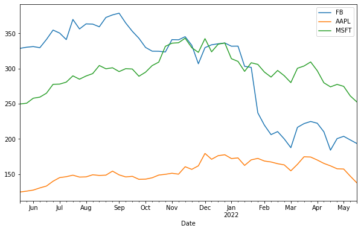<br />可以使用 `plot()` 方法提供的其他参数来为绘图添加更多细节，如下所示：
```python
df.plot(y='FB', figsize=(10,6), title='Facebook Stock', ylabel='USD')
```
Output:<br />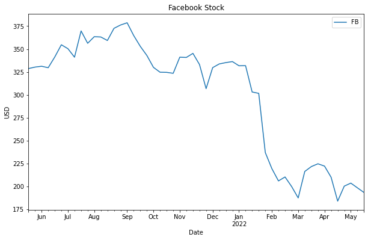<br />正如在图中看到的，title 参数为绘图添加了一个标题，而 ylabel 为绘图的 y 轴设置了一个标签。默认情况下显示图例的图例，但是可以将 legend 参数设置为 false 来隐藏图例。
<a name="xpkoJ"></a>
## **条形图**
条形图是一种基本的可视化图表，用于比较数据组之间的值并用矩形条表示分类数据。该图表可能包括特定类别的计数或任何定义的值，并且条形的长度对应于它们所代表的值。<br />在下面的示例中，将根据每月平均股价创建一个条形图，来比较每个公司在特定月份与其他公司的平均股价。首先，需要按月末重新采样数据，然后使用 `mean()` 方法计算每个月的平均股价。还选择了最近三个月的数据，如下所示：
```python
df_3Months = df.resample(rule='M').mean()[-3:]
print(df_3Months)
```
Output:
```python
                  MSFT          FB        AAPL
Date                                          
2022-03-31  298.400002  212.692505  166.934998
2022-04-30  282.087494  204.272499  163.704994
2022-05-31  262.803335  198.643331  147.326665
```
现在，可以通过将条形字符串值分配给 kind 参数来基于聚合数据创建条形图：
```python
df_3Months.plot(kind='bar', figsize=(10,6), ylabel='Price')
```
Output:<br />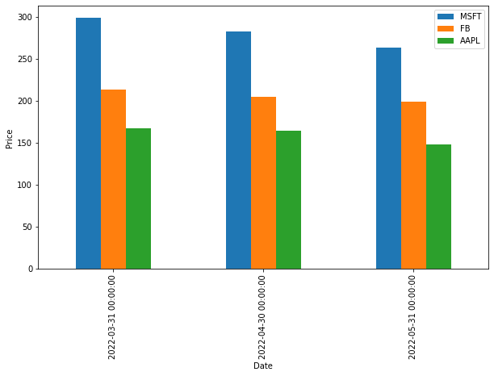<br />可以通过将 barh 字符串值分配给 kind 参数来创建水平条形图：
```python
df_3Months.plot(kind='barh', figsize=(9,6))
```
Output:<br />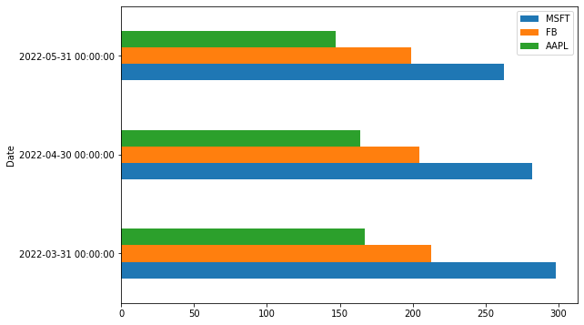<br />还可以在堆叠的垂直或水平条形图上绘制数据，这些条形图代表不同的组，结果条的高度显示了组的组合结果。要创建堆积条形图，需要将 True 分配给堆积参数，如下所示：
```python
df_3Months.plot(kind='bar', stacked=True, figsize=(9,6))
```
Output:<br />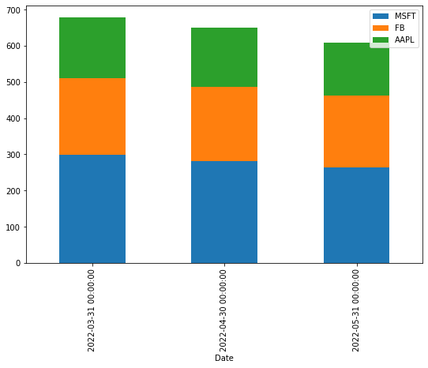
<a name="tOB3e"></a>
## **直方图**
直方图是一种表示数值数据分布的条形图，其中 x 轴表示 bin 范围，而 y 轴表示某个区间内的数据频率。
```python
df[['MSFT', 'FB']].plot(kind='hist', bins=25, alpha=0.6, figsize=(9,6))
```
Output:<br />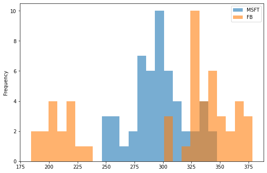<br />在上面的示例中， bins 参数指定 bin 间隔的数量，而 alpha 参数指定透明度。<br />也可以堆叠直方图：
```python
df[['MSFT', 'FB']].plot(kind='hist', bins=25, alpha=0.6, stacked=True, figsize=(9,6))
```
Output:<br />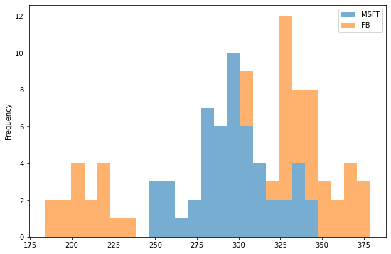
<a name="izQa2"></a>
## **箱形图**
箱线图由三个四分位数和两个虚线组成，它们在一组指标中总结数据：最小值、第一四分位数、中位数、第三四分位数和最大值。<br />箱线图传达的信息非常有用，例如四分位距 (IQR)、中位数和每个数据组的异常值。看看它是如何工作的：
```python
df.plot(kind='box', figsize=(9,6))
```
Output:<br />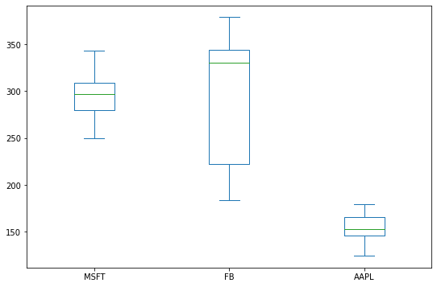<br />可以通过将 False 分配给 vert 参数来创建水平箱线图，如水平条形图：
```python
df.plot(kind='box', vert=False, figsize=(9,6))
```
Output:<br />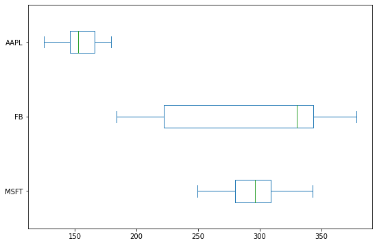
<a name="e2pxc"></a>
## **面积图**
面积图是折线图的扩展，它用颜色填充折线图和 x 轴之间的区域。如果在同一个图中显示了多个面积图，则不同的颜色可以区分不同的面积图：
```python
df.plot(kind='area', figsize=(9,6))
```
Output:<br />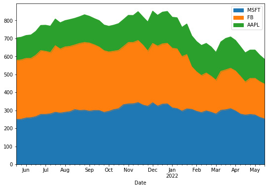<br />Pandas `plot()` 方法默认创建堆积面积图，通过将 False 分配给堆叠参数来取消堆叠面积图是一项常见任务：
```python
df.plot(kind='area', stacked=False, figsize=(9,6))
```
Output:<br />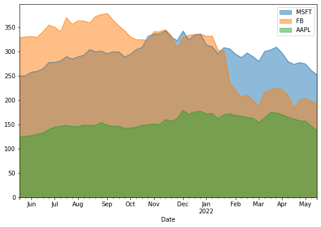
<a name="uCMRR"></a>
## **饼图**
如果对比率感兴趣，饼图是列中数值数据的一个很好的比例表示。以下示例显示了过去三个月的平均 Apple 股票价格分布：
```python
df_3Months.index=['March', 'April', 'May']
df_3Months.plot(kind='pie', y='AAPL', legend=False, autopct='%.f')
```
Output:<br />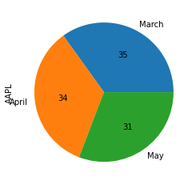<br />默认情况下，图例将显示在饼图上，因此将 False 分配给 legend 关键字以隐藏图例。<br />上面代码中的新关键字参数是 autopct，它在饼图切片上显示百分比值。<br />如果想将多个饼图中所有列的数据表示为子图，可以将 True 分配给 `subplots` 参数，如下所示：
```python
df_3Months.plot(kind='pie', legend=False, autopct='%.f', subplots=True, figsize=(14,8))
```
Output:<br />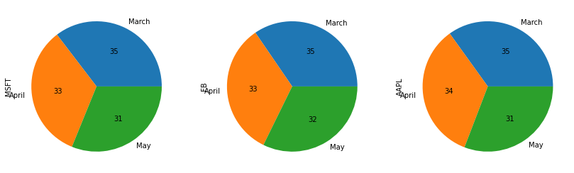
<a name="Sek6N"></a>
## **散点图**
散点图在 x 和 y 轴上绘制数据点以显示两个变量之间的相关性。像这样：
```python
df.plot(kind='scatter', x='MSFT', y='AAPL', figsize=(9,6), color='Green')
```
Output:<br />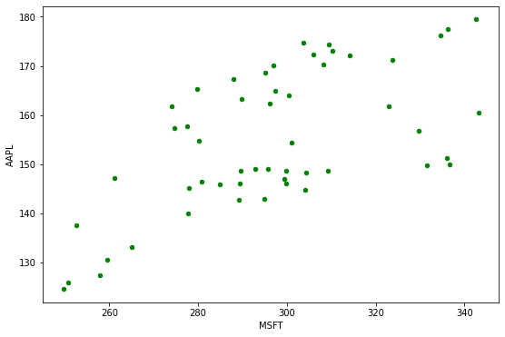<br />正如在上图中看到的，散点图显示了微软和苹果股价之间的关系。
<a name="FrwD0"></a>
## **六边形图**
当数据非常密集时，六边形 bin 图（也称为 hexbin 图）可以替代散点图。换句话说，当数据点的数量很大，并且每个数据点不能单独绘制时，最好使用这种以蜂窝形式表示数据的绘图。此外，每个 hexbin 的颜色定义了该范围内数据点的密度。
```python
df.plot(kind='hexbin', x='MSFT', y='AAPL', gridsize=10, figsize=(10,6))
```
Output:<br />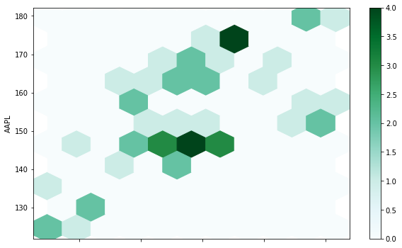<br />`gridsize` 参数指定 x 方向上六边形的数量，较大的网格尺寸意味着更多和更小的箱，gridsize 参数的默认值为 100。
<a name="mVdgW"></a>
## **KDE 绘图**
要讨论的最后一个图是核密度估计，也称为 KDE，它可视化连续和非参数数据变量的概率密度。该图使用高斯核在内部估计概率密度函数 (PDF)：
```python
df.plot(kind='kde')
```
Output:<br />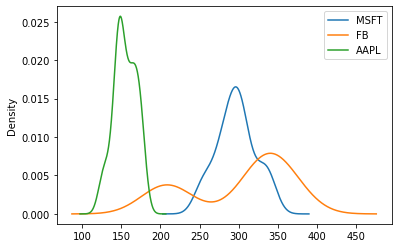<br />还可以指定影响 KDE 绘图中绘图平滑度的带宽，如下所示：
```python
df.plot(kind='kde', bw_method=0.1)
```
Output:<br />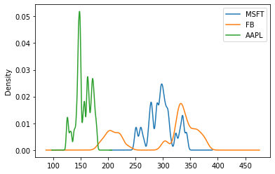
```python
df.plot(kind='kde', bw_method=1)
```
Output:<br />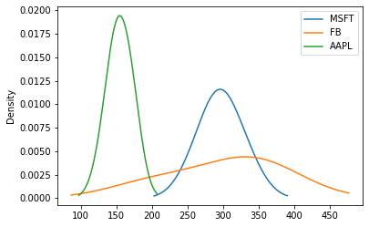<br />选择较小的带宽会导致平滑不足，这意味着密度图显示为单个峰值的组合。相反，巨大的带宽会导致过度平滑，这意味着密度图表现为单峰分布。
