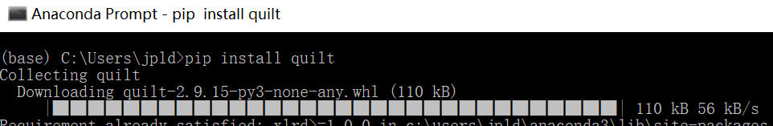
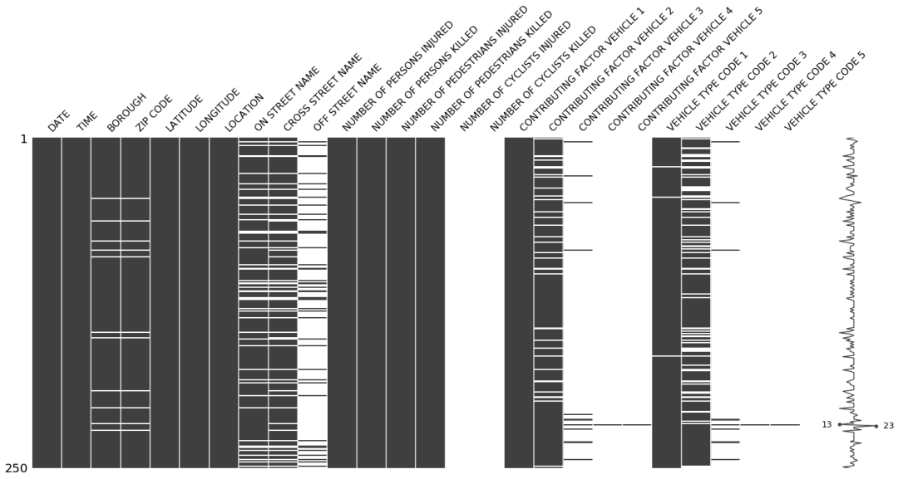
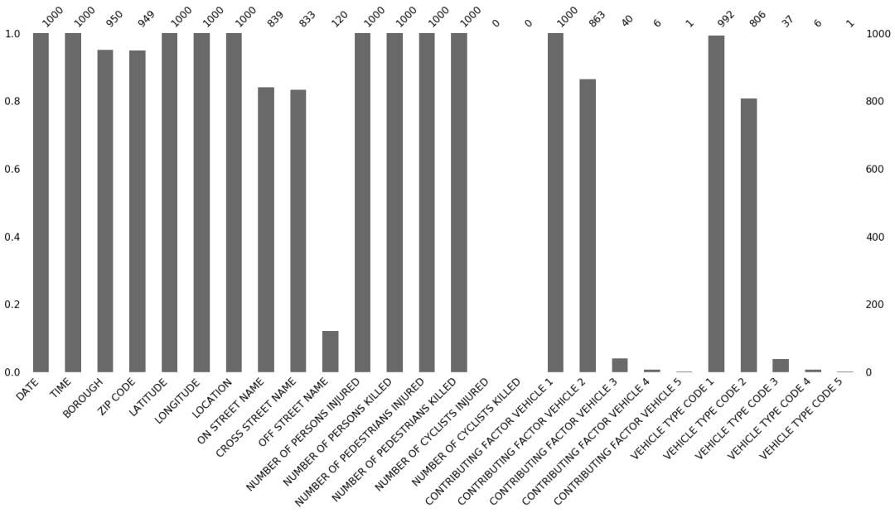
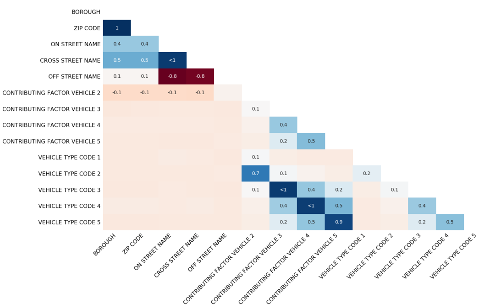

Python 
<a name="SVgSo"></a>
## 适用场景
无论是打比赛还是在实际工程项目中，都会遇到数据缺失的情况，如果数据集较小，还能在excel或者其他可视化软件大致看一下导致数据缺失的原因，那么数据集较大时，想要探索其中规律，无疑难度也是越来越大。<br />missingno提供了一个灵活且易于使用的缺少数据可视化工具和实用程序的小型工具集，可以快速直观地概述数据集的完整性。
<a name="r8sjB"></a>
## 安装及引用
```python
pip install missingno
import missingno as msno
```
missingno一般配合numpy和pandas一起使用：
```python
import numpy as np
import pandas as pd
```
案例中还会用到quilt，这是一个数据包管理器，可以像管理代码一样管理数据，anaconda没有内置，所以需要安装一下。
<a name="gMsor"></a>
## 导入数据
```python
from quilt.data.ResidentMario import missingno_data
collisions = missingno_data.nyc_collision_factors()
collisions = collisions.replace("nan", np.nan)

## 绘制缺失值矩阵图
msno.matrix无效矩阵是一个数据密集的显示，它可以快速直观地看出数据完整度。  
msno.matrix(collisions.sample(250))
```
<br />右侧的迷你图概述了数据完整性的一般形状，并指出了数据集中具有最大和最小无效值的行数。需要说明的是，这个矩阵图最多容纳50个变量，超过此范围的标签开始重叠或变得不可读，默认情况下，大尺寸显示器会忽略它们。<br />如果要处理时间序列数据，则可以使用关键字参数指定周期性freq：
```python
null_pattern = (np.random.random(1000).reshape((50, 20)) > 0.5).astype(bool)  
null_pattern = pd.DataFrame(null_pattern).replace({False: None})  
msno.matrix(null_pattern.set_index(pd.period_range('1/1/2011', '2/1/2015', freq='M')) , freq='BQ')


```
<a name="uUq1W"></a>
## 绘制缺失值条形图
条形图提供与矩阵图相同的信息，但格式更简单。`msno.bar(collisions.sample(1000))`
<a name="DyLcw"></a>
## 绘制缺失值热力图
missingno相关性热力图可以显示无效的相关性：一个变量的存在或不存在如何强烈影响的另一个的存在。<br />数值为1：两个变量一个缺失另一个必缺失；<br />数值为-1：一个变量缺失另一个变量必然不缺失。<br />数值为0：变量缺失值出现或不出现彼此没有影响。<br />热力图非常适合于选择变量对之间的数据完整性关系，但是当涉及到较大的关系时，其解释力有限，并且它不特别支持超大型数据集。<br />注：始终为满或始终为空的变量没有任何有意义的关联，因此会从可视化中删除。
```python
msno.heatmap(collisions)
```

<a name="K8B60"></a>
## 缺失值树状图
通过树状图，可以更全面地观察缺失变量的关联性，揭示比关联热力图更深刻的相关关系：<br />`msno.dendrogram(collisions)`<br /><br />树状图使用层次聚类算法通过变量的无效相关性（以二进制距离来衡量）将变量彼此分类。在树的每个步骤中，根据哪个组合最小化其余群集的距离来对变量进行拆分。变量集越单调，它们的总距离越接近零，而它们的平均距离（y轴）越接近零。以零距离链接在一起的簇叶完全可以预测彼此的存在-一个变量在填充另一个变量时可能始终为空，或者它们可能始终都被填充或都为空，依此类推。
