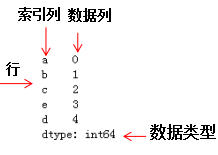
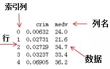
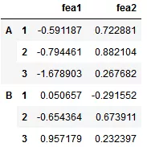

Pandas 
<a name="lrkBT"></a>
### 1、安装Pandas
常用的方法是通过Anaconda安装，在终端或命令符输入如下命令安装：
```bash
conda install pandas
```
若未安装Anaconda，使用Python自带的包管理工具pip来安装：
```bash
pip install pandas
```
<a name="n8Cyc"></a>
### 2、导入pandas库和查询相应的版本信息
```python
import numpy as np   # pandas和numpy常常结合在一起使用，导入numpy库
import pandas as pd  # 导入pandas库
print(pd.__version__) # 打印pandas版本信息
#> 0.23.4
```
<a name="UpEOG"></a>
### 3、pandas数据类型
pandas包含两种数据类型：series和dataframe。<br />series是一种一维数据结构，每一个元素都带有一个索引，与一维数组的含义相似，其中索引可以为数字或字符串。series结构名称：<br /><br />dataframe是一种二维数据结构，数据以表格形式（与excel类似）存储，有对应的行和列。dataframe结构名称：
<a name="144OZ"></a>
### 4、series教程 
<a name="B6LWZ"></a>
#### 1. 从列表，数组，字典构建series
```python
mylist = list('abcedfghijklmnopqrstuvwxyz')   # 列表
myarr = np.arange(26)                       # 数组
mydict = dict(zip(mylist, myarr))             # 字典
# 构建方法
ser1 = pd.Series(mylist)
ser2 = pd.Series(myarr)
ser3 = pd.Series(mydict)
print(ser3.head())                 # 打印前5个数据
#>  a    0
    b    1
    c    2
    d    4
    e    3
    dtype:int64
```
<a name="eyi8z"></a>
#### 2. 使series的索引列转化为dataframe的列
```python
mylist = list('abcedfghijklmnopqrstuvwxyz')
myarr = np.arange(26)
mydict = dict(zip(mylist, myarr))
ser = pd.Series(mydict)
# series转换为dataframe
df = ser.to_frame()
# 索引列转换为dataframe的列
df.reset_index(inplace=True)
print(df.head())
#>   index  0
0     a  0
1     b  1
2     c  2
3     e  3
4     d  4
```
<a name="qmaEk"></a>
#### 3. 结合多个series组成dataframe
```python
# 构建series1
ser1 = pd.Series(list('abcedfghijklmnopqrstuvwxyz')) 
# 构建series2
ser2 = pd.Series(np.arange(26))
# 方法1，axis=1表示列拼接，0表示行拼接
df = pd.concat([ser1, ser2], axis=1)
# 与方法1相比，方法2设置了列名
df = pd.DataFrame({'col1': ser1, 'col2': ser2})
print(df.head())
#>   col1  col2
0    a     0
1    b     1
2    c     2
3    e     3
4    d     4
```
<a name="RDzDr"></a>
#### 4. 命名列索引的名称
```python
ser = pd.Series(list('abcedfghijklmnopqrstuvwxyz'))
# 命名索引列名称
ser.name = 'alphabets'
# 显示前5行数据
ser.head()
#>	0    a
1    b
2    c
3    e
4    d
 Name: alphabets, dtype: object
```
<a name="6715a945"></a>
#### 5. 获得series对象A中不包含series对象B的元素
```python
ser1 = pd.Series([1, 2, 3, 4, 5])
ser2 = pd.Series([4, 5, 6, 7, 8])
# 返回ser1不包含ser2的布尔型series
ser3=~ser1.isin(ser2)
# 获取ser不包含ser2的元素
ser1[ser3]
#>	0    1
1    2
2    3
 dtype: int64
```
<a name="2FTr0"></a>
#### 6. 获得seriesA和seriesB不相同的项
```python
ser1 = pd.Series([1, 2, 3, 4, 5])
ser2 = pd.Series([4, 5, 6, 7, 8])
# 求ser1和ser2的并集
ser_u = pd.Series(np.union1d(ser1, ser2))
# 求ser1和ser2的交集
ser_i = pd.Series(np.intersect1d(ser1, ser2))
# ser_i在ser_u的补集就是ser1和ser2不相同的项
ser_u[~ser_u.isin(ser_i)]
#>	0    1
1    2
2    3
5    6
6    7
7    8
 dtype: int64
```
<a name="yk9cO"></a>
#### 7. 获得数值series的四分位值
```python
# 设置随机数种子
state = np.random.RandomState(100)
# 从均值为5标准差为25的正态分布随机抽取5个点构成series
ser = pd.Series(state.normal(10, 5, 25))
# 求ser的四分位数
np.percentile(ser, q=[0, 25, 50, 75, 100])
#> array([ 1.25117263,  7.70986507, 10.92259345, 13.36360403, 18.0949083 ])
```
<a name="GywGF"></a>
#### 8. 获得series中单一项的频率计数
```python
#从0~7随机抽取30个列表值，组成series
ser = pd.Series(np.take(list('abcdefgh'), np.random.randint(8, size=30)))
# 对该series进行计数
ser.value_counts()
#>	d    8
 g    6
 b    6
 a    5
 e    2
 h    2
 f    1
 dtype: int64
```
<a name="q2eLF"></a>
#### 9. 保留series中前两个频次最多的项，其他项替换为‘other’
```python
np.random.RandomState(100)
# 从1~4均匀采样12个点组成series
ser = pd.Series(np.random.randint(1, 5, [12]))
# 除前两行索引对应的值不变，后几行索引对应的值为Other
ser[~ser.isin(ser.value_counts().index[:2])] = 'Other'
ser
#>	0     Other
1         4
2         2
3         2
4         4
5     Other
6     Other
7     Other
8         4
9         4
10        4
11        2
 dtype: object
```
<a name="mD6jk"></a>
#### 10. 对数值series分成10个相同数目的组
换个角度理解，对数值series离散化成10个类别（categorical）值
```python
ser = pd.Series(np.random.random(20))
# 离散化10个类别值,只显示前5行的数据
pd.qcut(ser, q=[0, .10, .20, .3, .4, .5, .6, .7, .8, .9, 1], 
        labels=['1st', '2nd', '3rd', '4th', '5th', '6th', '7th', '8th', '9th', '10th']).head()
#>
0    3rd
1    1st
2    6th
3    6th
4    9th
dtype: category
Categories (10, object): [1st < 2nd < 3rd < 4th ... 7th < 8th < 9th < 10th]
```
<a name="57H7E"></a>
#### 11. 使numpy数组转化为给定形状的dataframe
```python
ser = pd.Series(np.random.randint(1, 10, 35))
# serier类型转换numpy类型，然后重构
df = pd.DataFrame(ser.values.reshape(7,5))
print(df)
#>    0  1  2  3  4
0  1  2  1  2  5
1  1  2  4  5  2
2  1  3  3  2  8
3  8  6  4  9  6
4  2  1  1  8  5
5  3  2  8  5  6
6  1  5  5  4  6
```
<a name="Poikk"></a>
#### 12. 找到series的值是3的倍数的位置
```python
ser = pd.Series(np.random.randint(1, 10, 7))
print(ser)
# 获取值是3倍数的索引
np.argwhere(ser % 3==0)
#>	0    6
1    8
2    6
3    7
4    6
5    2
6    4
 dtype: int64
 
#>	array([[0],
        [2],
        [4]])
```
<a name="VCkRm"></a>
#### 13. 获取series中给定索引的元素（items）
```python
ser = pd.Series(list('abcdefghijklmnopqrstuvwxyz'))
index = [0, 4, 8, 14, 20]
# 获取指定索引的元素
ser.take(index)
#>	0     a
4     e
8     i
14    o
20    u
 dtype: object
```
<a name="8PfR0"></a>
#### 14. 垂直和水平的拼接series
```python
ser1 = pd.Series(range(5))
ser2 = pd.Series(list('abcde'))
# 垂直拼接
df = pd.concat([ser1, ser2], axis=0)
# 水平拼接
df = pd.concat([ser1, ser2], axis=1)
print(df)
#>    0  1
0  0  a
1  1  b
2  2  c
3  3  d
4  4  e
```
<a name="Y78fp"></a>
#### 15. 获取series对象A中包含series对象B元素的位置
```python
# ser1必须包含ser2，否则会报错
ser1 = pd.Series([10, 9, 6, 5, 3, 1, 12, 8, 13])
ser2 = pd.Series([1, 3, 10, 13])
# 方法 1
[np.where(i == ser1)[0].tolist()[0] for i in ser2]
# 方法 2
[pd.Index(ser1).get_loc(i) for i in ser2]
#> [5, 4, 0, 8]
```
<a name="lOkRV"></a>
#### 16. 计算series之间的均方差
```python
truth = pd.Series(range(10))
pred = pd.Series(range(10)) + np.random.random(10)
# 均方差
np.mean((truth-pred)**2)
#> 0.25508722434194103
```
<a name="wx1AY"></a>
#### 17. 使series中每个元素的首字母为大写
```python
# series的元素为str类型
ser = pd.Series(['how', 'to', 'kick', 'ass?'])
# 方法 1
ser.map(lambda x: x.title())
# 方法 2 ，字符串相加
ser.map(lambda x: x[0].upper() + x[1:])
# 方法 3
pd.Series([i.title() for i in ser])
#>	0     How
1      To
2    Kick
3    Ass?
 dtype: object
```
<a name="g9cTm"></a>
#### 18. 计算series中每个元素的字符串长度
```python
ser = pd.Series(['how', 'to', 'kick', 'ass?'])
# 方法
ser.map(lambda x: len(x))
#>	0    3
1    2
2    4
3    4
 dtype: int64
```
<a name="50IgJ"></a>
#### 19. 计算series的一阶导和二阶导
```python
ser = pd.Series([1, 3, 6, 10, 15, 21, 27, 35])
# 求一阶导并转化为列表类型
print(ser.diff().tolist())
# 求二阶导并转化为列表类型
print(ser.diff().diff().tolist())
#>	[nan, 2.0, 3.0, 4.0, 5.0, 6.0, 6.0, 8.0]
 [nan, nan, 1.0, 1.0, 1.0, 1.0, 0.0, 2.0]
```
<a name="kUUgk"></a>
#### 20. 将一系列日期字符串转换为timeseries
```python
ser = pd.Series(['01 Jan 2010', '02-02-2011', '20120303', '2013/04/04', '2014-05-05', '2015-06-06T12:20'])
pd.to_datetime(ser)
#>	0   2010-01-01 00:00:00
1   2011-02-02 00:00:00
2   2012-03-03 00:00:00
3   2013-04-04 00:00:00
4   2014-05-05 00:00:00
5   2015-06-06 12:20:00
 dtype: datetime64[ns]
```
<a name="ugYYc"></a>
#### 21. 从一个series中获取至少包含两个元音的元素
```python
ser = pd.Series(['Apple', 'Orange', 'Plan', 'Python', 'Money'])
# 方法
from collections import Counter
# Counter是一个类字典类型，键是元素值，值是元素出现的次数,满足条件的元素返回True
mask = ser.map(lambda x: sum([Counter(x.lower()).get(i, 0) for i in list('aeiou')]) >= 2)
ser[mask]
#>	0     Apple
1    Orange
4     Money
 dtype: object
```
<a name="H7XIx"></a>
#### 22. 计算根据另一个series分组后的series均值
```python
fruit = pd.Series(np.random.choice(['apple', 'banana', 'carrot'], 10))
weights = pd.Series(np.linspace(1, 10, 10))
# 根据fruit对weight分组
weightsGrouped = weights.groupby(fruit)
print(weightsGrouped.indices)
# 对分组后series求每个索引的平均值
weightsGrouped.mean()
#>	{'apple': array([0, 3], dtype=int64), 'banana': array([1, 2, 4, 8],
 dtype=int64), 'carrot': array([5, 6, 7, 9], dtype=int64)}
#>	apple     2.50
 banana    4.75
 carrot    7.75
 dtype: float64
```
<a name="n1z4w"></a>
#### 23. 计算两个series之间的欧氏距离
```python
p = pd.Series([1, 2, 3, 4, 5, 6, 7, 8, 9, 10])
q = pd.Series([10, 9, 8, 7, 6, 5, 4, 3, 2, 1])
# 方法1
sum((p - q)**2)**.5
# 方法2
np.linalg.norm(p-q)
#>	18.16590212458495
```
<a name="u9gF5"></a>
#### 24. 在数值series中找局部最大值
局部最大值对应二阶导局部最小值
```python
ser = pd.Series([2, 10, 3, 4, 9, 10, 2, 7, 3])
# 二阶导
dd = np.diff(np.sign(np.diff(ser)))
# 二阶导的最小值对应的值为最大值，返回最大值的索引
peak_locs = np.where(dd == -2)[0] + 1
peak_locs
#>	array([1, 5, 7], dtype=int64)
```
<a name="QhgvZ"></a>
#### 25. 用最少出现的字符替换空格符
```python
my_str = 'dbc deb abed gade'
# 方法
ser = pd.Series(list('dbc deb abed gade'))
# 统计元素的频数
freq = ser.value_counts()
print(freq)
# 求最小频数的字符
least_freq = freq.dropna().index[-1]
# 替换
"".join(ser.replace(' ', least_freq))
#>	d    4
      3
 b    3
 e    3
 a    2
 c    1
 g    1
 dtype: int64
#>	'dbcgdebgabedggade'
```
<a name="VQznG"></a>
#### 26. 计算数值series的自相关系数
```python
ser = pd.Series(np.arange(20) + np.random.normal(1, 10, 20))
# 求series的自相关系数，i为偏移量
autocorrelations = [ser.autocorr(i).round(2) for i in range(11)]
print(autocorrelations[1:])
# 选择最大的偏移量
print('Lag having highest correlation: ', np.argmax(np.abs(autocorrelations[1:]))+1)
#>	[0.33, 0.41, 0.48, 0.01, 0.21, 0.16, -0.11, 0.05, 0.34, -0.24]
#>	Lag having highest correlation:  3
```
<a name="gJRlp"></a>
#### 27. 对series进行算术运算操作
```python
# 如何对series之间进行算法运算
import pandas as pd
series1 = pd.Series([3,4,4,4],['index1','index2','index3','index4'])
series2 = pd.Series([2,2,2,2],['index1','index2','index33','index44'])
# 加法
series_add = series1 + series2
print(series_add)
# 减法
series_minus = series1 - series2
# series_minus
# 乘法
series_multi = series1 * series2
# series_multi
# 除法
series_div = series1/series2
series_div
series是基于索引进行算数运算操作的，pandas会根据索引对数据进行运算，若series之间有不同的索引，对应的值就为Nan。结果如下：
#加法：
 index1     5.0
 index2     6.0
 index3     NaN
 index33    NaN
 index4     NaN
 index44    NaN
 dtype: float64
#除法：
 index1     1.5
 index2     2.0
 index3     NaN
 index33    NaN
 index4     NaN
 index44    NaN
 dtype: float64
```
<a name="lRx2Y"></a>
### 3. dataframe教程
<a name="VMHY5"></a>
#### 1. 从csv文件只读取前几行的数据
```python
# 只读取前2行和指定列的数据
df = pd.read_csv('https://raw.githubusercontent.com/selva86/datasets/master/Cars93_miss.csv',nrows=2,usecols=['Model','Length'])
df
#>  Model	Length
0	Integra	177
1	Legend	195
```
<a name="pc76d"></a>
#### 2. 从csv文件中每隔n行来创建dataframe
```python
# 每隔50行读取一行数据
df = pd.read_csv('https://raw.githubusercontent.com/selva86/datasets/master/BostonHousing.csv', chunksize=50)
df2 = pd.DataFrame()
for chunk in df:
    # 获取series
    df2 = df2.append(chunk.iloc[0,:])
#显示前5行
print(df2.head())
#>                   crim    zn  indus chas                  nox     rm   age  \
0              0.21977   0.0   6.91    0  0.44799999999999995  5.602  62.0   
1               0.0686   0.0   2.89    0                0.445  7.416  62.5   
2   2.7339700000000002   0.0  19.58    0                0.871  5.597  94.9   
3               0.0315  95.0   1.47    0  0.40299999999999997  6.975  15.3   
4  0.19072999999999998  22.0   5.86    0                0.431  6.718  17.5   
 
       dis rad  tax ptratio       b  lstat  medv  
0  6.0877   3  233    17.9   396.9   16.2  19.4  
1  3.4952   2  276    18.0   396.9   6.19  33.2  
2  1.5257   5  403    14.7  351.85  21.45  15.4  
3  7.6534   3  402    17.0   396.9   4.56  34.9  
4  7.8265   7  330    19.1  393.74   6.56  26.2
```
<a name="d796069d"></a>
#### 3. 改变导入csv文件的列值
改变列名‘medv’的值，当列值≤25时，赋值为‘Low’；列值>25时，赋值为‘High’.
```python
# 使用converters参数，改变medv列的值
df = pd.read_csv('https://raw.githubusercontent.com/selva86/datasets/master/BostonHousing.csv', 
                 converters={'medv': lambda x: 'High' if float(x) > 25 else 'Low'})
print(df.head())
#>         b  lstat  medv
0  396.90   4.98   Low  
1  396.90   9.14   Low  
2  392.83   4.03  High  
3  394.63   2.94  High  
4  396.90   5.33  High
```
<a name="yprYq"></a>
#### 4. 从csv文件导入指定的列
```python
# 导入指定的列：crim和medv
df = pd.read_csv('https://raw.githubusercontent.com/selva86/datasets/master/BostonHousing.csv', usecols=['crim', 'medv'])
# 打印前四行dataframe信息
print(df.head())
#>       crim  medv
0  0.00632  24.0
1  0.02731  21.6
2  0.02729  34.7
3  0.03237  33.4
4  0.06905  36.2
```
<a name="EhG01"></a>
#### 5. 得到dataframe的行，列，每一列的类型和相应的描述统计信息
```python
df = pd.read_csv('https://raw.githubusercontent.com/selva86/datasets/master/Cars93_miss.csv')
#  打印dataframe的行和列
print(df.shape)
# 打印dataframe每列元素的类型显示前5行
print(df.dtypes.head())
# 统计各类型的数目,方法1
print(df.get_dtype_counts())
# 统计各类型的数目,方法2
# print(df.dtypes.value_counts())
# 描述每列的统计信息，如std，四分位数等
df_stats = df.describe()
# dataframe转化数组
df_arr = df.values
# 数组转化为列表
df_list = df.values.tolist()
#>	(93, 27)
 Manufacturer     object
 Model            object
 Type             object
 Min.Price       float64
 Price           float64
 dtype: object
 float64    18
object      9
 dtype: int64
```
<a name="1bdWO"></a>
#### 6. 获取给定条件的行和列
```python
import numpy as np
df = pd.read_csv('https://raw.githubusercontent.com/selva86/datasets/master/Cars93_miss.csv')
# print(df)
# 获取最大值的行和列
row, col = np.where(df.values == np.max(df.Price))
# 行和列获取最大值
print(df.iat[row[0], col[0]])
df.iloc[row[0], col[0]]
# 行索引和列名获取最大值
df.at[row[0], 'Price']
df.get_value(row[0], 'Price')
#>	61.9
```
<a name="2NGKf"></a>
#### 7. 重命名dataframe的特定列
```python
df1 = pd.DataFrame(data=np.array([[18,50],[19,51],[20,55]]),index=['man1','man2','man3'],columns=['age','weight'])
print(df1)
# 修改列名
print("\nchange columns :\n")
#方法1
df1.rename(columns={'weight':'stress'})
#方法2
df1.columns.values[1] = 'stress'
print(df1)
#>       age  weight
 man1   18      50
 man2   19      51
 man3   20      55
 
 change columns :
 
       age  stress
 man1   18      50
 man2   19      51
 man3   20      55
```
<a name="7eOI0"></a>
#### 8. 检查dataframe中是否有缺失值
```python
df = pd.read_csv('https://raw.githubusercontent.com/selva86/datasets/master/Cars93_miss.csv')
# 若有缺失值，则为Ture
df.isnull().values.any()
#>	True
```
<a name="lOQou"></a>
#### 9. 统计dataframe的每列中缺失值的个数
```python
df = pd.read_csv('https://raw.githubusercontent.com/selva86/datasets/master/Cars93_miss.csv')
# 获取每列的缺失值个数
n_missings_each_col = df.apply(lambda x: x.isnull().sum())
print(n_missings_each_col.head())
#>	Manufacturer    4
 Model           1
 Type            3
 Min.Price       7
 Price           2
 dtype: int64
```
<a name="5lybj"></a>
#### 10. 用平均值替换相应列的缺失值
```python
df = pd.read_csv('https://raw.githubusercontent.com/selva86/datasets/master/Cars93_miss.csv',nrows=10)
print(df[['Min.Price','Max.Price']].head())
# 平均值替换缺失值
df_out = df[['Min.Price', 'Max.Price']] = df[['Min.Price', 'Max.Price']].apply(lambda x: x.fillna(x.mean()))
print(df_out.head())
#>    Min.Price  Max.Price
0       12.9       18.8
1       29.2       38.7
2       25.9       32.3
3        NaN       44.6
4        NaN        NaN
#>    Min.Price  Max.Price
0       12.9       18.8
1       29.2       38.7
2       25.9       32.3
3       23.0       44.6
4       23.0       29.9
```
<a name="hd3sJ"></a>
#### 11. 用全局变量作为apply函数的附加参数处理指定的列
```python
df = pd.read_csv('https://raw.githubusercontent.com/selva86/datasets/master/Cars93_miss.csv')
print(df[['Min.Price', 'Max.Price']].head())
# 全局变量
d = {'Min.Price': np.nanmean, 'Max.Price': np.nanmedian}
# 列名Min.Price的缺失值用平均值代替，Max.Price的缺失值用中值代替
df[['Min.Price', 'Max.Price']] = df[['Min.Price', 'Max.Price']].apply(lambda x, d: x.fillna(d[x.name](x)), args=(d, ))
print(df[['Min.Price', 'Max.Price']].head())
#>    Min.Price  Max.Price
0       12.9       18.8
1       29.2       38.7
2       25.9       32.3
3        NaN       44.6
4        NaN        NaN
#>    Min.Price  Max.Price
0  12.900000      18.80
1  29.200000      38.70
2  25.900000      32.30
3  17.118605      44.60
4  17.118605      19.15
```
<a name="8BLfc"></a>
#### 12. 以dataframe的形式选择特定的列
```python
df = pd.DataFrame(np.arange(20).reshape(-1, 5), columns=list('abcde'))
# print(df)
# 以dataframe的形式选择特定的列
type(df[['a']])
type(df.loc[:, ['a']])
print(type(df.iloc[:, [0]]))
# 以series的形式选择特定的列
type(df.a)
type(df['a'])
type(df.loc[:, 'a'])
print(type(df.iloc[:, 1]))
#>	<class 'pandas.core.frame.DataFrame'>
<class 'pandas.core.series.Series'>
```
<a name="06KcR"></a>
#### 13. 改变dataframe中的列顺序
```python
df = pd.DataFrame(np.arange(20).reshape(-1, 5), columns=list('abcde'))
print(df)
# 交换col1和col2
def switch_columns(df, col1=None, col2=None):
    colnames = df.columns.tolist()
    i1, i2 = colnames.index(col1), colnames.index(col2)
    colnames[i2], colnames[i1] = colnames[i1], colnames[i2]
    return df[colnames]
df1 = switch_columns(df, 'a', 'c')
print(df1)
#>     a   b   c   d   e
0   0   1   2   3   4
1   5   6   7   8   9
2  10  11  12  13  14
3  15  16  17  18  19
#>     c   b   a   d   e
0   2   1   0   3   4
1   7   6   5   8   9
2  12  11  10  13  14
3  17  16  15  18  19
```
<a name="0ViaM"></a>
#### 14. 格式化dataframe的值
```python
df = pd.DataFrame(np.random.random(4)**10, columns=['random'])
print(df)
# 显示小数点后四位
df.apply(lambda x: '%.4f' % x, axis=1)
print(df)
#>          random
0  3.539348e-04
1  3.864140e-10
2  2.973575e-02
3  1.414061e-01
#>          random
0  3.539348e-04
1  3.864140e-10
2  2.973575e-02
3  1.414061e-01
```
<a name="M6iQA"></a>
#### 15. 将dataframe中的所有值以百分数的格式表示
```python
df = pd.DataFrame(np.random.random(4), columns=['random'])
# 格式化为小数点后两位的百分数
out = df.style.format({
    'random': '{0:.2%}'.format,
})
out
#>  random
0	48.54%
1	91.51%
2	90.83%
3	20.45%
```
<a name="0zwBO"></a>
#### 16. 从dataframe中每隔n行构建dataframe
```python
df = pd.read_csv('https://raw.githubusercontent.com/selva86/datasets/master/Cars93_miss.csv')
# 每隔20行读dataframe数据
print(df.iloc[::20, :][['Manufacturer', 'Model', 'Type']])
#>    Manufacturer    Model     Type
0         Acura  Integra    Small
20     Chrysler  LeBaron  Compact
40        Honda  Prelude   Sporty
60      Mercury   Cougar  Midsize
80       Subaru   Loyale    Small
```
<a name="invYq"></a>
#### 17. 得到列中前n个最大值对应的索引
```python
df = pd.DataFrame(np.random.randint(1, 15, 15).reshape(5,-1), columns=list('abc'))
print(df)
# 取'a'列前3个最大值对应的行
n = 5
df['a'].argsort()[::-1].iloc[:3]
#>     a   b   c
0   5   5   2
1  12   7   1
2   5   2  12
3   5  14  12
4   1  13  13
#>	4    1
3    3
2    2
 Name: a, dtype: int64
```
<a name="sGBDG"></a>
#### 18.  获得dataframe行的和大于100的最末n行索引
```python
df = pd.DataFrame(np.random.randint(10, 40, 16).reshape(-1, 4))
print(df)
# dataframe每行的和
rowsums = df.apply(np.sum, axis=1)
# 选取大于100的最末两行索引
# last_two_rows = df.iloc[np.where(rowsums > 100)[0][-2:], :]
nline = np.where(rowsums > 100)[0][-2:]
nline
#>     0   1   2   3
0  19  34  15  12
1  38  35  14  26
2  39  32  18  20
3  28  27  36  38
#>	array([2, 3], dtype=int64)
```
<a name="Jaz2w"></a>
#### 19. 从series中查找异常值并赋值
```python
ser = pd.Series(np.logspace(-2, 2, 30))
# 小于low_per分位的数赋值为low，大于low_per分位的数赋值为high
def cap_outliers(ser, low_perc, high_perc):
    low, high = ser.quantile([low_perc, high_perc])
    print(low_perc, '%ile: ', low, '|', high_perc, '%ile: ', high)
    ser[ser < low] = low
    ser[ser > high] = high
    return(ser)
capped_ser = cap_outliers(ser, .05, .95)
#>	0.05 %ile:  0.016049294076965887 | 0.95 %ile:  63.876672220183934
```
<a name="XD448"></a>
#### 20. 交换dataframe的两行
```python
df = pd.DataFrame(np.arange(9).reshape(3, -1))
print(df)
# 函数
def swap_rows(df, i1, i2):
    a, b = df.iloc[i1, :].copy(), df.iloc[i2, :].copy()
    # 通过iloc换行
    df.iloc[i1, :], df.iloc[i2, :] = b, a
    return df
# 2和3行互换
print(swap_rows(df, 1, 2))
#>    0  1  2
0  0  1  2
1  3  4  5
2  6  7  8
#>    0  1  2
0  0  1  2
1  6  7  8
2  3  4  5
```
<a name="BlTWf"></a>
#### 21. 倒转dataframe的行
```python
df = pd.DataFrame(np.arange(9).reshape(3, -1))
print(df)
# 方法 1
df.iloc[::-1, :]
# 方法 2
print(df.loc[df.index[::-1], :])
#>    0  1  2
0  0  1  2
1  3  4  5
2  6  7  8
#>    0  1  2
2  6  7  8
1  3  4  5
0  0  1  2
```
<a name="n4Ygu"></a>
#### 22. 对分类变量进行one-hot编码
```python
df = pd.DataFrame(np.arange(25).reshape(5,-1), columns=list('abcde'))
print(df)
# 对列'a'进行onehot编码
df_onehot = pd.concat([pd.get_dummies(df['a']), df[list('bcde')]], axis=1)
print(df_onehot)
#>     a   b   c   d   e
0   0   1   2   3   4
1   5   6   7   8   9
2  10  11  12  13  14
3  15  16  17  18  19
4  20  21  22  23  24
#>    0  5  10  15  20   b   c   d   e
0  1  0   0   0   0   1   2   3   4
1  0  1   0   0   0   6   7   8   9
2  0  0   1   0   0  11  12  13  14
3  0  0   0   1   0  16  17  18  19
4  0  0   0   0   1  21  22  23  24
```
<a name="zNXKt"></a>
#### 23. 获取dataframe行方向上最大值个数最多的列
```python
df = pd.DataFrame(np.random.randint(1,100, 9).reshape(3, -1))
print(df)
# 获取每列包含行方向上最大值的个数
count_series = df.apply(np.argmax, axis=1).value_counts()
print(count_series)
# 输出行方向最大值个数最多的列的索引
print('Column with highest row maxes: ', count_series.index[0])
#>     0   1   2
0  46  31  34
1  38  13   6
2   1  18  15
#>统计列的最大值的个数
 	0    2
 	1    1
 	dtype: int64
 
#>	Column with highest row maxes:  0
```
<a name="55AFq"></a>
#### 24. 得到列之间最大的相关系数
```python
df = pd.DataFrame(np.random.randint(1,100, 16).reshape(4, -1), columns=list('pqrs'), index=list('abcd'))
# df
print(df)
# 得到四个列的相关系数
abs_corrmat = np.abs(df.corr())
print(abs_corrmat)
# 得到每个列名与其他列的最大相关系数
max_corr = abs_corrmat.apply(lambda x: sorted(x)[-2])
# 显示每列与其他列的相关系数
print('Maximum Correlation possible for each column: ', np.round(max_corr.tolist(), 2))
#>     p   q   r   s
 a  59  99   1  34
 b  89  60  97  40
 c  43  35  14   6
 d  70  59  30  53
#>           p         q         r         s
 p  1.000000  0.200375  0.860051  0.744529
 q  0.200375  1.000000  0.236619  0.438541
 r  0.860051  0.236619  1.000000  0.341399
 s  0.744529  0.438541  0.341399  1.000000
#>	Maximum Correlation possible for each column:  [0.86 0.44 0.86 0.74]
```
<a name="bQT8j"></a>
#### 25. 创建包含每行最小值与最大值比例的列
```python
df = pd.DataFrame(np.random.randint(1,100, 9).reshape(3, -1))
print(df)
# 方法1：axis=1表示行方向，
min_by_max = df.apply(lambda x: np.min(x)/np.max(x), axis=1)
# 方法2
min_by_max = np.min(df, axis=1)/np.max(df, axis=1)
min_by_max
#>     0   1   2
0  81  68  59
1  45  73  23
2  20  22  69
 
#>	0    0.728395
1    0.315068
2    0.289855
 dtype: float64
```
<a name="PoAdE"></a>
#### 26. 创建包含每行第二大值的列
```python
df = pd.DataFrame(np.random.randint(1,100, 9).reshape(3, -1))
print(df)
# 行方向上取第二大的值组成series
out = df.apply(lambda x: x.sort_values().unique()[-2], axis=1)
# 构建dataframe新的列
df['penultimate'] = out
print(df)
#>     0   1   2
0  28  77   1
1  43  19  69
2  29  30  72
#>     0   1   2  penultimate
0  28  77   1           28
1  43  19  69           43
2  29  30  72           30
```
<a name="EXmv9"></a>
#### 27. 归一化dataframe的所有列
```python
df = pd.DataFrame(np.random.randint(1,100, 80).reshape(8, -1))
# 正态分布归一化
out1 = df.apply(lambda x: ((x - x.mean())/x.std()).round(2))
print('Solution Q1\n',out1)
# 线性归一化
out2 = df.apply(lambda x: ((x.max() - x)/(x.max() - x.min())).round(2))
print('Solution Q2\n', out2)
```
<a name="0aNA0"></a>
#### 28. 计算每一行与下一行的相关性
```python
df = pd.DataFrame(np.random.randint(1,100, 25).reshape(5, -1))
# 行与行之间的相关性
[df.iloc[i].corr(df.iloc[i+1]).round(2) for i in range(df.shape[0])[:-1]]
```
<a name="dBw3G"></a>
#### 29. 用0赋值dataframe的主对角线和副对角线
```python
df = pd.DataFrame(np.random.randint(1,100, 25).reshape(5, -1))
print(df)
# zhu
for i in range(df.shape[0]):
    df.iat[i, i] = 0
    df.iat[df.shape[0]-i-1, i] = 0
print(df)
#>     0   1   2   3   4
0  51  35  71  71  79
1  78  25  71  85  44
2  90  97  72  14   4
3  27  91  37  25  48
4   1  26  68  70  20
#>     0   1   2   3   4
0   0  35  71  71   0
1  78   0  71   0  44
2  90  97   0  14   4
3  27   0  37   0  48
4   0  26  68  70   0
```
<a name="P4kG4"></a>
#### 30. 得到按列分组的dataframe的平均值和标准差
```python
df = pd.DataFrame({'col1': ['apple', 'banana', 'orange'] * 2,
                   'col2': np.random.randint(0,15,6),
                   'col3': np.random.randint(0, 15, 6)})
print(df)
# 按列col1分组后的平均值
df_grouped_mean = df.groupby(['col1']).mean()
print(df_grouped_mean)
# 按列col1分组后的标准差
df_grouped_std = df.groupby(['col1']).mean()
print(df_grouped_std)
#>      col1  col2  col3
0   apple     2    14
1  banana    11     8
2  orange     8    10
3   apple     5     2
4  banana     6    12
5  orange    11    13
#>         col2  col3
 col1              
 apple    3.5   8.0
 banana   8.5  10.0
 orange   9.5  11.5
#>         col2  col3
 col1              
 apple    3.5   8.0
 banana   8.5  10.0
 orange   9.5  11.5
```
<a name="lCJLW"></a>
#### 31. 得到按列分组后另一列的第n大的值
```python
df = pd.DataFrame({'fruit': ['apple', 'banana', 'orange'] * 2,
                   'taste': np.random.rand(6),
                   'price': np.random.randint(0, 15, 6)})
print(df)
# teste列按fruit分组
df_grpd = df['taste'].groupby(df.fruit)
# teste列中banana元素的信息
x=df_grpd.get_group('banana')
# 排序并找第2大的值
s = x.sort_values().iloc[-2]
print(s)
#>     fruit     taste  price
0   apple  0.521990      7
1  banana  0.640444      0
2  orange  0.460509      9
3   apple  0.818963      4
4  banana  0.646138      7
5  orange  0.917056     12
#>	0.6404436436085967
```
<a name="0VsnC"></a>
#### 32. 计算分组dataframe的平均值，并将分组列保留为另一列
```python
df = pd.DataFrame({'fruit': ['apple', 'banana', 'orange'] * 2,
                   'rating': np.random.rand(6),
                   'price': np.random.randint(0, 15, 6)})
# 按fruit分组后，price列的平均值，并将分组置为一列
out = df.groupby('fruit', as_index=False)['price'].mean()
print(out)
#>     fruit  price
0   apple    4.0
1  banana    6.5
2  orange   11.0
```
<a name="jQ9Ra"></a>
#### 33. 获取两列值元素相等的位置（并非索引）
```python
df = pd.DataFrame({'fruit1': np.random.choice(['apple', 'orange', 'banana'], 3),
                    'fruit2': np.random.choice(['apple', 'orange', 'banana'], 3)})
print(df)
# 获取两列元素相等的行
np.where(df.fruit1 == df.fruit2)
#>    fruit1  fruit2
0   apple  banana
1   apple   apple
2  orange   apple
#>	(array([1], dtype=int64),)
```
<a name="GtOPY"></a>
#### 34. 创建指定列偏移后的新列
```python
df = pd.DataFrame(np.random.randint(1, 100, 20).reshape(-1, 4), columns = list('abcd'))
# 创建往下偏移后的列
df['a_lag1'] = df['a'].shift(1)
# 创建往上偏移后的列
df['b_lead1'] = df['b'].shift(-1)
print(df)
#>     a   b   c   d  a_lag1  b_lead1
0  29  90  43  24     NaN     36.0
1  94  36  67  66    29.0     76.0
2  81  76  44  49    94.0     97.0
3  55  97  10  74    81.0     43.0
4  32  43  62  62    55.0      NaN
```
<a name="jDV2l"></a>
#### 35. 获得dataframe中单一值的频数
```python
df = pd.DataFrame(np.random.randint(1, 10, 20).reshape(-1, 4), columns = list('abcd'))
# 统计元素值的个数
pd.value_counts(df.values.ravel())
#>	9    3
7    3
3    3
1    3
6    2
5    2
4    2
8    1
2    1
 dtype: int64
```
<a name="muOn7"></a>
#### 36. 将文本拆分为两个单独的列
```python
df = pd.DataFrame(["STD, City    State",
"33, Kolkata    West Bengal",
"44, Chennai    Tamil Nadu",
"40, Hyderabad    Telengana",
"80, Bangalore    Karnataka"], columns=['row'])
print(df)
# expand=True表示以分割符把字符串分成两列
df_out = df.row.str.split(',|\t', expand=True)
# 获取新的列
new_header = df_out.iloc[0]
# 重新赋值
df_out = df_out[1:]
df_out.columns = new_header
print(df_out)
#>                           row
0          STD, City    State
1  33, Kolkata    West Bengal
2   44, Chennai    Tamil Nadu
3  40, Hyderabad    Telengana
4  80, Bangalore    Karnataka
#>	0 STD     City       State
1  33   Kolkata    West Bengal
2  44    Chennai    Tamil Nadu
3  40   Hyderabad    Telengana
4  80   Bangalore    Karnataka
```
<a name="OJssI"></a>
#### 37. 构建多级索引的dataframe
利用元组（Tuple）构建多级索引，然后定义dataframe.
```python
# 如何构建多级索引的dataframe
# 先通过元组方式构建多级索引
import numpy as np
outside = ['A','A','A','B','B','B']
inside =[1,2,3,1,2,3]
my_index = list(zip(outside,inside))
# my_index
# 转化为pd格式的索引
my_index = pd.MultiIndex.from_tuples(my_index)
# my_index
# 构建多级索引dataframe
df = pd.DataFrame(np.random.randn(6,2),index =my_index,columns=['fea1','fea2'])
df
```
多索引dataframe结果：<br /><br />获取多索引dataframe的数据：
```python
df.loc['A'].iloc[1]
#>	fea1   -0.794461
 fea2    0.882104
 Name: 2, dtype: float64
df.loc['A'].iloc[1]['fea1']
#>	-0.7944609970323794
```

