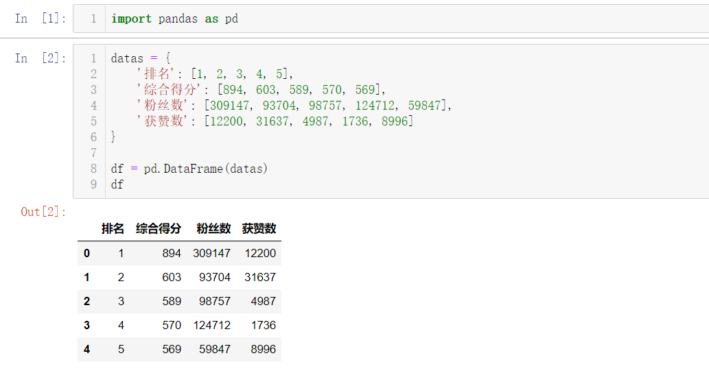
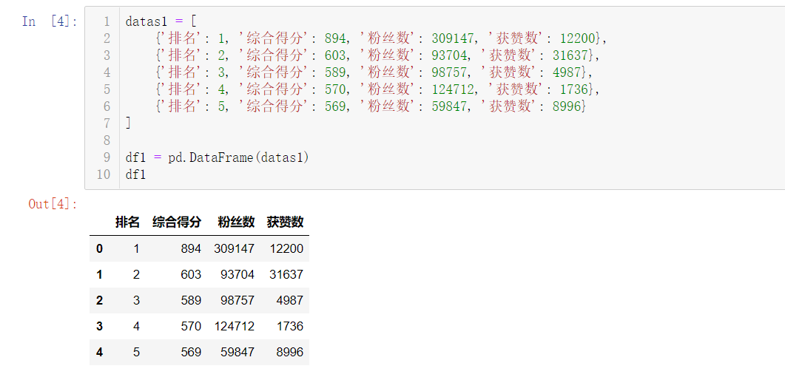
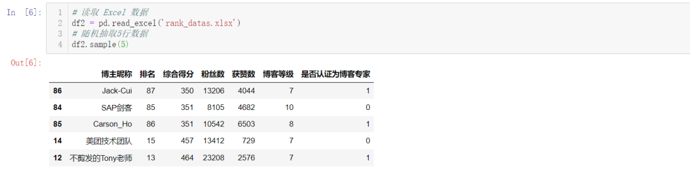
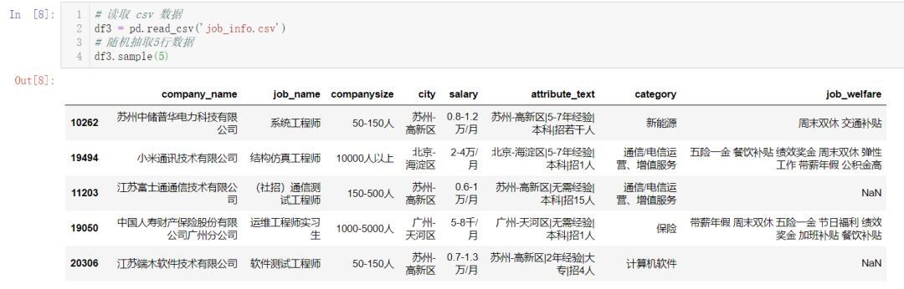
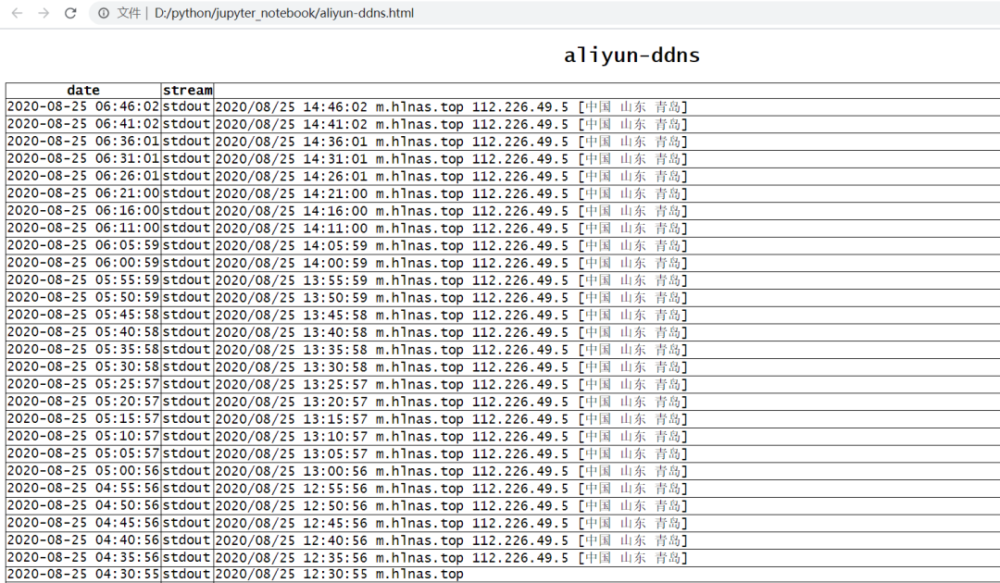
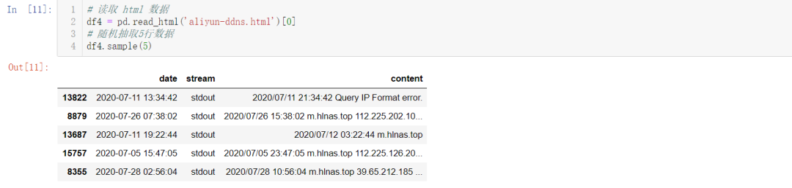
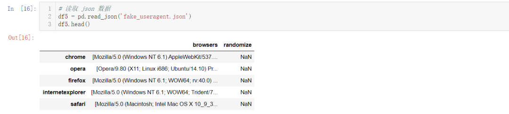

Python Pandas 
<a name="NJWtL"></a>
## 一、生成DataFrame
<a name="kSBPy"></a>
### 以字典形式生成
```python
import pandas as pd

datas = {
    '排名': [1, 2, 3, 4, 5],
    '综合得分': [894, 603, 589, 570, 569],
    '粉丝数': [309147, 93704, 98757, 124712, 59847],
    '获赞数': [12200, 31637, 4987, 1736, 8996]
}

df = pd.DataFrame(datas)
df
```
结果如下：<br />
<a name="XnSXW"></a>
### 以列表形式生成
```python
datas1 = [
    {'排名': 1, '综合得分': 894, '粉丝数': 309147, '获赞数': 12200},
    {'排名': 2, '综合得分': 603, '粉丝数': 93704, '获赞数': 31637},
    {'排名': 3, '综合得分': 589, '粉丝数': 98757, '获赞数': 4987},
    {'排名': 4, '综合得分': 570, '粉丝数': 124712, '获赞数': 1736},
    {'排名': 5, '综合得分': 569, '粉丝数': 59847, '获赞数': 8996}
]

df1 = pd.DataFrame(datas1)
df1
```
结果如下：<br /><br />在爬取数据时，保存数据如果用pandas，需要组织数据生成DataFrame，以上两种方法是很常用的，熟练掌握这两种方法在保存爬取下来的数据时很有帮助。
<a name="rpstF"></a>
## 二、读取数据
<a name="YjMUp"></a>
### `pd.read_excel()`：读取 Excel 表格数据
```python
# 读取 Excel 数据
df2 = pd.read_excel('rank_datas.xlsx')
# 随机抽取5行数据
df2.sample(5)
```

<a name="gEAOG"></a>
### `pd.read_csv()`：读取 csv 表格数据
```python
# 读取 csv 数据
df3 = pd.read_csv('job_info.csv')
# 随机抽取5行数据
df3.sample(5)
```

<a name="QLy2V"></a>
### `pd.read_html()`：读取 html 网页上的表格数据

```python
# 读取 html 数据
df4 = pd.read_html('aliyun-ddns.html')[0]
# 随机抽取5行数据
df4.sample(5)
```
结果如下：<br /><br />`pd.read_html()`这个方法虽然少用，但它的功能非常强大，有时可以用做爬虫，直接抓取网页 Table 表格型数据，得到DataFrame。
<a name="NBJKC"></a>
### `pd.read_json()`：读取 json 数据
```python
# 读取 json 数据
df5 = pd.read_json('fake_useragent.json')
df5.head()
```

<a name="FCcWA"></a>
### `pd.read_clipboard()`：从剪切板读取数据
```python
# 从剪切板读取数据
df6 = pd.read_clipboard()
df6
```
<a name="LYLFW"></a>
## 三、保存数据
<a name="Tf5P2"></a>
### `df.to_csv()`：保存到csv
```python
df6.to_csv('test_o1.csv')
```
<a name="U15u8"></a>
### `df.to_excel()`：保存到 Excel
```python
df6.to_excel('test_02.xlsx')
```
<a name="unmUU"></a>
### `df.to_html()`：保存到html
```python
df6.to_html('test_03.html')
```
