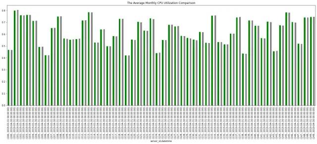

Python Pandas<br />对于 Pandas 来说，可以处理众多的数据类型，其中最有趣和最重要的数据类型之一就是时间序列数据。时间序列数据无处不在，它在各个行业都有很多应用。患者健康指标、股票价格变化、天气记录、经济指标、服务器、网络、传感器和应用程序性能监控都是时间序列数据的应用方向<br />可以将时间序列数据定义为在不同时间间隔获得并按时间顺序排列的数据点的集合<br />Pandas 基本上是为分析金融时间序列数据而开发的，并为处理时间、日期和时间序列数据提供了一整套全面的框架<br />来讨论在 Pandas 中处理日期和时间的多个方面，具体包含如下内容：

- Timestamp 和 Period 对象的功能
- 如何使用时间序列 DataFrames
- 如何对时间序列进行切片
- DateTimeIndex 对象及其方法
- 如何重新采样时间序列数据
<a name="sYH0q"></a>
## 探索 Pandas 时间戳和周期对象
Pandas 库提供了一个名为 Timestamp 的具有纳秒精度的 DateTime 对象来处理日期和时间值。Timestamp 对象派生自 NumPy 的 datetime64 数据类型，使其比 Python 的 DateTime 对象更准确而且更快。下面使用 Timestamp 构造函数创建一些 Timestamp 对象。
```python
import pandas as pd
import numpy as np
from IPython.display import display

print(pd.Timestamp(year=1982, month=9, day=4, hour=1, minute=35, second=10))
print(pd.Timestamp('1982-09-04 1:35.18'))
print(pd.Timestamp('Sep 04, 1982 1:35.18'))
```
Output:
```python
1982-09-04 01:35:10
1982-09-04 01:35:10
1982-09-04 01:35:10
```
如果将单个整数或浮点值传递给 Timestamp 构造函数，它会返回一个时间戳，该时间戳等于 Unix 纪元（1970 年 1 月 1 日）之后的纳秒数：
```python
print(pd.Timestamp(5000))
```
Output:
```python
1970-01-01 00:00:00.000005
```
Timestamp 对象包含许多方法和属性，可访问时间戳的不同功能。尝试一下：
```python
time_stamp = pd.Timestamp('2022-02-09')
print('{}, {} {}, {}'.format(time_stamp.day_name(), time_stamp.month_name(), time_stamp.day, time_stamp.year))
```
Output:
```python
Wednesday, February 9, 2022
```
Timestamp 类的一个实例代表一个时间点，而 Period 对象的一个实例代表一个时期，例如一年、一个月等<br />例如，公司在一年的时间里监控他们的收入。Pandas 库提供了一个名为 Period 的对象来处理，如下所示：
```python
year = pd.Period('2021')
display(year)
```
Output:
```python
Period('2021', 'A-DEC')
```
可以看到它创建了一个代表 2021 年期间的 Period 对象，而“A-DEC”表示该期间是年度的，在 12 月结束<br />Period 对象提供了许多有用的方法和属性。例如，如果要返回期间的开始和结束时间，可以使用以下属性：
```python
print('Start Time:', year.start_time)
print('End Time:', year.end_time)
```
Output:
```python
Start Time: 2021-01-01 00:00:00
End Time: 2021-12-31 23:59:59.999999999
```
要创建每月期间，可以将特定月份传递给它，如下所示
```python
month = pd.Period('2022-01')
display(month)
print('Start Time:', month.start_time)
print('End Time:', month.end_time)
```
Output:
```python
Period('2022-01', 'M')

Start Time: 2022-01-01 00:00:00
End Time: 2022-01-31 23:59:59.999999999
```
“M”表示周期的频率是每月一次。还可以使用 freq 参数显式指定周期的频率。下面的代码创建了一个代表 2022 年 1 月 1 日期间的期间对象：
```python
day = pd.Period('2022-01', freq='D')
display(day)
print('Start Time:', day.start_time)
print('End Time:', day.end_time)
```
Output:
```python
Period('2022-01-01', 'D')

Start Time: 2022-01-01 00:00:00
End Time: 2022-01-01 23:59:59.999999999
```
还可以对周期对象执行算术运算。创建一个每小时频率的新 period 对象，看看如何进行计算：
```python
hour = pd.Period('2022-02-09 16:00:00', freq='H')
display(hour)
display(hour + 2)
display(hour - 2)
```
Output:
```python
Period('2022-02-09 16:00', 'H')

Period('2022-02-09 18:00', 'H')

Period('2022-02-09 14:00', 'H')
```
可以使用 Pandas 日期偏移量获得相同的结果：
```python
display(hour + pd.offsets.Hour(+2))
display(hour + pd.offsets.Hour(-2))
```
Output:
```python
Period('2022-02-09 18:00', 'H')

Period('2022-02-09 14:00', 'H')
```
要创建日期序列，可以使用 pandas `range_dates()` 方法。在代码片段中尝试一下：
```python
week = pd.date_range('2022-2-7', periods=7)
for day in week:
    print('{}-{}\t{}'.format(day.day_of_week, day.day_name(), day.date()))
```
Output:
```python
0-Monday    2022-02-07
1-Tuesday   2022-02-08
2-Wednesday 2022-02-09
3-Thursday  2022-02-10
4-Friday    2022-02-11
5-Saturday  2022-02-12
6-Sunday    2022-02-13
```
week 的数据类型是 DatetimeIndex 对象，一周中的每个日期都是 Timestamp 的一个实例。所以可以使用所有适用于 Timestamp 对象的方法和属性
<a name="pSVd4"></a>
## 创建时间序列数据框
首先，通过从 CSV 文件中读取数据来创建一个 DataFrame，该文件包含与连续 34 天每小时记录的 50 台服务器相关的关键信息：
```python
df = pd.read_csv('https://raw.githubusercontent.com/m-mehdi/pandas_tutorials/main/server_util.csv')
display(df.head())
```
Output:
```python
	datetime	server_id	cpu_utilization	free_memory	session_count
0	2019-03-06 00:00:00	100	0.40	0.54	52
1	2019-03-06 01:00:00	100	0.49	0.51	58
2	2019-03-06 02:00:00	100	0.49	0.54	53
3	2019-03-06 03:00:00	100	0.44	0.56	49
4	2019-03-06 04:00:00	100	0.42	0.52	54
```
看一下 DataFrame 的内容。每个 DataFrame 行代表服务器的基本性能指标，包括特定时间戳的 CPU 利用率、可用内存和会话计数。DataFrame 分解为一小时的片段。例如，从午夜到凌晨 4 点记录的性能指标位于 DataFrame 的前五行<br />现在，详细了解一下 DataFrame 的特性，例如它的大小和每列的数据类型：
```python
print(df.info())
```
Output:
```python
<class 'pandas.core.frame.DataFrame'>
RangeIndex: 40800 entries, 0 to 40799
Data columns (total 5 columns):
 #   Column           Non-Null Count  Dtype  
---  ------           --------------  -----  
 0   datetime         40800 non-null  object 
 1   server_id        40800 non-null  int64  
 2   cpu_utilization  40800 non-null  float64
 3   free_memory      40800 non-null  float64
 4   session_count    40800 non-null  int64  
dtypes: float64(2), int64(2), object(1)
memory usage: 1.6+ MB
None
```
运行上面的语句会返回行数和列数、总内存使用量、每列的数据类型等<br />根据上面的信息，datetime 列的数据类型是对象，这意味着时间戳存储为字符串值。要将 datetime 列的数据类型从 string 对象转换为 datetime64 对象，可以使用 pandas 的 `to_datetime()` 方法，如下：
```python
df['datetime'] = pd.to_datetime(df['datetime'])
```
当通过导入 CSV 文件创建 DataFrame 时，日期/时间值被视为字符串对象，而不是 DateTime 对象。pandas `to_datetime()` 方法将存储在 DataFrame 列中的日期/时间值转换为 DateTime 对象。将日期/时间值作为 DateTime 对象使操作它们变得更加容易。运行以下语句并查看更改：
```python
print(df.info())
```
Output:
```python
<class 'pandas.core.frame.DataFrame'>
RangeIndex: 40800 entries, 0 to 40799
Data columns (total 5 columns):
 #   Column           Non-Null Count  Dtype         
---  ------           --------------  -----         
 0   datetime         40800 non-null  datetime64[ns]
 1   server_id        40800 non-null  int64         
 2   cpu_utilization  40800 non-null  float64       
 3   free_memory      40800 non-null  float64       
 4   session_count    40800 non-null  int64         
dtypes: datetime64[ns](1), float64(2), int64(2)
memory usage: 1.6 MB
None
```
现在 datetime 列的数据类型是 datetime64[ns] 对象。[ns] 表示基于纳秒的时间格式，它指定 DateTime 对象的精度<br />此外，可以让 pandas 的 `read_csv()` 方法将某些列解析为 DataTime 对象，这比使用 `to_datetime()` 方法更直接。尝试一下：
```python
df = pd.read_csv('https://raw.githubusercontent.com/m-mehdi/pandas_tutorials/main/server_util.csv', parse_dates=['datetime'])
print(df.head())
```
Output:
```python
   datetime  server_id  cpu_utilization  free_memory  session_count
0 2019-03-06 00:00:00        100             0.40         0.54             52
1 2019-03-06 01:00:00        100             0.49         0.51             58
2 2019-03-06 02:00:00        100             0.49         0.54             53
3 2019-03-06 03:00:00        100             0.44         0.56             49
4 2019-03-06 04:00:00        100             0.42         0.52             54
```
运行上面的代码会创建一个 DataFrame，其中 datetime 列的数据类型是 DateTime 对象<br />下面对 datetime 列应用一些基本方法<br />首先，看看如何在 DataFrame 中返回最早和最晚的日期。为此，可以简单地在 datetime 列上应用 `max()` 和 `min()` 方法，如下所示：
```python
display(df.datetime.min())
display(df.datetime.max())
```
Output:
```python
Timestamp('2019-03-06 00:00:00')

Timestamp('2019-04-08 23:00:00')
```
要选择两个特定日期之间的 DataFrame 行，可以创建一个布尔掩码并使用 `.loc` 方法过滤特定日期范围内的行：
```python
mask = (df.datetime >= pd.Timestamp('2019-03-06')) & (df.datetime < pd.Timestamp('2019-03-07'))
display(df.loc[mask])
```
Output:
```python
datetime	server_id	cpu_utilization	free_memory	session_count
0	2019-03-06 00:00:00	100	0.40	0.54	52
1	2019-03-06 01:00:00	100	0.49	0.51	58
2	2019-03-06 02:00:00	100	0.49	0.54	53
3	2019-03-06 03:00:00	100	0.44	0.56	49
4	2019-03-06 04:00:00	100	0.42	0.52	54
…	…	…	…	…	…
40003	2019-03-06 19:00:00	149	0.74	0.24	81
40004	2019-03-06 20:00:00	149	0.73	0.23	81
40005	2019-03-06 21:00:00	149	0.79	0.29	83
40006	2019-03-06 22:00:00	149	0.73	0.29	82
40007	2019-03-06 23:00:00	149	0.75	0.24	84
1200 rows × 5 columns
```
<a name="GY1lE"></a>
## 切片时间序列
为了使时间戳切片成为可能，需要将 datetime 列设置为 DataFrame 的索引。要将列设置为 DataFrame 的索引，请使用 set_index 方法：
```python
df.set_index('datetime', inplace=True)
print(df)
```
Output:
```python
 datetime    server_id  cpu_utilization  free_memory  session_count
2019-03-06 00:00:00        100             0.40         0.54             52
2019-03-06 01:00:00        100             0.49         0.51             58
2019-03-06 02:00:00        100             0.49         0.54             53
2019-03-06 03:00:00        100             0.44         0.56             49
2019-03-06 04:00:00        100             0.42         0.52             54
...                        ...              ...          ...            ...
2019-04-08 19:00:00        149             0.73         0.20             81
2019-04-08 20:00:00        149             0.75         0.25             83
2019-04-08 21:00:00        149             0.80         0.26             82
2019-04-08 22:00:00        149             0.75         0.29             82
2019-04-08 23:00:00        149             0.75         0.24             80

[40800 rows x 4 columns]
```
要使用 `.loc` 方法选择等于单个索引的所有行：
```python
print(df.loc['2019-03-07 02:00:00'].head(5))
```
Output:
```python
 datetime       server_id  cpu_utilization  free_memory  session_count
2019-03-07 02:00:00        100             0.44         0.50             56
2019-03-07 02:00:00        101             0.78         0.21             87
2019-03-07 02:00:00        102             0.75         0.27             80
2019-03-07 02:00:00        103             0.76         0.28             85
2019-03-07 02:00:00        104             0.74         0.24             77
```
可以选择与索引列中的特定时间戳部分匹配的行。尝试一下：
```python
print(df.loc['2019-03-07'].head(5))
```
Output:
```python
 datetime      server_id  cpu_utilization  free_memory  session_count
2019-03-07 00:00:00        100             0.51         0.52             55
2019-03-07 01:00:00        100             0.46         0.50             49
2019-03-07 02:00:00        100             0.44         0.50             56
2019-03-07 03:00:00        100             0.45         0.52             51
2019-03-07 04:00:00        100             0.42         0.50             53
```
选择字符串可以是任何标准的日期格式，来看一些例子：
```python
df.loc['Apr 2019']
df.loc['8th April 2019']
df.loc['April 05, 2019 5pm']
```
还可以使用 .loc 方法对日期范围内的行进行切片。以下语句将返回从 2019 年 4 月 3 日到 2019 年 4 月 4 日结束的所有行；开始日期和结束日期都包括在内：
```python
display(df.loc['03-04-2019':'04-04-2019'])
```
但是运行它会引发一个令人讨厌的未来警告。为了摆脱警告，可以在切片行之前对索引进行排序：
```python
display(df.sort_index().loc['03-04-2019':'04-04-2019'])
```
Output:
```python
datetime	server_id	cpu_utilization	free_memory	session_count
2019-03-06 00:00:00	100	0.40	0.54	52
2019-03-06 00:00:00	135	0.50	0.55	55
2019-03-06 00:00:00	110	0.54	0.40	61
2019-03-06 00:00:00	136	0.58	0.40	64
2019-03-06 00:00:00	109	0.57	0.41	61
…	…	…	…	…
2019-04-04 23:00:00	143	0.43	0.52	50
2019-04-04 23:00:00	111	0.53	0.52	59
2019-04-04 23:00:00	149	0.75	0.24	85
2019-04-04 23:00:00	138	0.40	0.56	47
2019-04-04 23:00:00	107	0.63	0.33	73
36000 rows × 4 columns
```
<a name="VvN0c"></a>
## DateTimeIndex 方法
某些 pandas DataFrame 方法仅适用于 DateTimeIndex。下面来具体看一下，首先确保 DataFrame 有一个 DateTimeIndex：
```python
print(type(df.index))
```
Output:
```python
<class 'pandas.core.indexes.datetimes.DatetimeIndex'>
```
要返回在特定时间收集的服务器监控数据，无论日期如何，请使用 at_time() 方法：
```python
display(df.at_time('09:00'))
```
Output:
```python
datetime	server_id	cpu_utilization	free_memory	session_count
2019-03-06 09:00:00	100	0.48	0.51	51
2019-03-07 09:00:00	100	0.45	0.49	56
2019-03-08 09:00:00	100	0.45	0.53	53
2019-03-09 09:00:00	100	0.45	0.51	53
2019-03-10 09:00:00	100	0.49	0.55	55
…	…	…	…	…
2019-04-04 09:00:00	149	0.75	0.21	80
2019-04-05 09:00:00	149	0.71	0.26	83
2019-04-06 09:00:00	149	0.75	0.30	83
2019-04-07 09:00:00	149	0.81	0.28	77
2019-04-08 09:00:00	149	0.82	0.24	86
1700 rows × 4 columns
```
此外，要选择所有日期午夜和凌晨 2 点之间的所有服务器数据，可以使用 `between_time()` 方法。尝试一下：
```python
display(df.between_time('00:00','02:00'))
```
Output:
```python
datetime	server_id	cpu_utilization	free_memory	session_count
2019-03-06 00:00:00	100	0.40	0.54	52
2019-03-06 01:00:00	100	0.49	0.51	58
2019-03-06 02:00:00	100	0.49	0.54	53
2019-03-07 00:00:00	100	0.51	0.52	55
2019-03-07 01:00:00	100	0.46	0.50	49
…	…	…	…	…
2019-04-07 01:00:00	149	0.74	0.21	78
2019-04-07 02:00:00	149	0.76	0.26	74
2019-04-08 00:00:00	149	0.75	0.28	75
2019-04-08 01:00:00	149	0.69	0.27	79
2019-04-08 02:00:00	149	0.78	0.20	85
5100 rows × 4 columns
```
可以使用 `first()` 方法根据特定的日期偏移量选择第一个 DataFrame 行。例如，将 5B 作为日期偏移量传递给该方法会返回前五个工作日内具有索引的所有行。同样，将 1W 传递给 `last()` 方法会返回上周内所有带有索引的 DataFrame 行。需要注意的是，必须按其索引对 DataFrame 进行排序，以确保这些方法有效。试试这两个例子：
```python
display(df.sort_index().first('5B'))
```
Output:
```python
datetime	server_id	cpu_utilization	free_memory	session_count
2019-03-06	100	0.40	0.54	52
2019-03-06	135	0.50	0.55	55
2019-03-06	110	0.54	0.40	61
2019-03-06	136	0.58	0.40	64
2019-03-06	109	0.57	0.41	61
…	…	…	…	…
2019-03-12	134	0.53	0.45	61
2019-03-12	144	0.68	0.31	73
2019-03-12	113	0.76	0.24	83
2019-03-12	114	0.58	0.48	67
2019-03-12	131	0.58	0.42	67
7250 rows × 4 columns

display(df.sort_index().last('1W'))
```
Output:
```python
datetime	server_id	cpu_utilization	free_memory	session_count
2019-04-08 00:00:00	106	0.44	0.62	49
2019-04-08 00:00:00	112	0.72	0.29	81
2019-04-08 00:00:00	100	0.43	0.54	51
2019-04-08 00:00:00	137	0.75	0.28	83
2019-04-08 00:00:00	110	0.61	0.40	62
…	…	…	…	…
2019-04-08 23:00:00	128	0.64	0.41	64
2019-04-08 23:00:00	127	0.67	0.33	78
2019-04-08 23:00:00	126	0.71	0.33	73
2019-04-08 23:00:00	123	0.71	0.22	83
2019-04-08 23:00:00	149	0.75	0.24	80
1200 rows × 4 columns

df.sort_index().last('2W')
```
Output:
```python
datetime	server_id	cpu_utilization	free_memory	session_count
2019-04-01 00:00:00	120	0.54	0.48	63
2019-04-01 00:00:00	104	0.73	0.31	83
2019-04-01 00:00:00	103	0.77	0.22	82
2019-04-01 00:00:00	124	0.39	0.55	49
2019-04-01 00:00:00	127	0.68	0.37	73
…	…	…	…	…
2019-04-08 23:00:00	128	0.64	0.41	64
2019-04-08 23:00:00	127	0.67	0.33	78
2019-04-08 23:00:00	126	0.71	0.33	73
2019-04-08 23:00:00	123	0.71	0.22	83
2019-04-08 23:00:00	149	0.75	0.24	80
9600 rows × 4 columns
```
<a name="UFH9b"></a>
## 重新采样时间序列数据
`resample()` 方法背后的逻辑类似于 `groupby()` 方法。它在任何可能的时间段内对数据进行分组。虽然可以使用 `resample()` 方法进行上采样和下采样，将重点介绍如何使用它来执行下采样，这会降低时间序列数据的频率——例如，将每小时的时间序列数据转换为每日或 每日时间序列数据到每月<br />以下示例返回服务器 ID 100 每天的平均 CPU 利用率、可用内存和活动会话计数。为此，首先需要过滤 DataFrame 中服务器 ID 为 100 的行，然后将每小时数据重新采样为每日数据。最后，对结果应用 `mean()` 方法，得到三个指标的每日平均值：
```python
df[df.server_id == 100].resample('D')['cpu_utilization', 'free_memory', 'session_count'].mean()
```
Output:
```python
datetime	cpu_utilization	free_memory	session_count
2019-03-06	0.470417	0.535417	53.000000
2019-03-07	0.455417	0.525417	53.666667
2019-03-08	0.478333	0.532917	54.541667
2019-03-09	0.472917	0.523333	54.166667
2019-03-10	0.465000	0.527500	54.041667
2019-03-11	0.469583	0.528750	53.916667
2019-03-12	0.475000	0.533333	53.750000
2019-03-13	0.462917	0.521667	52.541667
2019-03-14	0.472083	0.532500	54.875000
2019-03-15	0.470417	0.530417	53.500000
2019-03-16	0.463750	0.530833	54.416667
2019-03-17	0.472917	0.532917	52.041667
2019-03-18	0.475417	0.535000	53.333333
2019-03-19	0.460833	0.546667	54.791667
...
```
还可以通过链接 `groupby()` 和 `resample()` 方法来查看每个服务器 ID 的相同结果。以下语句返回每个服务器每月的最大 CPU 利用率和可用内存。尝试一下：
```python
df.groupby(df.server_id).resample('M')['cpu_utilization', 'free_memory'].max()
```
Output:
```python
server_id	datetime	cpu_utilization	free_memory
100	2019-03-31	0.56	0.62
2019-04-30	0.55	0.61
101	2019-03-31	0.91	0.32
2019-04-30	0.89	0.30
102	2019-03-31	0.85	0.36
…	…	…	…
147	2019-04-30	0.61	0.57
148	2019-03-31	0.84	0.35
2019-04-30	0.83	0.34
149	2019-03-31	0.85	0.36
2019-04-30	0.83	0.34
100 rows × 2 columns
```
下面绘制每个服务器每月的平均 CPU 利用率，能够充分了解每个服务器的平均 CPU 利用率在几个月内的变化
```python
import matplotlib.pyplot as plt
fig, ax = plt.subplots(figsize=(24, 8))
df.groupby(df.server_id).resample('M')['cpu_utilization'].mean()\
.plot.bar(color=['green', 'gray'], ax=ax, title='The Average Monthly CPU Utilization Comparison')
```
Output:
```python
<AxesSubplot:title={'center':'The Average Monthly CPU Utilization Comparison'}, xlabel='server_id,datetime'>
```

<a name="ZhF5F"></a>
## 总结
Pandas 是一种出色的分析工具，尤其是在处理时间序列数据时。该库提供了广泛的工具来处理时间索引的 DataFrame。
