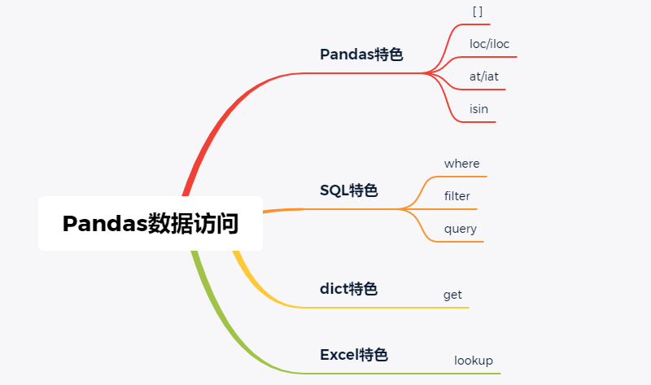
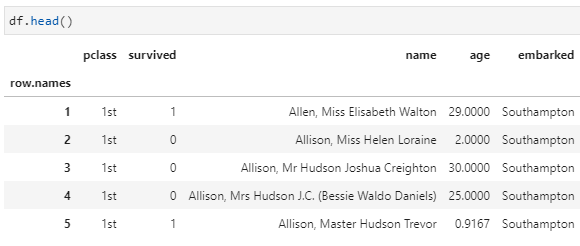
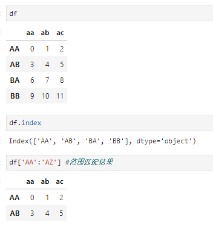
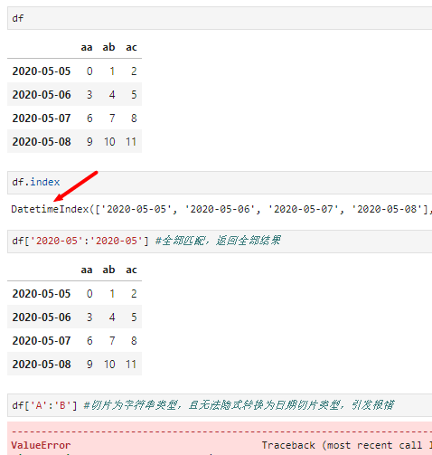
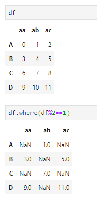
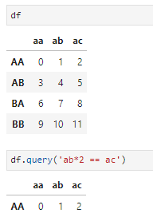
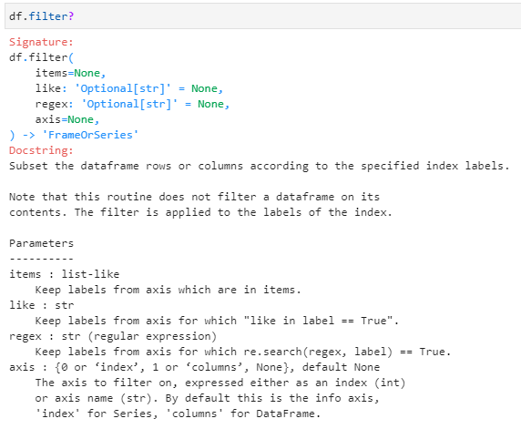
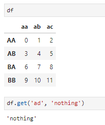
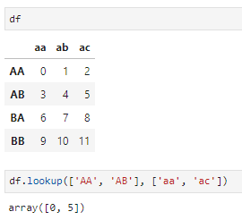

PythonPandas  Pandas中的核心数据结构是DataFrame，所以在讲解数据访问前有必要充分认清和深刻理解DataFrame这种数据结构。以下面经典的titanic数据集为例，可以从两个方面特性来认识DataFrame： 

1. DataFrame是一个行列均由多个Series组成的二维数据表框，其中Series可看做是一个一维向量。理解这一点很重要，因为如果把DataFrame看做是一个集合类型的话，那么这个集合的元素泛型即为Series；
2. DataFrame可看做是一个二维嵌套的dict，其中第一层dict的key是各个列名；而每个dict内部则是一个以各行索引为key的子dict。当然，这里只是将其"看做"而非等价，是因为其与一个严格的dict还是有很大区别的，一个很重要的形式上区别在于：DataFrame的列名是可以重复的，而dict的key则是不可重复的。

认识了这两点，那么就很容易理解DataFrame中数据访问的若干方法，比如：

1. [ ]，这是一种最常用的数据访问方式，某种意义上沿袭了Python中的语法糖特色。通常情况下，[]常用于在DataFrame中获取单列、多列或多行信息。具体而言：
- 当在[]中提供单值或多值（多个列名组成的列表）访问时按列进行查询，单值访问不存在列名歧义时还可直接用属性符号" . "访问
- 切片形式访问时按行进行查询，又区分数字切片和标签切片两种情况：当输入数字索引切片时，类似于普通列表切片；当输入标签切片时，执行**范围查询**（即无需切片首末值存在于标签列中），包含两端标签结果，无匹配行时返回为空，但要求标签切片类型与索引类型一致。例如，当标签列类型（可通过df.index.dtype查看）为时间类型时，若使用无法隐式转换为时间的字符串作为索引切片，则引发报错

 

2. loc/iloc，可能是除[]之外最为常用的两种数据访问方法，其中loc按标签值（列名和行索引取值）访问、iloc按数字索引访问，均支持单值访问或切片查询。与[ ]访问类似，loc按标签访问时也是执行范围查询，包含两端结果。
3. at/iat，其实是可看分别做为loc和iloc的一种特殊形式，只不过不支持切片访问，仅可用于单值提取，即指定单个标签值或单个索引值进行访问，一般返回标量结果，除非标签值存在重复。
4. isin，条件范围查询，一般是对某一列判断其取值是否在某个可迭代的集合中。即根据特定列值是否存在于指定列表返回相应的结果。
5. where，妥妥的Pandas仿照SQL中实现的算子命名。不过这个命名其实是非常直观且好用的，如果熟悉Spark则会自然联想到在Spark中其实数据过滤主要就是用给的where算子。这里仍然是执行条件查询，但与直观不大相符的是这里会返回全部结果，只是将不满足匹配条件的结果赋值为NaN或其他指定值，可用于筛选或屏蔽值。

6. query，提到query，还得多说两句。前面受where容易使人联想到SQL，其实提到query让人想到的仍然是SQL，因为SQL=Structed Query Language，所以query用在DataFrame中其实是提供了一种以类SQL语法执行数据访问的方式，这对熟悉SQL的使用者来说非常有帮助！当然，这种用法一般都可用常规的条件查询替代。

7. filter，说完where和query，其实还有一个表面上很类似的查询功能，那就是filter。在Spark中，filter是where的别名算子，即二者实现相同功能；但在pandas的DataFrame中却远非如此。在DataFrame中，filter是用来读取特定的行或列，并支持三种形式的筛选：固定列名(items)、正则表达式(regex)以及模糊查询(like)，并通过axis参数来控制是行方向或列方向的查询。这里给出其文档简介，很容易理解其功能：

8. get。由于DataFrame可看做是嵌套dict结构，所以也提供了类似字典中的get()方法，主要适用于不确定数据结构中是否包含该标签时，与字典的get方法非常类似：

9. lookup。如果说提到query自然联想到SQL，那么提到lookup自然会想到的就是Excel了。实际上，DataFrame中的lookup执行的功能与Excel中的lookup函数差距还是挺大的，初学之时颇有一种挂羊头卖狗肉的感觉。实际上，这里的lookup可看做是loc的一种特殊形式，即分别传入一组行标签和列标签，lookup解析成一组行列坐标，返回相应结果：

 最后，pandas中提供了非常灵活多样的数据访问形式，可以说是兼顾了嵌套Series和嵌套dict的双重特性，但最为常用的其实还是[]、loc和iloc这几种方法，而对于where、query、isin等在某些情况下也会非常高效，但对于filter、get、lookup以及at/iat等其实则并不常用。
