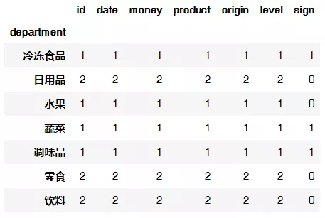
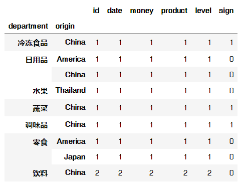

Pandas
<a name="8nnvY"></a>
## 1、导入模块
```python
import pandas as pd      # 这里用到的是pandas和numpy两个模块
import numpy as np
```
<a name="0ytRE"></a>
## 2、创建数据集并读取
<a name="b015592a"></a>
### 2.1 创建数据集
构造一个超市购物的数据集，该数据集属性包括：订单ID号（id）、订单日期（date）、消费金额（money）、订单商品（product）、商品类别（department）、商品产地（origin）。
```python
# 列表和字典均可传入DataFrame，我这里用的是字典传入：
data=pd.DataFrame({
    "id":np.arange(101,111),                                # np.arange会自动输出范围内的数据，这里会输出101~110的id号。
    "date":pd.date_range(start="20200310",periods=10),      # 输出日期数据，设置周期为10，注意这里的周期数应该与数据条数相等。
    "money":[5,4,65,-10,15,20,35,16,6,20],                  # 设置一个-10的坑，下面会填（好惨，自己给自己挖坑，幸亏不准备跳~）
    "product":['苏打水','可乐','牛肉干','老干妈','菠萝','冰激凌','洗面奶','洋葱','牙膏','薯片'],
    "department":['饮料','饮料','零食','调味品','水果',np.nan,'日用品','蔬菜','日用品','零食'],                # 再设置一个空值的坑
    "origin":['China',' China','America','China','Thailand','China','america','China','China','Japan']     # 再再设置一个america的坑
})
data              # 输出查看数据集
```
输出结果：<br />
<a name="M0bgq"></a>
### 2.2 数据写入和读取
```python
data.to_csv("shopping.csv",index=False)       # index=False表示不加索引，否则会多一行索引
data=pd.read_csv("shopping.csv")
```
<a name="nTVpz"></a>
## 3、数据查看
<a name="lYM5g"></a>
### 3.1 数据集基础信息查询
```python
data.shape            # 行数列数
data.dtypes           # 所有列的数据类型
data['id'].dtype      # 某一列的数据类型
data.ndim             # 数据维度
data.index            # 行索引
data.columns          # 列索引
data.values           # 对象值
```
<a name="lmasF"></a>
### 3.2 数据集整体情况查询
```python
data.head()    # 显示头部几行（默认5行）
data.tail()    # 显示末尾几行（默认5行）
data.info()    # 数据集相关信息概览：索引情况、列数据类型、非空值、内存使用情况
data.describe()    # 快速综合统计结果
```
<a name="EDBKt"></a>
## 4、数据清洗
<a name="e77f6dba"></a>
### 4.1 查看异常值
当然，现在这个数据集很小，可以直观地发现异常值，但是在数据集很大的时候，用下面这种方式查看数据集中是否存在异常值。
```python
for i in data:
    print(i+": "+str(data[i].unique()))      # 查看某一列的唯一值
```
输出结果：可以发现，该数据集中money存在一个负值，department存在一个空值以及origin存在大小写问题。<br />
<a name="2qMlj"></a>
### 4.2 空值处理
<a name="6e6Xy"></a>
#### 4.2.1 空值检测
`data.isnull()` 查看整个数据集的空值<br />`data['department'].isnull()` 查看某一列的空值
```python
data.isnull()                # 查看整个数据集的空值
data['department'].isnull()  # 查看某一列的空值
```
输出结果：<br /><br />将空值判断进行汇总，更加直观，`ascending`默认为`True`，升序。
```python
data.isnull().sum().sort_values(ascending=False)
```
输出结果：<br /><br />更多关于`pandas.DataFrame.sort_values`<br />的用法，查看官方链接：[https://pandas.pydata.org/pandas-docs/stable/reference/api/pandas.DataFrame.sort_values.html](https://pandas.pydata.org/pandas-docs/stable/reference/api/pandas.DataFrame.sort_values.html)
<a name="YmeLv"></a>
#### 4.2.2 空值处理
```python
pandas.DataFrame.fillna（value = None，method = None，inplace = False）
```

- `value`：用于填充的值，可以是具体值、字典和数组，不能是列表；
- `method`：填充方法，有 ffill 和 bfill 等；
- `inplace`默认无False，如果为True，则将修改此对象上的所有其他视图。

更多关于`pandas.DataFrame.fillna`<br />的用法，查看官方链接：[https://pandas.pydata.org/pandas-docs/stable/reference/api/pandas.DataFrame.fillna.html](https://pandas.pydata.org/pandas-docs/stable/reference/api/pandas.DataFrame.fillna.html)
```python
data['department'].fillna(method="ffill")    # 填充上一个值，即填充“水果”
```
输出结果：<br />
```python
data['department'].fillna(method="bfill")    # 填充下一个值，即填充"日用品"
data['department'].fillna(value="冷冻食品",inplace=True)    # 替换为具体值，并且在原对象值上进行修改
```
输出结果：<br />
<a name="81ecbd0f"></a>
### 4.3 空格处理
只针对object类型数据
```python
for i in data:                                    # 遍历数据集中的每一列
    if pd.api.types.is_object_dtype(data[i]):     # 如果是object类型的数据，则执行下方代码
        data[i]=data[i].str.strip()               # 去除空格
data['origin'].unique()                           # 验证一下
```
输出结果：`array(['China', 'America', 'Thailand', 'america', 'Japan'], dtype=object)`
<a name="WI9e5"></a>
### 4.4 大小写转换
```python
data['origin'].str.title()         # 将首字母大写
data['origin'].str.capitalize()    # 将首字母大写
data['origin'].str.upper()         # 全部大写
data['origin'].str.lower()         # 全部小写
```
<a name="740eb6d8"></a>
### 4.5 数据替换
```python
data['origin'].replace("america","America",inplace=True)    # 将第一个值替换为第二个值，inplace默认为False
data['origin']
```
输出结果：<br />
```python
data['money'].replace(-10,np.nan,inplace=True)                    # 将负值替换为空值
data['money'].replace(np.nan,data['money'].mean(),inplace=True)   # 将空值替换为均值
data['money']
```
输出结果：<br />
<a name="YgRJL"></a>
### 4.6 数据删除
<a name="DWw9C"></a>
#### 方法一
```python
data1 = data[data.origin != 'American'] #去掉origin为American的行
data1
data2=data[(data != 'Japan').all(1)]    #去掉所有包含Japan的行    不等于Japan的行为真，则返回
data2
```
<a name="MWvO0"></a>
#### 方法二
```python
data['origin'].drop_duplicates()      # 默认删除后面出现的重复值，即保留第一次出现的重复值
```
输出结果：<br />
```python
data['origin'].drop_duplicates(keep='last')   # 删除前面出现的重复值，即保留最后一次出现的重复值
```
输出结果：<br />
> 更多关于`pandas.DataFrame.drop_duplicates`
> 的用法，查看官方链接：[https://pandas.pydata.org/pandas-docs/stable/reference/api/pandas.DataFrame.drop_duplicates.html#pandas.DataFrame.drop_duplicates](https://pandas.pydata.org/pandas-docs/stable/reference/api/pandas.DataFrame.drop_duplicates.html#pandas.DataFrame.drop_duplicates)

<a name="i5Rgx"></a>
### 4.7 数据格式转换
```python
data['id'].astype('str')    # 将id列的类型转换为字符串类型。
```
常见的数据类型对照<br />
<a name="hNENJ"></a>
### 4.8 更改列名称
```python
data.rename(columns={'id':'ID', 'origin':'产地'})     # 将id列改为ID，将origin改为产地。
```
输出结果：<br /> 
<a name="B2lpt"></a>
## 5、数据预处理
先创建一个data2数据集
```python
data2=pd.DataFrame({
    "id":np.arange(102,105),
    "profit":[1,10,2]
})
data2
```
输出结果：<br /><br />再创建一个data3数据集
```python
data3=pd.DataFrame({
    "id":np.arange(111,113),
    "money":[106,51]
})
data3
```
输出结果：<br />
<a name="04a5ef89"></a>
### 5.1 数据的合并
<a name="9nqid"></a>
#### 用`merge`合并
```python
DataFrame.merge(self，right，how =‘inner’，on = None)
```

- `right`指要合并的对象
- `on`指要加入的列或索引级别名称，必须在两个DataFrame中都可以找到。
- `how`决定要执行的合并类型：`left`（使用左框架中的键）、`right`、`inner`（交集，默认）、`outer`（并集）
```python
data_new=pd.merge(data,data2,on='id',how='inner')      # 默认取交集
data_new=pd.merge(data,data2,on='id',how='outer')      # 取并集，没有值的地方填充NaN
data.merge(data2,on='id',how='inner')                  # 另一种写法,输出结果见下方
```
输出结果：<br /><br />更多关于`pandas.DataFrame.merge`的用法，查看官方链接：[https://pandas.pydata.org/pandas-docs/stable/reference/api/pandas.DataFrame.merge.html](https://pandas.pydata.org/pandas-docs/stable/reference/api/pandas.DataFrame.merge.html)
```python
data.merge(data2,on='id',how='left')     # 使用左框架中的键
```
输出结果：<br />
<a name="QGHkk"></a>
#### 用`append`合并
```python
data.append(data2)    # 在原数据集的下方合并入新的数据集
```
输出结果：<br />
<a name="hyEgw"></a>
#### 用`join`合并
用下面这种方式会报错：列重叠，且没有指定后缀，因为上面的数据data和data2都有“id”列，所以需要给id列指明后缀。
```python
data.join(data2)        # 会报错
```
第一种修改方式：
```python
data.join(data2,lsuffix='_data', rsuffix='_data2')
```
输出结果：<br /><br />第二种修改方式：
```python
data.set_index('id').join(data2.set_index('id'))
```
输出结果：<br /><br />更多关于`pandas.DataFrame.join`<br />的用法，查看官方链接：[https://pandas.pydata.org/pandas-docs/stable/reference/api/pandas.DataFrame.join.html](https://pandas.pydata.org/pandas-docs/stable/reference/api/pandas.DataFrame.join.html)
<a name="oy5hB"></a>
#### 用`concat`合并
```python
pandas.concat(objs,axis = 0,ignore_index = False,keys = None)
```

- `objs`：Series，DataFrame或Panel对象的序列或映射。
- `axis`：串联的轴，默认为0，即以索引串联（竖直拼接）；如果为1，则以列串联（水平拼接）
- `ignore_index`：清除现有索引并将其重置，默认为False。
- `key`：在数据的最外层添加层次结构索引。
```python
data_new=pd.concat([data,data2,data3],axis = 1,keys=['data', 'data2','data3'])
data_new
```
输出结果：<br /><br />更多关于`pandas.concat`<br />的用法，查看官方链接：[https://pandas.pydata.org/pandas-docs/version/0.23.4/generated/pandas.concat.html](https://pandas.pydata.org/pandas-docs/version/0.23.4/generated/pandas.concat.html)
<a name="0vnye"></a>
### 5.2 设置索引列
```python
data.set_index("id")      # 设置id为索引列
```
输出结果：<br />
```python
data.reset_index(drop=True)    # 重置索引列，并且避免将旧索引添加为列
```
输出结果：<br />
<a name="AKXvg"></a>
### 5.3 按照特定列的值排序
按照索引列进行排序：
```python
data.sort_index()
```
按照money的值进行排序：
```python
data.sort_values(by="money",ascending = True)    # ascending默认为True，即升序.
```
输出结果：<br />
<a name="0fueN"></a>
### 5.4 分类显示
如果money列的值>=10, level列显示high，否则显示low：
```python
data['level'] = np.where(data['money']>=10, 'high', 'low')
data
```
输出结果：<br />
<a name="nOUdC"></a>
### 5.5 分组标记
```python
data.loc[(data['level']=="high") & (data['origin']=="China"),"sign"]="棒"
data
```
输出结果：<br />
<a name="BG50i"></a>
### 5.6 切割数据
对date字段的值依次进行分列，并创建数据表，索引值为data的索引列，列名称为year\month\day。
```python
data_split = pd.DataFrame((x.split('-') for x in data['date']), index=data.index, columns=['year','month','day'])
data_split
```
输出结果：<br /><br />再与原数据表进行匹配：
```python
pd.concat([data,data_split],axis=1)
```
输出结果：<br />
<a name="bZ7qD"></a>
## 6、数据提取
下面这部分会比较绕：<br />loc函数按标签值进行提取，iloc按位置进行提取`pandas.DataFrame.loc()` 允许输入的值：

- 单个标签，例如5或’a’，（请注意，5被解释为索引的标签，而不是沿索引的整数位置）。
- 标签列表或数组，例如。[‘a’, ‘b’, ‘c’]
- 具有标签的切片对象，例如’a’:‘f’，切片的开始和结束都包括在内。

更多关于`pandas.DataFrame.loc`<br />的用法，查看官方链接：[https://pandas.pydata.org/pandas-docs/stable/reference/api/pandas.DataFrame.loc.html#pandas.DataFrame.loc](https://pandas.pydata.org/pandas-docs/stable/reference/api/pandas.DataFrame.loc.html#pandas.DataFrame.loc)
```python
pandas.DataFrame.iloc()
```
允许输入的值：整数5、整数列表或数组[4,3,0]、整数的切片对象1:7<br />更多关于`pandas.DataFrame.iloc`<br />的用法，查看官方链接：[https://pandas.pydata.org/pandas-docs/stable/reference/api/pandas.DataFrame.iloc.html#pandas.DataFrame.iloc](https://pandas.pydata.org/pandas-docs/stable/reference/api/pandas.DataFrame.iloc.html#pandas.DataFrame.iloc)
<a name="Mjd9G"></a>
### 6.1 单行索引
```python
data.loc[6]    # 提取索引值为6的那一行（即输出第7行）
```
输出结果：<br />
```python
data.iloc[6]    # 提取第7行
```
输出结果同上！
<a name="7hG2L"></a>
### 6.2 区域索引
<a name="JaU8C"></a>
#### 6.2.1 用loc取连续的多行
提取索引值为2到索引值为4的所有行，即提取第3行到第5行，注意：此时切片的开始和结束都包括在内。
```python
data.loc[2:4]
```
输出结果：<br /><br />提取“2020-03-13”之前的所有数据
```python
data.loc[:"2020-03-13"]
```
输出结果：<br />
<a name="asKmV"></a>
#### 6.2.2 用`loc`取不连续的多行
提取索引值为2和索引值为4的所有行，即提取第3行和第5行。
```python
data.loc[[2,4]]
```
输出结果：<br />
<a name="ma3Fy"></a>
#### 6.2.3 用`loc`取具体值
```python
data.loc[6,"id"]
```
输出结果：107
<a name="UyXAQ"></a>
#### 6.2.4 用`iloc`取连续的多行
提取第3行到第6行
```python
data.iloc[2:6]
```
输出结果：<br />
<a name="JjXzw"></a>
#### 6.2.5 用`iloc`取连续的多行和多列
提取第3行到第6行，第4列到第5列的值，取得是行和列交叉点的位置。
```python
data.iloc[2:6,3:5]
```
输出结果：<br />
<a name="Cq0AG"></a>
#### 6.2.6 用`iloc`取不连续的多行和多列
提取第3行和第6行，第4列和第5列的交叉值
```python
data.iloc[[2,6],[3,5]]
```
输出结果：<br />
<a name="lANn1"></a>
#### 6.2.7 用`iloc`取具体值
提取第3行第7列的值
```python
data.iloc[2,6]
```
输出结果：‘high’<br />总结：文字变代码，数值少1；代码变文字，数值加1；代码从0开始计数；文字从1开始计数。
<a name="IWKoq"></a>
### 6.3 值的判断
<a name="4ctXR"></a>
#### 方式一：判断origin列的值是否为China
```python
data['origin']=="China"
```
<a name="QTQ5q"></a>
#### 方式二：判断department列的值是否为水果
```python
data['department'].isin(['水果'])
```
输出结果：<br />
```python
data['department'].isin(['水果']).sum()     # 对判断后的值进行汇总
```
输出结果：1
<a name="hZ1tq"></a>
### 6.4 提取符合判断的值
```python
data.loc[data['origin'].isin(['Thailand'])]    # 将产地是泰国的数据进行提取
```
输出结果：<br />
<a name="Cnwxn"></a>
## 7、数据筛选
<a name="YCsoK"></a>
### 7.1 使用与、或、非进行筛选
将满足origin是China且money小于35这两个条件的数据，返回其id、date、money、product、department、origin值。
```python
data.loc[(data['origin']=="China") & (data['money']<35),['id','date','money','product','department','origin']]
```
输出结果：<br /><br />将满足origin是China或者money小于35这两个条件之中任意一个条件的数据，返回其id、date、money、product、department、origin值。
```python
data.loc[(data['origin']=="China") | (data['money']<35),['id','date','money','product','department','origin']]
```
输出结果：<br /><br />将满足origin是China且money不小于10这两个条件的数据，返回其id、date、money、product、department、origin值。
```python
data.loc[(data['origin']=="China") != (data['money']<10),['id','date','money','product','department','origin']]
```
输出结果：<br />
<a name="bVBUD"></a>
### 7.2 使用query函数进行筛选
```python
data.query('department=="饮料"')              # 单个条件筛选
data.query('department==["饮料","零食"]')     # 多个条件筛选
```
输出结果：<br /><br />更多关于`pandas.DataFrame.query`<br />的用法，查看官方链接：[https://pandas.pydata.org/pandas-docs/stable/reference/api/pandas.DataFrame.query.html](https://pandas.pydata.org/pandas-docs/stable/reference/api/pandas.DataFrame.query.html)
<a name="VlBrN"></a>
### 7.3 对结果进行计数求和
```python
data.query('department=="饮料"').count()         # 对饮料类型的数据进行筛选后计数
data.query('department=="饮料"').money.count()   # 对筛选后的数据按照money进行计数
```
输出结果：2
```python
data.query('department=="饮料"').money.sum()    # 在筛选后的数据中，对money进行求和
```
输出结果：9.0
<a name="JPtsL"></a>
## 8、数据汇总
<a name="YNigm"></a>
### 8.1 以department属性对所有列进行计数汇总
```python
data.groupby("department").count()
```
输出结果：<br />
<a name="LyKuP"></a>
### 8.2 以department属性分组之后，对id字段进行计数汇总
```python
data.groupby("department")['id'].count()
```
输出结果：<br />
<a name="zFymX"></a>
### 8.3 以两个属性进行分组计数
```python
data.groupby(["department","origin"]).count()
```
输出结果：<br />
<a name="sKRE1"></a>
### 8.4 以department属性进行分组汇总并计算money的合计与均值
```python
data.groupby("department")['money'].agg([len, np.sum, np.mean])
```
输出结果：<br />
<a name="cJogI"></a>
## 9、数据统计
<a name="ljcoo"></a>
### 9.1 数据采样
```python
pandas.DataFrame.sample(n = None,replace = False,weights = None)
```

- n：样本数
- replace：样本有无更换（有无放回）（默认不放回）
- weights：权重

更多关于`pandas.DataFrame.sample`<br />的用法，查看官方链接：[https://pandas.pydata.org/pandas-docs/version/0.17.0/generated/pandas.DataFrame.sample.html](https://pandas.pydata.org/pandas-docs/version/0.17.0/generated/pandas.DataFrame.sample.html)
```python
data.sample(3,replace=True,weights=[0.1,0.1,0.2,0.2,0.1,0.1,0.1,0.1,0,0])
```
输出结果：<br />
<a name="ES8TH"></a>
### 9.2 描述性统计
```python
data.describe().round(2).T      # round表示小数位数，T表示转置（这一函数之前提及过）
```
输出结果：<br />
<a name="jMvjO"></a>
### 9.3 计算标准差
```python
data['money'].std()
```
输出结果：18.14754345175493
<a name="t34bb"></a>
### 9.4 计算协方差
```python
data.cov()
```
输出结果：<br />
<a name="h3fa7"></a>
### 9.5 相关性分析
```python
data.corr()
```
输出结果：<br />
