Python Pandas
<a name="bb7rW"></a>
## 1、ExcelWriter
使用`ExcelWriter()`可以向同一个excel的不同sheet中写入对应的表格数据，首先要创建一个`writer`对象，传入的主要参数为文件名及其路径
```python
import pandas as pd

a = pd.DataFrame({
    "a": [1, 2, 3, 4, 5],
    "b": [2, 5, 6, 8, 10],
})
b = pd.DataFrame({
    "c": [5, 2, 3, 1, 4],
    "d": [2, 5, 7, 8, 10],
})

# 写入到同一个excel当中去
with pd.ExcelWriter("data.xlsx") as writer:

    a.to_excel(writer, sheet_name="a_sheet", index = False)
    b.to_excel(writer, sheet_name="b_sheet", index = False)
```
<a name="jy5Wx"></a>
## 2、`pipe`
`pipe()`方法可以将一连串的函数以链式的结构嵌套在数据集当中，例如一个脏数据集当中有重复值、空值和极值等等，分别建立了3个函数来`"drop_duplicates"`，`"remove_outliers"`和`"fill_nans"`分别处理上面提到的3个问题，然后用`pipe()`方法将这三个函数以链式的结构串联起来，作用在同一个数据集上面，代码如下图所示
```python
df_preped = (df.pipe(drop_duplicates).
             pipe(remove_outliers, ['price', 'carat', 'depth']).
             pipe(encode_categoricals, ['cut', 'color', 'clarity'])
            )
```
<a name="r9EBq"></a>
## 3、`explode`
可以通过一个简单的例子来说明一下该函数的作用，
```python
df = pd.Series(
    [1, 6, 7, [46, 56, 49], 45, [15, 10, 12]]
).to_frame("dirty")
```
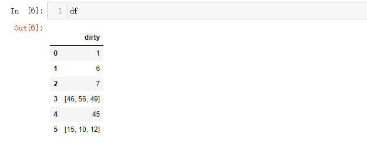
```python
df.explode("dirty", ignore_index=True)
```
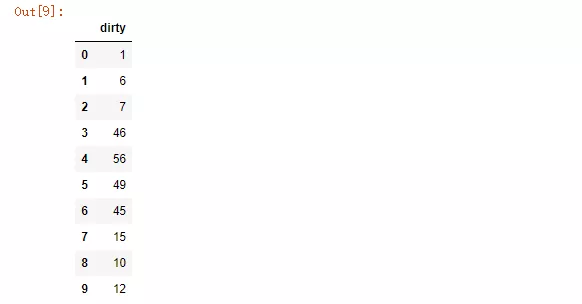<br />要是遇到一行的数据当中含有多个元素，`explode()`方法可以将这一行的数据展开到多行，`ignore_index = True`，意味着数据展开来之后，索引也会逐行地递增
<a name="ppgE6"></a>
## 4、`between`
`between`是用来提取出给定范围当中的值的，看下面的例子
```python
data = {'name': ['John', 'Mike', 'Tom', 'Greg', 'Jim'],
        'income': [8000, 9000, 10000, 10000, 20000],
        'age': [20, 24, 25, 23, 28]}
df = pd.DataFrame(data)
```
挑选出收入在8000到10000范围之内的数据
```python
df[df['income'].between(8000, 10000, inclusive='neither')]
```
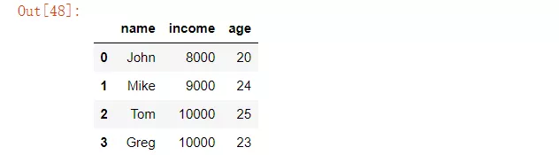
<a name="XLswK"></a>
## 5、`convert_dtypes`
pandas当中的`convert_dtypes`可以自动推断数据类型并且进行转化，例如
```python
df = pd.DataFrame(
    {'a':[1,2,3],
     'b':[0.55,0.66,1.55],
     'c':['Jack','Tony','Posi']}
)
df.dtypes
```
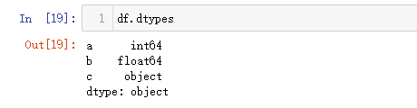
```python
df.convert_dtypes().dtypes
```
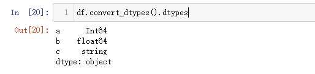
<a name="F5M8s"></a>
## 6、`select_dtypes`
pandas当中的`select_dtypes()`方法功能是返回那些指定数据类型的列，当中的`include`顾名思义就是筛选出指定数据类型的列,例如下面挑选出是bool数据类型的数据来
```python
a = pd.DataFrame({
    "a": [1, 2, 3, 4, 5],
    "b": [True, False, False, True, True],
    "c": ["John", "Tom", "Mike", "Jim", "Dylan"]
})
a.select_dtypes(include='bool')
```
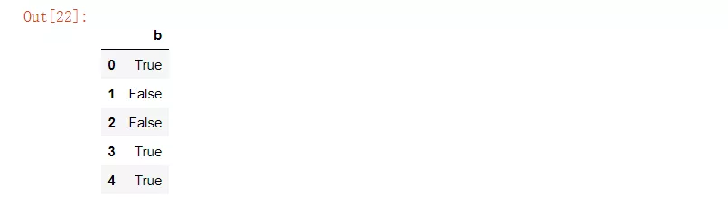<br />而`exclude`就是排除掉指定数据类型的数据，将其他类型的数据筛选出来
```python
a.select_dtypes(exclude='bool')
```
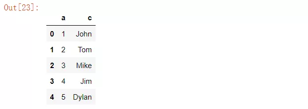
<a name="opAPN"></a>
## 7、`mask`
pandas当中的`mask()`方法主要是对按照指定的条件，对数据集当中的数据进行替换，例如下面数据集当中对于大于0的数据替换成0
```python
df = pd.DataFrame({"A":[12, 4, 5, 44, 1], 
                   "B":[5, 2, 54, 3, 2], 
                   "C":[20, 16, 7, 3, 8], 
                   "D":[14, 3, 17, 2, 6]}) 
```
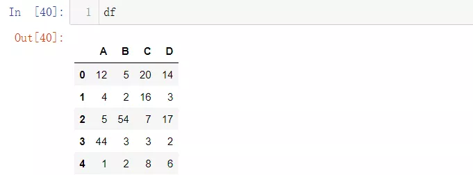
```python
# 将大于10的数字替换成0
df.mask(df > 10, 0)
```
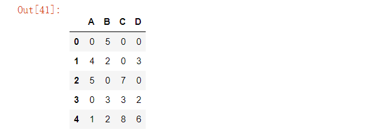
<a name="fs1cK"></a>
## 8、`nlargest`和`nsmallest`
`nlargest`和`nsmallest`的作用在于可以看到根据特定的列排序的最大或者是最小的若干列，例如
```python
data = {'name': ['John', 'Mike', 'Tom', 'Greg', 'Jim'],
        'income': [2500, 4500, 5000, 3000, 2000],
        'age': [20, 24, 25, 23, 28]}
df = pd.DataFrame(data)
```
按照`income`这一列将数据排序，并且显示出最大的前3行
```python
df.nlargest(3, 'income')
```

<a name="tRD8O"></a>
## 9、`idxmax`和`idxmin`
主要用来返回最大值或者是最小值的位置，也就是索引值
```python
data = {'income': [8000, 9000, 10000, 10000, 20000],
        'age': [20, 24, 25, 23, 28]}
df = pd.DataFrame(data, index = ['John', 'Mike', 'Tom', 'Greg', 'Jim'])
```
<br />找出`income`最高和最低的那个人是谁
```python
df['income'].idxmax()
>>>> Jim

df['income'].idxmin()
>>> John
```
<a name="BOgOg"></a>
## 10、`clip`
在给出指定范围的前提下，对于数据集当中超出该范围的值进行更改，例如将范围限定在-4到6之间，超过6的数字会被设置为6，超过-4的数字会被设置为-4
```python
data = {'col_0': [9, -3, 0, -1, 5],
        'col_1': [-2, -7, 6, 8, -5]}
df = pd.DataFrame(data)
```
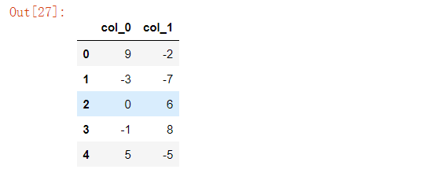
```python
df.clip(-4, 6)
```
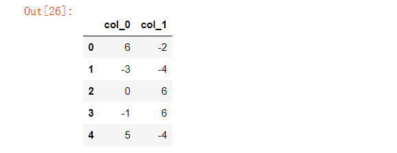
<a name="Aa6iW"></a>
## 11、`at_time`和`between_time`
pandas当中`at_time()`方法和`between_time()`方法主要是用来处理时间序列的数据，根据给出的时间点或者时间范围来筛选出数据
```python
index = pd.date_range("2021-08-01", periods=100, freq="H")
data = pd.DataFrame({"col": list(range(100))}, index=index)
data.head()
```
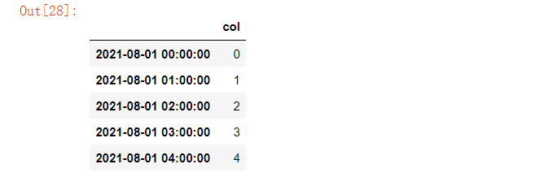<br />筛选出那些下午2点的数据
```python
data.at_time("14:00")
```
当然可以使用`between_time`这个方法来挑选出某个时间范围内的数
```python
data.between_time("11:00", "12:00")
```
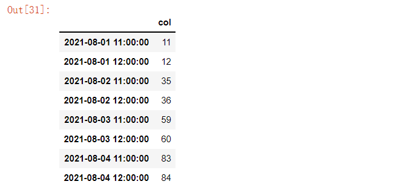
<a name="GIqVD"></a>
## 12、`at`和`iat`
一般用pandas当中的`loc`和`iloc`比较多，用来筛选出想要的数据，而`at`和`iat`也能够实现`loc`和`iloc`的功能，而且更加的快捷
```python
data = {'name': ['John', 'Mike', 'Tom', 'Greg', 'Jim'],
        'income': [8000, 9000, 10000, 10000, 20000],
        'age': [20, 24, 25, 23, 28]}
df = pd.DataFrame(data)
```
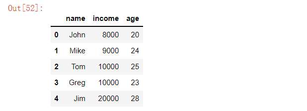
```python
# [index, label]
df.at[1, "income"]
>>> 9000

# [index, index]
df.iat[2, 3]
>>> 1000
```
<a name="WjAg5"></a>
## 13、pandas styler
pandas还能够对数据集当中的数据进行上色，可以通过该方法将某些觉得重要的数据给标注出来，例如对数据集中每列的最大值和最小值标注出来
```python
df = pd.DataFrame(np.random.randn(5, 5), columns=list('ABCDE'))

# 我们标注出最大、最小的值
df.style.highlight_max(color = "yellow")
```
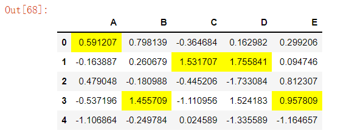<br />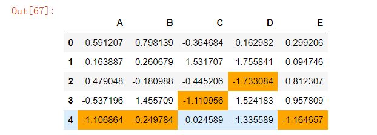
<a name="NSvvC"></a>
## 14、`hasnans`
假如数据集当中存在空值，可以用`hasnans`方法来检查，要是有空值，则返回True，反之则返回False
```python
s = pd.Series([2, 4, 6, "abcde", np.nan])
s.hasnans
>>>> True
```
