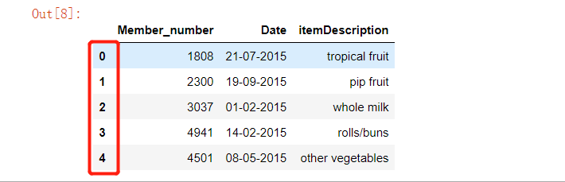
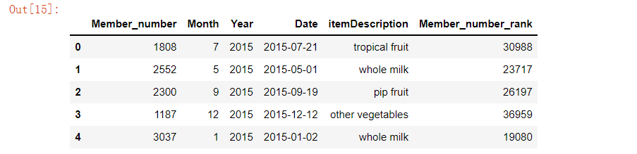

Python Pandas
<a name="VbpJS"></a>
## 1、读取数据
Pandas当中的`read_csv`的方法能够去读取csv类型的文件，然后转化成类似于表格形式的`dataframe`，
```python
marketing = pd.read_csv("DirectMarketing.csv")
groceries = pd.read_csv("Groceries_dataset.csv")
df = pd.read_csv("Churn_Modelling.csv")
```
要是只想展示一部分，比方说其中几行的数据，当然也可以这么来操作
```python
df = pd.read_csv("Churn_Modelling.csv", nrows = 5000)
df.shape
(5000,14)
```
当然其中几列的数据，也可以这么来操作，例如下面的代码选中“Gender”、“Age”以及“Tensure”等几列
```python
df1 = pd.read_csv("Churn_Modelling.csv", usecols=['Gender', 'Age', 'Tenure', 'Balance'])
```
<a name="yovu0"></a>
## 2、查看缺失值
要是想要看一下数据集当中的缺失值的话，可以，
```python
groceries.isna().sum()

Member_number      0
Date               0
itemDescription    0
dtype: int64
```
<a name="KSyKq"></a>
## 3、填充缺失值
下面来填充数据集当中的缺失值，有很多种方式方法来填充数据集当中的缺失值，比方说中位数、平均数、众数等等
```python
# 这里用的是众数来填充，当然也可以用平均数mean，中位数median
groceries['itemDescription'].fillna(value=groceries['itemDescription'].mode()[0], inplace=True)

# 或者是用"fillna"这个方法
groceries["Date"].fillna(method = "ffill", inplace = True)
```
假若想把这些缺失值给抹去，也很好来操作，使用`"drop"`方法，`"inplace=True"`表明原数组内容直接被改变
```python
groceries.drop(axis = 0, how = 'any', inplace = True)
```
<a name="DX6wl"></a>
## 4、查看某一列的数据类型
首先来查看一下数据集当中每一列的数据类型，
```python
groceries.dtypes

Member_number       int64
Date               object
itemDescription    object
dtype: object
```
可以看到的是，“Date”这一列的数据类型是“object”，可以通过“`astype`”这个方法来改变这一列的数据类型
```python
groceries['Date'] = groceries['Date'].astype("datetime64")
```
当然还有“`to_datetime`”这个方法来尝试
```python
groceries['Date'] = pd.to_datetime(groceries['Date'])
```
除此之外，在读取数据的时候，也可以通过里面的参数“`parse_dates`”来改变这一列的数据类型
```python
groceries = pd.read_csv("Groceries_dataset.csv", parse_dates=['Date'])
groceries.dtypes

Member_number               int64
Date               datetime64[ns]
itemDescription            object
dtype: object
```
<a name="RzOZi"></a>
## 5、筛选出数据
通常来说有很多种方式方法来筛选数据以得出想要的结果，比方说可以通过一些逻辑符号“==”、“！=”或者是“>”“<”等方式,例如下面的代码便是挑选出“itemDescription”等于是“pip fruit”的数据
```python
groceries[groceries["itemDescription"] == "pip fruit"].head()
```
<br />当然还有“`isin`”这个方法来从一定的范围内选出数据，能够传入一个列表，在列表中注明要筛选的数据，例如下面的代码，筛选出“Member_number”在这些范围当中的数据
```python
groceries[groceries.Member_number.isin([3737, 2433, 3915, 2625])].head()
```
<br />“`query`”这个方法也可以帮助到我们
```python
groceries.query('3000 < Member_number < 5000').head()
```
<br />“`where`”这个方法也行
```python
groceries[['Member_number','Date', 'itemDescription']].where(groceries['Member_number'] > 2500, 0).head()

```

<a name="aRKhd"></a>
## 6、排除数据
“`~`”符号用来表明需要筛选出不在给定的范围之内的数据，比方说下面的代码筛选出“Member_number”不再这些范围当中的数据
```python
groceries[~groceries.Member_number.isin([3737, 2433, 3915, 2625])].head()
```

<a name="imG07"></a>
## 7、数据统计
“`value_counts`”方法是被使用最广泛的工具，在数据统计和计数当中，计算一下该列当中每大类的离散值出现的频率
```python
marketing["OwnHome"].value_counts()

Own     516
Rent    484
Name: OwnHome, dtype: int64
```
要是将其中的参数“normalize”改成“True”，它也将以百分比的形式出现，
```python
marketing.Catalogs.value_counts(normalize=True)

12    0.282
6     0.252
24    0.233
18    0.233
```
除此之外，也可以用“`nunique`”这个方法来查看某一列离散值当中有几大类，例如下面的代码中“OwnHome”这一列只有两大类
```python
marketing["OwnHome"].nunique()

2
```
<a name="c97L5"></a>
## 8、将某一列作为索引
一般数据集中的索引大家可以理解为就是“行数”，也就是“第一行”、“第二行”，当然可以通过“set_index”这个方法来将任意某一列设置为需要的索引，比方说数据集中的“Date”字段被设置成了索引
```python
groceries.set_index('Date', inplace=True)
```

<a name="wQJtf"></a>
## 9、重新设置索引
当去除掉某几行数据之后，数据集当中的索引会出现“断裂”的情况，同理当合并两个数据集的时候，索引也不会被重新设置，要是上面的情况出现，数据集中的索引便不是“连续”的了，可以通过“`reset_index`”来重新设置索引，例如下面的数据集的索引并不是连续的<br />
```python
groceries.reset_index(drop=True, inplace=True)
```

<a name="q4nhR"></a>
## 10、关于“`loc`”和“`iloc`”
“`loc`”方法和“`iloc`”方法用法想类似，其中比较重要的一点是“`loc`”方法一般可以接受标签，例如
```python
groceries.loc[:,["Member_number", "Date"]].head()
```
<br />而“`iloc`”里面要是放标签的话，则会报错，一般“`iloc`”里面放的则是索引，
```python
# 取第一列和第二列两列的数据
groceries.iloc[:,[0, 1]].head()
```

<a name="eXq2P"></a>
## 11、提取“月份”和“年份”
可以通过“`dt`”这个方法来提取时间类型的数据中的年份和月份，例如
```python
groceries['Year'] = groceries['Date'].dt.year
groceries['Month'] = groceries['Date'].dt.month
```

<a name="IPVUz"></a>
## 12、去除某几列的数据
要是碰到想去除掉某几列的数据的时候，可以使用“`drop`”方法，例如，去除掉“Year”和“Month”这两列
```python
groceries.drop(['Year','Month'], axis=1, inplace=True)
```

<a name="rTdM4"></a>
## 13、增加某几列的数据
要是想在数据集当中增加几列的时候，可以使用“`insert`”方法，例如，在第一列和第二列的位置插入“Month”数据和“Year”的数据
```python
year = groceries['Date'].dt.year
month = groceries['Date'].dt.month

groceries.insert(1, 'Month', month)
groceries.insert(2, 'Year', year)
```

<a name="cCjOa"></a>
## 14、排名统计
可以为某一列数据做一个排名，使用“`rank`”这个方法
```python
groceries['Member_number_rank'] = groceries['Member_number'].rank(method = 'first', ascending = False).astype('int')
```

<a name="fLvdj"></a>
## 15、展示小数点后面的几位小数
数据集当中对于浮点型的数字，小数点后面可能仍然会有很多的数字，可以通过“`round`”方法来进行调整，例如保留一位小数
```python
df.round(1).head()
```

<a name="YB1nx"></a>
## 16、基于字符串去筛选数据
有时候需要基于字符串去进行数据的筛选，例如，要筛选出下面的数据集当中顾客的名字是以“Mi”开头的顾客，可以这么来做
```python
df[df['Surname'].str.startswith('Mi')].head()
```

<a name="rHr5D"></a>
## 17、基于字符串的长度来筛选数据
有时候也可以通过字符串的长度来筛选数据，例如通过下面的代码筛选出“itemDescription”这个字段长度大于20的数据
```python
groceries[groceries.itemDescription.str.len() > 20].head()
```

<a name="eh80d"></a>
## 18、对离散值类型的数据进行分离
可以对离散值类型的某一列数据，当中是字符串的数据，进行分离，例如遇到“Date”这一列当中的数据是字符串，然后可以通过“`split`”这个方法来进行字符串的分离，例如下面的代码将“Date”这一列当中的月份数据给分离出来了
```python
groceries['Month'] = groceries['Date'].str.split('-', expand=True)[1]
```

<a name="oVzbU"></a>
## 19、画图
可以在已有数据集的基础上，通过“`plot`”这个方法以及里面的参数“`kind`”来进行可视化，例如想要画直方图的话
```python
df['Balance'].plot(kind='hist', figsize=(10,6), title='Customer Balance')
```

<a name="xtnao"></a>
## 20、标注重点
有时候可能需要对数据集当中某些数据打标签，表上颜色来显示其重要性，在“Pandas”模块中有“style”这个方法可以使用，例如下面的代码将“Salary”以及“Catalogs”这两列的最大值标出来了
```python
df_new.style.highlight_max(axis = 0, color = "yellow")
```

