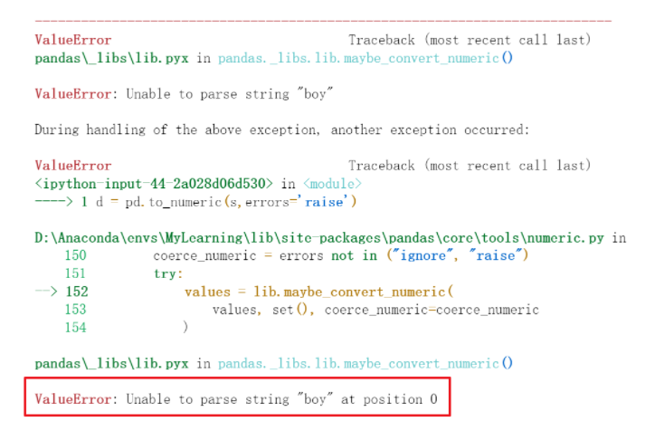
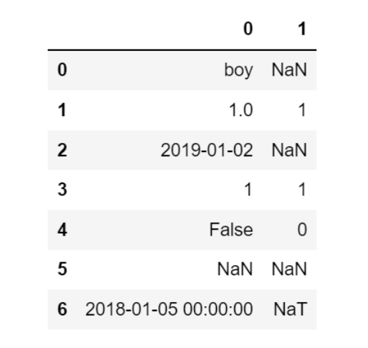

Pyhton Pandas
<a name="pD2kl"></a>
## 一、变量类型及转换
对于变量的数据类型而言，Pandas除了数值型的int 和 float类型外，还有`object `，`category`，`bool`，`datetime`类型。<br />另外，空值类型作为一种特殊类型，需要单独处理。<br />数据处理的过程中，经常需要将这些类型进行互相转换，下面介绍一些变量类型转换的常用方法。
<a name="L9u2q"></a>
### 1、查询变量类型
在数据处理的过程中，针对不同的数据类型会有不同的处理方法，比如数值型可以做加减乘除，但是字符型、时间类型就需要其它处理方法。为此，首先需要将各种数据类型进行区分，然后再分别处理。<br />pandas中`select_dtype`函数可以特征变量进行快速分类，具体用法如下：
```python
DataFrame.select_dtypes(include=None, exclude=None)
```

- `include`：列表，想要留下的数据类型，比如float64，int64，bool，object等
- `exclude`：列表，需要排除的数据类型，同上。
```python
df = pd.DataFrame({'a': [1, 2] * 3,
                   'b': [True, False] * 3,
                   'c': [1.0, 2.0] * 3,
                   'd': ['a','b']*3})
# 筛选float和int的数值类型变量
num_list = df.select_dtypes(include=['float','int64']).columns.tolist()
# 筛选ojbect字符型的数值类型变量
obj_list = df.select_dtypes(include=['object']).columns.tolist()

print(obj_list)
print(num_list)

>> ['d']
>> ['a', 'c']
```
`include`和`exclude`也可以组合使用筛选。<br />如果想要查看所有变量的数据类型，可以通过`info`快速查看，如下：
```python
df.info()
>><class 'pandas.core.frame.DataFrame'>
RangeIndex: 6 entries, 0 to 5
Data columns (total 4 columns):
 #   Column  Non-Null Count  Dtype  
---  ------  --------------  -----  
 0   a       6 non-null      int64  
 1   b       6 non-null      bool   
 2   c       6 non-null      float64
 3   d       6 non-null      object 
dtypes: bool(1), float64(1), int64(1), object(1)
memory usage: 278.0+ bytes
```
<a name="aTXrQ"></a>
### 2、转换数值类型
数值类型包括`int`和`float`。<br />转换数据类型比较通用的方法可以用`astype`进行转换。<br />pandas中有种非常便利的方法`to_numeric()`可以将其它数据类型转换为数值类型。
```python
pandas.to_numeric(arg, errors='raise', downcast=None)
```

- `arg`：被转换的变量，格式可以是list,tuple,1-d array,Series
- `errors`：转换时遇到错误的设置，ignore, raise, coerce，下面例子中具体讲解
- `downcast`：转换类型降级设置，比如整型的有无符号signed/unsigned，和浮点float

下面例子中，s是一列数据，具有多种数据类型，现在想把它转换为数值类型。
```python
import pandas as pd
import numpy as np

s = pd.Series(['boy', '1.0', '2019-01-02', 1, False, None, pd.Timestamp('2018-01-05')])

# 默认错位格式为raise，遇到非数字字符串类型报错
pd.to_numeric(s, errors='raise') 
```

```python
# 错位格式为ignore，只对数字字符串转换, 其他类型一律忽视不转换, 包含时间类型
pd.to_numeric(s, errors='ignore')
```

```python
# 将时间字符串和bool类型强制转换为数字, 其他均转换为NaN
pd.to_numeric(s, errors='coerce')  
```

```python
# downcast 可以进一步转化为int或者float
pd.to_numeric(s) # 默认float64类型
pd.to_numeric(s, downcast='signed') # 转换为整型
```
<a name="sfBcn"></a>
### 3、转换字符类型
数字转字符类型非常简单，可以简单的使用str直接转换。
```python
df = pd.DataFrame({'year': [2015, 2016],
                   'month': [2, 3],
                   'day': [4, 5]})
df['month'] = df['month'].map(str) 
df.info()
>><class 'pandas.core.frame.DataFrame'>
RangeIndex: 2 entries, 0 to 1
Data columns (total 3 columns):
 #   Column  Non-Null Count  Dtype 
---  ------  --------------  ----- 
 0   year    2 non-null      int64 
 1   month   2 non-null      object
 2   day     2 non-null      int64 
dtypes: int64(2), object(1)
memory usage: 176.0+ bytes
```
此外这里再延伸一下，**去掉字符类型**的方法`eval`。<br />比如，当遇到`'[1,2,3]'`这种情况的时候，实际想获取里面的列表，但是现在却是个字符串类型，可以使用`eval`函数将`''`这个外套直接去掉，去掉后自动转换成里面数据类型。
```python
a = '[1,2,3]'
type(a) 
>> str

eval(a)
>> [1, 2, 3]
```
<a name="tWDeL"></a>
### 4、转换时间类型
使用`to_datetime`函数将数据转换为日期类型，用法如下:
```python
pandas.to_datetime(arg, errors='raise', dayfirst=False, yearfirst=False, utc=None, box=True, format=None, exact=True, unit=None, infer_datetime_format=False, origin='unix')
```
参数比较多，常用的就是format，按照指定的字符串strftime格式解析日期，一般情况下该函数可以直接自动解析成日期类型。
```python
# 对整个dataframe转换，将年月日几列自动合并为日期
df = pd.DataFrame({'year': [2015, 2016],
                   'month': [2, 3],
                   'day': [4, 5]}) 
df
>> year month day
0 2015 2 4
1 2016 3 5

pd.to_datetime(df)
>>
0   2015-02-04
1   2016-03-05
dtype: datetime64[n
s]

# 对单列转换日期类型
df1 = pd.DataFrame({'appl_tm':['20220401','20220402','20220403'],
                    'appl_tm1':['2012.03.04','2021.09.04','2031.06.05']})
>>df1
    appl_tm     appl_tm1
0 20220401 2012.03.04
1 20220402 2021.09.04
2 20220403 2031.06.05 

df1['appl_tm'] = pd.to_datetime(df1['appl_tm'])
df1['appl_tm1'] = pd.to_datetime(df1['appl_tm1'], format='%Y.%m.%d')
>>df1
    appl_tm     appl_tm1
0 2022-04-01 2012-03-04
1 2022-04-02 2021-09-04
2 2022-04-03 2031-06-05
```
转换为日期类型后，就可以对日期使用`series.dt.`方法进行更复杂的筛选和查询了。
```python
# 筛选2021年的日期,month和day也是同理
df1['appl_tm1'].dt.year == 2021
>>
0    False
1     True
2    False
Name: appl_tm1, dtype: bool 

df1[df1['appl_tm1'].dt.year == 2021]
>>
    appl_tm     appl_tm1
1 2022-04-02 2021-09-04
```
<a name="KjPmc"></a>
### 5、转换`category`类型
`category`类型在pandas中的出场率并不是很高，一般在不考虑优化效率时，会用其它类型替代。但如果需要转换category类型，可以直接使用`astype`完成。
```python
df = pd.DataFrame({'year': [2015, 2016],
                   'month': [2, 3],
                   'day': [4, 5]}) 
df['year'] = df['year'].astype('category')
df.info()
>><class 'pandas.core.frame.DataFrame'>
RangeIndex: 2 entries, 0 to 1
Data columns (total 3 columns):
 #   Column  Non-Null Count  Dtype   
---  ------  --------------  -----   
 0   year    2 non-null      category
 1   month   2 non-null      int64   
 2   day     2 non-null      int64   
dtypes: category(1), int64(2)
memory usage: 258.0 byte
```
<a name="wXQX3"></a>
### 6、智能类型转换`convert_dtypes`
上面介绍的均为手动一对一的变量类型转换，pandas中还提供了一种智能转换的方法convert_dtypes，使用它可以无脑自动完成转换。<br />默认情况下，`convert_dtypes`将尝试将`Series`或`DataFrame`中的每个Series转换为支持的dtypes，它可以对Series和`DataFrame`都直接使用。<br />该方法的参数如下：

- `infer_objects`：默认为`True`，是否应将对象`dtypes`转换为最佳类型
- `convert_string`：默认为`True`，对象`dtype`是否应转换为`StringDtype()`
- `convert_integer`：默认为`True`，如果可能，是否可以转换为整数扩展类型
- `convert_boolean `：默认为`True`，对象`dtype`是否应转换为`BooleanDtypes()`
- `convert_floating `：默认为`True`，如果可能，是否可以转换为浮动扩展类型。如果`convert_integer`也为True，则如果可以将浮点数忠实地转换为整数，则将优先考虑整数`dtype`

下面看一组示例。<br />通过结果可以看到，变量都是是创建时默认的类型。但其实变量是有整数、字符串、布尔的，其中有的还存在空值。
```python
# 对整个dataframe直接转换
>>> dfn = df.convert_dtypes()
>>> dfn
   a  b      c     d     e      f
0  1  x   True     h    10   <NA>
1  2  y  False     i  <NA>  100.5
2  3  z   <NA>  <NA>    20  200.0

>>> dfn.dtypes
a      Int32

b     string
c    boolean
d     string
e      Int64
f    Float64
dtype: object
```
忽略了空值的影响，变量类型已经自动转换为想要的了。<br />对`Series`的转换也是一样的。下面的`Seires`中由于存在`nan`空值所以类型为`object`。
```python
# Series 变量类型转换
s = pd.Series(["a", "b", np.nan])

>>> s
0      a
1      b
2    NaN
dtype: object

# 通过convert_dtypes成功转换为String
>>> s.convert_dtypes()
0       a
1       b
2    <NA>
dtype: string
```
如果未来增加了新类型，`convert_dtypes`方法也会同步更新，并支持新的变量类型。
