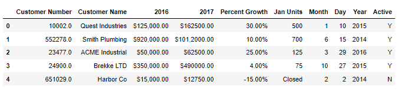
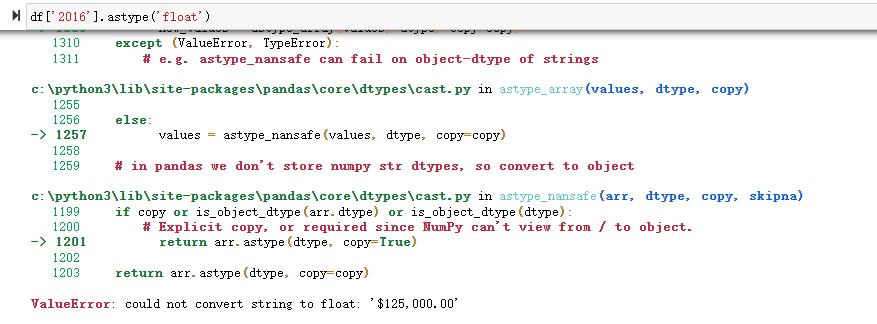
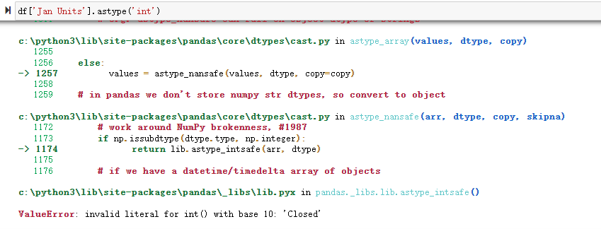
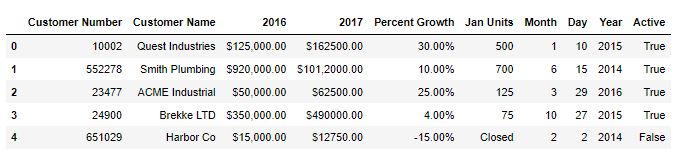

Python Pandas<br />在进行数据分析时，确保使用正确的数据类型是很重要的，否则可能会得到意想不到的结果或甚至是错误结果。对于 pandas 来说，它会在许多情况下自动推断出数据类型<br />尽管 pandas 已经自我推断的很好了，但在数据分析过程中，可能仍然需要显式地将数据从一种类型转换为另一种类型。本文将讨论基本的 pandas 数据类型（又名 dtypes ），它们如何映射到 python 和 numpy 数据类型，以及从一种 pandas 类型转换为另一种的方法
<a name="iu4y0"></a>
## Pandas 数据类型
数据类型本质上是编程语言用来理解如何存储和操作数据的内部结构。例如，一个程序需要理解将两个数字相加，如 5 + 10 得到 15。或者有两个字符串，如“cat”和“hat”，可以将它们连接（加）在一起得到“cathat”<br />关于 pandas 数据类型的一个可能令人困惑的地方是 pandas、python 和 numpy 之间存在一些出入<br />下表做了相关的总结

| Pandas dtype | Python type | NumPy type | Usage |
| --- | --- | --- | --- |
| object | str or mixed | string_, unicode_, mixed types | Text or mixed numeric and non-numeric values |
| int64 | int | int_, int8, int16, int32, int64, uint8, uint16, uint32, uint64 | Integer numbers |
| float64 | float | float_, float16, float32, float64 | Floating point numbers |
| bool | bool | bool_ | True/False values |
| datetime64 | NA | datetime64[ns] | Date and time values |
| timedelta[ns] | NA | NA | Differences between two datetimes |
| category | NA | NA | Finite list of text values |

不过在大多数情况下，无需担心是否应该尝试显式地将 pandas 类型强制为对应于 NumPy 类型。大多数时候，使用 pandas 默认的 int64 和 float64 类型就可以了<br />下面将重点介绍以下 pandas 类型：

- object
- int64
- float64
- datetime64
- bool

而对于category 和 timedelta 类型，会在后面的文章中重点介绍<br />还需要注意的是object数据类型实际上可以包含多种不同的类型。例如，a 列可以包括整数、浮点数和字符串，它们统称为object。因此，可能需要一些额外的技术来处理object列中的混合数据类型<br />下面先来查看本文使用的测试数据
```python
import numpy as np
import pandas as pd

df = pd.read_csv("sales_data_types.csv")
```
Output:<br /><br />乍一看数据好像还不错，所以可以尝试做一些操作来分析数据。尝试将 2016 年和 2017 年的销售额相加：
```python
df['2016'] + df['2017']
```
Output:
```python
0      $125,000.00$162500.00
1    $920,000.00$101,2000.00
2        $50,000.00$62500.00
3      $350,000.00$490000.00
4        $15,000.00$12750.00
dtype: object
```
结果显然不是期望的，希望将总数加在一起，但 pandas 只是将两个值连接在一起。其实问题也很明显，数据类型是`dtype: object` ，object 是 pandas 中的字符串，因此它执行字符串操作而不是数学操作<br />可以通过如下代码查看数据所有的数据类型信息
```python
df.dtypes
```
Output:
```python
Customer Number    float64
Customer Name       object
2016                object
2017                object
Percent Growth      object
Jan Units           object
Month                int64
Day                  int64
Year                 int64
Active              object
dtype: object
```
当然还可以使用`df.info()`来查看更多信息
```python
df.info()
```
Output:
```python
<class 'pandas.core.frame.DataFrame'>
RangeIndex: 5 entries, 0 to 4
Data columns (total 10 columns):
 #   Column           Non-Null Count  Dtype  
---  ------           --------------  -----  
 0   Customer Number  5 non-null      float64
 1   Customer Name    5 non-null      object 
 2   2016             5 non-null      object 
 3   2017             5 non-null      object 
 4   Percent Growth   5 non-null      object 
 5   Jan Units        5 non-null      object 
 6   Month            5 non-null      int64  
 7   Day              5 non-null      int64  
 8   Year             5 non-null      int64  
 9   Active           5 non-null      object 
dtypes: float64(1), int64(3), object(6)
memory usage: 528.0+ bytes
```
以上都是 Pandas 自动分配的数据类型，有几个问题：

- Customer Number 是 float64 但应该是 int64
- 2016 和 2017 列存储为 object，而不是诸如 float64 或 int64 之类的数值
- 百分比增长和 Month 单位也存储为 object 而不是数值
- 列 Month 、 Day 和 Year 应转换为 datetime64 类型
- Active 列应该是一个布尔值

也就是说，在进行数据分析之前，必须手动更正这些数据类型<br />在 pandas 中转换数据类型，有三个基本选项：

- 使用 astype() 强制转换数据类型
- 创建自定义函数来转换数据
- 使用 pandas 函数，例如 `to_numeric()` 或 `to_datetime()`
<a name="H6KrS"></a>
## 使用 `astype()` 函数
将 pandas 数据列转换为不同类型的最简单方法是使用 `astype()`，例如，要将 Customer Number 转换为整数，可以这样调用它：
```python
df['Customer Number'].astype('int')
```
Output:
```python
0     10002
1    552278
2     23477
3     24900
4    651029
Name: Customer Number, dtype: int32
```
如果想更改原始数据中的信息，则需要定义变量接收返回值，因为 astype() 函数返回一个副本
```python
df["Customer Number"] = df['Customer Number'].astype('int')
df.dtypes
```
Output:
```python
Customer Number     int32
Customer Name      object
2016               object
2017               object
Percent Growth     object
Jan Units          object
Month               int64
Day                 int64
Year                int64
Active             object
dtype: object
```
这样就完成了 Customer Number 列的类型转换<br />看起来很简单，尝试对 2016 列做同样的事情，并将其转换为浮点数：<br /><br />同样的，转换 Jan Units 列<br /><br />转换异常了~<br />上面的情况中，数据中包含了无法转换为数字的值。在 sales 列中，数据包括货币符号以及每个值中的逗号；在 Jan Units 列中，最后一个值是“Closed”，它不是数字<br />再来尝试转换 Active 列
```python
df['Active'].astype('bool')
```
Output:
```python
0    True
1    True
2    True
3    True
4    True
Name: Active, dtype: bool
```
乍一看似乎还不错，但仔细观察，问题就大了。所有值都被解释为 True，但最后一位客户的 Active 标志为 N，竟然也被转换为 True 了<br />所以可以得到，`astype()` 的使用是有条件的，仅在以下情况下才有效：

- 数据是干净的，可以简单地转换为一个数字
- 将数值转换为字符串对象

如果数据有非数字字符或者不是同质的，那么 astype() 将不是类型转换的好选择。需要进行额外的转换才能使类型更改正常工作
<a name="E6kHH"></a>
## 自定义转换函数
由于此数据的转换有点复杂，可以构建一个自定义函数，将其应用于每个值并转换为适当的数据类型<br />对于（这个特定数据集的）货币转换，可以使用一个简单的函数：
```python
def convert_currency(val):
    """
    Convert the string number value to a float
     - Remove $
     - Remove commas
     - Convert to float type
    """
    new_val = val.replace(',','').replace('$', '')
    return float(new_val)
```
该代码使用 python 的字符串函数去除“$”和“,”，然后将值转换为浮点数<br />也许有人会建议使用 Decimal 类型的货币。但这不是 pandas 中的内置数据类型，所以使用 float 方法<br />现在可以使用 pandas 的 apply 函数将其应用于 2016 列中的所有值
```python
df['2016'].apply(convert_currency)
```
Output:
```python
0    125000.0
1    920000.0
2     50000.0
3    350000.0
4     15000.0
Name: 2016, dtype: float64
```
成功了！<br />当然也可以使用 lambda 函数来处理，代码简洁了，但是可读性却下降了
```python
df['2016'].apply(lambda x: x.replace('$', '').replace(',', '')).astype('float')
```
接下来处理 Active 列，自定义函数需要使用 `np.where()`。有几种可能的方法可以解决这个特定问题。`np.where()` 方法对许多类型的问题都很有用，所以选择在这里使用<br />基本思想是使用 `np.where()` 函数将所有“Y”值转换为 True 并将其他所有值转换为 False
```python
df["Active"] = np.where(df["Active"] == "Y", True, False)
```
Output:<br /><br />数据类型也转换为 bool 了
```python
df.dtypes
```
Output:
```python
Customer Number     int32
Customer Name      object
2016               object
2017               object
Percent Growth     object
Jan Units          object
Month               int64
Day                 int64
Year                int64
Active               bool
dtype: object
```
<a name="F4RxZ"></a>
## Pandas 辅助函数
Pandas 在 `astype()` 函数和更复杂的自定义函数之间有一个中间地带，这些辅助函数对于某些数据类型转换非常有用<br />到目前为止，没有对日期列或 Jan Units 列做任何事情。这两者都可以简单地使用内置的 pandas 函数进行转换，例如 `pd.to_numeric()` 和 `pd.to_datetime()`<br />Jan Units 转换存在问题的原因是列中包含非数字值。如果尝试使用 `astype()` 会得到一个错误（如前所述）。`pd.to_numeric()` 函数可以更优雅地处理这些值：
```python
pd.to_numeric(df['Jan Units'], errors='coerce')
```
Output:
```python
0    500.0
1    700.0
2    125.0
3     75.0
4      NaN
Name: Jan Units, dtype: float64
```
有几点需要注意。首先，该函数可以轻松处理数据并创建一个 float64 列。此外，它用 NaN 值替换了无效的“Closed”值，因为传递了 errors=coerce 。可以保留该值或使用 `fillna(0)` 将其填充为 0：
```python
pd.to_numeric(df['Jan Units'], errors='coerce').fillna(0)
```
Output:
```python
0    500.0
1    700.0
2    125.0
3     75.0
4      0.0
Name: Jan Units, dtype: float64
```
最后使用 `pd.to_datetime()` 函数来处理日期数据
```python
pd.to_datetime(df[['Month', 'Day', 'Year']])
```
Output:
```python
0   2015-01-10
1   2014-06-15
2   2016-03-29
3   2015-10-27
4   2014-02-02
dtype: datetime64[ns]
```
该函数将列组合成一系列适当的 datateime64 dtype，很方便<br />最后，把上面处理代码都放到一起
```python
df_2 = pd.read_csv("sales_data_types.csv",
                   dtype={'Customer Number': 'int'},
                   converters={'2016': convert_currency,
                               '2017': convert_currency,
                               'Percent Growth': convert_percent,
                               'Jan Units': lambda x: pd.to_numeric(x, errors='coerce'),
                               'Active': lambda x: np.where(x == "Y", True, False)
                              })

df_2.dtypes
```
Output:
```python
Customer Number      int32
Customer Name       object
2016               float64
2017               float64
Percent Growth     float64
Jan Units          float64
Month                int64
Day                  int64
Year                 int64
Active              object
dtype: object
```
