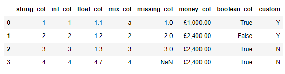
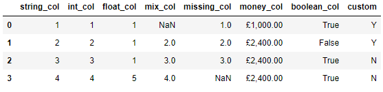
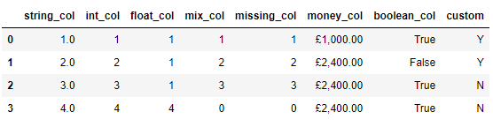
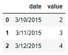
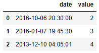
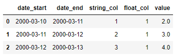

Pandas
<a name="lTD9Z"></a>
## 导入数据集和模块
那么第一步惯例就是导入Pandas模块以及创建数据集了，代码如下
```python
import pandas as pd
import numpy as np

df = pd.DataFrame({
        'string_col': ['1','2','3','4'],
        'int_col': [1,2,3,4],
        'float_col': [1.1,1.2,1.3,4.7],
        'mix_col': ['a', 2, 3, 4],
        'missing_col': [1.0, 2, 3, np.nan],
        'money_col': ['£1,000.00', '£2,400.00', '£2,400.00', '£2,400.00'],
        'boolean_col': [True, False, True, True],
        'custom': ['Y', 'Y', 'N', 'N']
  })
  
df
```
output<br /><br />先来看一下每一列的数据类型，代码如下
```python
df.dtypes
```
output
```python
string_col      object
int_col          int64
float_col      float64
mix_col         object
missing_col    float64
money_col       object
boolean_col       bool
custom          object
dtype: object
```
当然了也可以调用`info()`方法来实现上述的目的，代码如下
```python
df.info()
```
output
```python
<class 'pandas.core.frame.DataFrame'>
RangeIndex: 4 entries, 0 to 3
Data columns (total 8 columns):
 #   Column       Non-Null Count  Dtype  
---  ------       --------------  -----  
 0   string_col   4 non-null      object 
 1   int_col      4 non-null      int64  
 2   float_col    4 non-null      float64
 3   mix_col      4 non-null      object 
 4   missing_col  3 non-null      float64
 5   money_col    4 non-null      object 
 6   boolean_col  4 non-null      bool   
 7   custom       4 non-null      object 
dtypes: bool(1), float64(2), int64(1), object(4)
memory usage: 356.0+ bytes
```
<a name="LdBXG"></a>
## 数据类型转换
接下来开始数据类型的转换，最经常用到的是`astype()`方法，例如将浮点型的数据转换成整型，代码如下
```python
df['float_col'] = df['float_col'].astype('int')
```
或者将其中的“string_col”这一列转换成整型数据，代码如下
```python
df['string_col'] = df['string_col'].astype('int')
```
当然从节省内存的角度上来考虑，转换成int32或者int16类型的数据，
```python
df['string_col'] = df['string_col'].astype('int8')
df['string_col'] = df['string_col'].astype('int16')
df['string_col'] = df['string_col'].astype('int32')
```
然后再来看一下转换过后的各个列的数据类型
```python
df.dtypes
```
output
```python
string_col     float32
int_col          int64
float_col        int32
mix_col         object
missing_col    float64
money_col       object
boolean_col       bool
custom          object
dtype: object
```
但是当某一列的数据类型不止一个的时候，转换的过程当中则会报错，例如“mix_col”这一列
```python
df['mix_col'] = df['mix_col'].astype('int')
```
output
```python
ValueError: invalid literal for int() with base 10: 'a'
```
于是乎可以调用的`to_numeric()`方法以及`errors`参数，代码如下
```python
df['mix_col'] = pd.to_numeric(df['mix_col'], errors='coerce')
df
```
output<br /><br />而要是遇到缺失值的时候，进行数据类型转换的过程中也一样会出现报错，代码如下
```python
df['missing_col'].astype('int')
```
output
```python
ValueError: Cannot convert non-finite values (NA or inf) to integer
```
可以先通过调用`fillna()`方法来将缺失值填充成其他数值，然后再进行类型的转换，代码如下
```python
df["missing_col"] = df["missing_col"].fillna(0).astype('int')
df
```
output<br /><br />最后的则是“money_col”这一列，可以看到当中有货币符号，因此第一步要做的则是将这些货币符号给替换掉，然后再进行数据类型的转换，代码如下
```python
df['money_replace'] = df['money_col'].str.replace('£', '').str.replace(',','')
df['money_replace'] = pd.to_numeric(df['money_replace'])
df['money_replace']
```
output
```python
0    1000.0
1    2400.0
2    2400.0
3    2400.0
```
<a name="ORABK"></a>
## 当遇上时间序列数据时
当需要给日期格式的数据进行类型转换的时候，通常需要调用的是`to_datetime()`方法，代码如下
```python
df = pd.DataFrame({'date': ['3/10/2015', '3/11/2015', '3/12/2015'],
                   'value': [2, 3, 4]})
df
```
output<br /><br />先来看一下各个列的数据类型
```python
df.dtypes
```
output
```python
date     object
value     int64
dtype: object
```
调用`to_datetime()`方法的代码如下
```python
pd.to_datetime(df['date'])
```
output
```python
0   2015-03-10
1   2015-03-11
2   2015-03-12
Name: date, dtype: datetime64[ns]
```
当然这并不意味着不能调用`astype()`方法了，出来的结果与上述的一样，代码如下
```python
df['date'].astype('datetime64')
```
而当遇到自定义格式的日期格式的数据时，同样也是调用`to_datetime()`方法，但是需要设置的格式也就是`format`参数需要保持一致
```python
df = pd.DataFrame({'date': ['2016-6-10 20:30:0', 
                            '2016-7-1 19:45:30', 
                            '2013-10-12 4:5:1'],
                   'value': [2, 3, 4]})

df['date'] = pd.to_datetime(df['date'], format="%Y-%d-%m %H:%M:%S")
```
output<br />
<a name="xYgwp"></a>
## 是不是可以一步到位呢？
最后，或许有人会问，是不是有什么办法可以一步到位实现数据类型的转换呢？那当然也是可以实现的，代码如下
```python
df = pd.DataFrame({'date_start': ['3/10/2000', '3/11/2000', '3/12/2000'],
                   'date_end': ['3/11/2000', '3/12/2000', '3/13/2000'],
                   'string_col': ['1','2','3'],
                   'float_col': [1.1,1.2,1.3],
                   'value': [2, 3, 4]})
                   
df = df.astype({
    'date_start': 'datetime64',
    'date_end': 'datetime64',
    'string_col': 'int32',
    'float_col': 'int64',
    'value': 'float32',
})
```
来看一下出来的结果
```python
df
```
output<br />
