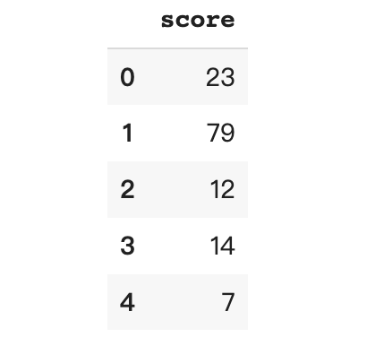
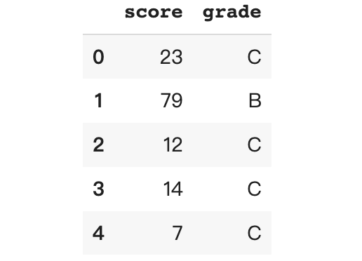
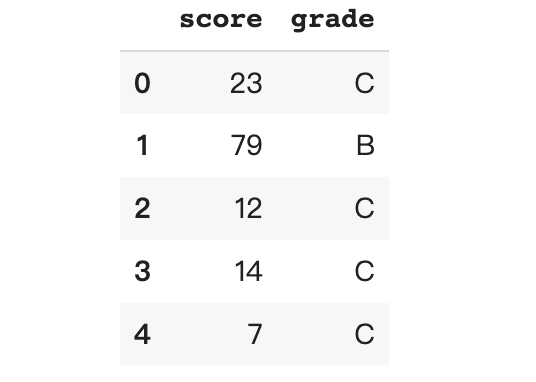
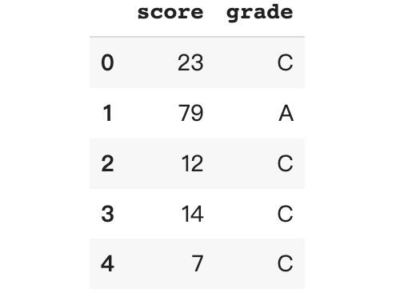

PythonPandas<br />使用 Pandas 的between 、cut、qcut 和 value_count离散化数值变量。<br />分箱是一种常见的数据预处理技术有时也被称为分桶或离散化，他可用于将连续数据的间隔分组到“箱”或“桶”中。这里将讨论使用 python Pandas 库对数值进行分箱的 4 种方法。<br />创建以下合成数据用于演示
```python
import pandas as pd # version 1.3.5 
import numpy as np 
def create_df(): 
	df = pd.DataFrame({'score': np.random.randint(0,101,1000)}) 
	return df 

create_df() 
df.head()
```
数据包括 1000 名学生的 0 到 100 分的考试分数。而这次的任务是将数字分数分为值“A”、“B”和“C”的等级，其中“A”是最好的等级，“C”是最差的等级。<br />
<a name="X2sr9"></a>
### 1、between & loc
Pandas `.between` 方法返回一个包含 True 的布尔向量，用来对应的 Series 元素位于边界值 left 和 right 之间。<br />参数有下面三个：

- left：左边界
- right：右边界
- inclusive：要包括哪个边界。可接受的值为 {“both”、“neither”、“left”、“right”}。

根据以下间隔规则将学生的分数分为等级：

- A: (80, 100]
- B: (50, 80]
- C: [0, 50]

其中方括号 [ 和圆括号 ) 分别表示边界值是包含的和不包含的。需要确定哪个分数在感兴趣的区间之间，并为其分配相应的等级值。注意看下面的不同的参数表示是否包含边界
```python
df.loc[df['score'].between(0, 50, 'both'), 'grade'] = 'C' 
df.loc[df['score'].between(50, 80, 'right'), 'grade'] = 'B' 
df.loc[df['score'].between(80, 100, 'right'), 'grade'] = 'A'
```
<br />以下是每个分数区间的人数：
```python
df.grade.value_counts()

C    488
B    310
A    202
Name: grade, dtype: int64
```
此方法需要为每个 bin 编写处理的代码，因此它仅适用于 bin 很少的情况。
<a name="pz0W1"></a>
### 2、cut
可以使用 cut将值分类为离散的间隔。此函数对于从连续变量到分类变量也很有用。<br />cut的参数如下：

- x：要分箱的数组。必须是一维的。
- bins：标量序列：定义允许非均匀宽度的 bin 边缘。
- labels：指定返回的 bin 的标签。必须与上面的 bins 参数长度相同。
- include_lowest：(bool) 第一个区间是否应该是左包含的。
```python
bins = [0, 50, 80, 100] 
labels = ['C', 'B', 'A'] 
df['grade'] = pd.cut(x = df['score'], 
                      bins = bins, 
                      labels = labels, 
                      include_lowest = True)
```
这样就创建一个包含 bin 边界值的 bins 列表和一个包含相应 bin 标签的标签列表。<br /><br />查看每个区段的人数
```python
df.grade.value_counts()

C    488
B    310
A    202
Name: grade, dtype: int64
```
结果与上面示例相同。
<a name="fC0b0"></a>
### 3、qcut
qcut可以根据排名或基于样本分位数将变量离散为大小相等的桶[3]。<br />在前面的示例中，为每个级别定义了分数间隔，这回使每个级别的学生数量不均匀。在下面的示例中，将尝试将学生分类为 3 个具有相等（大约）数量的分数等级。示例中有 1000 名学生，因此每个分箱应该有大约 333 名学生。<br />qcut参数：

- x：要分箱的输入数组。必须是一维的。
- q：分位数。10 表示十分位数，4 表示四分位数等。也可以是交替排列的分位数，例如[0, .25, .5, .75, 1.] 四分位数。
- labels：指定 bin 的标签。必须与生成的 bin 长度相同。
- retbins：(bool) 是否返回 (bins, labels)。
```python
df['grade'], cut_bin = pd.qcut(df['score'], 
                          q = 3, 
                          labels = ['C', 'B', 'A'], 
                          retbins = True) 
df.head()
```
<br />如果 retbins 设置为 True 则会返回 bin 边界。
```python
print (cut_bin) 
>> [  0.  36.  68. 100.]
```
分数间隔如下：

- C：[0, 36]
- B：(36, 68]
- A：(68, 100]

使用 `.value_counts()` 检查每个等级有多少学生。理想情况下，每个箱应该有大约 333 名学生。
```python
df.grade.value_counts()

C    340
A    331
B    329
Name: grade, dtype: int64
```
<a name="EiHHV"></a>
### 4、value_counts
虽然 pandas `.value_counts` 通常用于计算系列中唯一值的数量，但它也可用于使用 bins 参数将值分组到半开箱中。
```python
df['score'].value_counts(bins = 3, sort = False)
```
默认情况下，`.value_counts` 按值的降序对返回的系列进行排序。将 sort 设置为 False 以按其索引的升序对系列进行排序。
```python
(-0.101, 33.333]    310
(33.333, 66.667]    340
(66.667, 100.0]     350
Name: score, dtype: int64
```
series 索引是指每个 bin 的区间范围，其中方括号 [ 和圆括号 ) 分别表示边界值是包含的和不包含的。返回series 的值表示每个 bin 中有多少条记录。<br />与 `.qcut` 不同，每个 bin 中的记录数不一定相同（大约）。`.value_counts` 不会将相同数量的记录分配到相同的类别中，而是根据最高和最低分数将分数范围分成 3 个相等的部分。分数的最小值为 0，最大值为 100，因此这 3 个部分中的每一个都大约在 33.33 范围内。这也解释了为什么 bin 的边界是 33.33 的倍数。<br />还可以通过传入边界列表来定义 bin 边界。
```python
df['score'].value_counts(bins = [0,50,80,100], sort = False)

(-0.001, 50.0]    488
(50.0, 80.0]      310
(80.0, 100.0]     202
Name: score, dtype: int64
```
这给了与示例 1 和 2 相同的结果。
<a name="TNgwC"></a>
### 总结
这里介绍了如何使用 `.between`、`.cut`、`.qcut` 和 `.value_counts` 对连续值进行分箱。
