Python Pandas<br />很多算法都需要对分类特征进行转换（编码），这个操作在机器学习中十分常见，即根据某一列的值，新增（修改）一列。<br />为了方便理解，下面创建示例DataFrame<br />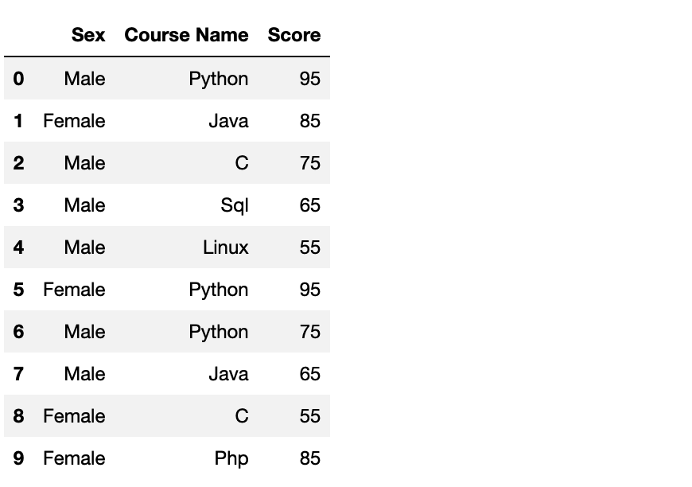
<a name="OOHwX"></a>
## 数值型数据
让我们先来讨论连续型数据的转换，也就是根据Score列的值，来新增一列标签，即如果分数大于90，则标记为A，分数在80-90标记为B，以此类推。
<a name="n3cRM"></a>
### 自定义函数 + 循环遍历
首先当然是最简单，最笨的方法，自己写一个函数，并用循环遍历，那肯定就是一个def加一个for
```python
df1 = df.copy()

def myfun(x):
    if x>90:
        return 'A'
    elif x>=80 and x<90:
        return 'B'
    elif x>=70 and x<80:
        return 'C'
    elif x>=60 and x<70:
        return 'D'
    else:
        return 'E'
    
df1['Score_Label'] = None
for i in range(len(df1)):
    df1.iloc[i,3] = myfun(df1.iloc[i,2])
```
这段代码，相信所有人都能看懂，简单好想但比较麻烦<br />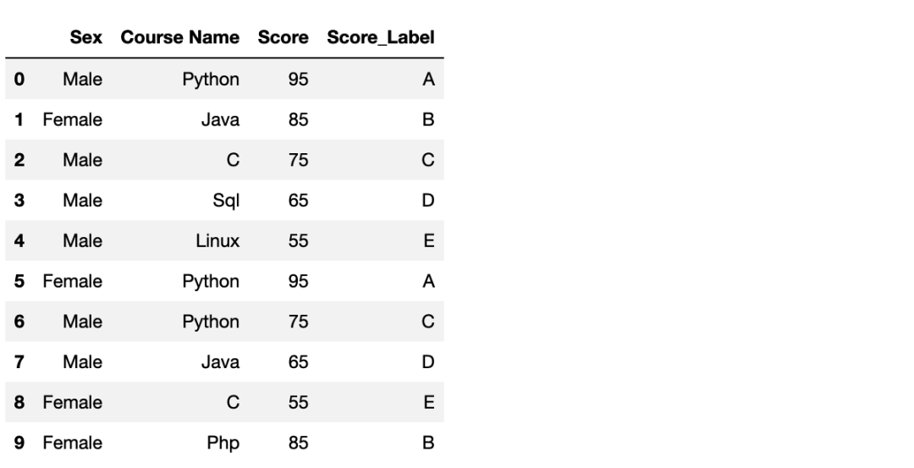<br />有没有更简单的办法呢？pandas当然提供了很多高效的操作的函数，继续往下看。
<a name="pAooi"></a>
### 自定义函数 + map
现在，可以使用map来干掉循环（虽然本质上也是循环）
```python
df2 = df.copy()

def mapfun(x):
    if x>90:
        return 'A'
    elif x>=80 and x<90:
        return 'B'
    elif x>=70 and x<80:
        return 'C'
    elif x>=60 and x<70:
        return 'D'
    else:
        return 'E'

df2['Score_Label'] = df2['Score'].map(mapfun)
```
结果是同样的<br />
<a name="eDzvl"></a>
### 自定义函数 + apply
如果还想简洁代码，可以使用**自定义函数 + apply**来干掉自定义函数
```python
df3 = df.copy()
df3['Score_Label'] = df3['Score'].apply(lambda x: 'A' if x > 90 else (
    'B' if 90 > x >= 80 else ('C' if 80 > x >= 70 else ('D' if 70 > x >= 60 else 'E'))))
```
结果和上面是一致的，只不过这么写容易被打。
<a name="BfvUt"></a>
### 使用 `pd.cut`
现在，继续了解更高级的pandas函数，依旧是对 Score 进行编码，使用`pd.cut`，并指定划分的区间后，可以直接分好组
```python
df4 = df.copy()
bins = [0, 59, 70, 80, 100]
df4['Score_Label'] = pd.cut(df4['Score'], bins)
```
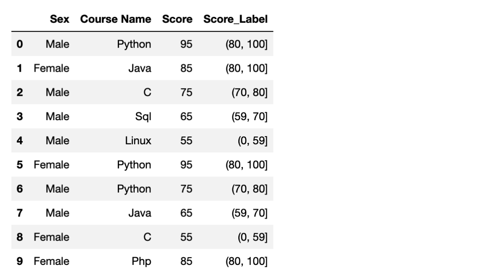<br />也可以直接使用labels参数来修改对应组的名称，是不是方便多了
```python
df4['Score_Label_new'] = pd.cut(df4['Score'], bins, labels=[
                                'low', 'middle', 'good', 'perfect'])
```
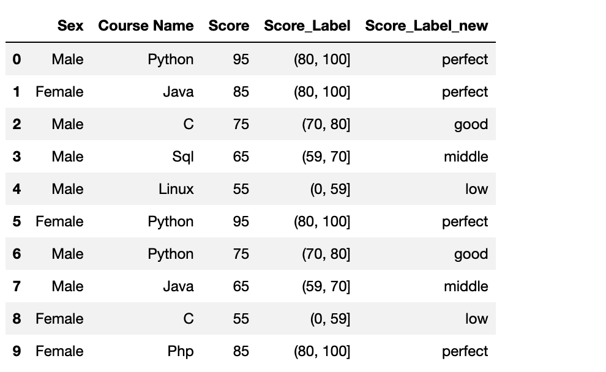
<a name="s8EqZ"></a>
### 使用 sklearn 二值化
既然是和机器学习相关，sklearn肯定跑不掉，如果需要新增一列并判定成绩是否及格，就可以使用`Binarizer`函数，代码也是简洁好懂
```python
df5 = df.copy()
binerize = Binarizer(threshold = 60)
trans = binerize.fit_transform(np.array(df1['Score']).reshape(-1,1))
df5['Score_Label'] = trans
```
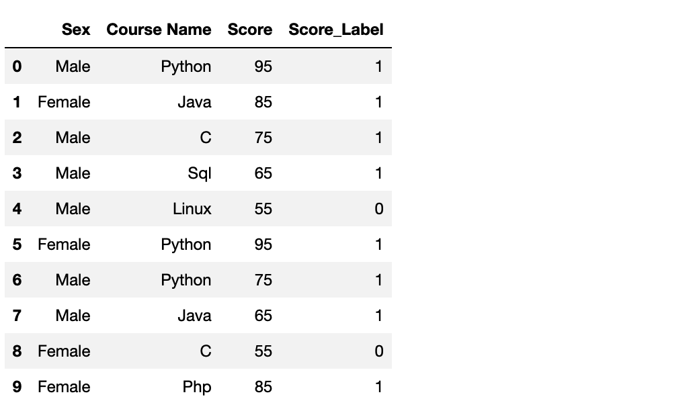
<a name="jryyg"></a>
## 文本型数据
下面介绍更常见的，对文本数据进行转换打标签。例如新增一列，将性别男、女分别标记为0、1
<a name="ZrwMB"></a>
### 使用 replace
首先介绍`replace`，但要注意的是，上面说过的自定义函数相关方法依旧是可行的
```python
df6 = df.copy()
df6['Sex_Label'] = df6['Sex'].replace(['Male','Female'],[0,1])
```
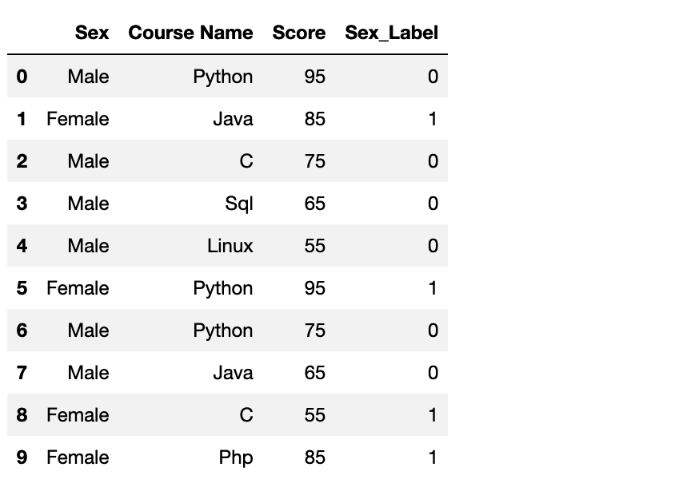<br />上面是对性别操作，因为只有男女，所以可以手动指定0、1，但要是类别很多，也可以使用`pd.value_counts()`来自动指定标签，例如对Course Name列分组
```python
df6 = df.copy()
value = df6['Course Name'].value_counts()
value_map = dict((v, i) for i,v in enumerate(value.index))
df6['Course Name_Label'] = df6.replace({'Course Name':value_map})['Course Name']
```

<a name="BGQY6"></a>
### 使用map
额外强调的是，新增一列，一定要能够想到map
```python
df7 = df.copy()
Map = {elem:index for index,elem in enumerate(set(df["Course Name"]))}
df7['Course Name_Label'] = df7['Course Name'].map(Map)
```
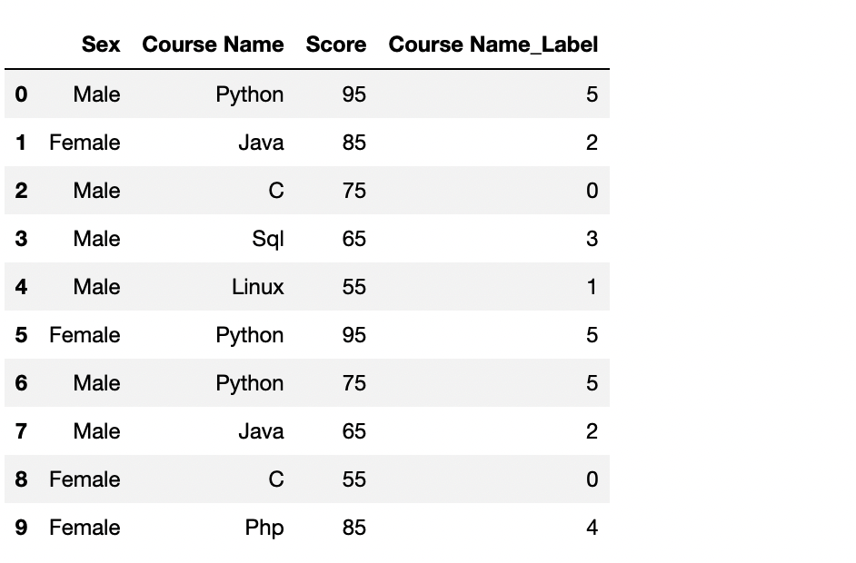
<a name="shH5G"></a>
### 使用astype
```python
df8 = df.copy()
value = df8['Course Name'].astype('category')
df8['Course Name_Label'] = value.cat.codes
```
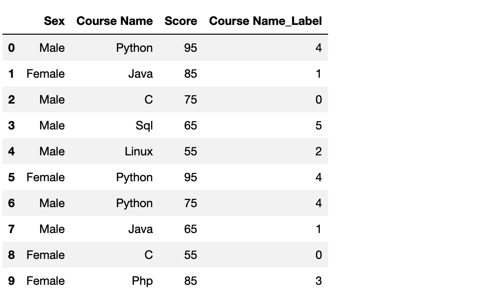
<a name="eFvON"></a>
### 使用 sklearn
同数值型一样，这种机器学习中的经典操作，sklearn一定有办法，使用LabelEncoder可以对分类数据进行编码
```python
from sklearn.preprocessing import LabelEncoder
df9 = df.copy()
le = LabelEncoder()
le.fit(df9['Sex'])
df9['Sex_Label'] = le.transform(df9['Sex'])
le.fit(df9['Course Name'])
df9['Course Name_Label'] = le.transform(df9['Course Name'])
```
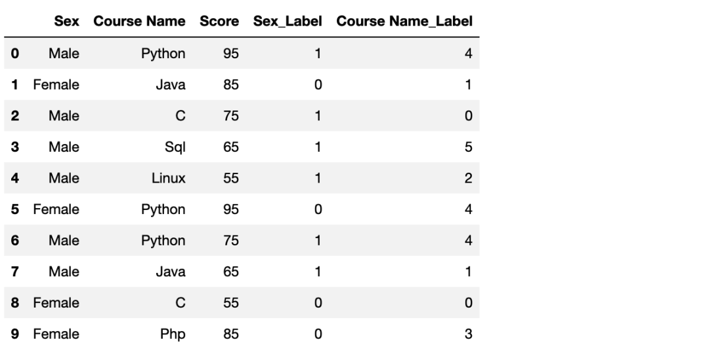<br />一次性转换两列也是可以的
```python
df9 = df.copy()
le = OrdinalEncoder()
le.fit(df9[['Sex','Course Name']])
df9[['Sex_Label','Course Name_Label']] = le.transform(df9[['Sex','Course Name']])
```
<a name="WwVy6"></a>
### 使用factorize
最后，再介绍一个小众但好用的pandas方法，我们需要注意到，在上面的方法中，自动生成的Course Name_Label列，虽然一个数据对应一个语言，因为避免写自定义函数或者字典，这样可以自动生成，所以大多是无序的。<br />如果我们希望它是有序的，也就是 Python 对应 0，Java对应1，除了自己指定，还有什么优雅的办法？这时可以使用factorize，它会根据出现顺序进行编码
```python
df10 = df.copy()
df10['Course Name_Label'] = pd.factorize(df10['Course Name'])[0]
```
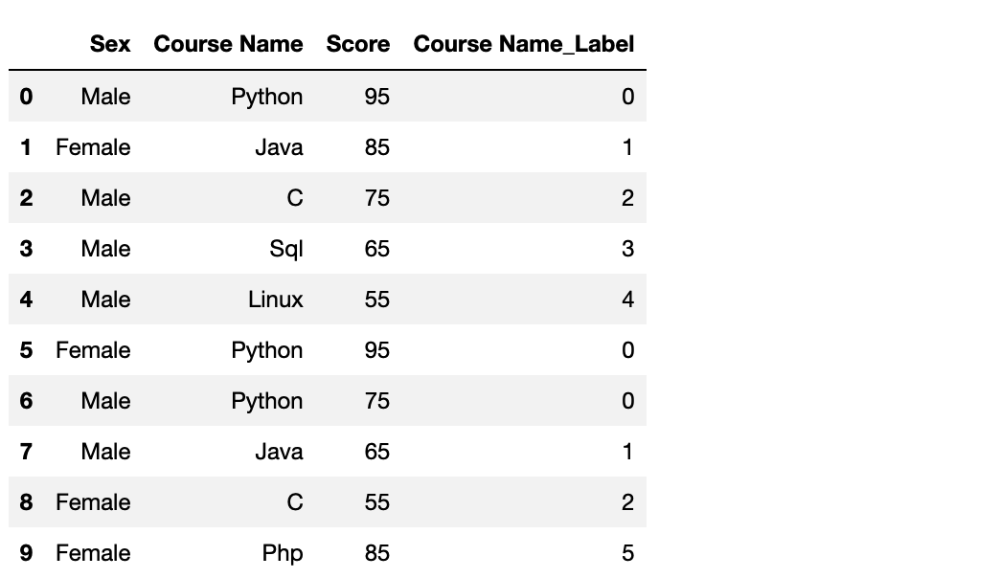<br />结合匿名函数，可以做到对多列进行有序编码转换
```python
df10 = df.copy()
cat_columns = df10.select_dtypes(['object']).columns

df10[['Sex_Label', 'Course Name_Label']] = df10[cat_columns].apply(
    lambda x: pd.factorize(x)[0])
```
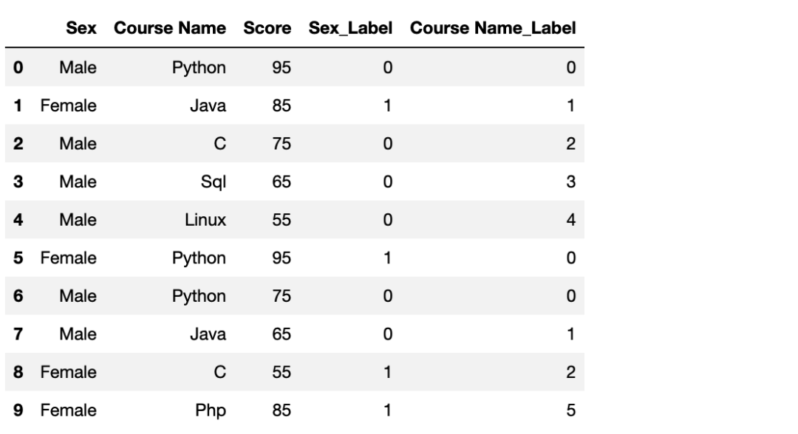
<a name="oNUfL"></a>
## 参考
**Graph Pandas**([https://pandas.liuzaoqi.com](https://pandas.liuzaoqi.com))
