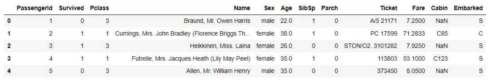
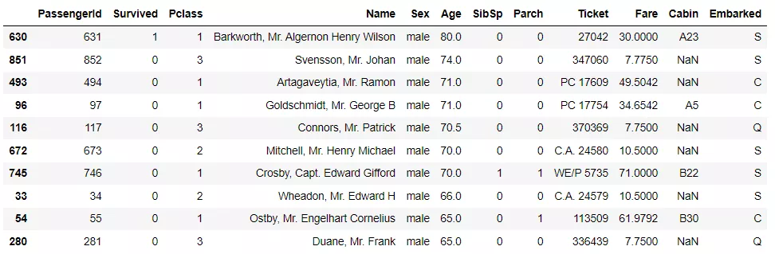
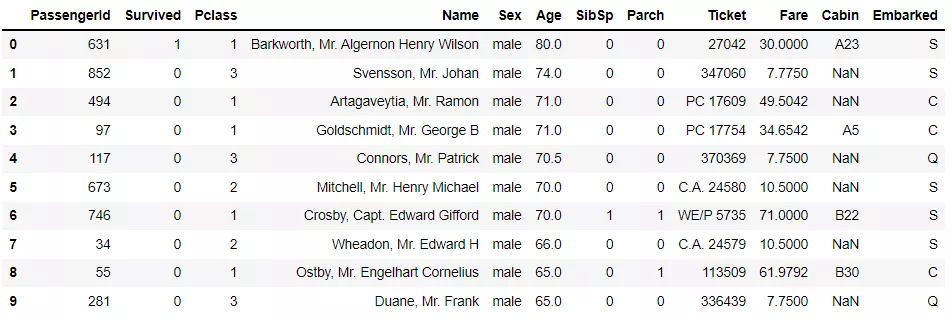
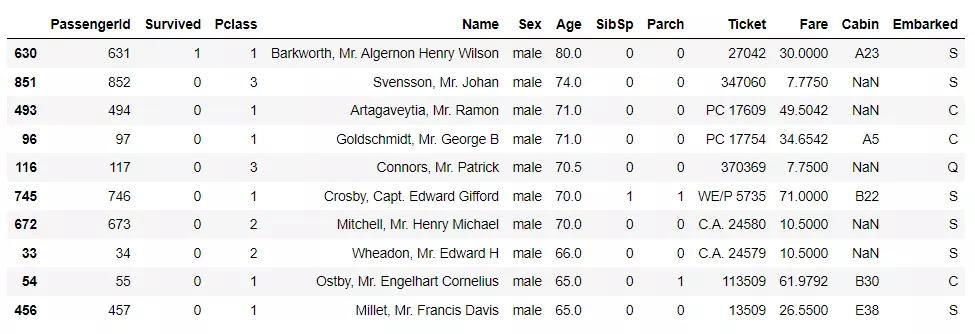
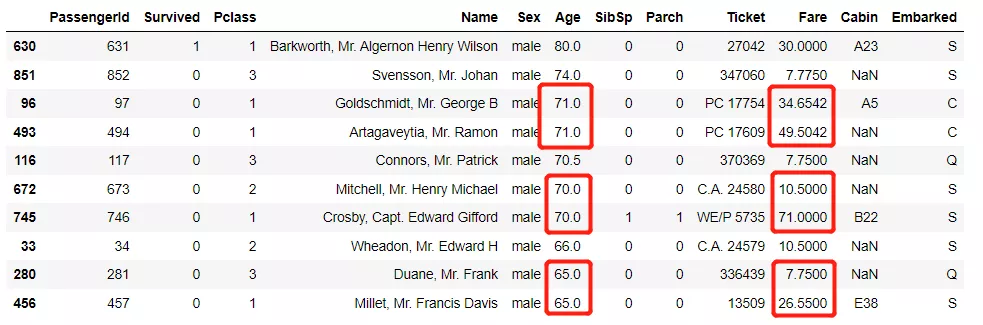
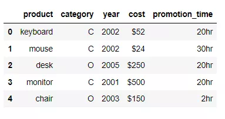
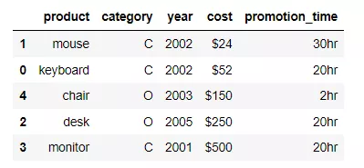
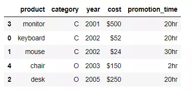
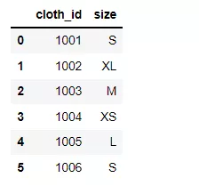
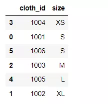

Python Pandas<br />Pandas模块当中的数据统计与排序，说到具体的就是`value_counts()`方法以及`sort_values()`方法。<br />`value_counts()`方法，顾名思义，主要是用于计算各个类别出现的次数的，而`sort_values()`方法则是对数值来进行排序，当然除了这些，还有很多大家不知道的衍生的功能等待被挖掘。
<a name="FuBXm"></a>
### 导入模块并且读取数据库
这次用到的数据集是“非常有名”的泰坦尼克号的数据集，该数据源能够在很多平台上都能够找得到
```python
import pandas as pd
df = pd.read_csv("titanic_train.csv")
df.head()
```
output<br />
<a name="hi8Uu"></a>
### 常规的用法
首先来看一下常规的用法，代码如下
```python
df['Embarked'].value_counts()
```
output
```python
S    644
C    168
Q     77
Name: Embarked, dtype: int64
```
下面简单来介绍一下`value_counts()`方法当中的参数，
```python
DataFrame.value_counts(subset=None,
                       normalize=False,
                       sort=True,
                       ascending=False,
                       dropna=True)
```
常用到参数的具体解释为：

- `subset`: 表示根据什么字段或者索引来进行统计分析
- `normalize`: 返回的是比例而不是频次
- `ascending`: 降序还是升序来排
- `dropna`: 是否需要包含有空值的行
<a name="W2XLT"></a>
### 对数值进行排序
上面返回的结果是按照从大到小来进行排序的，当然也可以反过来，从小到大来进行排序，代码如下
```python
df['Embarked'].value_counts(ascending=True)
```
output
```python
Q     77
C    168
S    644
Name: Embarked, dtype: int64
```
<a name="d0sJx"></a>
### 对索引的字母进行排序
同时也可以对索引，按照字母表的顺序来进行排序，代码如下
```python
df['Embarked'].value_counts(ascending=True).sort_index(ascending=True)
```
output
```python
C    168
Q     77
S    644
Name: Embarked, dtype: int64
```
当中的`ascending=True`指的是升序排序
<a name="ENAQb"></a>
### 包含对空值的统计
默认的是`value_counts()`方法不会对空值进行统计，那要是也希望对空值进行统计的话，就可以加上`dropna`参数，代码如下
```python
df['Embarked'].value_counts(dropna=False)
```
output
```python
S      644
C      168
Q       77
NaN      2
Name: Embarked, dtype: int64
```
<a name="dqU8s"></a>
### 百分比式的数据统计
可以将数值的统计转化成百分比式的统计，可以更加直观地看到每一个类别的占比，代码如下
```python
df['Embarked'].value_counts(normalize=True)
```
output
```python
S    0.724409
C    0.188976
Q    0.086614
Name: Embarked, dtype: float64
```
要是希望对能够在后面加上一个百分比的符号，则需要在Pandas中加以设置，对数据的展示加以设置，代码如下
```python
pd.set_option('display.float_format', '{:.2%}'.format)
df['Embarked'].value_counts(normalize = True)
```
output
```python
S   72.44%
C   18.90%
Q    8.66%
Name: Embarked, dtype: float64
```
当然除此之外，还可以这么来做，代码如下
```python
df['Embarked'].value_counts(normalize = True).to_frame().style.format('{:.2%}')
```
output
```python
  Embarked
S 72.44%
C 18.90%
Q 8.66%
```
<a name="nViOU"></a>
### 连续型数据分箱
和Pandas模块当中的`cut()`方法相类似的在于，这里也可以将连续型数据进行分箱然后再来统计，代码如下
```python
df['Fare'].value_counts(bins=3)
```
output
```python
(-0.513, 170.776]     871
(170.776, 341.553]     17
(341.553, 512.329]      3
Name: Fare, dtype: int64
```
将Fare这一列同等份的分成3组然后再来进行统计，当然也可以自定义每一个分组的上限与下限，代码如下
```python
df['Fare'].value_counts(bins=[-1, 20, 100, 550])
```
output
```python
(-1.001, 20.0]    515
(20.0, 100.0]     323
(100.0, 550.0]     53
Name: Fare, dtype: int64
```
<a name="QNBIk"></a>
### 分组再统计
pandas模块当中的`groupby()`方法允许对数据集进行分组，它也可以和`value_counts()`方法联用更好地来进行统计分析，代码如下
```python
df.groupby('Embarked')['Sex'].value_counts()
```
output
```python
Embarked  Sex   
C         male       95
          female     73
Q         male       41
          female     36
S         male      441
          female    203
Name: Sex, dtype: int64
```
上面的代码是针对“Embarked”这一类别下的“Sex”特征进行分组，然后再进一步进行数据的统计分析，当然出来的结果是Series数据结构，要是想让Series的数据结果编程DataFrame数据结构，可以这么来做，
```python
df.groupby('Embarked')['Sex'].value_counts().to_frame()
```
<a name="zAsry"></a>
### 数据集的排序
下面来谈一下数据的排序，主要用到的是`sort_values()`方法，例如根据“年龄”这一列来进行排序，排序的方式为降序排，代码如下
```python
df.sort_values("Age", ascending = False).head(10)
```
output<br />
<a name="Gda1e"></a>
### 对行索引重新排序
可以看到排序过之后的DataFrame数据集行索引依然没有变，希望行索引依然可以是从0开始依次的递增，就可以这么来做，代码如下
```python
df.sort_values("Age", ascending = False, ignore_index = True).head(10)
```
output<br /><br />下面简单来介绍一下`sort_values()`方法当中的参数
```python
DataFrame.sort_values(by, 
               axis=0, 
               ascending=True, 
               inplace=False, 
               kind='quicksort', 
               na_position='last', # last，first；默认是last
               ignore_index=False, 
               key=None)
```
常用到参数的具体解释为：

- `by`: 表示根据什么字段或者索引来进行排序，可以是一个或者是多个
- `axis`: 是水平方向排序还是垂直方向排序，默认是垂直方向
- `ascending`: 排序方式，是升序还是降序来排
- `inplace`: 是生成新的DataFrame还是在原有的基础上进行修改
- `kind`: 所用到的排序的算法，有快排quicksort或者是归并排序mergesort、堆排序heapsort等等
- `ignore_index`: 是否对行索引进行重新的排序
<a name="Hh8zm"></a>
### 对多个字段的排序
还可以对多个字段进行排序，代码如下
```python
df.sort_values(["Age", "Fare"], ascending = False).head(10)
```
output<br /><br />同时也可以对不同的字段指定不同的排序方式，如下
```python
df.sort_values(["Age", "Fare"], ascending = [False, True]).head(10)
```
output<br /><br />可以看到在“Age”一样的情况下，“Fare”字段是按照升序的顺序来排的
<a name="BIIEj"></a>
### 自定义排序
可以自定义一个函数方法，然后运用在`sort_values()`方法当中，让其按照自己写的方法来排序，看如下的这组数据
```python
df = pd.DataFrame({
    'product': ['keyboard', 'mouse', 'desk', 'monitor', 'chair'],
    'category': ['C', 'C', 'O', 'C', 'O'],
    'year': [2002, 2002, 2005, 2001, 2003],
    'cost': ['$52', '$24', '$250', '$500', '$150'],
    'promotion_time': ['20hr', '30hr', '20hr', '20hr', '2hr'],
})
```
output<br /><br />当中的“cost”这一列带有美元符号“$”，因此就会干扰排序的正常进行，使用lambda方法自定义一个函数方法运用在`sort_value()`当中
```python
df.sort_values(
    'cost', 
    key=lambda val: val.str.replace('$', '').astype('float64')
)
```
output<br /><br />当然还可以自定义一个更加复杂一点的函数，并且运用在`sort_values()`方法当中，代码如下
```python
def sort_by_cost_time(x):
    if x.name == 'cost':
        return x.str.replace('$', '').astype('float64')
    elif x.name == 'promotion_time':
        return x.str.replace('hr', '').astype('int')
    else:
        return x
        
df.sort_values(
   ['year', 'promotion_time', 'cost'], 
   key=sort_by_cost_time
)
```
output<br /><br />还有另外一种情况，例如遇到衣服的尺码，XS码、S码、M码、L码又或者是月份，Jan、Feb、Mar、Apr等等，需要自己去定义大小，这个时候需要用到的是CategoricalDtype
```python
cat_size_order = CategoricalDtype(
    ['XS', 'S', 'M', 'L', 'XL'], 
    ordered=True
)
cat_size_order
```
output
```python
CategoricalDtype(categories=['XS', 'S', 'M', 'L', 'XL'], ordered=True)
```
于是针对下面的数据
```python
df = pd.DataFrame({
    'cloth_id': [1001, 1002, 1003, 1004, 1005, 1006],
    'size': ['S', 'XL', 'M', 'XS', 'L', 'S'],
})
```
output<br /><br />将事先定义好的顺序应用到该数据集当中，代码如下
```python
df['size'] = df['size'].astype(cat_size_order)
df.sort_values('size')
```
output<br /><br />先通过`astype()`来转换数据类型，然后再进行排序
