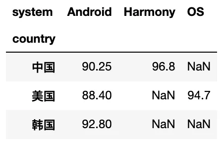

Python Pandas
<a name="iN2dE"></a>
## 一、pandas merge
<a name="Hm8Wl"></a>
### 1、`merge`函数用途
pandas中的`merge()`函数类似于SQL中`join`的用法，可以将不同数据集依照某些字段（属性）进行合并操作，得到一个新的数据集。
<a name="Q8Mhc"></a>
### 2、`merge`函数的具体参数

- 用法：
```python
DataFrame1.merge(DataFrame2, 
how='inner', on=None, left_on=None, 
right_on=None, left_index=False, 
right_index=False, sort=False, suffixes=('_x', '_y'))
```

- 参数说明：
   - `how`：默认为`inner`，可设为`inner`/`outer`/`left`/`right`；
   - `on`：根据某个字段进行连接，必须存在于两个DateFrame中（若未同时存在，则需要分别使用`left_on`和`right_on`来设置）；
   - `left_on`：左连接，以DataFrame1中用作连接键的列；
   - `right_on`：右连接，以DataFrame2中用作连接键的列；
   - `left_index`：将DataFrame1行索引用作连接键；
   - `right_index`：将DataFrame2行索引用作连接键；
   - `sort`：根据连接键对合并后的数据进行排列，默认为True；
   - `suffixes`：对两个数据集中出现的重复列，新数据集中加上后缀_x,_y进行区别。
<a name="xEhpL"></a>
### 3、`merge`函数的应用
<a name="I3N0F"></a>
#### `merge`一般应用
```python
import pandas as pd

# 定义资料集并打印出来
left = pd.DataFrame({'key1': ['K0', 'K0', 'K1', 'K2'],
                     'key2': ['K0', 'K1', 'K0', 'K1'],
                     'A': ['A0', 'A1', 'A2', 'A3'],
                     'B': ['B0', 'B1', 'B2', 'B3']})
right = pd.DataFrame({'key1': ['K0', 'K1', 'K1', 'K2'],
                      'key2': ['K0', 'K0', 'K0', 'K0'],
                      'C': ['C0', 'C1', 'C2', 'C3'],
                      'D': ['D0', 'D1', 'D2', 'D3']})

print(left)
print('------------')
print(right)
```


- 单个字段连接
```python
# 依据key1 column合并，并打印
res = pd.merge(left, right, on='key1')
print(res)
```

- 多字段连接
```python
# 依据key1和key2 column进行合并，并打印出四种结果['left', 'right','outer', 'inner']
res = pd.merge(left, right, on=['key1', 'key2'], how='inner')
print(res)

res = pd.merge(left, right, on=['key1', 'key2'], how='outer')
print(res)

res = pd.merge(left, right, on=['key1', 'key2'], how='left') # 以left为主进行合并
print(res)

res = pd.merge(left, right, on=['key1', 'key2'], how='right') # 以right为主进行合并
print(res)
```
<a name="H9tni"></a>
#### 2 `merge`进阶应用

- `indicator` 设置合并列数据来源
```python
# indicator 设置合并列数据来源
df1 = pd.DataFrame({'coll': [0, 1], 'col_left': ['a', 'b']})
df2 = pd.DataFrame({'coll': [1, 2, 2], 'col_right': [2, 2, 2]})
print(df1)
print('---------')
print(df2)

# 依据coll进行合并，并启用indicator=True，最后打印
res = pd.merge(df1, df2, on='coll', how='outer', indicator=True)
print(res)
'''
left_only 表示数据来自左表
right_only 表示数据来自右表
both 表示两个表中都有，也就是匹配上的
'''
```

```python
# 自定义indicator column的名称并打印出
res = pd.merge(df1, df2, on='coll', how='outer', indicator='indicator_column')
print(res)
```

- 依据`index`合并
```python
# 依据index合并
# 定义数据集并打印出
left = pd.DataFrame({'A': ['A0', 'A1', 'A2'],
                     'B': ['B0', 'B1', 'B2']},
                   index = ['K0', 'K1', 'K2'])
right = pd.DataFrame({'C': ['C0', 'C2', 'C3'],
                     'D': ['D0', 'D2', 'D3']},
                   index = ['K0', 'K2', 'K3'])
print(left)
print('---------')
print(right)
```

```python
# 依据左右数据集的index进行合并，how='outer',并打印
res = pd.merge(left, right, left_index=True, right_index=True, how='outer')
print(res)

# 依据左右数据集的index进行合并，how='inner',并打印
res = pd.merge(left, right, left_index=True, right_index=True, how='inner')
print(res)
```

- 解决`overlapping`的问题
```python
# 解决overlapping的问题
# 定义资料集
boys = pd.DataFrame({'k': ['K0', 'K1', 'K2'], 'age': [1, 2, 3]})
girls = pd.DataFrame({'k': ['K0', 'K1', 'K3'], 'age': [4, 5, 6]})
print(boys)
print('---------')
print(girls)

# 使用suffixes解决overlapping的问题
# 比如将上面两个合并时，age重复了，则可通过suffixes设置，以此保证不重复，不同名（默认会在重名列名后加_x _y）
res = pd.merge(boys, girls, on='k', suffixes=['_boy', '_girl'], how='inner')
print(res)
```

<a name="iBRBr"></a>
## 二、pandas `apply`
<a name="hfDLO"></a>
### 1、pandas apply by pluto
`apply`函数是pandas中极其好用的一个函数，它可以对dataframe在行或列方向上进行批量化处理，从而大大简化数据处理的过程。<br />`apply`函数的基本形式：
```python
DataFrame.apply(func, 
axis=0, broadcast=False, 
raw=False, reduce=None, args=(), **kwds)
```
最常用前两个参数，分别是`func`运算函数和`axis`运算的轴，运算轴默认是`axis=0`，按列作为序列传入`func`运算函数，设置axis=1则表示按行进行计算。<br />在运算函数并不复杂的情况下，第一个参数通常使用lambda函数。当函数复杂时可以另外写一个函数来调用。下面通过一个实例来说明：
```python
import pandas as pd

df = pd.DataFrame({'A':[3,1,4,1,5,9,None,6],
              'B':[1,2,3,None,5,6,7,8]})

d = df.apply(lambda x: x.fillna(x.mean()))
print(df)
print('----------')
print(d)
```
处理前的数据：<br /><br />处理后的数据：<br /><br />可以看到上面代码通过`apply`对nan值进行了均值填充，填充的为nan值所在列的均值。<br />在默认情况下，axis参数值为0，表示在行方向上进行特定的函数运算，即对每一列进行运算。<br />可以设置`axis=1`来对每一行进行运算。例如将上例设置为`axis=1`，结果变为：<br />可以看出它是使用每行的均值对nan值进行了填充。<br />`apply`也可以另写函数来调用：
```python
import pandas as pd

df = pd.DataFrame({'A':[3,1,4,1,5,9,None,6],
              'B':[1,2,3,None,5,6,7,8]})

def add(x):
    return x+1

d = df.apply(add, axis=1)
print(df)
print('----------')
print(d)
```
这个函数实现了对每一列上的数字加一:<br />注意：行方向，不是指对行进行运算。<br />比如：一行有`[a, b, c, d]`，行方向运算指的是按先计算a列，然后计算b列，再计算c列，最后计算d列，所以行方向指的只是运算顺序的方向。<br />（不用过度纠结，记住`axis=0`是对列进行计算，`axis=1`是对行进行计算即可）
<a name="lzzS7"></a>
### 2、pandas `apply`
最深感触是其在处理EXCEL数据方面可为鬼斧神工，无论增、删、查、分都高效快捷，本以为Pandas做到这种程度已经相当棒了，但是当学到apply函数时，才发觉它超出了自己的想象力。<br />Apply简单案例如下：<br />唐僧师徒加上白龙马一行五人去参加成人考试，考试科目包含语文、数学、英语共三门，现在想要知道三门科目成绩均不小于85分的人有哪些？
```python
import pandas as pd
df = pd.DataFrame({'语文':[93,80,85,76,58],
                   '数学':[87,99,95,85,70],
                   '英语':[80,85,97,65,88]}, 
                  index=['孙悟空','猪八戒','沙和尚','唐僧','白龙马']
                 )
print(df)
print('-----------')
df1 = df.loc[df['语文'].apply(lambda x:85<=x<100)] \
    .loc[df['英语'].apply(lambda x:85<=x<100)] \
    .loc[df['数学'].apply(lambda x:85<=x<100)]
print(df1)
```

<a name="lfRUk"></a>
## 三、pandas `pivot_table `
在pandas中 除了`pivot_table`  还有`pivot`函数也一样可以实现数据透视功能，前者可以看成后者的增强版。<br />`pivot_table`函数的基本形式：
```python
DataFrame.pivot_table(self, values=None, index=None, columns=None, aggfunc='mean', fill_value=None, margins=False, dropna=True, margins_name='All', observed=False)
```
`pivot_table`对数据格式要求不高，而且支持`aggfunc`/`fillvalue`等参数，所以应用更加广泛。<br />`pivot_table`函数的参数有`values(单元格值)`、`index(索引)`、`columns(列名)`，这些参数组成一个数据透视表的基本结构。<br />复杂一点 要用到`aggfunc`方法，默认是求均值（针对于数值列），当然也可以求其他统计量或者得到数据类型的转换，而且可以多个统计方法同时使用。<br />总而言之，`pivot_table`可以转换各个维度去观察数据，达到“透视”的目的。<br />案例说明：
```python
import numpy as np
import pandas as pd
df = pd.DataFrame({'brand': ['苹果', '三星', '华为', 'OPPO', '诺基亚', '小米'],
                    'country': ['美国','韩国','中国','中国','美国','中国'],
                   'system': ['OS', 'Android', 'Harmony', 'Android', 'Android', 'Android'],
                   'score': [94.7,  92.8, 96.8, 89.3, 88.4, 91.2]})
df
```

```python
# 按country进行分组，默认计算数值列的均值
df.pivot_table(index='country')
```

```python
# 按country进行分组，除了计算score均值，另外计算每个国家出现的品牌个数（不重复）
df.pivot_table(index='country',aggfunc={'score':np.mean,'brand':lambda x : len(x.unique())})
```

```python
# 按country进行分组，system作为列名，score作为表中的值（重复的取均值），取对应的数据生成新的表
df.pivot_table(index='country',columns='system',values='score')
```

```python
# 统计各个国家手机的最高分 最低分  平均分，空值填充为零
df.pivot_table(index='country',columns='system',values='score',aggfunc=[max,min,np.mean],fill_value=0)
```
<br /> 
