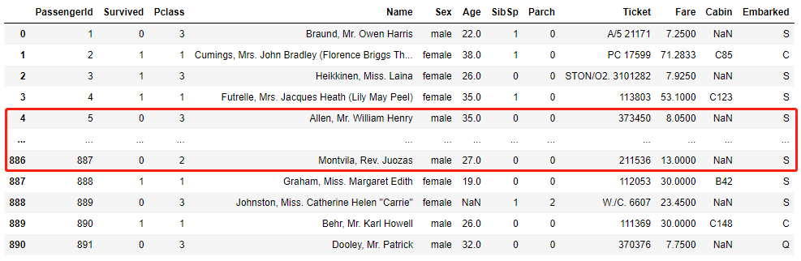
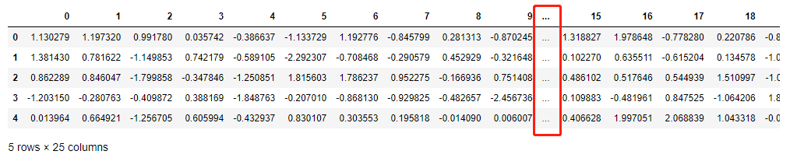
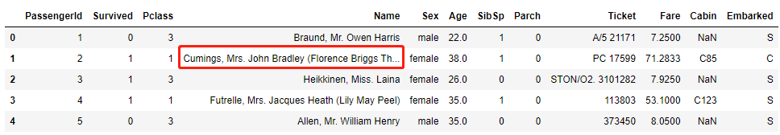
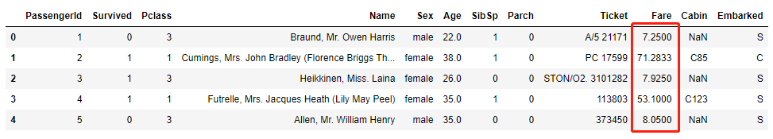
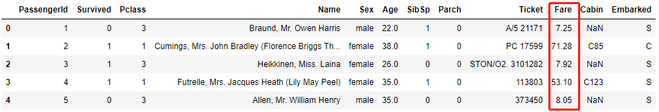
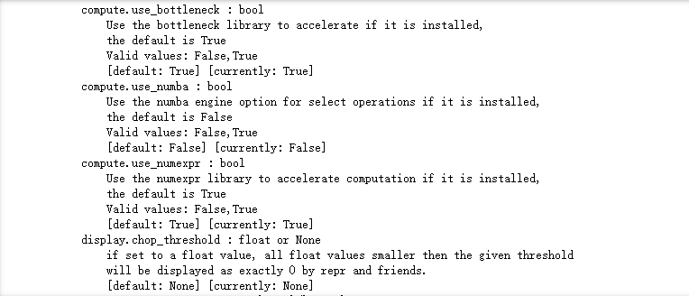
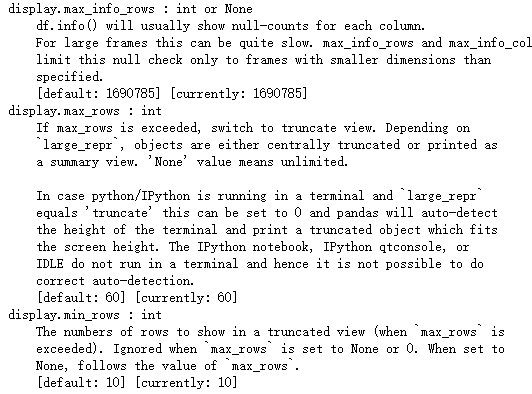

Python Pandas
<a name="pVzrN"></a>
### 数据集的准备
这次需要用到的数据集是广为人所知的泰坦尼克号的乘客数据，先导入并且读取数据集
```python
import pandas as pd 
df = pd.read_csv("train.csv")
```
<a name="KNrrL"></a>
### 展示更多的行
Pandas默认只展示60行的数据，如果数据集当中的数量超过了60行，
```python
pd.get_option('display.max_rows')
## 或者是
pd.options.display.max_rows
```
output
```python
60
```
要是数据集当中的数据超过了60行，则会将中间的数据给折叠起来，展示出来前面的5行以及最后的5行，如下图所示<br /><br />当然也可以改变最多展示出来的行数，代码如下
```python
pd.set_option('display.max_rows', 200)
```
或者要是想将所有的数据都给展示出来的话，就设置成None，当然要是数据集很长很长的话，有几万行几十万行的话，这么做可能会使得notebook崩掉
```python
pd.set_option('display.max_rows', None)
# 或者是
# pd.options.display.max_rows = None
```
<a name="QbriB"></a>
### 展示更多的列
同样地，pandas默认只展示20列的数据
```python
pd.get_option('display.max_columns')
# pd.options.display.max_columns
```
output
```python
20
```
要是数据集超过了20列的数据，中间的几列数据就会折叠起来，如下图所示<br /><br />当然也可以改变这个值，例如当数据集当中的数据超过了50列才会被折叠，代码如下
```python
# 当数据集当中的数据超过了50列才会被折叠
pd.set_option('display.max_columns', 50)
# pd.options.display.max_columns = 50
```
或者就干脆展示出来所有的列
```python
pd.set_option('display.max_columns', None)
# pd.options.display.max_columns = None
```
<a name="FDHeb"></a>
### 改变列的宽度
当想要展示数据集当中的前5列的时候
```python
df.head()
```
output<br /><br />可以发现“Name”这一列当中的第二行因为字数比较多，就用了省略号来代替，这是因为Pandas对显示数据的量也是有限制的，
```python
pd.get_option('display.max_colwidth')
# pd.options.display.max_colwidth
```
当然也能改变这个默认值，代码如下
```python
pd.set_option('display.max_colwidth', 500)
# pd.options.display.max_colwidth = 500
```
或者显示出所有的内容
```python
pd.set_option('display.max_colwidth', None)
# pd.options.display.max_colwidth = None
```
<a name="XKU6K"></a>
### 改变浮点数的精度
Pandas对于浮点数的精度的展示也是有限制的，如下图所示<br /><br />默认只展示小数点后面的6位小数，
```python
pd.get_option('display.precision')
# pd.options.display.precision
```
output
```python
6
```
要是只是希望展示小数点后面2位小数，则可以这么来做
```python
pd.set_option('display.precision', 2)
# pd.options.display.precision = 2
```
来看一下最终的效果如何
```python
df.head()
```
output<br />
<a name="HHx5X"></a>
### 个性化展示数字
有时候遇到例如货币、百分比、小数等数字时，可以通过pandas当中的`display.float_format`方法来个性化展示数字，
```python
pd.set_option('display.float_format',  '{:,.2f}'.format)
df_test
```
例如希望对数字添加百分号来展示，代码如下
```python
pd.set_option('display.float_format', '{:.2f}%'.format)
df_test
```
例如希望在数字面前添加货币符号，代码如下
```python
pd.set_option('display.float_format', '${:.2f}'.format)
df_test
```
<a name="baVdZ"></a>
### 改变图表绘制的后端
默认的Pandas模块对图表的绘制是以matplotlib为后端的，但是以此为后端绘制出来的图表并不是动态可交互的，可以改成以plotly或者是altair为后端来绘制图表，
```python
import pandas as pd
import numpy as np
pd.set_option('plotting.backend', 'altair')
data = pd.Series(np.random.randn(100).cumsum())
data.plot()
```
<a name="tLZtf"></a>
### 重置回默认的配置
除了上面介绍的配置之外，也可以自行对数据集的展示的配置进行调整，首先看一下总共有哪些配置可以来调整
```python
pd.describe_option()
```
output<br /><br />要是指定想要看横轴方向上的配置，可以这么来做
```python
pd.describe_option("rows")
```
output<br /><br />依次可以对最大展示出来的行数、最少展示出来的行数进行调整，而要是想将所有的配置还原成默认值，可以这么来做
```python
pd.reset_option('all')
```
