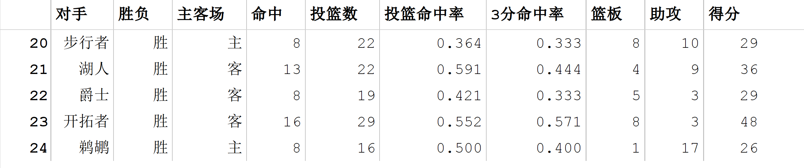
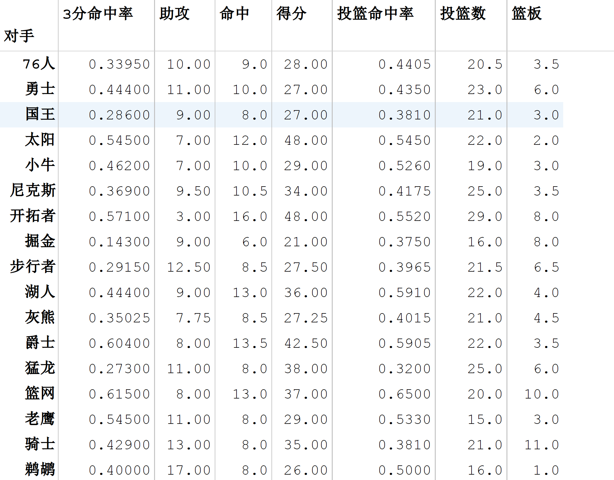
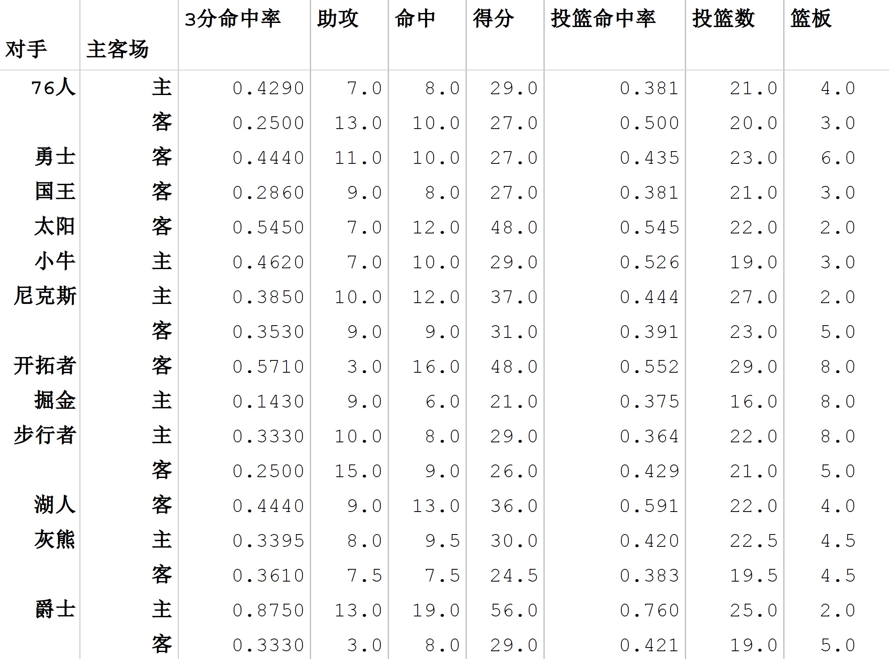
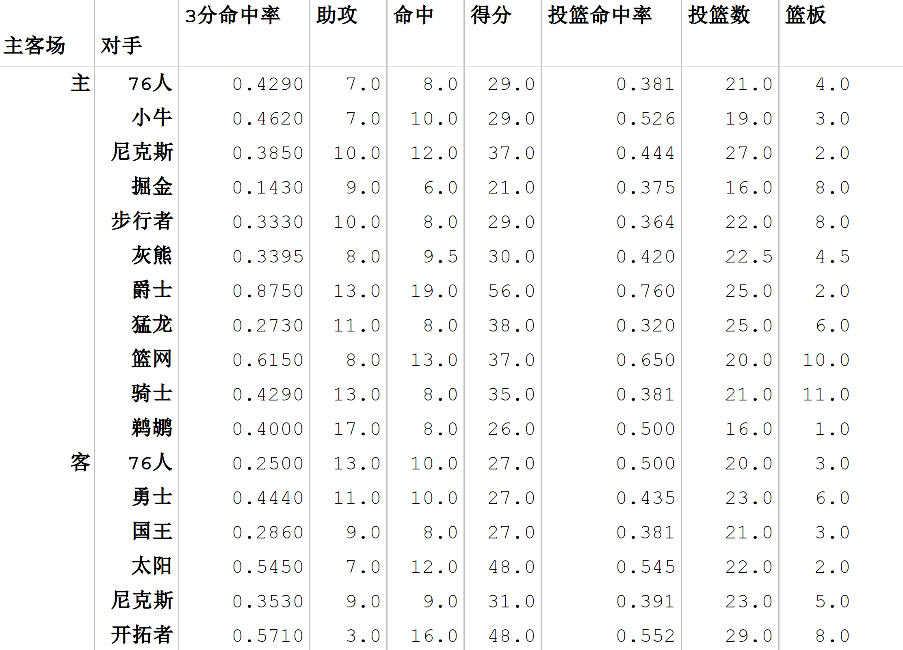
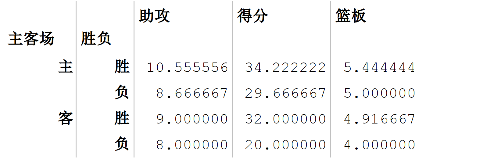
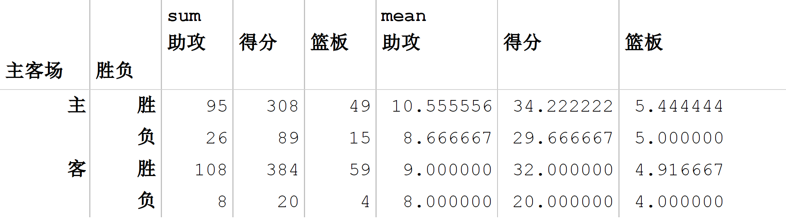
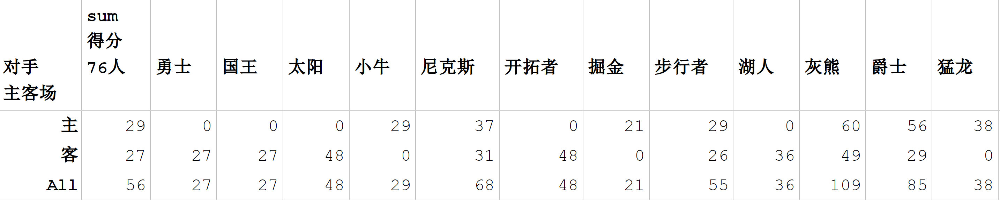
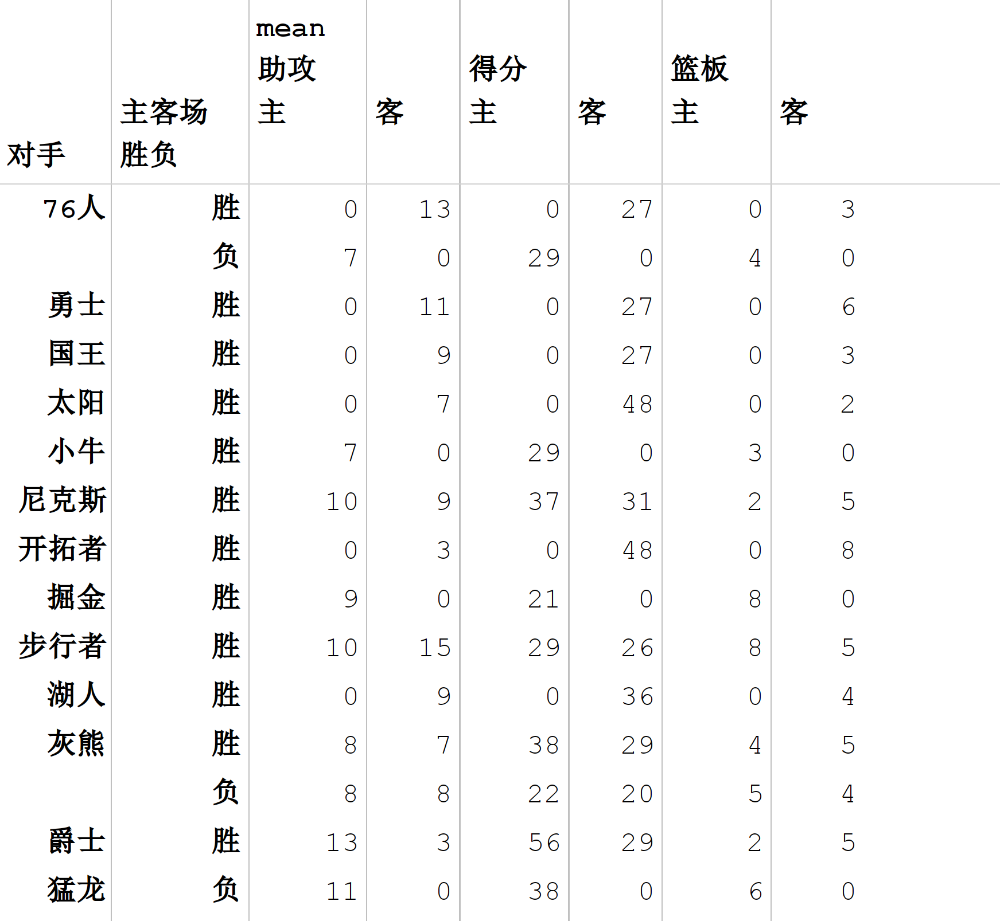
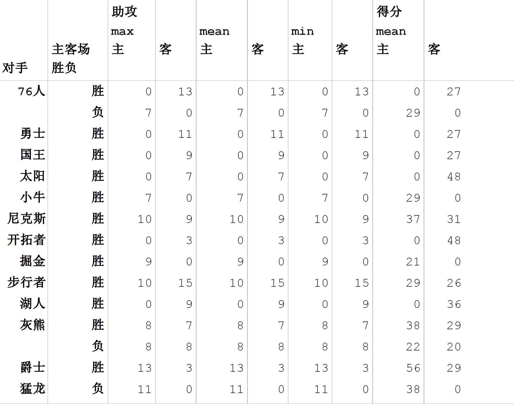

PythonPandas
<a name="iwJk4"></a>
## 一、概述
<a name="KCaJk"></a>
### 1.1 什么是透视表？
透视表是一种可以**对数据动态排布并且分类汇总的表格格式**。或许大多数人都在Excel使用过数据透视表，也体会到它的强大功能，而在pandas中它被称作**pivot_table**。
<a name="Uhamt"></a>
### 1.2 为什么要使用`pivot_table`？

- 灵活性高，可以随意定制分析计算要求
- 脉络清晰易于理解数据
- 操作性强，报表神器
<a name="mTh1B"></a>
## _二、如何使用_`_pivot_table_`
首先读取数据，数据集是火箭队当家球星James Harden某一赛季比赛数据作为数据集进行讲解。<br />**数据地址**：[James_Harden.csv](https://www.yuque.com/attachments/yuque/0/2022/csv/396745/1658366840884-89cdaf2d-c5b4-48a1-a211-0a209e16ac9e.csv?_lake_card=%7B%22src%22%3A%22https%3A%2F%2Fwww.yuque.com%2Fattachments%2Fyuque%2F0%2F2022%2Fcsv%2F396745%2F1658366840884-89cdaf2d-c5b4-48a1-a211-0a209e16ac9e.csv%22%2C%22name%22%3A%22James_Harden.csv%22%2C%22size%22%3A1108%2C%22type%22%3A%22text%2Fcsv%22%2C%22ext%22%3A%22csv%22%2C%22source%22%3A%22%22%2C%22status%22%3A%22done%22%2C%22download%22%3Atrue%2C%22taskId%22%3A%22u26e3adf5-87d6-4585-a18e-43408dfb531%22%2C%22taskType%22%3A%22upload%22%2C%22__spacing%22%3A%22both%22%2C%22id%22%3A%22u8ba8b5ba%22%2C%22margin%22%3A%7B%22top%22%3Atrue%2C%22bottom%22%3Atrue%7D%2C%22card%22%3A%22file%22%7D)。<br />先看一下官方文档中pivot_table的函数体：pandas.pivot_table - pandas 0.21.0 documentation：
```python
pivot_table(data, 
			values=None, 
			index=None, 
			columns=None,
			aggfunc='mean', 
			fill_value=None, 
			margins=False, 
			dropna=True, 
			margins_name='All')
```
pivot_table有四个最重要的参数 **index、values、columns、aggfunc**，本文以这四个参数为中心讲解pivot操作是如何进行。
<a name="JPfxm"></a>
### 2.1 读取数据
```python
import pandas as pd
import numpy as np
df = pd.read_csv('h:/James_Harden.csv',encoding='utf8')
df.tail()
```
数据格式如下：<br />
<a name="i3XxV"></a>
### 2.2 Index
每个pivot_table**必须拥有一个index**，如果想查看哈登对阵每个队伍的得分，首先将对手设置为index：
```python
pd.pivot_table(df,index=[u'对手'])
```
<br />对手成为了第一层索引，还想看看对阵同一对手在不同主客场下的数据，试着将对手与胜负与主客场都设置为index，其实就变成为了两层索引：
```python
pd.pivot_table(df,index=[u'对手',u'主客场'])
```
<br />试着交换下它们的顺序，数据结果一样：
```python
pd.pivot_table(df,index=[u'主客场',u'对手'])
```
<br />看完上面几个操作，**Index就是层次字段**，要通过透视表获取什么信息就按照相应的顺序设置字段，所以在进行pivot之前也需要足够了解数据。
<a name="fKQhT"></a>
### 2.3 Values
通过上面的操作，获取了james harden在对阵对手时的所有数据，而**Values可以对需要的计算数据进行筛选**，如果只需要james harden在主客场和不同胜负情况下的得分、篮板与助攻三项数据：
```python
pd.pivot_table(df,index=[u'主客场',u'胜负'],
			   values=[u'得分',u'助攻',u'篮板'])
```

<a name="Kj56v"></a>
### 2.4 Aggfunc
aggfunc参数可以设置对数据聚合时进行的函数操作。<br />当未设置aggfunc时，它默认`_aggfunc='mean'_`计算均值。还想要获得james harden在主客场和不同胜负情况下的总得分、总篮板、总助攻时：
```python
pd.pivot_table(df,index=[u'主客场',u'胜负'],
			   values=[u'得分',u'助攻',u'篮板'],
			   aggfunc=[np.sum,np.mean])
```

<a name="FhWac"></a>
### 2.5 Columns
Columns类似Index可以设置列层次字段，它不是一个必要参数，作为**一种分割数据的可选方式**。
```python
# fill_value填充空值,margins=True进行汇总
pd.pivot_table(df,index=[u'主客场'],
        columns=[u'对手'],values=[u'得分'],
        aggfunc=[np.sum],
        fill_value=0,
        margins=1)
```
<br />现在已经把关键参数都介绍了一遍，下面是一个综合的例子：
```python
table=pd.pivot_table(df,index=[u'对手',u'胜负'],
    columns=[u'主客场'],values=[u'得分',u'助攻',u'篮板'],
    aggfunc=[np.mean],fill_value=0)
```
结果如下：<br /><br />aggfunc也可以使用**dict类型**，如果dict中的内容与values不匹配时，以dict中为准。
```python
table=pd.pivot_table(df,index=[u'对手',u'胜负'],
					 columns=[u'主客场'],values=[u'得分',u'助攻',u'篮板'],
					 aggfunc={u'得分':np.mean, u'助攻':[min, max, np.mean]},
					 fill_value=0)
```
<br />结果就是助攻求min,max和mean,得分求mean,而篮板没有显示。
