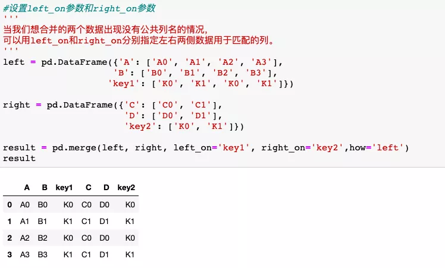

Python Pandas concat append merge join<br />Pandas 是一套用于 Python 的快速、高效的数据分析工具。它可以用于数据挖掘和数据分析，同时也提供数据清洗功能。目录如下：<br />
<a name="g5Xot"></a>
## 一、`concat`
<a name="UzAcX"></a>
### 1、定义
`concat`函数可以在两个维度上对数据进行拼接，默认纵向拼接（`axis=0`），即按行拼接。拼接方式默认为外连接（`outer`)，即取所有的表头字段或索引字段。
<a name="mS1gl"></a>
### 2、语法
```python
pd.concat(objs,axis=0, join='outer', ignore_index=False,
keys=None,levels=None, names=None, verify_integrity=False, 
copy=True)
```
参数释义：<br />objs：需要用于连接合并的对象列表<br />axis：连接的方向，默认为0（按行），按列为1<br />join：连接的方式，默认为outer，可选inner只取交集<br />ignore_index：合并后的数据索引重置，默认为False，可选True<br />keys：列表或数组，也可以是元组的数组，用来构造层次结构索引<br />levels：指定用于层次化索引各级别上的索引，在有keys值时<br />names：用于创建分层级别名称，在有keys和levels时<br />verify_integrity：检查连接对象中新轴是否重复，若是则异常，默认为False允许重复<br />copy：默认为True，如果是False，则不会复制不必要的可以提高效率
<a name="qJQ0M"></a>
### 3、代码示例
首先，看一个简单的例子：<br /><br />以上代码构建了3个字典并转为DataFrame，然后通过`concat`实现默认方式合并。合并演示如下：<br />
<a name="tlBZw"></a>
#### 1.设置参数`keys`
<br /><br /><br />
<a name="aBV0C"></a>
#### 2.设置`axis`参数
`axis=1`按列合并，默认情况下，`join='outer'`，合并时索引全部保留，对于不存在值的部分会默认赋NaN。<br /><br />
<a name="qYRaq"></a>
#### 3.设置`join`参数
<br />
<a name="INd2g"></a>
#### 4.设置`ignore_index`参数

<a name="oYHTe"></a>
#### 5.Series与DataFrame合并

<a name="U6oj8"></a>
## 二、`append`
<a name="G8xo4"></a>
### 1、定义
运用`append`方法，可以将Series或字典数据添加到DataFrame。
<a name="G4uBK"></a>
### 2、代码示例

<a name="ddmLA"></a>
## 三、`merge`
<a name="CM6ou"></a>
### 1、定义
`merge`函数可根据一个或多个键（列）相同进行DataFrame拼接。类似于关系型数据库的`join`操作。
<a name="Ezmaj"></a>
### 2、语法
```python
pd.merge(left, right, how='inner', on=None, left_on=None, 
right_on=None,left_index=False,right_index=False, sort=True,
suffixes=('_x', '_y'), copy=True, indicator=False,validate=None)
```
参数释义：<br />left：参与合并的左侧数据<br />right：参与合并的右侧数据<br />how：合并类型：inner(默认内连接)、outer（外连接）、left（左连接）、right（右连接）<br />on：用于连接的列名，默认为左右侧数据共有的列名，指定时需要为左右侧数据都存在的列名<br />left_on：左侧数据用于连接的列<br />right_on：右侧数据用于连接的列<br />left_index：将左侧索引作为连接的列<br />right_index：将右侧索引作为连接的列<br />sort：排序，默认为True，设置为False可提高性能<br />suffixes：默认为('_x', '_y')，可以自定义如('date_x','date_y')<br />copy：默认为True，如果是False，则不会复制不必要的可以提高效率<br />indicator：指示器，默认False，设置为True时会新增一列标识<br />validate：字符串，如果指定则会检测合并的数据是否满足指定类型（1对1，1对多，多对1，多对多）
<a name="C6K9F"></a>
### 3、示例
首先，看一个简单的例子：<br /><br />
<a name="w55aL"></a>
#### 1.设置参数how
<br /><br /><br />
<a name="oVU1Z"></a>
#### 2.设置`validate`参数

<a name="Nug6k"></a>
#### 3.设置indicator参数

<a name="bxh1T"></a>
#### 4.设置`left_on`参数和`right_on`参数

<a name="nNsGs"></a>
## 四、`join`
<a name="DiNAD"></a>
### 1、定义
`join`可以将两个没用共同列名的数据进行快速合并，默认是保留被合并的数据索引。`join`接受的参数有`how`、`on`和`suffix`等。
<a name="mqvvE"></a>
### 2、示例
<br />
