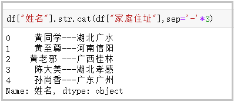

Python Pandas
<a name="HrQoE"></a>
## 构造数据集
这里先构造一个数据集，用于演示这20个函数。
```python
import pandas as pd
df ={'姓名':[' 黄同学','黄至尊','黄老邪 ','陈大美','孙尚香'],
     '英文名':['Huang tong_xue','huang zhi_zun','Huang Lao_xie','Chen Da_mei','sun shang_xiang'],
     '性别':['男','women','men','女','男'],
     '身份证':['463895200003128433','429475199912122345','420934199110102311','431085200005230122','420953199509082345'],
     '身高':['mid:175_good','low:165_bad','low:159_bad','high:180_verygood','low:172_bad'],
     '家庭住址':['湖北广水','河南信阳','广西桂林','湖北孝感','广东广州'],
     '电话号码':['13434813546','19748672895','16728613064','14561586431','19384683910'],
     '收入':['1.1万','8.5千','0.9万','6.5千','2.0万']}
df = pd.DataFrame(df)
df
```
效果图：<br />
<a name="KMUwG"></a>
## 1、`cat`函数
这个函数主要用于字符串的拼接；
```python
df["姓名"].str.cat(df["家庭住址"],sep='-'*3)
```
效果图：<br />
<a name="JvtML"></a>
## 2、`contains`函数
这个函数主要用于判断某个字符串是否包含给定字符；
```python
df["家庭住址"].str.contains("广")
```
效果图：<br />
<a name="qaPF0"></a>
## 3、`startswith`、`endswith`函数
这个函数主要用于判断某个字符串是否以...开头/结尾；
```python
# 第一个行的“ 黄伟”是以空格开头的
df["姓名"].str.startswith("黄") 
df["英文名"].str.endswith("e")
```
效果图：<br />
<a name="PURsp"></a>
## 4、`count`函数
这个函数主要用于计算给定字符在字符串中出现的次数；
```python
df["电话号码"].str.count("3")
```
效果图：<br />
<a name="nB4XT"></a>
## 5、`get`函数
这个函数主要用于获取指定位置的字符串；
```python
df["姓名"].str.get(-1)
df["身高"].str.split(":")
df["身高"].str.split(":").str.get(0)
```
效果图：<br />
<a name="DN7pB"></a>
## 6、`len`函数
这个函数主要用于计算字符串长度；
```python
df["性别"].str.len()
```
效果图：<br />
<a name="wvBeL"></a>
## 7、`upper`、`lower`函数
这个函数主要用于英文大小写转换；
```python
df["英文名"].str.upper()
df["英文名"].str.lower()
```
效果图：<br />
<a name="JCzMz"></a>
## 8、`pad`+`side`参数/`center`函数
这个函数主要用于在字符串的左边、右边或左右两边添加给定字符；
```python
df["家庭住址"].str.pad(10,fillchar="*")      # 相当于ljust()
df["家庭住址"].str.pad(10,side="right",fillchar="*")    # 相当于rjust()
df["家庭住址"].str.center(10,fillchar="*")
```
效果图：<br />
<a name="kZMNA"></a>
## 9、`repeat`函数
这个函数主要用于重复字符串几次；
```python
df["性别"].str.repeat(3)
```
效果图：<br />
<a name="Hj55b"></a>
## 10、`slice_replace`函数
这个函数主要用于使用给定的字符串，替换指定的位置的字符；
```python
df["电话号码"].str.slice_replace(4,8,"*"*4)
```
效果图：<br />
<a name="aUxVb"></a>
## 11、`replace`函数
这个函数主要用于将指定位置的字符，替换为给定的字符串；
```python
df["身高"].str.replace(":","-")
```
效果图：<br /><br />这个函数还接受正则表达式，将指定位置的字符，替换为给定的字符串。
```python
df["收入"].str.replace("\d+\.\d+","正则")
```
效果图：<br />
<a name="k2IGr"></a>
## 12、`split`方法+`expand`参数
这个函数主要用于将一列扩展为好几列；
```python
# 普通用法
df["身高"].str.split(":")
# split方法，搭配expand参数
df[["身高描述","final身高"]] = df["身高"].str.split(":",expand=True)
df
# split方法搭配join方法
df["身高"].str.split(":").str.join("?"*5)
```
效果图：<br />
<a name="k1rcB"></a>
## 13、`strip`、`rstrip`、`lstrip`函数
这个函数主要用于去除空白符、换行符；
```python
df["姓名"].str.len()
df["姓名"] = df["姓名"].str.strip()
df["姓名"].str.len()
```
效果图：<br />
<a name="Kxtbh"></a>
## 14、`findall`函数
这个函数主要用于利用正则表达式，去字符串中匹配，返回查找结果的列表；
```python
df["身高"]
df["身高"].str.findall("[a-zA-Z]+")
```
效果图：<br />
<a name="qVytv"></a>
## 15、`extract`、`extractall`函数
这个函数主要用于接受正则表达式，抽取匹配的字符串(一定要加上括号)；
```python
df["身高"].str.extract("([a-zA-Z]+)")
# extractall提取得到复合索引
df["身高"].str.extractall("([a-zA-Z]+)")
# extract搭配expand参数
df["身高"].str.extract("([a-zA-Z]+).*?([a-zA-Z]+)",expand=True)
```
效果图：<br />
