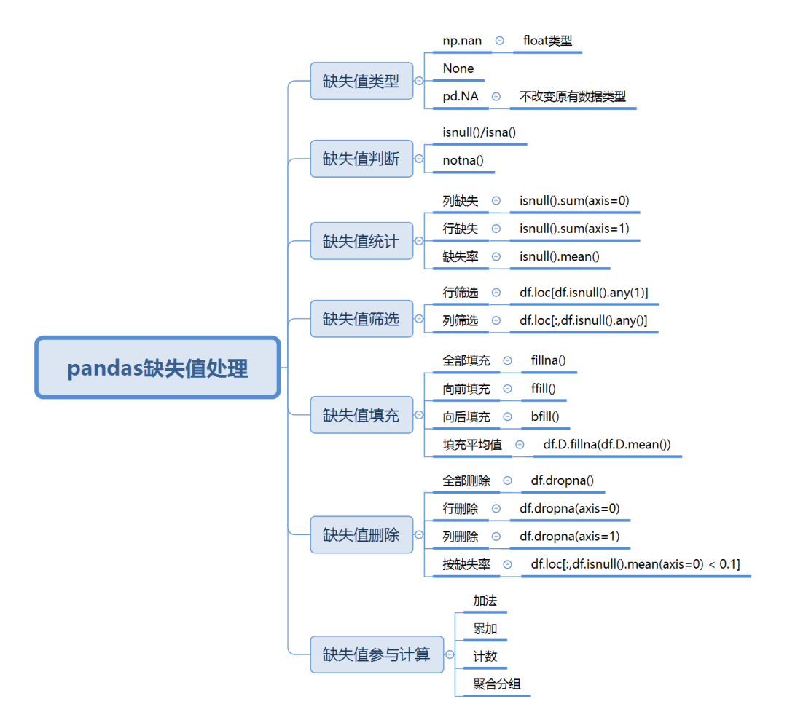

Python Pandas<br />
<a name="BQkeZ"></a>
## 一、缺失值类型
在Pandas中，缺失数据显示为**NaN**。缺失值有3种表示方法，`np.nan`，`none`，`pd.NA`。
<a name="lSh0i"></a>
### 1、`np.nan`
缺失值有个特点（坑），它不等于任何值，连自己都不相等。如果用nan和任何其它值比较都会返回nan。
```python
np.nan == np.nan
>> False
```
也正由于这个特点，在数据集读入以后，不论列是什么类型的数据，默认的缺失值全为`np.nan`。<br />**因为nan在Numpy中的类型是浮点，因此整型列会转为浮点；而字符型由于无法转化为浮点型，只能归并为object类型（'O'），原来是浮点型的则类型不变。**
```python
type(np.nan)
>> float

pd.Series([1,2,3]).dtype
>> dtype('int64')
pd.Series([1,np.nan,3]).dtype
>> dtype('float64')
```
初学者做数据处理遇见object类型会发懵，不知道这是个啥，明明是字符型，导入后就变了，其实是因为缺失值导致的。<br />除此之外，还要介绍一种针对时间序列的缺失值，它是单独存在的，用**NaT**表示，是pandas的内置类型，**可以视为时间序列版的**`**np.nan**`，也是与自己不相等。
```python
s_time = pd.Series([pd.Timestamp('20220101')]*3)
s_time
>> 0 2022-01-01
   1 2022-01-01
   2 2022-01-01
   dtype:datetime64[ns]
-----------------
s_time[2] = pd.NaT
s_time
>> 0 2022-01-01
   1 2022-01-01
   2 NaT
   dtype:datetime64[ns]
```
<a name="AsrNb"></a>
### 2、`None`
还有一种就是`None`，它要比nan好那么一点，因为它至少自己与自己相等。
```python
None == None
>> True
```
在传入数值类型后，会自动变为`np.nan`。
```python
type(pd.Series([1,None])[1])
>> numpy.float64
```
只有当传入object类型时是不变的，因此可以认为如果不是人工命名为`None`的话，它基本不会自动出现在pandas中，所以`None`大家基本也看不到。
```python
type(pd.Series([1,None],dtype='O')[1])
>> NoneType
```
<a name="hJygI"></a>
### 3、NA标量
pandas1.0以后的版本中引入了一个专门表示缺失值的标量**pd.NA**，它代表空整数、空布尔值、空字符，这个功能目前处于实验阶段。<br />开发者也注意到了这点，对于不同数据类型采取不同的缺失值表示会很乱。pd.NA就是为了统一而存在的。**pd.NA的目标是提供一个缺失值指示器，可以在各种数据类型中一致使用(而不是**`**np.nan**`**、None或者NaT分情况使用)。**
```python
s_new = pd.Series([1, 2], dtype="Int64")
s_new
>> 0   1
   1   2
   dtype: Int64
-----------------
s_new[1] = pd.NaT
s_new
>> 0    1
   1  <NA>
   dtype: Int64
```
同理，对于布尔型、字符型一样不会改变原有数据类型,这样就解决了原来动不动就变成object类型的麻烦了。<br />下面是pd.NA的一些常用算术运算和比较运算的示例：
```python
##### 算术运算
# 加法
pd.NA + 1
>> <NA>
-----------
# 乘法
"a" * pd.NA
>> <NA>
-----------
# 以下两种其中结果为1
pd.NA ** 0
>> 1
-----------
1 ** pd.NA
>> 1

##### 比较运算
pd.NA == pd.NA
>> <NA>
-----------
pd.NA < 2.5
>> <NA>
-----------
np.log(pd.NA)
>> <NA>
-----------
np.add(pd.NA, 1)
>> <NA>
```
<a name="sI8P7"></a>
## 二、缺失值判断
了解了缺失值的几种形式后，要知道如何判断缺失值。对于一个dataframe而言，判断缺失的主要方法就是`isnull()`或者`isna()`，这两个方法会直接返回`True`和`False`的布尔值。可以是对整个dataframe或者某个列。
```python
df = pd.DataFrame({
      'A':['a1','a1','a2','a3'],
      'B':['b1',None,'b2','b3'],
      'C':[1,2,3,4],
      'D':[5,None,9,10]})
# 将无穷设置为缺失值      
pd.options.mode.use_inf_as_na = True
```
<a name="iJ3dE"></a>
### 1、对整个dataframe判断缺失
```python
df.isnull()
>> A B C D
0 False False False False
1 False True False True
2 False False False False
3 False False False False
```
<a name="J4CYR"></a>
### 2、对某个列判断缺失
```python
df['C'].isnull()
>> 0    False
   1    False
   2    False
   3    False
Name: C, dtype: bool
```
如果想取非缺失可以用`notna()`，使用方法是一样的，结果相反。
<a name="ZuSLD"></a>
## 三、缺失值统计
<a name="BOekv"></a>
### 1、列缺失
一般会对一个`dataframe`的**列**进行缺失统计，查看每个列有多少缺失，如果缺失率过高再进行删除或者插值等操作。那么直接在上面的`isnull()`返回的结果上直接应用`.sum()`即可，`axis`默认等于0，0是列，1是行。
```python
## 列缺失统计
isnull().sum(axis=0)
```
<a name="J9MZA"></a>
### 2、行缺失
但是很多情况下，也需要对**行**进行缺失值判断。比如一行数据可能一个值都没有，如果这个样本进入模型，会造成很大的干扰。因此，行列两个缺失率通常都要查看并统计。<br />操作很简单，只需要在`sum()`中设置`axis=1`即可。
```python
## 行缺失统计
isnull().sum(axis=1)
```
<a name="yGiHg"></a>
### 3、缺失率
有时不仅想要知道缺失的数量，更想知道缺失的比例，即缺失率。正常可能会想到用上面求得数值再比上总行数。但其实这里有个小技巧可以一步就实现。
```python
## 缺失率
df.isnull().sum(axis=0)/df.shape[0]

## 缺失率（一步到位）
isnull().mean()
```
<a name="hw1gE"></a>
## 四、缺失值筛选
筛选需要loc配合完成，对于行和列的缺失筛选如下：
```python
# 筛选有缺失值的行
df.loc[df.isnull().any(1)]
>> A B C D
1 a1 None 2 NaN
-----------------
# 筛选有缺失值的列
df.loc[:,df.isnull().any()]
>> B D
0 b1 5.0
1 None NaN
2 b2 9.0
3 b3 10.0
```
如果要查询没有缺失值的行和列，可以对表达式用取反~操作：
```python
df.loc[~(df.isnull().any(1))]
>> A B C D
0 a1 b1 1 5.0
2 a2 b2 3 9.0
3 a3 b3 4 10.0
```
上面使用了`any`判断只要有缺失就进行筛选，也可以用`all`判断是否全部缺失，同样可以对行里进行判断，如果整列或者整行都是缺失值，那么这个变量或者样本就失去了分析的意义，可以考虑删除。
<a name="uwkjj"></a>
## 五、缺失值填充
一般对缺失值有两种处理方法，一种是直接删除，另外一种是保留并填充。下面先介绍填充的方法`fillna`。
```python
# 将dataframe所有缺失值填充为0
df.fillna(0)
>> A B C D
0 a1 b1 1 5.0
1 a1 0 2 0.0
2 a2 b2 3 9.0
3 a3 b3 4 10.0
--------------
# 将D列缺失值填充为-999
df.D.fillna('-999')
>> 0       5
   1    -999
   2       9
   3      10
Name: D, dtype: object
```
方法很简单，但使用时需要注意一些参数。

- inplace：可以设置`fillna(0, inplace=True)`来让填充生效，原dataFrame被填充。
- methond：可以设置`methond`方法来实现向前或者向后填充，`pad`/`ffill`为向前填充，`bfill`/`backfill`为向后填充，比如`df.fillna(methond='ffill')`，也可以简写为`df.ffill()`。
```python
df.ffill()
>> A B C D
0 a1 b1 1 5.0
1 a1 b1 2 5.0
2 a2 b2 3 9.0
3 a3 b3 4 10.0
```
原缺失值都会按照前一个值来填充(B列1行，D列1行)。<br />除了用前后值来填充，也可以用整个列的均值来填充，比如对D列的其它非缺失值的平均值8来填充缺失值。
```python
df.D.fillna(df.D.mean())
>> 0     5.0
   1     8.0
   2     9.0
   3    10.0
Name: D, dtype: float64
```
<a name="tGjF2"></a>
## 六、缺失值删除
删除缺失值也非情况，比如是全删除还是删除比较高缺失率，这个要看自己的容忍程度，真实的数据必然会存在缺失的，这个无法避免。而且缺失在某些情况下也代表了一定的含义，要视情况而定。
<a name="r0EIb"></a>
### 1、全部直接删除
```python
# 全部直接删除
df.dropna()
>> A B C D
0 a1 b1 1 5.0
2 a2 b2 3 9.0
3 a3 b3 4 10.0
```
<a name="TtcsD"></a>
### 2、行缺失删除
```python
# 行缺失删除
df.dropna(axis=0)
>> A B C D
0 a1 b1 1 5.0
2 a2 b2 3 9.0
3 a3 b3 4 10.0
```
<a name="yF0ju"></a>
### 3、列缺失删除
```python
# 列缺失删除
df.dropna(axis=1)
>> A C
0 a1 1
1 a1 2
2 a2 3
3 a3 4
-------------
# 删除指定列范围内的缺失,因为C列无缺失，所以最后没有变化
df.dropna(subset=['C'])
>> A B C D
0 a1 b1 1 5.0
1 a1 None 2 NaN
2 a2 b2 3 9.0
3 a3 b3 4 10.0
```
<a name="cF8S5"></a>
### 4、按缺失率删除
这个可以考虑用筛选的方法来实现，比如要删除列缺失大于0.1的（即筛选小于0.1的）。
```python
df.loc[:,df.isnull().mean(axis=0) < 0.1]
>> A C
0 a1 1
1 a1 2
2 a2 3
3 a3 4
-------------
# 删除行缺失大于0.1的
df.loc[df.isnull().mean(axis=1) < 0.1]
>> A B C D
0 a1 b1 1 5.0
2 a2 b2 3 9.0
3 a3 b3 4 10.0
```
<a name="Y6K9Z"></a>
## 七、缺失值参与计算
如果不对缺失值处理，那么缺失值会按照什么逻辑进行计算呢？<br />下面一起看一下各种运算下缺失值的参与逻辑。
<a name="QZRBp"></a>
### 1、加法
```python
df
>>A B C D
0 a1 b1 1 5.0
1 a1 None 2 NaN
2 a2 b2 3 9.0
3 a3 b3 4 10.0
---------------
# 对所有列求和
df.sum()
>> A    a1a1a2a3
   C          10
   D          24
```
可以看到，加法是会忽略缺失值的。
<a name="IFJX5"></a>
### 2、累加
```python
# 对D列进行累加
df.D.cumsum()
>> 0     5.0
   1     NaN
   2    14.0
   3    24.0
Name: D, dtype: float64
---------------
df.D.cumsum(skipna=False)
>> 0    5.0
   1    NaN
   2    NaN
   3    NaN
Name: D, dtype: float64
```
`cumsum`累加会忽略NA，但值会保留在列中，可以使用`skipna=False`跳过有缺失值的计算并返回缺失值。
<a name="qFZA9"></a>
### 3、计数
```python
# 对列计数
df.count()
>> A    4
   B    3
   C    4
   D    3
dtype: int64
```
缺失值不进入计数范围里。
<a name="I2xsz"></a>
### 4、聚合分组
```python
df.groupby('B').sum()
>> C D
B  
b1 1 5.0
b2 3 9.0
b3 4 10.0
---------------
df.groupby('B',dropna=False).sum()
>> C D
B  
b1 1 5.0
b2 3 9.0
b3 4 10.0
NaN 2 0.0
```
聚合时会默认忽略缺失值，如果要缺失值计入到分组里，可以设置`dropna=False`。这个用法和其它比如`value_counts`是一样的，有的时候需要看缺失值的数量。
